# SKUGGLE ENTERPRISE DESIGN SYSTEM

**Status:** Architecture Phase 6 — authoritative design-system specification; no application implementation is authorized.  
**Baseline:** repository state inspected 2026-09-03.  
**Frozen inputs:** the Enterprise Architecture Audit, Domain & Capability Architecture, Identity/Tenancy/IAM/RBAC Architecture, Workspace & Information Architecture, and Enterprise Application Shell Architecture.  
**Target:** WCAG 2.2 AA; responsive, localization-ready, tenant-safe, and dark-mode-ready.

## 1. Executive Decision Summary

Skuggle's base personality is **calm intelligence**: precise structure, warm language, restrained indigo identity, neutral surfaces, readable density, and purposeful feedback. It is one product family expressed differently by workspace—not seven brands.

1. Ship light mode in V1; architect and test tokens for dark mode, then release dark mode after tenant-brand and chart validation.
2. Permit tenant identity in logos, public/welcome media, documents, and bounded accents. Tenant colors do not own status, danger, focus, text, or Platform Console.
3. Tenant color may influence a primary action only after an automated contrast gate; otherwise the Skuggle action color is used. It never changes destructive actions.
4. Authenticated sidebars use controlled neutral surfaces, not tenant-colored backgrounds.
5. Platform Console uses a persistent platform label, shield/privilege iconography, distinct graphite/indigo framing, stricter density, and support-session banners—not color alone.
6. Relate is more content-led and expressive; Personal is lighter and calmer; Parent/Student are welcoming and task-first. Shared typography, controls, status, accessibility, and geometry preserve family identity.
7. Cards are named components for meaningful grouped objects, not default page wrappers. Borders, whitespace, lists, and sections do most layout work.
8. Comfortable is the default density. Compact is opt-in for operational collections and score entry; Focused removes competing chrome for sustained tasks.
9. On mobile, ordinary data tables become priority list rows/cards; specialized grids use a dedicated workflow, tablet/landscape guidance, or reduced-column entry.
10. Sound is off by default and absent from routine authenticated navigation. Optional completion/attention cues require an explicit preference and visual equivalent.
11. Mascot and illustration are welcome in onboarding, true/first-use empty states, Student, Personal, and selected Relate moments; restrained in finance, audit, safeguarding, security, and operational grids.
12. AI uses a consistent sparkle mark plus the label “AI”, a context/source notice, editable output, and explicit accept/discard controls. Gradients are accents, not proof of AI.
13. Adopt Storybook or an equivalent isolated catalog during implementation, with accessibility, interaction, responsive, visual-regression, and token-theme coverage.

## 2. Current UI Audit

### Evidence and classification

The frontend is React 19, TypeScript, Vite 6, Tailwind 4, Lucide, Motion, and Recharts. `src/index.css` defines Inter/Plus Jakarta Sans and seven `--skuggle-*` variables, but components primarily use direct Tailwind values. The inspection found 3,000+ direct color utilities, 1,100+ radius utilities, 338 native `<button>` occurrences, 887 `text-xs` occurrences, only 15 `focus-visible` occurrences, and two reduced-motion references. Counts are diagnostic, not a claim that every use is defective.

| Classification | Current evidence | Decision |
|---|---|---|
| Consistent | Indigo/slate family; Lucide; Inter + Plus Jakarta Sans; common rounded surfaces; shared `Button`, `FormField`, `DataTable`, `Modal`, `Drawer`, `StatusBadge`, `MetricCard`, `EmptyState`, `PageHeader` | Preserve visual intent; remap to tokens |
| Inconsistent | Repeated direct slate/indigo/blue/purple/rose/amber/emerald utilities; several radii, shadows, paddings, font sizes, native controls | Tokenize and converge |
| Duplicated | Feature-local buttons, inputs, cards, tables, tabs, badges, modals, filters, page headers | Wrap then replace by canonical components |
| One-off | Landing aurora/orbit, SmartMark scanning/grading motion, mascot hero art, report-card print utilities | Keep only in named patterns |
| Legacy | Manual page/tab patterns, role dashboards, modal-heavy durable flows, generic module presentation | Migrate under Phase 7; do not delete now |
| Accessibility risk | Modal/Drawer lack full focus trap, initial focus and restoration; small icon targets; extensive 12px text; incomplete focus-visible coverage; status often color-led; clickable `div` cards; native patterns vary | P0/P1 remediation in implementation |
| Reusable | Lucide, reduced-motion seed, print utilities, shared primitive APIs, semantic status inference concept, responsive Tailwind patterns | Keep and strengthen |
| Replace eventually | `Modal` full/2xl “almost-page” modes, status strings inferred inside visual component, arbitrary class overrides, feature-local control systems | Deprecate after consumers migrate |

### Component findings

| Current | Finding | Target | Treatment | Priority |
|---|---|---|---|---|
| `Button` | Useful shared start; variants coexist with native buttons | Button + IconButton + MenuButton | TOKENIZE/WRAP | P1 |
| `FormField` and native controls | Label/help/error foundation; many feature-local controls | Field, Input family, FieldGroup | KEEP+REFACTOR | P1 |
| `DataTable` | Useful general table but cannot serve score entry or all mobile needs | Table/DataGrid + MobileCollection | WRAP | P1 |
| `Modal`, `ConfirmDialog` | Escape/scroll lock present; focus lifecycle incomplete; oversized variants | Modal/Confirmation + full-page flow | REFACTOR | P0 |
| `Drawer` | Correct transient intent; focus lifecycle incomplete | Drawer/Sheet | REFACTOR | P0 |
| `StatusBadge` | Central mapping exists; domain strings and visual semantics are coupled | Status registry + Badge renderer | REFACTOR | P1 |
| `MetricCard` | Meaningful anatomy; clickable `div` semantics and trend meaning need tightening | MetricCard using link/button primitive | REFACTOR | P1 |
| `EmptyState` | Good reusable seed; lacks semantic variants | EmptyState catalog | TOKENIZE | P2 |
| `PageHeader` | Good seed; breadcrumbs/actions are underspecified | PageHeader variants + Breadcrumb | WRAP | P1 |
| App shell components | Existing header/sidebar/switcher/palette provide migration footholds | Frozen shell primitives | REFACTOR in Phase 7 | P1 |
| Landing/mascot motion | Expressive and reduced-motion partly covered | Public/expressive motion profile | KEEP, ISOLATE | P3 |

## 3. Design Principles

| Binding principle | Enforceable consequence |
|---|---|
| Clarity before decoration | Every visual element must communicate identity, hierarchy, state, action, or grouping. Remove ornamental containers from operational pages. |
| One primary action | One filled primary action per page or bounded dialog; export/settings/secondary actions recede or enter overflow. |
| Density with breathing room | Compact reduces padding and row height, never body type below 14px or touch access below the mobile minimum. |
| Color has a job | Semantic tokens only; status, selection, tenant identity, and privilege use separate roles. |
| Meaning is never color-only | Status includes text and, when urgency matters, icon/pattern; charts add labels, shape, or line style. |
| Progressive disclosure | Show the common path; advanced filters, metadata, and rare actions remain discoverable without crowding it. |
| Motion explains change | Motion shows origin, hierarchy, progress, or completion; routine rows and navigation are not decorative animation stages. |
| Mobile is task-first | Mobile preserves priority tasks and identity, not every desktop column or control. |
| Trust through truthful feedback | Never fake progress, silently lose edits, hide permission limits, or present stale/offline data as current. |
| Accessible by construction | Semantics, focus, target size, contrast, announcements, zoom, and reduced motion live in component contracts. |
| Warmth follows context | Friendly copy and restrained illustration support education; serious, private, and privileged workflows remain sober. |
| Reuse meaning, not just shape | Domain-specialized components may exist when interaction semantics differ; visual similarity alone does not justify a giant generic API. |

## 4. Product Visual Personality

Use crisp neutral canvases, lightly warm elevated surfaces, indigo as the stable Skuggle signature, modest 8–12px geometry, fine borders, restrained shadows, strong type hierarchy, plain-language feedback, and occasional education-oriented illustration. Premium means polish, rhythm, and predictable behavior—not gloss, glass, oversized gradients, or a card around every paragraph.

Avoid: saturated navigation walls, rainbow module icons, finance-dashboard aesthetics, excessive pills, 12px body copy, decorative trend arrows, enormous shadows, fake real-time motion, and dense ERP tree menus.

## 5. Workspace Experience Expressions

| Workspace | Tone | Density | Accent behavior | Navigation | Surface/illustration | Motion/data |
|---|---|---|---|---|---|---|
| School Staff | Structured, efficient, calm | Comfortable; Compact for queues/grids | Skuggle action + bounded tenant identity | Labeled sidebar/optional rail | Neutral; low illustration | Low motion; high data |
| Parent | Reassuring, direct | Comfortable | Tenant logo/accent in identity areas | Simplified task nav | Soft surfaces; moderate illustration | Low; summarized data |
| Student | Encouraging, clear | Comfortable | Tenant identity + restrained brighter accents | Simplified task nav | Friendly; moderate | Moderate; task/content-first |
| Personal | Calm, personal | Comfortable/Focused | Skuggle indigo with a softer secondary expression | Light productivity shell | Open canvas; selective illustration | Moderate; low/medium data |
| Relate | Human, expressive | Comfortable | Skuggle family with richer content accent | Top bar + slim rail/bottom nav | Content-forward; higher illustration | Moderate; feed/content data |
| Platform | Controlled, privileged | Compact | Fixed platform graphite/indigo; no tenant override | Explicit Console identity | Crisp, bordered, minimal art | Low; very high data |
| Public Portal | Welcoming, credible | Spacious | Largest safe tenant expression | Public chrome | Branded media allowed | Moderate; promotional content |

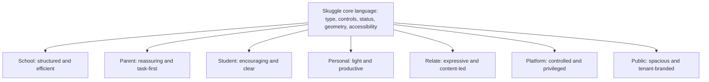

## 6. Design Token Architecture

Token resolution is primitive → semantic → workspace → component, with tenant overrides admitted only at a controlled semantic slot. Components consume semantic/component tokens, never primitives directly except inside token definitions.

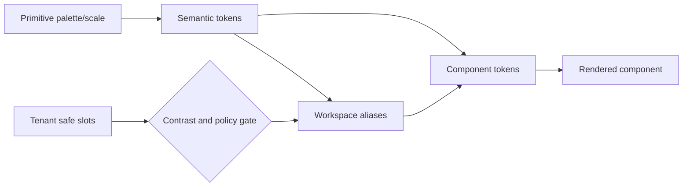

```text
tokens
  color
    primitive {neutral, indigo, blue, cyan, green, amber, red, violet}
    semantic {bg, surface, text, border, action, status, focus, data, overlay}
    workspace {school, parent, student, personal, relate, platform, public}
    tenant {primary, accent, onPrimary, logo, media}
  typography {family, size, lineHeight, weight, tracking, numeric}
  spacing {0, 1–12, section, page}
  size {control, icon, target, container, header, sidebar}
  radius {none, control, card, surface, dialog, pill}
  border {width, style, color}
  shadow {0–4}
  motion {duration, easing, distance}
  opacity {disabled, muted, overlay}
  density {comfortable, compact, focused}
  breakpoint {compact, medium, wide, expansive}
  zIndex {base, sticky, nav, popover, drawer, modal, toast, critical}
  focus {width, offset, color}
```

Naming uses `category.role.state`, e.g. `color.action.primary.hover`, `space.component.md`, `table.row.compact`, not `blue600` at consumption sites. Component tokens may alias semantics; tenant and workspace aliases may not bypass safety semantics.

### Foundation matrix

| Foundation | Purpose/token strategy | Light | Dark strategy | Tenant override |
|---|---|---|---|---|
| Color | Primitive → semantic roles | V1 values below | Alternate semantic mapping later | Bounded accent only |
| Typography | Role tokens, fluid-safe wrapping | Same roles | Same | No |
| Spacing | 4px base with semantic aliases | Same | Same | No |
| Radius | Five controlled roles | Same | Same | No |
| Border | Semantic color/strength | Neutral lines | Lighter-opacity lines | No |
| Elevation | 0–4; border-first | Soft neutral shadow | stronger edge/lower blur | No |
| Motion | duration/easing roles | Same | Same | No |
| Density | Comfortable/Compact/Focused | Same | Same | No |
| Focus | 2px visible ring + 2px offset | Indigo/contrast-safe | pale indigo/contrast-safe | No |
| Breakpoints | Behavior bands, not device brands | Same | Same | No |

## 7. Color

The following values are reference targets for design and later token calibration, not production code.

| Semantic role | Light reference | Dark reference intent |
|---|---|---|
| `bg.canvas` | neutral 50 `#F8FAFC` | neutral 950 |
| `surface.default` | white | neutral 900 |
| `surface.elevated` | white | neutral 850/900 with stronger edge |
| `surface.subtle` | neutral 100 | neutral 800 |
| `text.primary` | neutral 950 | neutral 50 |
| `text.secondary` | neutral 700 | neutral 300 |
| `text.muted` | neutral 600 | neutral 400 |
| `border.default` | neutral 200 | neutral 700 |
| `divider.subtle` | neutral 100 | neutral 800 |
| `focus` | indigo 600 | indigo 300 |
| `action.primary` | indigo 600 | indigo 400 |
| `action.primary.hover` | indigo 700 | indigo 300 |
| `selected` | indigo 50 + indigo edge | indigo tint + indigo edge |
| `success` | green 700 / green 50 | green 300 / green tint |
| `warning` | amber 800 / amber 50 | amber 300 / amber tint |
| `danger` | red 700 / red 50 | red 300 / red tint |
| `info` | blue 700 / blue 50 | blue 300 / blue tint |
| `neutralStatus` | neutral 700 / neutral 100 | neutral 300 / neutral 800 |

All text/background pairs must meet 4.5:1 for normal text and 3:1 for large text; non-text controls/focus/meaningful boundaries meet 3:1. Muted is still readable, not disabled gray. Disabled content remains perceivable; opacity alone does not carry state.

Dark mode is **architected now, shipped later**. No component may assume white means surface or black means text. Before release, validate tenant accents, charts, PDFs, images, browser chrome, and all states in both schemes.

## 8. Tenant Branding

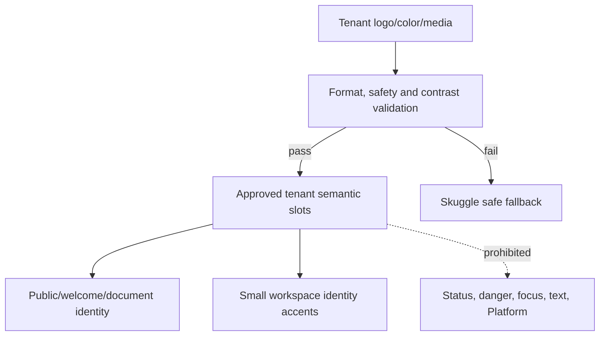

| Surface | Customizable | Restricted | Not customizable |
|---|---|---|---|
| Logo/school name | Approved files, accessible name | size, crop, fallback, privacy | shell legibility rules |
| Accent | `tenant.primary`, optional accent | contrast-gated, bounded areas | semantic status mapping |
| Primary action | May map to validated tenant primary in public/tenant welcome; optional in School | auto-select `onPrimary`; fallback required | danger/privileged confirmation |
| Sidebar | logo and small active marker | neutral controlled background | full brand-colored authenticated sidebar |
| Public Portal | accent, imagery, welcome background | readability overlays and limits | accessibility controls |
| Email/reports | logo, school identity, accent rules | print-safe and monochrome fallback | legal/audit semantics |
| Status/danger/focus | — | — | all safety semantics |
| Platform Console | — | tenant-under-support context label only | platform identity/theme |

Tenant colors are stored as inputs, resolved to derived accessible roles, tested against both adjacent surfaces, and rejected or adjusted when unsafe. They never enter arbitrary component style props.

## 9. Typography

Use **Inter Variable** for UI and numeric clarity; **Plus Jakarta Sans** for display/major headings if loading performance and licensing are confirmed. System-ui is the fallback. Self-host open-licensed WOFF2 in implementation where policy permits; do not distribute fonts in this phase. Enable tabular numerals for marks, money, IDs, and aligned metrics.

| Role | Size/line height | Weight/tracking | Use |
|---|---|---|---|
| Display | 40–48 / 48–56 | 700, tight | public/major welcome only |
| H1 | 28–32 / 36–40 | 700, tight | page title |
| H2 | 24 / 32 | 700 | major section |
| H3 | 20 / 28 | 650–700 | subsection/card group |
| H4 | 16 / 24 | 650 | small section |
| Body | 16 / 24 | 400 | reading/default user content |
| Body Small | 14 / 20 | 400 | enterprise secondary content |
| Label | 14 / 20 | 600 | fields/controls |
| Caption | 12 / 16 | 500 | supplemental metadata only |
| Data/Tabular | 14 / 20 | 500, tabular | tables, values; 16px for editable scores on touch |
| Button/Nav | 14 / 20 | 600 | actions/navigation |

Names and school titles wrap or truncate only with an accessible full-name path. Never compress long Nigerian or international names by reducing type. Currency and results align by decimal/tabular numeral. Text containers grow under browser text scaling.

## 10. Spacing & Grid

Base scale: 0, 2, 4, 8, 12, 16, 20, 24, 32, 40, 48, 64, 80px. Semantic roles: micro 2–4; inline 8; control internal 8–12; component 16–24; section 32–48; page 24–64.

Behavior bands: compact `<640px`, medium `640–1023px`, wide `1024–1439px`, expansive `≥1440px`; components respond to available space where container queries are appropriate. These implement, not replace, the frozen shell transformations.

| Layout role | Specification |
|---|---|
| Page gutter | 16 mobile, 24 tablet, 32 desktop, 40 expansive |
| Default content | fluid; max about 1440 for dashboards, not tables |
| Reading width | 65–75 characters |
| Form width | 640 single-column; 960 sectioned/two-column |
| Dashboard grid | 4/8/12 logical columns by band; minimum useful card width controls wrap |
| Tables | full available canvas; own horizontal behavior only when transformation is invalid |
| Sidebar/header | size tokens owned by shell; content never hardcodes offsets |

## 11. Density

| Mode | Use | Rows/controls/padding | Hierarchy |
|---|---|---|---|
| Comfortable | Parent, Student, Personal, settings, normal pages | 48–56 rows; 40–44 desktop controls; generous 16–24 component padding | labels and supporting copy visible |
| Compact | enterprise tables, finance, admissions queues, marks, platform | 36–44 rows; 36–40 controls; 8–16 padding | secondary data quieter; no body text below 14 |
| Focused | forms, wizards, reading, assessment creation/review | comfortable controls in narrower canvas; competing panels suppressed | task title/progress/help emphasized |

On coarse pointers, interactive targets are at least 44×44px even when visual rows are compact. Density is a page/pattern choice; do not mix three densities in one region.

## 12. Radius / Border / Elevation

Radius roles: control 8px, card 12px, surface 12px, dialog 16px, pill 999px; pill is limited to badges, avatars, chips, and compact toggles. Borders: subtle divider 1px, default 1px, strong 1px higher-contrast, interactive 1px, focus 2px ring, error 1px plus message/icon. Elevation: 0 canvas; 1 card; 2 sticky/floating control; 3 popover/drawer; 4 modal. Prefer borders and surface shifts at levels 0–1; no giant blurry shadows.

## 13. Iconography

Lucide is canonical: 1.75–2px visual stroke, rounded line style, 16 inline, 20 controls/navigation, 24 prominent, 32–48 empty-state. Status icons come from the semantic registry. Decorative icons are `aria-hidden`; meaningful icons have adjacent text or an accessible name. Icon-only buttons require a 44px touch target, visible focus, accessible name, and tooltip for unfamiliar desktop actions. Never use icon shape as the only privilege or status cue.

## 14. Motion

Tokens: micro 100–150ms, standard 180–240ms, emphasized 280–400ms; easing `exit` fast-out, `enter` decelerate, `move` standard. Use motion for popover origin, drawer/modal hierarchy, tab indicator, workspace transition, progress, and brief success acknowledgement. Route changes update content without full-page fade. Workspace switch may crossfade context identity while a determinate/indeterminate switching label persists. Reduced motion removes translation/scale, shimmer, parallax, confetti, and looping mascot motion; opacity changes become near-instant. Sound remains off by default and opt-in only for consequential completion/attention with visual and assistive equivalents.

## 15. Accessibility Foundations

| Family | Keyboard | Focus | Screen reader | Contrast/zoom | Touch/reduced motion |
|---|---|---|---|---|---|
| Actions/links | Enter/Space by semantics | visible all states | precise accessible name/state | AA at 200–400% reflow | 44px coarse target; no required animation |
| Forms | logical Tab; arrows by control | error does not replace focus | label, help, error, required, busy | no clipping at 200%; errors textual | 44px; no motion dependency |
| Navigation/tabs | landmarks; arrows for tabs/menus | current item distinct | `aria-current`, tab roles/counts | active cue non-color | large targets; reduced transitions |
| Tables/grids | table navigation; grid keys only for true grid | cell/row visible | headers, sort, selection, caption | reflow/alternative at zoom | mobile alternative |
| Dialogs/sheets | trap, Escape when safe | initial + restore | named dialog, modal state | body scroll contained | reduced enter/exit |
| Status/feedback | reachable actions | no stolen focus for toast | live-region priority matched | icon/text + color | timeout pausable; no flashing |
| Charts/media | keyboard data alternative | visible | summary + table/download | patterns/labels | animations optional |

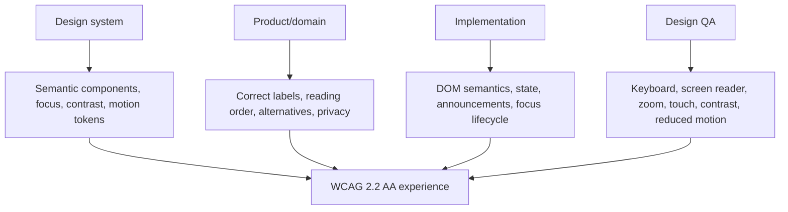

Minimums: 4.5:1 normal text, 3:1 large text and meaningful UI boundaries, 44×44 coarse-pointer targets, 24×24 minimum adjacent desktop targets with sufficient separation, visible 2px focus ring, logical DOM order, semantic landmarks, and no loss at 200% zoom. Target WCAG 2.2 AA; any exception requires a documented owner, user impact, alternative, and expiry.

## 16. Buttons & Actions

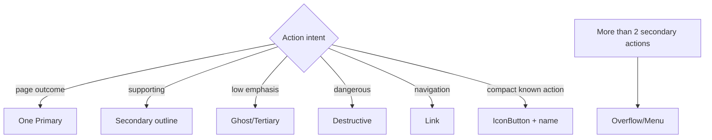

Primary is filled and singular; Secondary is bordered; Tertiary/Ghost is quiet; Destructive is red semantic and reserved for destructive commitment; Link navigates; Icon is familiar/compact; Split/Menu exists only when one default plus related alternatives is proven. Sizes: 36 compact desktop, 40 default, 44 touch/large. Every variant specifies default, hover, active, focus, disabled, loading, and error-safe behavior. Loading keeps width, shows progress, sets busy, prevents duplicate submission, and announces completion. A disabled consequential action has nearby reason; use a validation attempt where explanation is needed rather than silent disable.

## 17. Inputs & Forms

Canonical field anatomy is Label → required/optional marker → control → persistent help/example/privacy text → validation/status. Placeholder is example text, never the label. Error text identifies the problem and correction; associate it programmatically. Character count sits after help and announces only near limits. Async validation uses delayed busy then success/error without stealing focus.

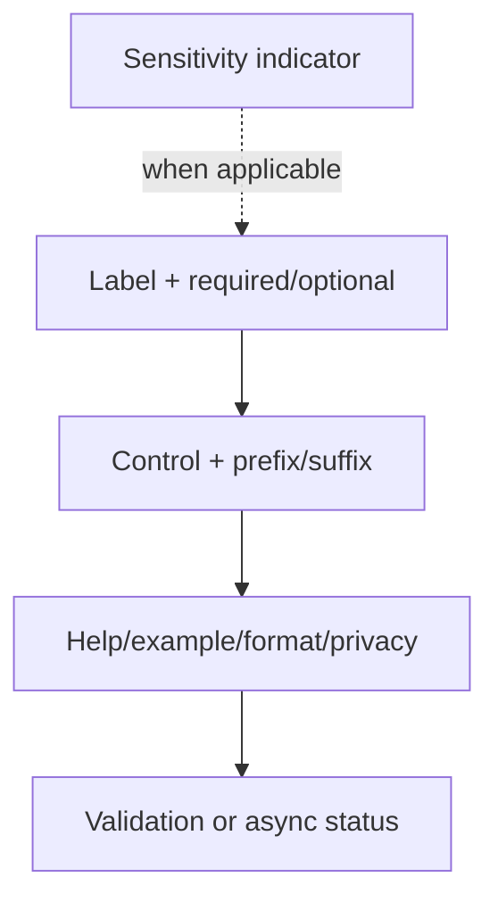

Input catalog: Text, Textarea, Number, Currency, Email, international Phone, Password, Search, Date, Time, Date Range, Select, Multi-select, Combobox, Checkbox, Radio, Switch, File Upload, Image Upload, Camera Capture, PIN/OTP, and Rich Text only for genuinely formatted authored content. All have default, hover, focus, filled, disabled, read-only, error, warning, success, and loading where meaningful. Read-only is selectable and clearly labeled; it is not disabled styling.

Forms use one column by default; two columns only for short related fields with predictable height. Mobile collapses to one column except truly compact pairs such as city/postcode where localization permits. Sectioned forms have heading, purpose, fields, optional local action. Repeating groups have visible identity, add/remove confirmation where data exists, and keyboard-stable insertion. Wizards save progress where durable, expose validation summaries linked to fields, and guard unsaved exit. Settings use category sections and “Save changes,” not generic “Submit.”

## 18. Upload / Camera / Media

FileUpload exposes accepted types/size, browse and optional drag/drop, selected file, scan/upload progress, retry/remove, and server rejection. ImageUpload adds preview, crop guidance, and alt/identity purpose. ImageCapture flow: explain purpose/privacy → request permission in response to action → live preview → capture → review/crop → Use photo/Retake → upload progress. Permission failure falls back to upload and instructions; it never blocks enrolment unless policy explicitly requires a photo. Profiles support remove, fallback initials, loading skeleton, and protected-image authorization. Student, Teacher, Staff, Parent, and CommunityProfile share the primitive with policy-specific privacy copy.

## 19. Navigation Components

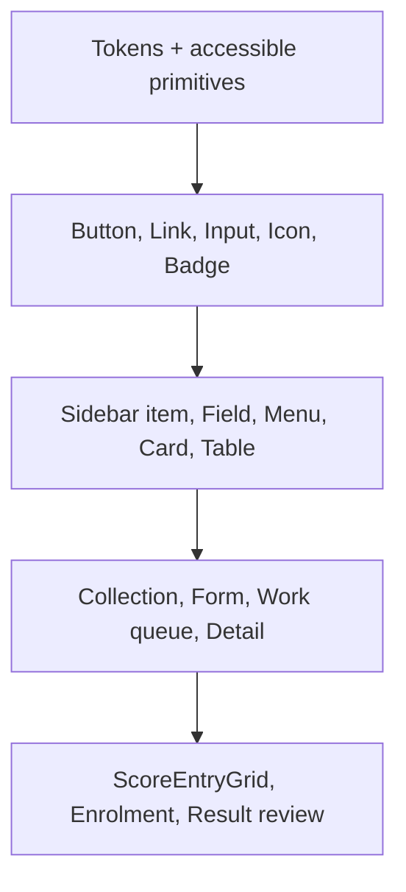

Sidebar follows frozen group → item depth. Group labels are quiet uppercase/sentence-case metadata, not actions. Active items use a marker, surface, weight, and `aria-current`; hover never resembles active. Collapsed rail retains tooltips, active cue, group separation, and a labeled expansion control. Badges are counts/status, not decoration. Disabled and upgrade states state why and remain distinct.

Mobile BottomNavigation has 3–5 persona-priority destinations plus More; labels remain visible. More Sheet contains the complete authorized taxonomy. WorkspaceSwitcher and AccountMenu remain separate identity concepts. Menus never contain navigation headings disguised as disabled items.

## 20. Workspace Switcher

Trigger anatomy: workspace logo/fallback, workspace name, type/persona hint, chevron, and Platform privilege marker where relevant. Desktop opens searchable popover; mobile opens a full-height sheet. Content groups School, Personal, Relate, and Platform contexts with headers; active item includes “Current.” Switching state disables repeated activation, announces destination, guards dirty work, atomically updates tenant/workspace, invalidates scoped data, then restores focus to the trigger. Unavailable or disabled workspaces include a reason. Long names wrap to two lines. Platform is never represented as an ordinary school row.

## 21. Academic Context

Campus, Session, and Term form one compound control, e.g. “Main Campus · 2026/2027 · Term 1.” Compact mode shows the summary and one trigger; expanded desktop popover uses three labeled dependent selectors; mobile uses a sheet. Historical override adds an explicit “Viewing historical context” badge/banner and return action. Invalid combinations explain the dependency and prevent silent fallback. Loading retains the last safe label plus busy status. Context changes guard unsaved work and are visible only in relevant School pages.

## 22. Page Headers & Breadcrumbs

PageHeader anatomy: optional Breadcrumb, title, concise description, status, metadata, one primary action, up to two secondary actions, overflow. Variants: Collection emphasizes create/filter context; Object Detail identity/status; Settings scope/save state; Analytics period/freshness; Work Queue counts/SLA; Wizard task/progress. On mobile actions stack or primary remains visible with others in overflow.

Breadcrumbs use chevrons, current item as text with `aria-current=page`, and ellipsis overflow that preserves Home/workspace plus parent/current. Long names truncate visually with accessible full text. Mobile uses a labeled Back link plus current page title rather than a crushed trail.

## 23. Tabs & Filters

Tabs navigate peer views and are deep-linkable: standard, compact, scrollable, badge, disabled, overflow. Use one row only, with underline/edge and text—not button-like filled pills. Arrow keys move tabs and focus behavior follows the chosen activation model.

SegmentedControl switches a small (2–4) mutually exclusive local view/filter such as CA/Test/Exam; it does not navigate, and large sets use Select/Combobox.

FilterBar order: Search, high-value quick filters, active chips, Advanced filters/count, Sort, Saved view, Column settings, Clear. State is URL-aware where shareable. Mobile keeps Search + Filters(count) + Sort and moves advanced controls to a sheet. Filtered-empty states preserve filters and offer clear/edit actions.

## 24. Tables & Data Grids

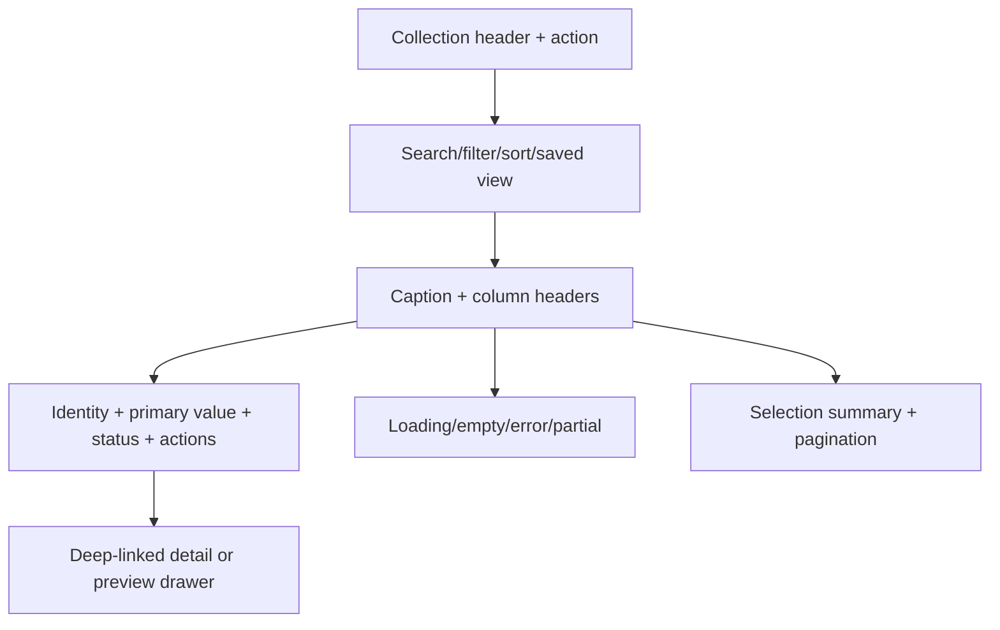

Table is semantic read-oriented tabular data. DataGrid adds selection, column configuration, sticky regions, and keyboard interaction only when needed. Headers expose sort state; rows use subtle hover, explicit selected checkbox/state, visible focus, and no default zebra striping unless row boundaries are otherwise unclear. Sticky headers/columns add a divider/elevation cue. Row actions place the one frequent action visibly and rare actions in a menu. Pagination shows range, total when known, page-size choice where useful, and preserves filters. Loading uses stable row skeletons; partial/error states preserve successfully loaded context.

Comfortable table rows are 48–56px; compact 36–44px. Server sorting/filtering/pagination is assumed for large collections. Horizontal scrolling is acceptable for analytical tables with frozen identity and a clear affordance, not the default mobile strategy.

## 25. Score Entry Grid

ScoreEntryGrid is domain-specialized. Frozen student identity columns lead; assessment columns use short labels with full accessible names; editable numeric cells use tabular 14–16px type, explicit maximum, and cell-level validation. Keyboard: arrows navigate, Tab advances editable cells, Enter commits/moves by documented rule, Escape reverts current edit. Paste/import previews mapping and errors before commit. Unsaved cells show non-color marker and persistent save state; locked cells expose reason; moderation state and conflicts are explicit. Bulk save reports partial failures without discarding valid work.

Mobile does not reproduce the full grid: choose one assessment/column, search student, enter vertically with previous/next and autosave/draft state. Recommend tablet/landscape for bulk entry; never block emergency mobile correction. Offline editing is unavailable unless the domain explicitly implements conflict-safe sync.

## 26. Cards & Metrics

Card roles: Summary, Metric, Content, Action, Profile, Status, Resource. Static cards are noninteractive; clickable cards use a real link or button with one interactive surface; selection cards use radio/checkbox semantics. Do not nest unrelated controls inside a clickable card.

MetricCard anatomy: label, value, unit/context, comparison period, trend with direction and meaning, freshness, optional drill-down. “↑ 8%” must say compared with what; favorable/unfavorable is domain-defined and not assumed from up/down. Four adjacent metrics are a dashboard group, not four decorative colors.

## 27. Status / Badge / Avatar

| Semantic category | Representative business states | Appearance contract |
|---|---|---|
| Positive | Active, Approved, Published, Paid, Present, Completed | success icon/dot + label |
| Informational | Submitted, Graded, Scheduled, Excused | info icon/dot + label |
| Attention | Pending, Draft, Partial, In review, Late | warning/neutral by urgency + label |
| Negative | Rejected, Failed, Overdue, Absent | danger icon + label |
| Restricted | Locked, Suspended | lock/ban icon + strong neutral or danger by policy |
| Inactive/neutral | Inactive, Unpublished, Not started | neutral marker + label |

Domain teams map state → semantic category in a registry; they do not invent colors. Badge is compact metadata; Status conveys lifecycle meaning and may include an icon. Pulse is reserved for genuinely live status.

Avatar sizes: compact 24–28, standard 32–40, large 48–64, profile 96–128. Person roles do not receive arbitrary colors. Fallback initials use first meaningful letters after normalizing honorifics and whitespace, never exceed two characters, and use privacy-safe generic fallback when identity must be hidden. Workspace logos use a separate component and crop rule.

## 28. Lists / Tasks / Notifications

Shared ListRow anatomy: leading identity/category, title, supporting metadata, state, time, trailing action. ActivityItem records an event; NotificationItem communicates awareness; TaskItem requires work; ApprovalItem adds requester, consequence and decision; AuditItem emphasizes actor/action/object/context and immutability; MessagePreview emphasizes sender/thread; AlertItem emphasizes risk and recovery.

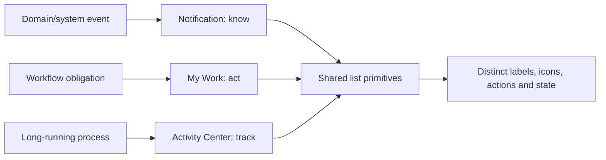

My Work includes task/approval/alert type, due date, priority, domain source, object link, owner/status, and action. Notifications categorize Message, Alert, Announcement, System; unread uses weight + marker + accessible state. Previews are privacy-safe and workspace-labeled. Reading a notification never completes a task.

## 29. Calendar

Views: Month for overview, Week for schedule, Agenda for mobile/accessible scan, Today for immediate tasks. Event category uses controlled color plus icon/label/pattern. Events expose title, time/timezone, location, calendar source, ownership, and editability. School event, academic calendar, teacher schedule, and personal calendar may overlay but remain filterable. Selecting a read-only event opens details, not an edit affordance. Provide list/table alternative and keyboard date navigation.

## 30. Modals / Drawers / Popovers

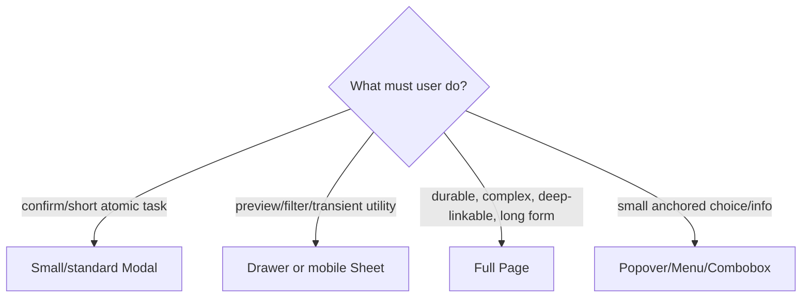

Modal variants are confirmation, small, standard. Anatomy: labelled title, optional description, body, primary/secondary actions, close. Trap focus, choose safe initial focus, Escape unless destructive work is in progress, restore trigger focus, prevent background interaction, and keep header/footer visible when body scrolls. Mobile standard modal becomes a sheet where appropriate. No nested modal chains and no extra-large almost-page modal.

Drawer variants: preview, filters, activity, notifications; Sheet variants: navigation, workspace switcher, mobile actions. Drawers preserve page context and use responsive width tokens. Menus contain actions; Combobox selects/searches a value; ContextMenu is pointer/context-key invoked actions; Popover is nonmodal anchored content. Follow APG keyboard/focus patterns and do not use terms interchangeably. Tooltips are delayed supplemental text, dismissed on Escape, hover/focus parity, never critical instruction; mobile uses visible label/help.

## 31. Wizards / Steppers

Stepper shows completed, current, error, and future with text plus state. Desktop may show 3–7 labeled steps; mobile shows “Step 2 of 5 — Guardian details” plus compact progress and optional step list. More than seven phases use grouped sections/checklist. Back preserves data, Next validates the current scope, Save and exit is explicit, and final review summarizes editable sections. Do not use ten tiny circles or imply linear completion when users may revisit.

## 32. Loading / Progress / Skeletons

Determinate progress uses real bytes/items/steps; indeterminate uses a spinner/bar with task label; background job progress lives in Activity Center; upload shows filename and cancel/retry; step progress reflects completed stages. Never invent an exact percentage. Skeletons only mirror predictable content, use subtle non-flashing treatment, preserve layout, and stop under reduced motion. Shell loads first, then workspace chrome, page frame, sections. Background refresh preserves content with a small freshness indicator; buttons retain label/width and announce busy.

## 33. Empty & Error States

Empty variants: First use (teach/create), True empty (explain), Filtered empty (edit/clear), Setup required (authorized setup path), Permission limited (request/contact, no false create), Not entitled (plan explanation). Each has specific title, cause, restrained icon/illustration, and an authorized next action.

Error variants: 404 find/navigate; 403 explain access boundary; Network retry/offline status; Server retry/reference ID; Partial preserve working regions; Validation summary + field links; Conflict compare/reload/copy; Offline capability limits; Unavailable status/support; Not configured setup owner; Subscription required entitlement path. They must not collapse into one generic page.

## 34. Alerts / Banners / Toasts

Alert is contextual inline feedback; Banner is persistent page/shell state; Toast is transient acknowledgement. Variants: Info, Success, Warning, Danger, System, Offline, Support Session, Subscription, Maintenance. Support Session is persistent, names tenant/support operator or safe equivalent, shows privilege icon/text and end-session action, and cannot be dismissed while active.

Toasts: success/info auto-dismiss after sufficient reading time; warning/error persist longer or require dismissal when action is needed; hover/focus pauses; max three visible; no toast-only confirmation for destructive or durable background outcomes. Live-region politeness matches urgency, and identical messages coalesce.

## 35. Activity Center

Shell-level item anatomy: job type, domain, object/reference, queued/running/succeeded/failed/cancelled state, real progress where known, start/completion time, owner/workspace, primary action, error and retry. Supports import, SmartMark, export, report/result generation, and bulk communication. Items survive navigation/reload, link to outputs, and keep failures until acknowledged. A header indicator summarizes active/failed counts without masquerading as Notifications.

## 36. Offline / PWA States

States: Online (normally silent), Offline (persistent banner), Syncing (specific items/count), Read-only (why), Stale (last updated), Update available (reload safely), Server unavailable (retry/status), Conflict (resolution path). Use human copy: “You’re offline. Attendance viewing is available; changes cannot be saved,” not network jargon. Each domain declares offline read/write support; the service worker alone is not a promise. Never queue sensitive/destructive mutations without explicit conflict and security design.

## 37. AI Experience Pattern

AI actions display sparkle icon + “AI” label and use one restrained violet/indigo accent token. Anatomy: capability label, input/context scope, privacy/source notice, generating state, editable output, Accept/Insert, Regenerate, Discard, report problem, and error/fallback. Clearly distinguish suggestion from saved fact and show when human review is required. Do not silently train/reuse sensitive content, imply certainty, or apply generated marks/messages without confirmation. Deterministic automation does not receive AI styling.

## 38. Sensitive Data Pattern

Classification levels (Public, Internal, Confidential, Restricted) are quiet labels/policy metadata. Health, safeguarding, finance, national identifiers, MFA, and private documents default to least exposure: masked values, explicit Reveal, purpose/reason prompt where policy requires, timed re-mask, download warning, safe previews, and audit notice. Seriousness comes from language and controlled access, not alarming red surfaces. Lists expose the minimum necessary data and avoid sensitive notification previews.

## 39. Platform Privilege Pattern

Platform identity combines fixed Console label, shield icon, graphite/indigo shell treatment, compact operational density, capability-scoped actions, and stronger confirmation copy. Privileged actions show scope (“All tenants” or named tenant), consequence, MFA/re-auth where required, and audit notice. Platform-critical confirmation requires typed/explicit target confirmation when impact is broad. Tenant support adds the persistent multi-cue banner and visible exit. Tenant branding never overrides Platform tokens.

## 40. Illustration / Mascot

Illustration style: simple geometric education motifs, limited Skuggle palette, diverse and respectful human representation, no sensitive scenario caricature, readable at small sizes, and dark/contrast-safe variants later. Use small spot art in onboarding/first-use/true-empty Parent, Student, Personal, Relate, and public contexts. Staff operational pages use icons or no art. Tenant branding may frame public illustrations but not recolor the mascot into inaccessible or off-brand variants.

Mascot may appear in welcome, onboarding, assistant/AI entry, Student/Personal, selective Relate, and friendly empty states. Avoid it in finance settlement, audit logs, safeguarding, privileged security, destructive confirmation, severe errors, and dense tables.

## 41. Data Visualization

Recharts remains a viable implementation dependency. Every ChartContainer supplies title, question answered, period/freshness, legend, tooltip, loading/empty/error, text summary, and accessible table/download when data matters. Use line for trends, bar for comparison, area only for cumulative/volume emphasis, donut only for 2–5 parts of a whole, progress for one bounded measure, heatmap only where two-dimensional intensity is meaningful. No 3D.

Ordered categorical palette uses indigo, cyan, violet, amber, green, and blue at contrast-tested strengths; semantic series use success/warning/danger/info tokens. Never assign random colors by render order when identity persists. Add direct labels, shapes/dashes, or annotations. Tenant accent may represent the tenant’s own series if distinct and safe, but cannot recolor all categories.

## 42. Responsive Components

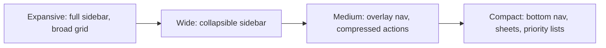

| Component | Large desktop | Desktop | Tablet | Mobile |
|---|---|---|---|---|
| Header/search | full slots/full search | compact search | trigger | trigger/full-screen search |
| Sidebar/nav | labeled + optional rail | collapsible | overlay drawer | bottom nav + More sheet |
| PageHeader | inline actions | inline/overflow | wrap | stack; primary + overflow |
| Tabs | full row | scroll if needed | scroll | scroll with edge cue/back alternative |
| Table | full columns | priority columns | reduced/sticky | priority list/card |
| FilterBar | full | full/wrap | quick + sheet | search + filter count + sort |
| Form | 1–2 columns | 1–2 | mostly 1 | 1 |
| Modal/Drawer | centered/side | centered/side | size-constrained | sheet/full page by task |
| Wizard | labeled steps | labeled | compact labels | step count/title |
| Cards/Metrics | 3–4 grid | 2–4 | 2 | 1–2, never illegibly narrow |
| Switcher/Academic | popovers | popovers | sheet/popover | sheet |

## 43. Content Design

Use sentence case for headings, labels, tabs, buttons, and statuses; preserve official names/acronyms. Buttons name the outcome: “Save changes,” “Publish results,” “Record payment,” not “Proceed” or “Click here.” Errors are specific, calm, and corrective; confirmations name target and consequence; destructive actions use the verb (“Delete application”) and never euphemisms. Empty states explain why and what is possible without blame. Avoid role assumptions, childish school language, technical backend terms, and “successfully” when success is already evident.

## 44. Localization / Date / Time / Money

Locale and tenant timezone drive display; storage/transport remain unambiguous standards. Prefer “3 Sep 2026” or locale long form over ambiguous `03/09/26`; times include 12/24-hour locale and timezone when cross-zone. Relative time (“5 minutes ago”) includes exact accessible tooltip/detail; deadlines use absolute date/time when consequential. Academic session is tenant terminology but structurally start/end years; term labels are configurable.

Money uses locale-aware formatting, ISO currency where symbol is ambiguous (`NGN 1,250.00`), tenant-configured decimal rules, tabular alignment, explicit negative/credit semantics, and no color-only debt indication. School Finance says invoice/payment/outstanding; Platform Billing says subscription/invoice/credit according to its domain.

Names, phone country codes, addresses, identifiers, currencies, and date formats are configurable and allowed to expand. Never universalize NIN. Preserve Unicode and plan logical CSS/directional icons for future RTL; do not mirror brand marks or media controls automatically.

## 45. Print & Document Design Principles

Print/PDF is a separate document system sharing identity, typography roles, status language, and number/date format—not a screenshot of app cards. Results, report cards, invoices, receipts, class lists, attendance, assessment papers, and reports define page size, margins, running headers/footers, page numbering, table continuation headers, signatures, confidentiality, tenant identity, monochrome fallback, and orphan/widow rules. Interactive affordances disappear; URLs/QR/reference IDs appear only when useful. Test common printers, A4 first where appropriate, and accessible tagged PDF when the generator supports it.

Email reuses logo, type hierarchy, action and status semantics with robust HTML fallbacks. Push/in-app carry category, safe preview, workspace, time, and deep link. SMS is plain, concise, privacy-safe, identifies sender, and never depends on color/icon. Channel content follows consent, urgency, and delivery policy.

## 46. Component Architecture

Foundation: tokens, type, icon, focus, responsive behavior. Primitive: Button, Link, Input, Checkbox, Badge, Avatar. Composite: Field, FilterBar, PageHeader, Modal, Table. Pattern: CollectionPage, ObjectDetail, Wizard, WorkQueue. Domain-specialized: ScoreEntryGrid, enrolment photo flow, result moderation. Composition is preferred over giant prop matrices; variants are finite and meaningful; controlled/uncontrolled behavior is explicit; accessibility is built in; semantic slots replace arbitrary class overrides; domain wrappers may constrain language/state.

### State matrix

| Component family | Required states |
|---|---|
| Actions | default, hover, focus, active, disabled, loading; success only when persistent transition is useful |
| Inputs | default, hover, focus, filled, disabled, read-only, error, warning, success, loading |
| Navigation/selection | default, hover, focus, active/current, selected, disabled, upgrade, collapsed |
| Collection | default, hover, focus, selected, loading, empty, filtered-empty, partial, error |
| Overlays | closed/opening/open/closing, loading, validation error; blocked dismissal when justified |
| Status/progress | pending/running/success/warning/error/cancelled/unknown |

Layer order: base 0; sticky content 10; header/navigation 20; popover 30; drawer 40; modal 50; toast 60; critical/system overlay 70. Components consume layer tokens; no arbitrary z-index escalation.

## 47. Component Catalog

The compact catalog below is normative. “A11y” includes semantic element/role, label, visible focus, keyboard pattern, contrast, zoom/reflow, touch target, and reduced-motion behavior from §15.

| Component(s) | Purpose/anatomy | Variants/states | Responsive/A11y | Do / Don't |
|---|---|---|---|---|
| Button, IconButton, Link | Commit action; compact action; navigate | §16 hierarchy and states | full label where possible; 44px touch | name outcomes / equalize six actions |
| Input, Textarea | Enter short/long text; Field wrapper | types + §17 states | fluid width; label/help/error | preserve typed value / placeholder-label |
| Select, Combobox | bounded choice; searchable choice | single/multi/loading/empty/error | sheet for complex mobile list; APG keys | native select when adequate / fake menu semantics |
| Checkbox, Radio, Switch | multiple, one-of, immediate toggle | checked/mixed/disabled/error | whole label target; announce state | switch only immediate settings / switch as submit |
| DatePicker | date/range selection | single/range/invalid/disabled | native/text fallback mobile; typed input accepted | localized display / ambiguous dates |
| FileUpload, ImageCapture | upload/capture lifecycle | §18 states | camera fallback; progress announced | constraints before selection / catastrophic permission failure |
| Search | query collection/global scope | idle/typing/loading/results/no-results | full-screen mobile global search | clear scope / unlabeled magnifier |
| Badge, Status | metadata/lifecycle | §27 mapping | never truncate critical state | registry mapping / domain colors |
| Avatar | person/workspace identity | sizes/fallback/private/loading | alt/name policy | privacy-safe fallback / role color coding |
| Card, MetricCard | meaningful group/measure | static/clickable/selectable; §26 | responsive grid | semantic interactive root / nested click traps |
| Table, DataGrid | read/operate tabular data | density, selection, sort, sticky, states | mobile alternative; headers/caption | server scale / Excel styling by default |
| ScoreEntryGrid | high-volume marks | edit/dirty/locked/moderation/import | dedicated mobile workflow; grid keyboard | domain specialization / generic table coercion |
| List, ActivityItem | scannable objects/events | compact/comfortable/read/unread | single-column; semantic lists | stable anatomy / decorative separators only |
| TaskItem, NotificationItem | action/awareness | priority/due/read/status | task actions remain reachable | distinct meaning / conflate read and done |
| Tabs, SegmentedControl | navigation/local exclusive filter | §23 | scroll/compact; tab keyboard | one row / tabs as buttons |
| Breadcrumb, Pagination | hierarchy/collection movement | overflow/current; numbered/cursor | Back pattern mobile; accessible names | preserve context / tiny hit areas |
| FilterBar | collection refinement | quick/advanced/saved/active | mobile sheet | URL-aware state / hidden active filters |
| DropdownMenu, Popover, Tooltip | action list/anchored content/help | open/disabled/checked/loading | sheet when needed; APG focus | correct semantic pattern / interchangeable terms |
| Modal, Drawer, Sheet | atomic/transient responsive surfaces | §30 | mobile transform; trap/restore focus | task threshold / almost-page modal |
| Wizard, Stepper | staged durable task/progress | complete/current/error/future | compact mobile summary | save/exit/review / decorative dots |
| Progress, Skeleton | honest wait/progress | determinate/indeterminate/job/upload | announce changes; reduced motion | real measures / fake percentages |
| Toast, Alert, Banner | transient/contextual/persistent feedback | §34 | live regions; pause timeout | durable errors persist / toast-only critical info |
| EmptyState, ErrorState | absence/failure/recovery | §§33 | centered only where suitable; focus recovery action | state-specific copy / generic dead end |
| WorkspaceSwitcher | change security/work context | §20 | popover → sheet | atomic invalidation / role masquerading |
| AcademicContext | campus/session/term | §21 | compound → sheet | dependency-aware / three giant selects |
| Sidebar, BottomNavigation | primary workspace nav | §19 | frozen shell transformations | group→item / ERP trees |
| PageHeader | page identity/actions | §22 variants | wraps/stacks | one primary / page-local invention |
| FormSection, FieldGroup | organize related fields | standard/collapsible only if optional | 2→1 columns; fieldset/legend | meaningful grouping / card every section |
| ActivityCenter | persistent jobs | §35 | panel → sheet/page | survives navigation / toast substitute |
| Calendar | time-based views | §29 | agenda default mobile | text alternative / color-only events |
| ChartContainer | analytical question | §41 states/chart types | simplified chart + table | context/freshness / 3D/rainbow |

## 48. Design QA

Every component PR demonstrates: visual states; all four behavior bands; keyboard-only completion; visible focus; screen-reader name/role/state and announcements; AA contrast; 200% zoom and text scaling; coarse-pointer targets; reduced motion; loading/empty/error/partial where relevant; long names and translated expansion; locale/RTL readiness; tenant brand pass/fallback; light mode and dark-token readiness; and no sensitive data leak. Overlays add focus trap/restore and scroll checks; collections add mobile alternative and large-data behavior; charts add nonvisual equivalent. Automated axe/lint/token checks supplement, never replace, manual keyboard and screen-reader review.

## 49. Governance

Adopt an isolated component catalog in Phase 7. Each entry includes purpose, anatomy, tokens, variants, states, responsive examples, accessibility notes, content rules, usage telemetry/maturity, and tests. Benefits—shared truth, visual regression, state coverage, safe tenant/theme testing—outweigh setup cost for Skuggle’s breadth.

New reusable components require: unmet user/semantic need, evidence existing components cannot compose it, owner, accessibility contract, token usage, all states, responsive behavior, tests, docs, and design-system review. New button/input/card/dialog/badge/table/status/color/spacing patterns are rejected without approval. Domain-specialized patterns are welcome when semantics justify them.

Deprecation lifecycle: inventory → classify KEEP/TOKENIZE/WRAP/REFACTOR/REPLACE/DEPRECATE → add canonical alternative → migrate one domain slice → telemetry/tests → warn imports → remove only after zero consumers and approved migration. No mass replacement or visual big bang.

## 50. Current → Target Migration

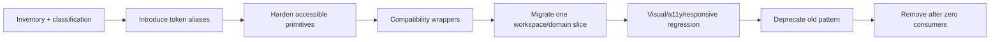

Migration priorities: P0 focus management/critical contrast/semantic controls; P1 tokens, actions, fields, navigation, status registry, tables; P2 page patterns, mobile alternatives, states; P3 expressive themes, charts, catalog depth; P4 Relate-specific expansion and released dark mode. Phase 7 owns code, routing, state, and package decisions.

## 51. Design Fitness Rules

1. No arbitrary colors outside approved token layers.
2. Status meaning cannot rely on color alone.
3. Tenant branding cannot override safety, status, focus, text, or Platform semantics.
4. One primary action exists per page/dialog context.
5. Icon-only controls have accessible names, visible focus, sufficient targets, and useful tooltips.
6. Placeholder never replaces a label.
7. Every input defines focus, error, disabled, read-only, and loading behavior where relevant.
8. Every dialog traps and restores focus.
9. No nested modal chains for ordinary workflows.
10. Data tables have a documented mobile alternative.
11. Touch targets meet the accessibility minimum.
12. Content remains usable at 200% zoom and with text scaling.
13. Reduced motion is honored.
14. Component spacing uses tokens.
15. Domain teams do not invent status colors.
16. Cards are not default wrappers for layout.
17. Dense interfaces retain at least 14px readable data/body type.
18. Platform privilege uses label, icon, structure, and confirmation—not color alone.
19. Sensitive data follows masking, purpose, preview, and audit rules.
20. AI-supported actions/output are explicitly identified.
21. Important disabled states explain why.
22. Loading does not blank the authenticated shell unnecessarily.
23. Empty states distinguish no-data, filtered, setup, permission, and entitlement cases.
24. Tenant identity never compromises shell navigation readability.
25. Every reusable component documents anatomy, states, responsiveness, accessibility, content, and tokens.
26. Compact density never shrinks coarse-pointer targets below 44px.
27. Full/extra-large durable workflows use pages, not modal substitutes.
28. My Work, Notifications, and Activity Center remain semantically separate.
29. Offline and stale data are truthfully labeled by capability.
30. Charts provide non-color encoding and a text/data alternative.

## 52. Architecture Decision Records

| ADR | Decision | Rationale |
|---|---|---|
| DS-01 | Calm intelligence is the base personality | balances enterprise trust and educational warmth |
| DS-02 | One language, workspace expressions | preserves family while respecting context |
| DS-03 | Light V1; dark architected for later | reduces immediate burden without structural lock-in |
| DS-04 | Bounded, validated tenant branding | identity without accessibility/semantic loss |
| DS-05 | Tenant primary may affect actions only through a contrast/policy gate | brand expression needs a safe fallback |
| DS-06 | Authenticated sidebars remain neutral | stable readability and workspace consistency |
| DS-07 | Platform uses fixed multi-cue privilege treatment | prevents tenant/platform context confusion |
| DS-08 | Relate is content-expressive; Personal is light/productive | purpose differs while foundations remain shared |
| DS-09 | Parent/Student are simplified and welcoming | their tasks and cognitive load differ from staff |
| DS-10 | Sound off by default, no routine navigation sound | trust, discretion, and accessibility |
| DS-11 | Illustration/mascot are context-limited | warmth without trivializing serious work |
| DS-12 | AI uses labeled, reviewable, source-aware pattern | avoids magic styling and automation ambiguity |
| DS-13 | Cards are purposeful, not dominant | reduces dashboard-template/ERP feel |
| DS-14 | Border, hierarchy, whitespace, and progressive disclosure carry dense pages | makes data-heavy work calm and scan-friendly |
| DS-15 | Comfortable default; Compact named opt-in | accessibility and consistency |
| DS-16 | Mobile collections become priority rows/cards except true analytical/specialized grids | task-first usability |
| DS-17 | Destruction uses semantic danger plus explicit target/consequence | prevents accidental harm |
| DS-18 | Central registry maps domain states to six semantic categories | prevents status rainbow |
| DS-19 | Tenant inputs resolve into safe semantic slots | accessibility remains enforceable |
| DS-20 | Storybook/equivalent is adopted in implementation | required scale, isolation, testing, and governance |

## 53. Implementation Handoff

Phase 7 may implement incrementally but must not reopen frozen domain, IAM, IA, or shell decisions. Before migration starts, freeze: semantic token names and light reference palette; dark-mode release policy; tenant slots/gating/fallback; typography licenses and roles; spacing/density/radius/border/elevation scales; breakpoint behavior bands; focus/target/contrast rules; action hierarchy; field anatomy; status registry ownership; modal/drawer/page threshold; mobile collection strategy; Platform/support-session cues; AI/sensitive-data patterns; component catalog taxonomy and governance.

Recommended implementation order: establish token package/theme resolver; harden Button/IconButton, Field/Input, focus utilities, Modal/Drawer; add Status registry; build PageHeader/Breadcrumb/Tabs/FilterBar/Table foundations; validate one compact operational collection and one comfortable parent/student flow; add shell primitives; then migrate domain slices behind compatibility wrappers. Add the isolated catalog, axe/interaction tests, visual regression, and tenant/theme matrices at the start—not after migration.

This document does not authorize React refactors, Laravel changes, routing changes, package installation, Tailwind changes, production components, or style migration.

## 54. Final Decision Matrix

| Area | Current state | Target decision | Treatment | Priority | Implementation dependency |
|---|---|---|---|---|---|
| Colors | small CSS seed + direct utilities | layered semantic palette | TOKENIZE | P1 | token resolver |
| Typography | Inter/Jakarta, widespread small text | role scale; 14px dense minimum | TOKENIZE | P1 | font/license/performance |
| Spacing | Tailwind values/local choices | semantic 4px-based rhythm | TOKENIZE | P1 | tokens |
| Radius | many direct rounded values | five roles | TOKENIZE | P2 | tokens |
| Shadows | broad local use | elevation 0–4, border-first | TOKENIZE | P2 | tokens |
| Icons | Lucide established | canonical Lucide rules | KEEP+TOKENIZE | P1 | icon wrapper/catalog |
| Buttons | shared + many native/local | hierarchy + IconButton | WRAP/REFACTOR | P1 | accessible primitives |
| Inputs | shared seed + native/local | complete input family | WRAP/REFACTOR | P1 | Field contract |
| Forms | controlled/local/dynamic | canonical anatomy/layouts | REFACTOR | P1 | form engine contracts |
| Upload/Camera | feature patterns exist | resilient upload/capture flows | WRAP | P2 | media/privacy APIs |
| Sidebar/Header | partial shell components | frozen shared shell visuals | REFACTOR | P1 | canonical routes/metadata |
| Workspace Switcher | modal/role blur risk | popover/sheet, atomic context | REPLACE | P1 | IAM/cache invalidation |
| Academic Context | scattered | compound context control | CREATE | P2 | academic context contract |
| Page Header/Breadcrumb | shared seed/inconsistent | canonical variants/trail | WRAP | P1 | route metadata |
| Tabs/Filters | local variants | one tab row; standard filters | REPLACE | P2 | URL/query contracts |
| Tables | shared/local | Table/DataGrid + mobile collection | WRAP | P1 | server pagination |
| Score Grid | specialized feature need | dedicated accessible grid | CREATE | P1 | assessment save/lock APIs |
| Cards/Metrics | dominant/local + MetricCard | named roles, meaningful metrics | REFACTOR | P2 | token primitives |
| Badges/Statuses | useful central seed, string-coupled | semantic registry | REFACTOR | P1 | domain state catalog |
| Avatar | local patterns | privacy-aware identity system | CONSOLIDATE | P2 | media policy |
| Notifications/My Work | visually/semantically blurred | separate awareness/action models | REFACTOR | P2/P3 | projections/workflow |
| Activity Center | domain fragments/toasts | persistent job center | CREATE | P3 | job API/events |
| Modal/Drawer | shared but incomplete focus; oversized | accessible governed surfaces | REFACTOR | P0 | focus primitives |
| Wizard | enrolment-local | resumable canonical pattern | WRAP | P2 | form persistence |
| Empty/Error | shared partial/mixed | semantic catalogs | TOKENIZE/CREATE | P2 | error contracts |
| Loading | ad hoc | progressive shell/page/section | STANDARDIZE | P2 | query boundaries |
| Offline | PWA assets, ambiguous capability | explicit per-domain states | CREATE | P2/P3 | sync declarations |
| Charts | Recharts/local choices | ChartContainer + palette/a11y | WRAP | P2 | analytics contracts |
| Illustration/Mascot | rich public assets | governed contextual use | KEEP+GOVERN | P3 | asset review |
| AI | multiple capabilities/visual risk | labeled reviewable pattern | CONSOLIDATE | P2/P3 | AI gateway/policy |
| Tenant Branding | branding feature/current colors | safe semantic slots/gate | REFACTOR | P1 | branding validation |
| Platform Theme | shared dashboard risk | fixed multi-cue privilege expression | CREATE | P1 | PlatformPrincipal/support session |
| Personal/Relate | shared/light; Relate planned | distinct bounded expressions | EVOLVE | P3/P4 | workspace implementation |
| Parent/Student | role dashboard variants | simplified task-first expressions | REFACTOR | P2 | IAM scope/IA routes |
| Accessibility | partial | WCAG 2.2 AA component contracts | REFACTOR | P0 | catalog/tests |
| Responsive | local Tailwind patterns | four behavior bands/matrices | STANDARDIZE | P1 | shell/container strategy |
| Dark Mode | absent | architect now; release later | DEFER RELEASE | P2/P3 | full theme QA |
| Motion | Motion + CSS one-offs | three tokens; reduced-motion complete | TOKENIZE | P2 | motion utilities |
| Sound | notification utility exists | off by default; limited opt-in | RESTRICT | P2 | preferences/consent |
| Storybook/catalog | absent | adopt equivalent in Phase 7 | CREATE | P1 | implementation tooling decision |

**Phase boundary:** Phase 6 stops here. The next artifact is **SKUGGLE MIGRATION & IMPLEMENTATION SPECIFICATION**. It will define incremental transition to canonical routing, workspace shells, design-system primitives, scoped frontend state, capability-based navigation, domain routes, and standardized components; none of those changes are implemented by this specification.
