# SKUGGLE MIGRATION & IMPLEMENTATION SPECIFICATION

**Status:** Phase 7 implementation programme; no migration or application implementation is authorized by this document.  
**Inspected:** 2026-09-03, working tree at `b30f3e1a405f7cd5b4253446752cc1d89724bd09` plus uncommitted changes.  
**Frozen inputs:** Architecture Phases 1–6. The Phase 6 artifact currently exists at repository root as `SKUGGLE_ENTERPRISE_DESIGN_SYSTEM.md`; move/copy placement under `docs/` is an implementation-repository housekeeping decision, not an architectural change.

## 1. Executive Summary

Skuggle will migrate by an **expand → coexist → observe → cut over → contract** strangler programme. No wave deletes its predecessor when introduced. Security and production hygiene come first; automated architectural controls second; design primitives, tenant/IAM contracts, routing, and shell foundations follow. Complete vertical slices then prove the architecture before it scales across domains.

The first production wave is Wave 0: remove localhost diagnostics, close or prove closure of the teacher-assignment tenant defect, build an endpoint-level IDOR/BOLA release gate, harden global bypasses, modal focus, and shell crash recovery. The first domain slice is **Students**, because the current repository has substantive typed models, policies, services, tests, enrolment work, and profile UI while still exercising tenant context, IAM, Person linkage, routing, shell, forms, media, and design-system primitives. The next pilots are **Attendance** and **Assessment score entry**. Finance is deliberately not a pilot.

Completion means every in-scope capability has canonical ownership, route, authorization/resource scope, tenant-safe data and jobs, accessible/responsive UI, tests/telemetry/runbooks, no live compatibility consumers, reconciled data, and approved legacy removal. “The new page renders” is not completion.

## 2. Current Repository Baseline

### Audit baseline vs current vs target

| Area | Audit baseline | Current working tree | Target |
|---|---|---|---|
| Git | Frozen audit did not record a commit; its evidence matches much of the 2026-09-03 working tree | committed anchor is `b30f3e1` (2026-08-30); before creating this artifact: 56 tracked files changed and 77 untracked paths | tagged, reproducible migration releases and a machine-readable baseline manifest |
| Frontend | React 19/Vite 6; manual history routing; 1,918-line AppContext; partial primitives | 92 TSX files; navigation/workspace registries, command palette, module workspace, 11 shared UI files including the barrel; AppContext is about 2,026 lines and remains central | nested workspace routes, scoped state, shared shell and DS |
| Backend | Laravel 13; 264 total executable routes in audit; 59 models/51 API controllers then | current filesystem: 70 PHP model files and 53 V1 API controllers; route source has 221 `Route::` declarations (not equivalent to executable route count) | bounded modular monolith and contract-owned APIs |
| Schema | typed core plus JSON bridges | four migrations untracked relative to committed `b30f3e1`: school roles, `school_module_records`, extended enrolment, form engine; the frozen audit already references this work | expand/contract, typed aggregate ownership |
| IAM | one membership `role_id`; DB permissions; aliases | `SchoolRoles` constants and broader seeded roles/permissions added; still role-name logic and single role | memberships + role assignments + canonical capability registry |
| Students | working core | richer enrolment/profile/document/medical/status services and tests | first complete vertical slice; Person-linked |
| Forms | legacy custom fields | versioned form models/services/controller and tests added | shared schema/version service; historical rendering |
| Shell/IA | coupled `App.tsx`/sidebar | navigation registry and workspace route helper added; manual routing remains | declarative guarded shells with legacy outlet |
| Design | direct utilities/local UI | shared Button/Modal/Drawer/Table/etc.; Phase 6 specification exists | tokenized, catalogued WCAG 2.2 AA components |
| Critical defects | localhost telemetry; teacher assignment tenant risk; incomplete IDOR assurance | three localhost POSTs remain (`SchoolStructureView` twice, `AppErrorBoundary` once); `SchoolStructureController` still performs the unsafe global teacher-user lookup | zero diagnostic exfiltration; enforced tenant/resource scope |

New risk: architecture work is mostly uncommitted, so provenance and rollback are weak. Establish a clean baseline tag after review before implementation. Existing user changes are not to be reset or folded into an unrelated migration PR.

### Current additions and audit-delta classification

- **Routes/APIs:** current source adds form definitions/library/fields, admission-number preview and duplicate checks, student documents/medical/profile sheet, tenant memberships, school modules, school structure, Performance, Guardians, tenant audit and Help tickets. It also contains a duplicate student-registration lookup declaration that must be resolved through the API inventory, not silently deleted.
- **Modules/UI:** new Students enrolment/profile, Admissions, Assessment workspace, Performance, School Structure, Reports, Forms, Administration, Learning Resources, Messages, Help, Subscription, ModuleWorkspace and CommandPalette surfaces exist.
- **Permissions/IAM:** `SchoolRoles` and School Super Admin compatibility were added; the seeder now contains 42 legacy permission keys including broad `admissions.manage`, `communication.send`, `operations.manage`, `services.manage` and `learning.manage`. This is progress in coverage, not the canonical registry.
- **Infrastructure:** database queue/cache/session support, Hostinger prepared-release swapping, checksums, cron workers, CI/security checks, Sentry/Pulse/S3/Redis options and migration safety controls are present. No post-audit infrastructure delta can be proven because the audit has no commit anchor; Phase 7 must baseline these files explicitly.
- **Resolved/improved findings:** declarative navigation seeds, shell/error seeds, richer Student isolation/enrolment work, a versioned form-engine foundation and School Super Admin distinction have improved. Manual routing, AppContext coupling, role-name presentation logic, generic storage ownership and full IDOR assurance remain unresolved.
- **New risks:** the larger generic `SchoolModuleCatalog` increases the transitional-data retirement burden; new endpoint families expand the BOLA matrix; contradictory local/S3 defaults in `.env.example` risk deployment drift; and inconsistent job context restoration remains.

### Codebase map

| Current file/path | Target responsibility | Wave | Treatment |
|---|---|---:|---|
| `src/App.tsx` | thin root, public router, workspace outlets | 7–8 | strangler/refactor |
| `src/context/AppContext.tsx` | compatibility facade over scoped providers/query state | 6–24 | extract incrementally |
| `src/lib/navigation.ts`, `sidebarNav.ts`, `moduleTabs.ts` | canonical route/capability metadata | 7–9 | consolidate, retain aliases |
| `src/lib/workspaceRoute.ts` | legacy URL translator | 7/24 | wrap then deprecate |
| `AppHeader`, `AppSidebar` | shared shell regions | 8–9 | adapt then replace internals |
| `WorkspaceSwitcherModal` | desktop popover/mobile sheet and atomic switch | 8 | compatibility adapter |
| `CommandPalette` | permission-filtered search/commands | 9/17 | evolve |
| `src/components/ui` | tokenized accessible primitives | 2/36 | harden/wrap |
| `src/features/**` | workspace/domain vertical slices | 10–23 | migrate per domain |
| Laravel tenant middleware/context | canonical context entry/propagation | 3 | harden |
| Policies/middleware permission checks | capability + resource authorization | 0/4 | inventory and converge |
| API controllers | thin use-case adapters | domain waves | strangle endpoint family |
| Models/services | bounded aggregate persistence/application services | domain waves | retain IDs, move ownership |
| Jobs/events/outbox | tenant envelope and durable integration | 3/16–18 | standardize |
| Migrations/seeders | expand/contract and registry sync | 3–24 | additive first; audited contract |

## 3. Migration Principles

1. Preserve production behavior until the replacement passes parity, security, data, accessibility, and rollback gates.
2. Expand schema/contracts first; destructive contraction is a later release.
3. One PR addresses one foundation concern, component family, route family, or bounded vertical slice.
4. Backend authorization is authoritative; frontend capability checks improve UX only.
5. Tenant context is explicit in requests, jobs, caches, files, exports, and search.
6. Compatibility has an owner, telemetry, expiry date, and removal condition.
7. Backfills are idempotent, resumable, tenant-partitioned, reconciled, and reversible.
8. Pilot by selected tenant/persona, not blind percentage, where state or authorization differs.
9. Domain facts have one owner; shared services orchestrate without validating domain transitions.
10. Stop a release on cross-tenant access, privilege escalation, corruption, unreconciled finance, changed published results, broken login/switching, unrecoverable migration, critical required-flow accessibility failure, wrong-resource routing, or secret exposure.

Prohibited: big-bang rewrite, frontend-only reskin on old IAM, database reset, unreconciled table copy, role-name authorization, convenience tenant bypass, mass route/component/permission replacement, long-lived refactor branch, unflagged cutover, untested backfill, silent fallback, and permanent compatibility layers.

Migration item states are: **NOT STARTED → FOUNDATION READY → DUAL MODE → PILOT → DEFAULT NEW → LEGACY FALLBACK → LEGACY DEPRECATED → LEGACY REMOVED**.

## 4. Dependency Graph

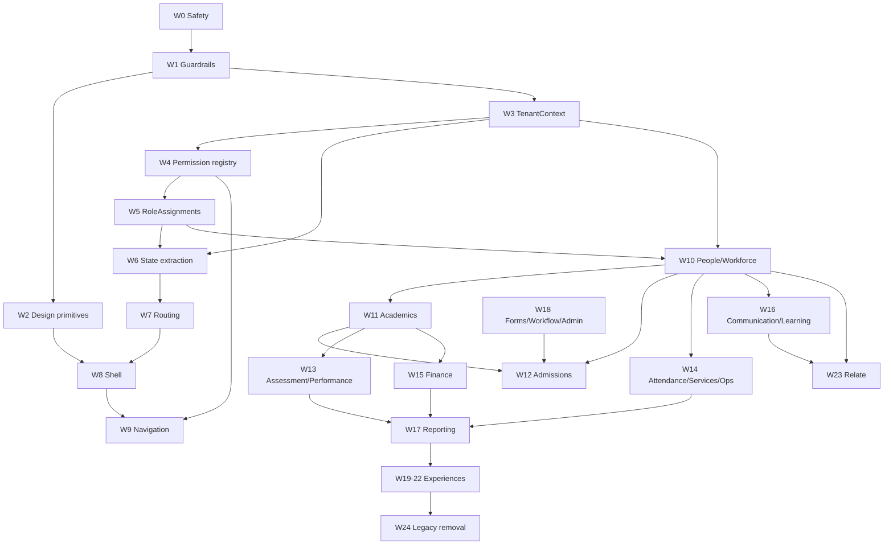

Blocking chain: safety → tenant/access contracts → routing → shell/navigation → domain slices. Design primitives may proceed beside tenant work after guardrails. Forms v1 is already emerging; formalize it before Admissions, but do not delay Students. Search/notifications/jobs mature as shared services when the first consuming slices require them.

## 5. Programme Waves

All waves use the common deployment sequence: backup/config snapshot → expand/disabled deploy → test in production-safe mode → internal → canary tenant → pilot cohort → default new with fallback → observe → deprecate → later contract. Rollback first disables the flag/read switch, then reverts stateless code; additive data remains until reconciled cleanup.

| Wave | Name | Primary outcome | Depends on |
|---:|---|---|---|
| 0 | Production Safety | P0 defects closed | none |
| 1 | Guardrails & Harness | automated architecture/release gates | 0 |
| 2 | Tokens & Accessible Primitives | first migration UI kit | 1 |
| 3 | Tenant Context | canonical propagation | 1 |
| 4 | Permission Registry | canonical vocabulary + aliases | 3 |
| 5 | Multi-Role Membership | additive RoleAssignments | 4 |
| 6 | Frontend State Boundaries | AppContext facade over scoped owners | 3–5 |
| 7 | Canonical Routing | nested route IDs + aliases | 6 |
| 8 | Application Shell | new shell hosts legacy/new pages | 2,7 |
| 9 | Capability Navigation | access-derived navigation | 4,7,8 |
| 10 | People & Workforce | Students pilot then people/workforce | 3–9 |
| 11 | Institution & Academics | canonical structure/context | 3–10 |
| 12 | Admissions | typed application lifecycle and conversion | 10–11 plus existing Forms foundation |
| 13 | Assessment & Performance | separated score/result lifecycles | 11 |
| 14 | Attendance/Services/Ops | typed operational ownership | 10,12 |
| 15 | School Finance | reconciled ledger-grade model | 10,12 |
| 16 | Communication/Learning | delivery + learning boundaries | 3,10 |
| 17 | Insights/Reporting | one execution model | domain owners |
| 18 | Administration/Forms/Workflow | governed shared services | 4–5 and proven use cases |
| 19 | Parent/Student | purpose-built projections/shells | 10,12–17 |
| 20 | Personal Space | workspace abstraction | 6–9 |
| 21 | Platform Console | privileged principal/support sessions | 3–5,8–9 |
| 22 | Public Portal | published projections | domain owners |
| 23 | Skuggle Relate | privacy/moderation-first community | 10,16,18 |
| 24 | Legacy Removal/Optimization | measured contraction | all relevant defaults stable |

### Wave execution cards

Each card supplies the mandatory fields compactly. “Tests/observe” always includes the applicable §37–40 suites; “flag” is server-authoritative and defaults off.

#### Wave 0 — Production Safety

- **Objective/decisions:** eliminate confirmed release hazards before architecture migration.
- **Affected/target:** diagnostic calls, teacher assignment, tenant bypass/IDOR inventory, Modal/Drawer focus, route/section error boundaries.
- **Backend/database/API:** tenant-constrain assignment lookup and relationship checks; enumerate by-ID endpoints and scope exceptions; no destructive schema; preserve contracts.
- **Frontend/compatibility:** remove hard-coded telemetry; harden focus trap/restore and shell recovery without redesign; no compatibility needed for diagnostics.
- **Flag/tests/observe:** no flag for security fixes; targeted tenant, policy, BOLA, browser focus, crash recovery; CSP/network telemetry, denial anomalies, frontend crash rate.
- **Deploy/rollback:** small independent fixes; canary; rollback stateless change only if regression, never restore unsafe diagnostics or known cross-tenant behavior.
- **Exit/non-goals:** zero localhost calls; teacher cross-tenant/wrong-assignment tests pass; P0 endpoint matrix green; no domain refactor.

#### Wave 1 — Architecture Guardrails & Test Harness

- **Objective/decisions:** turn frozen rules into CI and review controls.
- **Affected/target:** PHPUnit architecture/tenant suites, TS lint/static scripts, API contract checks, catalog test harness.
- **Backend/database/API:** unknown permission keys fail registry validation; tenant APIs declare context; forbid new role-name enforcement and unreviewed bypass; flag generic stores as transitional.
- **Frontend/compatibility:** detect third nav level, nested tabs, new raw status colors, hard-coded shared-component values, duplicated native buttons.
- **Flag/tests/observe:** CI-only; baseline allowlist prevents mass cleanup; trend violations down.
- **Deploy/rollback:** warn on existing debt, fail on new violations; rollback a faulty rule, not the rule set.
- **Exit/non-goals:** guardrails documented, deterministic, owned; no bulk remediation.

#### Wave 2 — Design Tokens & Accessible Primitives

- **Objective/decisions:** implement only primitives needed by first slices.
- **Affected/target:** tokens, Button/IconButton, Field/Input, Select/Combobox as needed, Checkbox/Radio/Switch, focus, Modal/Drawer, Status, PageHeader/Breadcrumb/Tabs/FilterBar/Table.
- **Backend/database/API:** none.
- **Frontend/compatibility:** old exports delegate to new internals where API-compatible; adapters translate legacy variants/class names; catalog records both.
- **Flag/tests/observe:** `ui.foundation.v2`; component/a11y/visual/responsive tests; usage and console-error telemetry.
- **Deploy/rollback:** publish in-app source, migrate one consumer family; flag or import rollback.
- **Exit/non-goals:** Students-ready set passes DS acceptance; do not build entire catalog or mass-replace utilities.

#### Wave 3 — Tenant Context + Authorization Foundation

- **Objective/decisions:** one TenantContext/envelope for HTTP, CLI, schedules, jobs, cache, storage, reports, exports, search.
- **Affected/target:** resolver middleware, tenant scopes, job payloads, cache/storage key helpers, global-query boundary.
- **Backend/database/API:** context from authenticated membership or explicit public resolver; signed immutable job envelope `{tenant, actor, workspace, correlation}`; additive metadata only.
- **Frontend/compatibility:** workspace header/request client consumes canonical context but legacy headers/session remain during dual mode.
- **Flag/tests/observe:** `tenant_context.v2`; full tenant suite; context mismatch, missing envelope, bypass counter without PII.
- **Deploy/rollback:** shadow-derive then compare; switch read path per cohort; revert read switch.
- **Exit/non-goals:** every migrated path has context proof; do not change all models at once.

#### Wave 4 — Canonical Permission Registry

- **Objective/decisions:** versioned capability vocabulary with explicit legacy aliases.
- **Affected/target:** registry source, seed sync, middleware/policies, frontend access payload.
- **Backend/database/API:** code-owned registry manifest generates/validates DB rows; aliases map legacy→canonical; unknown key fails CI/startup sync, never silently grants.
- **Frontend/compatibility:** receive canonical capabilities plus temporary legacy keys; no role-name decisions in new code.
- **Flag/tests/observe:** `authz.canonical_permissions`; shadow both evaluators and record parity/mismatch codes.
- **Deploy/rollback:** add keys/aliases; shadow; cohort enforcement; switch back to legacy evaluator if false denials.
- **Exit/non-goals:** parity threshold 100% for privileged grants and investigated mismatch-free observation; no permission deletion.

#### Wave 5 — Membership Multi-Role Compatibility

- **Objective/decisions:** add RoleAssignments while retaining `tenant_memberships.role_id`.
- **Affected/target:** membership schema/model, assignment lifecycle/cache, auth/access responses.
- **Backend/database/API:** additive assignment table; existing role is implicit; dual-read then dual-write; unique active assignment constraints and validity interval.
- **Frontend/compatibility:** old primary-role label remains; new persona/capability set is additive.
- **Flag/tests/observe:** `iam.role_assignments`; multi/temporary/expired/custom/self-grant/platform tests; permission parity.
- **Deploy/rollback:** backfill in tenant batches; revert reads to `role_id`; retain assignment rows.
- **Exit/non-goals:** 100% backfill/reconciliation; policy reads assignments; `role_id` remains until Wave 24.

#### Wave 6 — Frontend State Boundary Extraction

- **Objective/decisions:** turn AppContext into a compatibility facade, one state family at a time.
- **Affected/target:** Auth → Workspace → Access → Academic → Navigation → Notifications/Jobs → domain server state → page/form state.
- **Backend/database/API:** stable bootstrap contracts; no schema.
- **Frontend/compatibility:** facade reads new provider/hooks and preserves old API; consumer-by-consumer codemods only later.
- **Flag/tests/observe:** owner-specific flags; hook/provider, render-count, switch/invalidation tests; crashes and duplicate requests.
- **Deploy/rollback:** extract pure/read-only first, then writes; revert provider binding per owner.
- **Exit/non-goals:** no authoritative domain collections in shell; do not replace AppContext in one PR.

#### Wave 7 — Canonical Routing & Metadata

- **Objective/decisions:** declarative nested route model; evaluate React Router at implementation start.
- **Affected/target:** route IDs, workspace layouts, guards, object/tab routes, metadata, 404, aliases.
- **Backend/database/API:** server fallback serves SPA without masking API 404; no schema.
- **Frontend/compatibility:** legacy pathname parser becomes translator; old bookmarks redirect after authorization, preserving safe query state.
- **Flag/tests/observe:** `routing.v2`; route contract/deep-link/back-forward/404/authorization tests; legacy and unknown-route metrics.
- **Deploy/rollback:** dual route recognition, selected users, tenant pilot; revert routing flag.
- **Exit/non-goals:** canonical links emitted everywhere migrated; no mass rename.

#### Wave 8 — Application Shell Foundation

- **Objective/decisions:** root shell, workspace header/switcher, nav slot, academic context, page context, content canvas, account/help, boundaries.
- **Affected/target:** App/Header/Sidebar/Switcher/ErrorBoundary and LegacyPageAdapter.
- **Backend/database/API:** workspace/bootstrap metadata only; no domain rewrite.
- **Frontend/compatibility:** new shell renders legacy page outlet; adapter supplies old callbacks/context and forbids new dependencies.
- **Flag/tests/observe:** `shell.v2`; shell accessibility, partial failure, switch, mobile, performance; adapter usage count.
- **Deploy/rollback:** internal then tenant/persona; revert shell flag.
- **Exit/non-goals:** shell stable with legacy and Students route; adapter has owner/expiry; do not migrate every page.

#### Wave 9 — Capability-Based Navigation

- **Objective/decisions:** derive nav from workspace + capability + permission + entitlement + flag + persona relevance.
- **Affected/target:** navigation registry, badges, mobile priorities, command palette.
- **Backend/database/API:** server-issued authorized capability/entitlement metadata.
- **Frontend/compatibility:** nav aliases map old IDs; specialist roles retain distinct persona presentation.
- **Flag/tests/observe:** `navigation.v2`; combinatorial visibility/no-authority tests; click/404/hidden-authorized-route metrics.
- **Deploy/rollback:** persona cohorts; revert registry selector.
- **Exit/non-goals:** no role collapse or third level; backend remains authoritative.

#### Wave 10 — People + Workforce

- **Objective/decisions:** Students first vertical slice, then Guardians, Person links, Employee/Teacher/profile views.
- **Affected/target:** student/guardian/employee models, services, policies, APIs and feature views.
- **Backend/database/API:** additive Person/candidate links; preserve public IDs and endpoints through adapters.
- **Frontend/compatibility:** canonical routes and DS pages; old pages/API remain fallback.
- **Flag/tests/observe:** `domain.students.v2`, then people/workforce; full relationship/tenant/media tests and parity metrics.
- **Deploy/rollback:** selected low-criticality tenant; revert reads/UI, preserve new links.
- **Exit/non-goals:** verified links only; no uncertain auto-merge or admission rewrite.

#### Wave 11 — Institution + Academics

- **Objective/decisions:** consolidate Profile, Campus, Department, Session, Term, Class, Subject, Enrolment, Assignment, Timetable, LessonPlan ownership.
- **Affected/target:** duplicate structure APIs and JSON module data.
- **Backend/database/API:** one aggregate family per release; additive columns/tables; facade over old endpoints.
- **Frontend/compatibility:** AcademicContext and canonical settings routes host old/new modules.
- **Flag/tests/observe:** per-resource flags; context/assignment/term isolation and parity.
- **Deploy/rollback:** one module/tenant cohort at a time; read fallback.
- **Exit/non-goals:** canonical source per object; not one giant academic migration.

#### Wave 12 — Admissions

- **Objective/decisions:** typed Application→Document→Screening→Review→Decision→Offer→Conversion.
- **Affected/target:** generic admission records, enrolment handoff, references.
- **Backend/database/API:** additive tables; legacy-reference mapping; dual-read projection; explicit People/Academics conversion transaction/orchestration.
- **Frontend/compatibility:** route/page adapters; existing reference searchable.
- **Flag/tests/observe:** `domain.admissions.v2`; lifecycle, idempotent conversion, document security, reconciliation.
- **Deploy/rollback:** new applications on v2 for pilots; legacy remain readable; revert creation flag.
- **Exit/non-goals:** all active cases mapped; do not delete generic rows.

#### Wave 13 — Assessment + Performance

- **Objective/decisions:** Assessment owns assessments/questions/scores/moderation/lock; Performance owns results/approval/publication/analytics.
- **Affected/target:** assessment workspace, result views, SmartMark/CBT integrations.
- **Backend/database/API:** version scores; append corrections; immutable publication snapshots; explicit reopen/moderation commands.
- **Frontend/compatibility:** CA/Test/Exam are filters; legacy assessment/result aliases route to canonical contexts.
- **Flag/tests/observe:** per workflow; golden historical results, concurrency/lock, approval/publication, SmartMark job tests.
- **Deploy/rollback:** read-only compare before writes; never rollback by mutating published history.
- **Exit/non-goals:** generated/published totals identical; no silent historical recalculation.

#### Wave 14 — Attendance / Services / Operations

- **Objective/decisions:** separate Student vs Staff Attendance; type service cases and operational records by owner.
- **Affected/target:** attendance core and `school_module_records` slices.
- **Backend/database/API:** migrate one record type at a time; sensitive services have classification/field filters/audit.
- **Frontend/compatibility:** Attendance second pilot; legacy module adapter for unmigrated types.
- **Flag/tests/observe:** per record type; wrong campus/relationship/offline/device tests.
- **Deploy/rollback:** new writes per pilot; dual projection; revert write switch.
- **Exit/non-goals:** no shared ambiguous attendance or bulk JSON deletion.

#### Wave 15 — School Finance

- **Objective/decisions:** ledger-grade fee, account, invoice, payment, receipt, arrears, refund, reconciliation; separate Platform Billing.
- **Affected/target:** finance UI/basic transactions and reports.
- **Backend/database/API:** additive ledger; immutable entries; legacy-reference map; reconciliation snapshots.
- **Frontend/compatibility:** old read UI remains until per-tenant balance parity; no mixed terminology.
- **Flag/tests/observe:** tenant-specific only; money precision, idempotency, allocation/refund, authorization, reconciliation and load tests.
- **Deploy/rollback:** backup/restore proof; shadow ledger; finance freeze window for final cutover if required; rollback read/write switches, never delete entries.
- **Exit/non-goals:** old totals = new totals for balances, invoices, payments, receipts, outstanding, refunds; no busiest-school first pilot.

#### Wave 16 — Communication + Learning Resources

- **Objective/decisions:** separate authored communication from delivery; keep mature learning resources and rename Online Learning.
- **Affected/target:** messages, announcements, campaigns, outbox/delivery; resources, assignments, progress, practice.
- **Backend/database/API:** tenant job envelope, consent/preferences, retry/receipt; route aliases.
- **Frontend/compatibility:** “Online Learning” redirects to Learning Resources; notification UI stays distinct.
- **Flag/tests/observe:** channel/resource flags; privacy, delivery idempotency, retry, assignment scope.
- **Deploy/rollback:** channel cohorts; queue fallback; revert producer/read routes.
- **Exit/non-goals:** delivery auditable; do not equate messages and notifications.

#### Wave 17 — Insights + Reporting

- **Objective/decisions:** one report identity/execution/history; domain owns metric meaning.
- **Affected/target:** report endpoints, exports, dashboard aggregates.
- **Backend/database/API:** parameter schema, queued execution, output metadata; context and Insights links share ID.
- **Frontend/compatibility:** report adapters and canonical routes.
- **Flag/tests/observe:** report-family flags; result parity, authorization, export/file isolation, job performance.
- **Deploy/rollback:** shadow output compare; fall back to old executor.
- **Exit/non-goals:** reconciled high-value reports; no universal analytics fact ownership.

#### Wave 18 — Administration + Forms + Workflow

- **Objective/decisions:** compose Users/Access, Roles, Security, Forms, Workflow, Integrations, Subscription, Audit without centralizing domain settings.
- **Affected/target:** emerging form engine, custom fields, result approvals first.
- **Backend/database/API:** versioned immutable submission schema refs; workflow stores steps/assignments/deadlines/history while domain validates transitions.
- **Frontend/compatibility:** legacy custom-field renderer reads through schema adapter.
- **Flag/tests/observe:** `forms.v2`, workflow-by-domain; historical render/golden transitions/authorization.
- **Deploy/rollback:** dual render, then dual write where safe; revert resolver.
- **Exit/non-goals:** historical submissions render; no universal rules engine or giant settings table.

#### Wave 19 — Parent + Student Experience

- **Objective/decisions:** purpose-built projections and simplified shells after resource scopes stabilize.
- **Affected/target:** Parent Overview/Children/Results/Attendance/Finance/Learning/Messages; Student Home/Learning/Timetable/Assessments/Results/Attendance/Resources/Messages.
- **Backend/database/API:** relationship-scoped read models; minimal payloads.
- **Frontend/compatibility:** old role dashboards remain fallback.
- **Flag/tests/observe:** persona + tenant flags; parent-child/student-self, privacy, mobile/a11y/E2E.
- **Deploy/rollback:** invited pilot families/students; revert shell/page flags.
- **Exit/non-goals:** zero staff-page cloning with hidden controls.

#### Wave 20 — Personal Space

- **Objective/decisions:** preserve personal tenancy and place presentation behind Workspace abstraction.
- **Affected/target:** personal auth/plans/shell.
- **Backend/database/API:** explicit projections/deep links for school data; revocation isolation.
- **Frontend/compatibility:** old personal routes alias.
- **Flag/tests/observe:** workspace/persona; revocation/cache separation tests.
- **Deploy/rollback:** opt-in users; fallback old shell.
- **Exit/non-goals:** school revocation never removes Personal; no copied school records.

#### Wave 21 — Platform Console

- **Objective/decisions:** PlatformPrincipal, tenant registry, billing, support, ops, security, audit, health; controlled support sessions.
- **Affected/target:** PlatformOps controller/dashboard and aliases.
- **Backend/database/API:** platform principal boundary; MFA/step-up; support session envelope/expiry/audit; constrained global queries.
- **Frontend/compatibility:** platform aliases retained; fixed privilege shell.
- **Flag/tests/observe:** platform-user cohorts; tenant rejection, MFA, support session, global query tests.
- **Deploy/rollback:** internal platform operators only first; old console fallback.
- **Exit/non-goals:** no ambiguous platform_owner alias in enforcement; no tenant-brand override.

#### Wave 22 — Public Portal

- **Objective/decisions:** serve Welcome/Login/Admissions/Result PIN/Public Resources/Contact from explicit published projections.
- **Affected/target:** public pages/APIs/resolver.
- **Backend/database/API:** allowlisted public fields, rate limits, signed/opaque lookups, explicit tenant resolution.
- **Frontend/compatibility:** preserve indexed/bookmarked URLs with permanent redirect only after parity.
- **Flag/tests/observe:** tenant/route flags; cross-tenant enumeration, abuse, caching, accessibility/performance.
- **Deploy/rollback:** tenant-by-tenant; fallback projection/route.
- **Exit/non-goals:** no casual scope bypass or private aggregate serialization.

#### Wave 23 — Skuggle Relate

- **Objective/decisions:** new community bounded context after Person, CommunityProfile, privacy, minor safety, consent, moderation, search, notification, media foundations.
- **Affected/target:** new Relate APIs/shell; no legacy data replacement.
- **Backend/database/API:** separate profile/privacy/moderation ownership and safety audit.
- **Frontend/compatibility:** none beyond shared identity/workspace contracts.
- **Flag/tests/observe:** invite-only; safety/moderation/privacy/performance metrics without content PII.
- **Deploy/rollback:** closed alpha → controlled tenants/personas; disable workspace entry and preserve data.
- **Exit/non-goals:** safety gates passed; never embed social feed in School shell.

#### Wave 24 — Legacy Removal & Optimization

- **Objective/decisions:** remove only telemetry-proven zero-use aliases, role fields, switches, context fields, components, APIs, JSON ownership, permissions.
- **Affected/target:** all compatibility inventories.
- **Backend/database/API:** contract migrations separated from code cutover; archival/legal retention applied.
- **Frontend/compatibility:** deprecation warnings and final fallback window before removal.
- **Flag/tests/observe:** removal flags where recoverable; 30–90 day zero-use windows by risk.
- **Deploy/rollback:** backup/tag; remove one family; restore code/alias, and schema from additive preservation or tested restore.
- **Exit/non-goals:** Gate H and owner sign-off; no removal merely because local tests pass.

## 6. Wave 0 — Production Safety

| Finding/evidence | Fix scope | Regression risk/tests | Deployment/rollback |
|---|---|---|---|
| Three hard-coded POSTs to `127.0.0.1:7364` | delete diagnostic calls; use approved error telemetry abstraction with redaction | render/error-boundary tests; CSP/network assertion | immediate patch; do not restore on rollback |
| Audit TEN-01 teacher assignment; model changed since baseline | prove tenant + membership + teacher profile + campus/class relationship in create/read/update | cross-tenant user, global user collision, wrong campus, inactive membership | guarded backend patch; rollback only to last demonstrably safe version |
| Incomplete endpoint BOLA assurance | generate route/resource/policy matrix; add same/different tenant and relationship tests | false denies and missed public exceptions | endpoint families; block release on gap |
| Global scope bypasses | named service boundary, reason, audit, platform-only capability; static allowlist | jobs/platform/public tests | shadow logging then enforcement |
| Modal/Drawer focus | initial focus, trap, background inert, restore, Escape rules | full enrolment/confirmation keyboard tests | primitive patch with consumer smoke tests |
| Shell white-screen risk | route/section boundaries, reference ID, recover/reload, shell remains interactive | forced render/API failures | canary; revert boundary if looping |

## 7. Architecture Guardrails

| Rule | Automated control | Existing-debt policy |
|---|---|---|
| No backend role-name authorization | PHP static scan + architecture test allowlist | fail new/changed occurrences; burn down old |
| Tenant context for tenant API/job | route middleware inventory + job interface test | named public/platform exceptions only |
| Known permission keys | registry compile/seed parity test | aliases explicit and versioned |
| No third sidebar level/nested tabs | metadata schema test + rendered catalog test | legacy adapter may flatten only |
| No cross-domain direct writes | namespace/dependency tests and review ownership file | transitional service allowlist |
| No new canonical JSON storage | migration/model scan for generic stores | legacy record-type registry freezes additions |
| Resource endpoint isolation | generated route test checklist | endpoint cannot graduate without all cases |
| Shared UI uses tokens | lint for hex/arbitrary values in migrated paths | baseline file/line allowlist |
| No new status colors | semantic status API lint | existing mappings catalogued |
| Native duplicated controls | JSX lint/import policy | permit semantic native form elements through wrapper rules |

CI stages: format/type/unit; architecture/static; API/policy/tenant; migration; frontend component/a11y; selected E2E; build/security scan. Code review template records domain owner, tenant boundary, permissions, compatibility/expiry, flag, telemetry, rollback, data and accessibility impact.

## 8. Design System Foundation

Harden in this order: focus utilities and Button/IconButton; Field/Input and selection controls; Modal/Drawer; Status; PageHeader/Breadcrumb/Tabs; FilterBar/Table. These unlock Students and shell work. Use the current `src/components/ui` exports as adapters where feasible. Add Storybook or equivalent only during implementation after package/hosting/build evaluation; it is a development artifact, not runtime dependency.

Detection begins as baseline-aware warnings: hex/rgb and Tailwind palette usage in shared/migrated code, arbitrary bracket spacing/sizes, status palette classes, raw clickable `div`, and new native buttons outside approved primitives. After a directory is migrated, warnings become failures.

## 9. Tenant Context Migration

Sequence: define immutable context contract → instrument current resolver → add required HTTP context interface → create cache/storage key builders → create job/report/export/search envelope → shadow-compare derived tenant → migrate one job/endpoint family → enforce absence failures → retire implicit access.

Context carries tenant ID/public ID, workspace, actor/principal, request/correlation ID, and optional declared academic scope; it never trusts client tenant IDs over resolved membership. CLI/scheduled tasks iterate explicitly by tenant and clear context in `finally`. Cache keys include environment/version/tenant/resource; storage metadata includes classification/tenant; signed downloads reauthorize. Global Platform operations use a separately named PlatformContext, never “no tenant” as implicit privilege.

## 10. IAM Migration

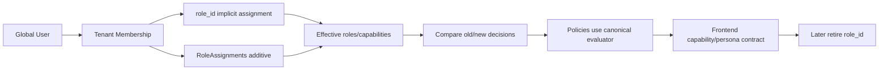

| Current | Target | Schema impact | Dual mode/cutover | Rollback |
|---|---|---|---|---|
| User | global User linked to Person(s)/principals | additive links | unchanged auth ID | ignore new link |
| no canonical Person | Person with verified profile links | additive | candidate then verified | unlink, audit retained |
| Membership + role_id | Membership + assignments | additive assignment table | role_id implicit + rows; evaluator switch | read role_id |
| role_id | temporary compatibility primary role | none initially; contract later | dual-write/backfill | stop dual-write |
| RoleAssignment absent | scoped/dated assignment | new table/indexes | flag by tenant | preserve rows |
| Role | tenant/system role definition | evolve | old IDs preserved | old evaluator |
| Permission strings | canonical registry + aliases | additive keys | shadow parity | legacy alias evaluation |
| Custom role limited | tenant role composed of allowed permissions | additive metadata | validated registry subset | disable custom assignment |
| Platform role alias | PlatformPrincipal separate from tenant roles | additive/contract | explicit platform evaluator | old platform gate temporarily |

## 11. Permission Registry

The source of truth is a versioned code manifest containing key, owning domain, description, allowed scopes, privilege level, replacement aliases, and lifecycle. A migration/seeder sync adds missing DB records and refuses unknown production grants; it never deletes automatically. Policies ask the canonical evaluator. Legacy aliases resolve in one direction and emit usage metrics. Shadow results record decision IDs/reason categories, not subjects or resources. Any old-allow/new-deny or old-deny/new-allow privileged mismatch is investigated before cohort enforcement.

## 12. Multi-Role Migration

Schema concept: `role_assignments(id/public_id, tenant_membership_id, role_id, scope_type?, scope_id?, starts_at?, ends_at?, status, assigned_by, reason, timestamps)` with uniqueness preventing duplicate overlapping active global assignments. Existing `role_id` is an implicit assignment until retired. Writes update both during dual mode; backfill creates a marked `legacy_primary` row idempotently. Effective permissions union active assignments, then apply explicit scope and safety constraints; no assignment may self-elevate above actor delegation.

Validate counts per tenant, every active membership has an effective role, no duplicate active assignments, old/new effective permissions equal before intentional divergence, and cache invalidation occurs on grant/revoke/expiry. Expiry jobs are optional optimization; evaluation must enforce time validity even if cron is late.

## 13. Person Migration

```text
Student / Guardian / Employee record
  → normalized candidate keys
  → scored candidate set
  → exact verified link or human review
  → audited Person link
```

Never merge solely on name, phone, or date of birth. Exact verified global-user linkage may be automatic when invariant and tenant policy permit; uncertain candidates stay separate. Backfill is tenant-batched/idempotent, records algorithm version and evidence hashes, avoids raw PII logs, and supports unlink/re-review. Domain records remain authoritative for domain-specific attributes during transition. Rollback removes/ignores links, never deletes source profiles.

## 14. Frontend State Migration

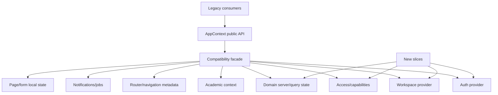

| State | Current owner | Target owner | Wave | Compatibility | Removal condition |
|---|---|---|---:|---|---|
| session/user | AppContext/App | Auth provider | 6 | facade getters/actions | no legacy consumers |
| active workspace/tenant | AppContext | Workspace provider | 6 | facade and atomic adapter | switch E2E/parity stable |
| role/permissions/modules | AppContext/local logic | Access provider/query | 4–6 | both key sets | canonical evaluator default |
| campus/session/term | session/page state | AcademicContext provider | 6/8 | legacy selectors bridge | migrated pages consume hook |
| active tab/history | App/AppContext | router | 7 | path translator | zero legacy route emits |
| nav groups/labels | registries + role logic | route/capability metadata | 7–9 | alias resolver | v2 nav default |
| notifications/toasts/jobs | mixed shell/local | feedback + notification + activity owners | 6/16–18 | event adapter | durable jobs off toast/context |
| students/attendance/etc. | AppContext collections | domain query/service state | per domain | selector facade | slice consumers zero |
| page filters/selection | feature/AppContext | route search params/local reducer | per page | adapter only if shared link | canonical page default |
| form drafts | local/context | form-local/resumable draft service | per workflow | legacy submit adapter | new form completion parity |

## 15. Routing Migration

Evaluate React Router during Wave 7 because no router dependency exists. It is the leading option given nested layouts, loaders/error boundaries, redirects and ecosystem maturity, but selection requires bundle, SSR-not-required SPA hosting, TypeScript, testability, and Vite/Hostinger fallback validation. A small custom router is acceptable only if it demonstrably satisfies the frozen contract with lower lifecycle risk.

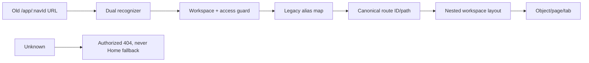

| Current route/nav | Target identity | Redirect/alias duration | Wave | Authorization/removal |
|---|---|---|---:|---|
| `/app`, `home` | `school.home` | alias until shell stable + zero old emits | 7–9 | workspace access |
| `/app/students` | `school.people.students.index` | redirect preserving filters | 10 | `students.view`; usage zero 60d |
| `/app/people` | `school.people.workforce.index` | semantic redirect only after UI split | 10 | workforce capability |
| `/app/admissions` | `school.admissions.applications.index` | alias through Wave 12 | 12 | admissions view/manage |
| assessment aliases (`tests`, `examinations`, `marks-entry`, etc.) | `school.assessment.*` | alias through result parity + 90d zero use | 13 | assessment/resource scope |
| `results`, `report-cards` | `school.performance.*` | preserve deep links/IDs | 13 | results scope |
| `/app/finance` | `school.finance.accounts/index` context | alias through finance reconciliation | 15 | finance permissions |
| online-learning IDs | `school.learning.resources.*` | redirect through Wave 16 | 16 | learning/resource scope |
| report IDs | `school.insights.reports.*` | aliases through Wave 17 | 17 | report permission |
| platform dashboard aliases | `platform.*` | through Wave 21 + operator migration | 21 | PlatformPrincipal + MFA |
| public tenant URLs | `public.tenant.*` | SEO-safe redirects where appropriate | 22 | explicit publication/rate limit |

Canonical route metadata owns ID, workspace, domain, path, label, breadcrumb resolver, title, required capability, entitlement, flag, persona relevance, mobile priority, and legacy aliases. Object IDs remain public IDs. Tabs that represent durable peer views are child routes. Unknown routes render 404 after safe tenant resolution and can never silently show Home.

## 16. Shell Migration

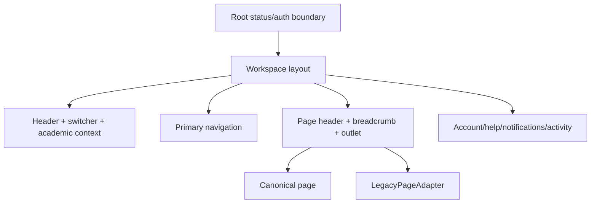

LegacyPageAdapter supplies only documented old context/actions, applies layout containment, error boundary and telemetry, and may not be imported by new pages. Registry records owner, consumers, replacement wave, last-use, and removal date. CI rejects new adapter consumers after Gate C.

## 17. Navigation Migration

One registry derives surfaces from route metadata and server-authoritative access inputs. Ordering belongs to frozen IA; badges come from narrow count endpoints; mobile priorities are persona-specific metadata. Role is a persona hint only. Generate sidebar, rail, mobile bottom nav, More sheet, command navigation, breadcrumbs, and sitemap checks from the same route identity. Hide unavailable items for security/irrelevance, distinguish disabled/setup/upgrade where the user benefits from explanation, and never interpret hidden navigation as authorization.

## 18. Domain Migration Strategy

Vertical page migration order is: canonical route → access metadata → new shell → DS primitives → server-state owner → new page/API/policy/tenant/database slice → compatibility bridge → visual/a11y/security/data regression → telemetry/pilot → remove consumer later.

Recommended proof slices:

1. **Students registry + profile**: high value, mature enough, spans most foundations without financial/result irreversibility.
2. **Student Attendance**: exercises academic context, compact collection, teacher resource scope, partial/offline UX.
3. **Assessment score entry**: exercises specialized grid, concurrency, locks, jobs and Performance boundary. Limit initial pilot to unpublished data.

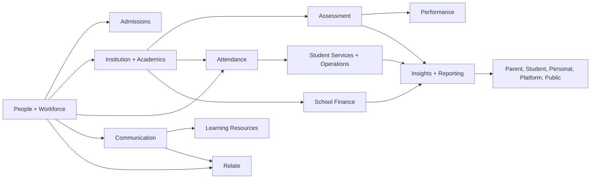

| Domain | Current maturity | Target | Generic/duplicate | Wave | Data risk/strategy |
|---|---|---|---|---:|---|
| People/Workforce | student strong; profiles fragmented | Person-linked typed aggregates | some overlaps | 10 | medium; verified links |
| Admissions | generic bridge | typed lifecycle | yes | 12 | high; reference map |
| Institution/Academics | typed core + duplicate APIs/blobs | canonical aggregates | both | 11 | high; module-by-module |
| Assessment | substantive/fragmented | score owner + lifecycle | route/component overlap | 13 | very high; versions/locks |
| Performance | results/read services | result/publication owner | duplicates | 13 | critical; immutable history |
| Attendance | working core | separate student/staff | some generic | 14 | medium; second pilot |
| Services/Ops | generic | typed cases/records | yes | 14 | high privacy; type-by-type |
| School Finance | basic/hybrid | ledger-grade | ambiguity | 15 | critical; reconcile |
| Communication | messages/delivery mixed | content + delivery | overlap | 16 | medium; idempotency |
| Learning | mature library + cross-features | resource/assignment/progress | naming/API overlap | 16 | medium; preserve IDs |
| Reporting | fragmented | shared execution/domain meaning | yes | 17 | high; output parity |
| Admin/Forms/Workflow | emerging/mixed | governed shared services | legacy APIs | 18 | high; schema versions |
| Experiences | dashboards/shared shell | projections/purpose shells | duplication | 19–23 | privacy; staged |

## 19. People & Workforce

Students remain canonical while Person links are introduced. Preserve Student/Employee/Guardian public IDs, admission/employee numbers, guardian pivots and existing API shapes. New v2 read models expose a stable person reference only after verification. Separate workforce employment, teaching assignment and membership identity. Teachers view is a workforce projection; a teacher assignment must reference a tenant membership/person authorized for that tenant and appropriate academic scope. Profile pages request protected sections independently so medical/private failure does not fail the whole profile.

## 20. Admissions

Create typed lifecycle tables behind legacy references; new pilot applications write v2 and emit legacy-compatible projections if old consumers require them. Documents use classified storage metadata and signed authorization. Conversion is idempotent and orchestrates: accepted application → verified/create Person/profile → Student → Enrollment in declared academic context. Store conversion IDs and outcome; retry never creates duplicates. Decisions and offers are append-only/audited; reversal is an explicit command.

## 21. Institution & Academics

Inventory duplicate endpoints and choose one canonical service per resource. Migrate School Profile, Campus, Department, Session, Term, Class, Subject, Enrollment, TeacherAssignment, Timetable, and LessonPlan independently. Every step adds target storage, backfills, exposes parity read, switches writes for pilots, validates counts/relationships, then changes reads. AcademicContext validation rejects cross-session/term/campus combinations. Generic module data becomes read-only per migrated key; no entire blob rewrite.

## 22. Assessment & Performance

Score safeguards: immutable assessment identity; optimistic version/ETag; atomic row/batch writes; min/max and enrollment validation; lock version/reason/actor/time; explicit reopen permission and audit; moderation records original/proposed/accepted values; import preview and idempotency key. Performance generation pins assessment versions and grading configuration. Publication creates immutable snapshot/version with hash, approver, term/context and timestamp. Corrections create a new result/publication version and explain supersession; no update-in-place of historical published output.

## 23. Attendance / Services / Operations

Student Attendance is enrollment/session/campus scoped; Staff Attendance is employment/shift scoped and uses separate permissions and reporting. Do not share one ambiguous endpoint or status vocabulary. Student Services cases declare privacy class, allowed fields by capability/relationship, masked list projection and audit. Operations records move from generic storage by semantic type; unmigrated types stay behind an explicit transitional registry that rejects new feature types.

## 24. School Finance

Introduce ledger entries, charges/invoices, allocations, payments, refunds, receipts and reconciliation identities without mutating legacy history. Use decimal-safe money and database transactions/locking/idempotency. Shadow-post transactions for a closed pilot period, compare per-student and school control totals, then cut writes in a controlled window. Before cutover prove: old opening + charges − payments ± adjustments/refunds = new closing; invoice totals, allocations, payment totals, receipt references, outstanding and refund totals match. A single unexplained discrepancy blocks release.

## 25. Communication & Learning

Communication owns authored messages/announcements/campaigns; delivery owns channel attempts, provider IDs, retry, receipt and preference/consent. Use outbox + tenant job envelope. Learning Resources keeps existing mature identities/versions while assignments/progress/practice become clear sub-capabilities. `Online Learning` becomes a temporary label/route alias only. AI generation goes through the governed gateway and never bypasses resource permissions.

## 26. Reporting & Insights

Report definition includes stable identity, owning domain, parameter schema, access policy, renderer/exporters and version. Reporting owns request, queued execution, progress, artifact metadata and history; domain queries/metrics remain with domains. Contextual and Insights links resolve the same definition. High-value legacy/new results are compared on fixed fixtures and anonymized production samples; mismatches show dimensions, not PII.

## 27. Administration / Forms / Workflow

Administration is navigation composition. Security settings remain IAM-owned; finance settings Finance-owned; assessment settings Assessment-owned. Forms evolve legacy custom fields into versioned definitions. Each submission stores form/schema version; publishing a new version does not alter old rendering. Backfill synthesizes immutable legacy schema versions and validates sample render parity.

Workflow stores definition/version, steps, assignments, deadlines and history. Domain commands still validate transitions. Prove with Results approval, then Admissions, Finance and Workforce only when repeated needs exist. Do not encode arbitrary scripts or create a universal rules engine.

## 28. Parent / Student

Build relationship-filtered APIs rather than reuse staff collection responses. Parent scope is child-specific and handles multiple children/tenants explicitly; Student scope is self. Projections minimize private fields and use child/student identity in every cached key. Shell and page content are purpose-built, mobile-first, comfortable density, and preserve deep links. Staff-only actions must be absent from contracts, not merely hidden.

## 29. Personal Space

Keep the existing personal tenant model initially. Workspace switching clears school-scoped caches and does not couple membership revocation to Personal availability. School facts appear through permission-checked links/projections, never replicated into personal storage without an explicit product contract. Use the lighter design expression but shared primitives.

## 30. Platform Console

Create an explicit PlatformPrincipal evaluated before any global query. Platform operations require platform capability, MFA/step-up for critical actions, reason and immutable audit. Support sessions bind operator, tenant, approved scope, reason, expiry, correlation and visible banner; queries run through this envelope. End/expiry invalidates tokens/caches. Tenant users can never satisfy platform permission through similarly named tenant roles.

## 31. Public Portal

Public projections are allowlisted DTOs/materialized reads, not serialization of private models with a missing scope. Resolve tenant by canonical host/path, rate-limit by action, use opaque/signed Result PIN paths, and prevent enumeration. Publication withdrawal removes public visibility without deleting records. Preserve stable public URLs and search metadata where safe.

## 32. Skuggle Relate

Relate begins only after Gate G prerequisites: verified Person/CommunityProfile relationship, age/minor classification, consent, audience/privacy controls, reporting/blocking/moderation, safe search, notification preferences, media scanning and retention. It has a distinct shell and data boundary. Launch invite-only with human moderation and abuse-response runbooks. Disabling the flag hides entry and writes while preserving evidence/data per policy.

## 33. Database Migration Standard

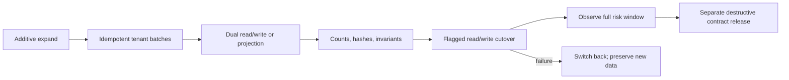

Types: ADDITIVE, BACKFILL, DUAL-WRITE, READ-SWITCH, CONTRACT, DESTRUCTIVE. Every backfill has stable cursor, bounded batch (start 100–1,000 based on measured row cost), idempotency key/version, tenant partition, resumable checkpoint, retry/dead-letter, redacted failure record, throttle, progress, verification query, rollback/ignore strategy, and production load window. Never rely on one transaction for an unbounded table.

| Table/store | Current owner | Target | Action/type | Wave | Backfill/reconcile/deprecate |
|---|---|---|---|---:|---|
| `tenant_memberships.role_id` | IAM | RoleAssignments | ADDITIVE/DUAL/CONTRACT | 5/24 | implicit rows; effective-permission parity; remove last |
| users/profile links | Identity/domains | User↔Person | ADDITIVE/BACKFILL | 10 | verified candidates; unlink rollback |
| students/guardians/employees | split domains | People/Workforce aggregates | ADDITIVE/READ-SWITCH | 10 | IDs/counts/relationships; retain source |
| `school_module_records` | generic | owning typed domain | BACKFILL/DUAL/CONTRACT | 11/14 | record-type batches; archive after zero reads |
| `tenant_module_data` | generic module blob | Academics/owner tables | BACKFILL/READ-SWITCH | 12+ | key-by-key parity; never whole blob |
| assessments/scores | Assessment | versioned Assessment | ADDITIVE/DUAL | 13 | value/lock/version hashes |
| results/publications | Performance | immutable snapshots | ADDITIVE/READ-SWITCH | 13 | golden PDFs/totals/hashes; source retained |
| attendance | Attendance | student/staff split | ADDITIVE/DUAL | 14 | daily/context totals |
| finance transaction stores | mixed | ledger | ADDITIVE/DUAL | 15 | full control-account reconciliation |
| form/custom-field tables | shared legacy/new | versioned Forms | BACKFILL/DUAL | 18 | schema/render parity; legacy versions retained |
| files/document metadata | feature/storage | classified media metadata | ADDITIVE | 10+ | no bulk move; checksum/key verification |

Back up database before every data wave; verify backup checksum/readability and perform representative restore rehearsal before critical People, Results and Finance cutovers. Back up affected file keys/metadata when file ownership changes. Host backups are supplementary.

## 34. API Compatibility Strategy

Prefer `/api/v1` stable resources with additive fields, new endpoints for changed semantics, and explicit adapters for legacy responses. Contract versions are documented and consumer telemetry identifies endpoint/version. Do not overload a field with new meaning.

| Current contract | Target | Coexistence | Cutover/removal |
|---|---|---|---|
| membership role/permissions payload | roles + canonical capabilities + persona | additive old fields | remove role field only after all clients and Wave 24 |
| student legacy endpoints | People Student v2 contract | adapter and same public IDs | new UI default + 90d zero old use |
| module records/data | typed domain endpoints | legacy projection over target/new writes by flag | reconciled per record type |
| school structure duplicates | canonical Academics APIs | aliases/facade | all consumers + traffic zero |
| assessment/results overlap | separate Assessment/Performance endpoints | legacy alias/response adapters | published-history parity |
| report/export variants | definition/execution API | adapter to one job model | output parity + zero calls |
| custom fields | versioned forms/submissions | legacy renderer/adapter | historical render guaranteed |
| public model responses | published projection endpoints | route adapter | tenant-by-tenant parity/security |

Use deprecation headers/documentation for external consumers where possible. Compatibility failures are visible metrics and structured logs; never silently fall back after an authorization or integrity error.

## 35. Frontend Compatibility Strategy

LegacyPageAdapter lets old pages render inside the new shell. UI export adapters preserve current prop APIs while delegating to hardened primitives. AppContext facade preserves selectors/actions while new slices use scoped hooks. Route aliases preserve bookmarks. Each adapter has owner, introduced wave, consumer list, telemetry, last-use and removal gate. New code cannot depend on an adapter.

## 36. Design System Migration

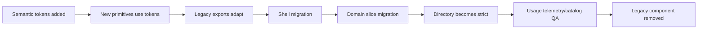

| Current | Target | Treatment/wave | Consumers | Removal condition |
|---|---|---|---|---|
| CSS `--skuggle-*` + direct utilities | layered tokens | TOKENIZE W2 | all UI | migrated directory strict |
| `Button` + native/local buttons | Button/IconButton | WRAP W2 | shell/students first | no legacy variants/imports |
| `FormField`/local fields | Field + inputs | WRAP W2/10 | enrolment/settings | validation/a11y parity |
| `Modal`/`ConfirmDialog` | accessible Modal/Confirmation | REFACTOR W0/2 | many features | focus tests + zero old API |
| `Drawer` | Drawer/Sheet | REFACTOR W0/2 | previews/utilities | focus/responsive parity |
| `StatusBadge` | status registry + renderer | REFACTOR W2/4 | domain pages | all states registered |
| `PageHeader` | canonical variants + Breadcrumb | WRAP W2/8 | pages | route metadata supplies identity |
| `DataTable` | Table/DataGrid/MobileCollection | WRAP W2/10 | registries/queues | migrated consumers complete |
| `MetricCard` | semantic MetricCard | REFACTOR by dashboard wave | dashboards | meaningful comparisons/a11y |
| feature-local tabs/filters | Tabs/Segmented/FilterBar | REPLACE W2/domain | features | canonical routes/URL state |
| enrolment stepper/photo | Stepper/ImageCapture patterns | WRAP W10 | Students | DS tests and API parity |

Tenant branding migrates by introducing safe semantic slots and contrast validation, mapping existing settings into them, previewing/fallback, then switching surfaces one at a time: public/welcome, documents/email, workspace identity. Never bulk reinterpret arbitrary legacy colors.

## 37. Test Strategy

| Domain/wave | Unit/domain | API/policy | Tenant/security | Frontend/a11y/E2E | Performance/migration |
|---|---|---|---|---|---|
| W0–1 | validators/guards | route matrix | BOLA/bypass | focus/crash smoke | CI duration/baseline |
| W2 | token/variant logic | — | theme isolation | component, axe, keyboard, visual | bundle/render regression |
| W3–5 | context/evaluator | auth contracts | full IAM/tenant suite | workspace switch | backfill/parity/cache |
| W6–9 | selectors/routes | bootstrap metadata | guard combinations | deep-link/shell/nav E2E | bundle/waterfall/render |
| W10 | Person/link/domain | student/people APIs | all relationships/files | registry/profile/enrolment | link backfill/query load |
| W11–14 | lifecycle rules | domain APIs | scope/privacy | workflow/grid/attendance | reconcile/concurrency |
| W15 | ledger/allocation | finance APIs | finance privilege | finance task E2E | mandatory reconciliation/load |
| W16–18 | delivery/report/form/workflow | contracts/jobs | export/file/channel | catalog + key E2E | job/backfill/output parity |
| W19–23 | projection/privacy | persona/public/platform | relationship/MFA/abuse | mobile/a11y full journeys | payload/caching/scale |
| W24 | deprecation invariants | removed contract checks | no bypass regression | legacy URL behavior | restore/contract rehearsal |

Test pyramid: many unit/domain/policy tests; feature/API and tenant-isolation suites; focused integrations; component/a11y tests; a smaller critical E2E set; targeted performance/migration/smoke tests. Every tenant aggregate covers same-tenant authorized, same-tenant unauthorized, different tenant, inactive membership, wrong relationship, campus, session/term, global bypass, queued job, export, search, and file download. IAM additionally covers multi-role, temporary/expired/custom role, privileged permission, self-grant rejection, platform-to-tenant rejection, parent-child, teacher assignment, student-self, MFA and support session.

## 38. Security Validation

| Finding | Risk | Target control/wave | Test | Blocker |
|---|---|---|---|---|
| teacher assignment tenant integrity | cross-tenant profile/assignment | relationship policy W0/10 | collision/wrong tenant/campus | yes |
| localhost diagnostics | data leakage/CSP noise | remove W0 | network assertion | yes |
| incomplete IDOR matrix | unauthorized resource access | generated policy suite W0–domain | BOLA matrix | yes |
| global bypasses | broad data exposure | named Platform/public boundary W3/21/22 | bypass audit tests | yes |
| role-name authorization | escalation/inconsistent grants | canonical evaluator W4 | static + policy parity | yes for migrated path |
| role assignment grants | self/escalation/expiry | delegation and time scope W5 | IAM suite | yes |
| files/exports | signed URL leakage | classified metadata + reauth W3+ | cross-tenant/download expiry | yes |
| forms/uploads | XSS/malware/mass assignment | schema validation, sanitization, scanner | payload/file tests | yes |
| public APIs | enumeration/rate abuse | projection/rate/opaque IDs W22 | abuse tests | yes |
| sessions/MFA | fixation/bypass | rotation/step-up W0/21 | auth tests | yes |

Also test CSRF, CSP/XSS, mass assignment, tenant override, webhook replay/idempotency, rate limits, storage ACLs and redacted logs.

## 39. Performance Validation

Measure current p50/p95 on representative hardware/data before setting absolutes. Initial budgets are regression controls: shell initial JS gzip must not grow >10% without approved evidence; migrated route chunk <200KB gzip or ≤10% over measured legacy; workspace context p95 ≤ legacy and aspirational <500ms excluding network; client route transition feedback <100ms and usable content p75 ≤1.5s on agreed test profile; no more than three blocking API waterfalls before primary content; large table interactions remain <100ms locally and server requests are cancellable/debounced. Budgets are adjusted only through recorded measurement, never marketing claims.

Backend acceptance per endpoint: query count captured and no N+1 with page size; required composite indexes proven by query plan on MySQL-compatible staging; pagination mandatory for collections; bounded payload; cache correctness independent of Redis; expensive work queued/chunked; concurrency/locking defined; p95/error rate no worse than baseline by >10% unless approved tradeoff. Finance and score writes include lock/idempotency load tests.

## 40. Observability

Every flag/slice dashboards route load/web vitals, API latency/error, authorization denials by reason (no subject/resource PII), tenant-context mismatch, frontend crash, workspace-switch failure, job failure/retry age, slow query, navigation 404, and compatibility use. Correlation IDs connect browser/API/job. Log public/opaque IDs only when approved, hash or bucket tenant identifiers for aggregate dashboards, redact names/emails/phones/marks/finance/health. Alerts distinguish regression from expected denied access.

Migration scorecard tracks items by status, test pass, cohort, parity, fallback use, debt, data reconciliation and exit gate. A capability cannot advance to LEGACY DEPRECATED with unexplained fallback or parity errors.

## 41. Feature Flags

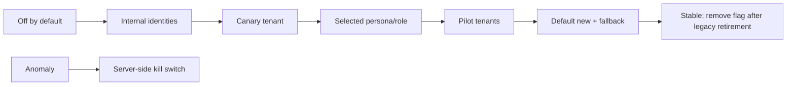

Flags are server-authoritative, typed, owned, documented with created/expiry dates, safe default and dependency. Evaluation supports environment, explicit account/internal user, tenant, workspace/persona, and percentage only for stateless/read-only behavior. Stateful schema/IAM/finance changes use tenant cohorts, never random per-request percentage. Separate read and write flags when rollback semantics differ. Log evaluation aggregates, not PII. Remove flags after stable full rollout or feature retirement.

## 42. Release Strategy

```mermaid
flowchart LR
  Dev[Short-lived branch + CI] --> Stage[MySQL-like staging + restore rehearsal]
  Stage --> Internal[Internal users]
  Internal --> Canary[One representative low-criticality tenant]
  Canary --> Pilot[3–5 varied pilot tenants]
  Pilot --> Cohort[Production cohorts]
  Cohort --> Full[Default new]
  Full --> Observe[Risk-based observation]
  Observe --> Deprecate[Legacy deprecation]
```

Pilot tenants have representative data, responsive contacts, low immediate criticality, and consent to feedback. Include size/role/device variation. Exclude the busiest school and high-stakes result/finance window from first trials.

| Wave family | Flag | Pilot | Metrics | Rollback trigger | Full release |
|---|---|---|---|---|---|
| 0–1 | security mostly unflagged | internal/canary | failures/denials/crashes | auth/access regression | P0 matrix green |
| 2 | `ui.*.v2` | Students/internal | a11y/visual/errors | required flow blocked | catalog + pilot parity |
| 3–5 | tenant/auth flags | selected tenants | decision/context parity | any unsafe mismatch | Gate B |
| 6–9 | state/route/shell/nav | tenant/persona | crashes, loads, 404, switch | login/switch/route regression | Gate C |
| 10–14 | domain flags | tenant + workflow | API/data/fallback | integrity/security/parity | domain exit gate |
| 15 | finance read/write flags | low-volume finance tenant | reconciliation | any discrepancy | signed reconciliation |
| 16–18 | service flags | channel/report/form cohort | jobs/output/render | loss/duplicate/mismatch | owner parity |
| 19–23 | workspace/persona | invited cohort | privacy/task success | scope/safety failure | Gate G |
| 24 | deprecation/removal | prior defaults | legacy use | unexpected live use | Gate H |

## 43. Rollback Strategy

Rollback hierarchy: disable new writes → disable new reads/UI/routes → restore legacy adapter → revert stateless release → replay/reconcile queued/outbox work → database restore only when forward recovery is unsafe. Additive columns/tables remain during ordinary rollback. Dual-written data receives provenance so replay/ignore is deterministic. Do not reverse a published result or ledger by deleting rows; issue compensating/versioned records. Every release tag maps to code, migration state, config/flag snapshot and backup ID.

Rollback triggers include any P0 blocker, sustained >10% relative error/latency regression beyond agreed window, parity mismatch, duplicate/lost job, unexplained fallback spike, accessibility failure blocking a required task, or pilot owner stop. Incident commander, domain owner and data/security approver are named before cutover.

## 44. Shared Hosting Constraints

Hostinger shared hosting remains supported. Correctness cannot depend on Redis, resident workers, WebSockets, Kubernetes, or guaranteed sub-minute cron. Use MySQL-compatible SQL, database/cache abstraction, database queue where available, cron-triggered short `--stop-when-empty` workers with overlap locks, bounded chunks, retry/backoff and failed-job/dead-letter review. Poll activity/notifications with backoff where WebSockets are absent.

Never run SmartMark, bulk import/email, large exports, report/result generation synchronously in web requests. Split into resumable jobs with per-invocation time budget. If hosting cannot reliably complete them, disable/limit the capability or offload to an approved external/dedicated worker; do not fake completion.

## 45. Infrastructure Evolution

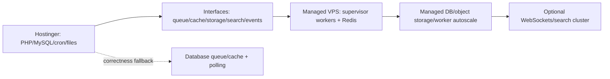

| Capability | Hostinger support | Current fallback | Future target | Trigger |
|---|---|---|---|---|
| Queue | limited cron/process | DB queue, short workers | supervised autoscaled workers | backlog/SLA/failure rate |
| Redis/cache | uncertain | DB/file cache; correctness without cache | managed Redis | latency/load and availability |
| WebSockets | poor | polling/backoff | managed realtime | proven collaboration need |
| Search | MySQL/basic | indexed scoped queries | dedicated search | scale/relevance/latency |
| Object storage | local/S3-compatible possible | preserve keys/local files | managed object store/CDN | volume, durability, delivery |
| SmartMark worker | web unsafe | small queued chunks/limits | dedicated CPU/GPU/external service | queue time/workload |
| Scheduler | cron reliability varies | idempotent catch-up + locks | managed scheduler | missed-run SLA |
| Backups | host backup insufficient | app DB/file backups + verification | managed PITR/cross-region | RPO/RTO demand |
| Monitoring | logs/health endpoints | external uptime + redacted logs | APM/central metrics | incident/scale needs |

Redis is an optimization for cache/lock/queue throughput, not correctness. Storage migration adds metadata/checksum/classification first; existing files stay in place and resolve through a storage locator. Move objects lazily or in verified batches with dual lookup.

## 46. Legacy Deprecation

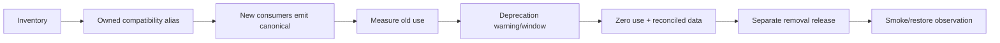

Default minimum observation: 30 days for internal UI aliases, 60 days for ordinary API/routes, 90 days or a complete academic/financial cycle for results, finance and external/public contracts. Removal requires zero telemetry, all known consumers migrated, support/documentation updated, data retained/archived by policy, rollback/restore rehearsal, and domain/security/data owner approval.

## 47. Technical Debt Register

Maintain an owned register with ID, category (BLOCKER, SECURITY, ARCHITECTURE, DATA, UX, PERFORMANCE, TESTING, OBSERVABILITY, LEGACY), evidence, affected tenant/domain, severity, introduced/discovered wave, mitigation, target wave, expiry and status. Do not silently repair unrelated debt in migration PRs; link or create an item. Blockers/security/data-integrity debt can interrupt sequence through explicit triage.

Change budget: normally ≤400 changed logical lines excluding generated fixtures, one schema concern or one component family or one route family; vertical-slice PRs may be larger only when split into reviewable preparatory/read/write/cutover PRs. Never combine IAM schema, router replacement and visual redesign. Use short-lived branches, reviewed PRs, protected main, immutable release tags and documented production rollback points—no six-month refactor branch.

Configuration has typed validation and documented owner/default/secret status. Never hard-code tenant, school, role, API URL or domain. Secrets remain outside repo, are rotated separately, and deployment verifies required config before traffic.

## 48. Phase Gates

| Gate | Measurable exit |
|---|---|
| A Foundation Ready | Wave 0 closed; guardrails pass; first DS catalog primitives meet WCAG; backups/flags/telemetry/runbooks operational |
| B IAM Ready | TenantContext enforced for pilot paths; canonical permission shadow parity; assignments backfilled/reconciled; IAM suite green |
| C Shell Ready | canonical router/shell/nav serve new + legacy pages; login/switch/deep-link/404/mobile/a11y/performance gates pass |
| D First Domain Pilot | Students pilot completes ≥2 stable release cycles; no P0/P1 parity/security/data issues; fallback low and explained |
| E Core Academic Migration | Institution/Academics plus unpublished Assessment/Performance parity; historical results immutable and verified |
| F Operations Migration | Attendance/Services/Ops and Finance signed reconciliations; queue/report SLAs met |
| G Experience Migration | Parent/Student/Personal/Platform/Public task journeys and privacy scopes stable; Relate prerequisites assessed |
| H Legacy Retirement | zero-use windows, consumer/data reconciliation, restore test, owner approvals, contract releases complete |

## 49. PR / Change Sequencing

Recommended first 26 PRs, each independently reviewable:

1. Freeze baseline inventory, route/security matrix and release checklist.
2. Remove localhost diagnostic telemetry and add network regression check.
3. Teacher-assignment tenant/relationship policy tests and minimal fix.
4. IDOR/BOLA generator/checklist plus highest-risk endpoint tests.
5. Modal/Drawer focus lifecycle and shell error-boundary tests.
6. Architecture rule harness with existing-debt allowlists.
7. Semantic token foundations and token lint baseline.
8. Button/IconButton/focus primitives plus catalog stories/tests.
9. Field/Input/selection primitives.
10. Modal/Drawer/Status hardening adapters.
11. PageHeader/Breadcrumb/Tabs/FilterBar/Table pilot set.
12. TenantContext contract and HTTP instrumentation.
13. Tenant job/cache/storage envelope helpers plus one pilot job.
14. Canonical permission manifest, seed parity and alias resolver.
15. Authorization shadow evaluator and telemetry.
16. RoleAssignments additive schema specification/implementation PR (only in execution phase).
17. Assignment backfill command and reconciliation report.
18. Auth/Workspace/Access provider extraction behind AppContext facade.
19. Academic context extraction and dirty-state guard.
20. Router evaluation ADR, route metadata schema and dual recognizer.
21. Canonical Students routes and legacy redirects.
22. Root/School shell with LegacyPageAdapter.
23. Capability navigation registry and specialist-persona tests.
24. Students API/policy/query-state read slice.
25. Students registry/profile DS page behind tenant flag.
26. Students write/enrolment/media path, pilot runbook and rollback rehearsal.

Subsequent PRs complete Person candidates/links and Workforce, then begin the Attendance second pilot. Any PR with schema/backfill is separated into expand, worker/reconcile, read switch and later contract.

## 50. Final Roadmap

**Immediate:** establish clean reviewed baseline; execute Wave 0; install no architecture until guardrails, backups, flags and telemetry work; implement the Students-required DS set; define TenantContext and permission registry.

**Next:** dual-mode IAM, incremental AppContext extraction, canonical router, shell/LegacyPageAdapter, capability navigation, Students pilot; then Person/Workforce, Academics context, Attendance and unpublished Assessment pilots.

**Later:** Admissions typed lifecycle, immutable Results migration, Operations/Services, reconciled Finance, Communication/Learning, Reporting/Forms/Workflow, purpose-built experiences, Platform/Public, gated Relate, then evidence-based legacy contraction and optimization.

## 51. Final Decision Matrix

| Area | Current | Target/wave | Compatibility | Risk | Rollback | Exit criteria |
|---|---|---|---|---|---|---|
| Tenant Context | middleware/scope with gaps | canonical envelope W3 | shadow derivation | critical | old resolver | all migrated paths proven |
| IAM | user/membership/single role | principal/multi-role W4–5 | dual evaluator | critical | legacy evaluator | Gate B |
| User/Person | user + fragmented profiles | verified links W10 | source profiles remain | high | unlink | reconciled verified links |
| Membership | `role_id` | assignments W5 | implicit legacy assignment | high | read role_id | permission parity |
| RoleAssignments | absent | scoped/dated rows W5 | dual read/write | high | ignore rows | backfill valid |
| Permissions | strings/mixed naming | manifest + aliases W4 | one-way alias | critical | legacy evaluation | zero mismatch |
| Custom Roles | limited | safe tenant composition W5/18 | old roles preserved | high | disable assignments | delegation tests |
| PlatformPrincipal | role aliases | explicit principal W21 | operator fallback | critical | old console | platform suite |
| AppContext | global coordinator | scoped owners W6+ | facade | medium | provider flag | zero consumers |
| Routing | manual history | nested routes W7 | dual recognizer | high | routing flag | zero old emits/404 safe |
| Navigation | role/view mappings | capability metadata W9 | ID aliases | high | old selector | specialist parity |
| Shell | coupled App | workspace layouts W8 | LegacyPageAdapter | medium | shell flag | Gate C |
| Design System | direct utilities/partial UI | tokens/primitives W2/36 | export adapters | medium | import/flag | catalog QA |
| Workspace Switcher | modal/role blur | atomic popover/sheet W8 | adapter | critical | old switcher | cache/switch E2E |
| Academic Context | scattered/session state | compound provider W6/8 | selector bridge | high | old session | invalid combos blocked |
| People | student-centric | Person-linked W10 | same public IDs | high | old reads | Gate D |
| Workforce | staff/teacher overlap | typed employment/assignment W10 | endpoint adapter | high | old projection | relationship parity |
| Admissions | generic records | typed lifecycle W12 | legacy refs/projection | high | old creation/read | active cases mapped |
| Academics | typed + duplicate/blob | canonical aggregates W11 | facade/key migration | high | per-module read | single owner |
| Assessment | fragmented workflows | score owner W13 | route/API aliases | critical | legacy read/write flag | score/lock parity |
| Performance | results overlap | immutable results W13 | snapshots/adapters | critical | prior publication remains | golden history parity |
| Attendance | working mixed risk | student/staff split W14 | endpoint adapter | medium | old path | context totals match |
| Student Services | generic/sensitive | typed private cases W14 | record adapter | critical | old reads | privacy/audit suite |
| Operations | generic records | typed owners W14 | registry/adapters | high | per-type flag | zero generic use/type |
| Finance | basic/hybrid | ledger W15 | shadow ledger | critical | switch back, preserve ledger | signed equality |
| Communication | mixed delivery | content + delivery W16 | producer adapter | high | legacy producer | no loss/duplicate |
| Learning Resources | mature/cross-named | clear capability W16 | label/route aliases | medium | old route | zero alias use |
| Reporting | duplicates | one execution W17 | output adapters | high | old executor | reconciled reports |
| Administration | dumping-ground risk | composition W18 | old nav aliases | medium | old nav | owner-local settings |
| Forms | legacy + emerging engine | versioned schemas W18 | dual renderer | high | legacy resolver | historical render |
| Workflow | domain-specific | shared coordination W18 | first Results only | high | domain legacy flow | transition parity |
| Parent/Student | role dashboards | purpose shells W19 | fallback dashboards | critical privacy | persona flag | relationship E2E |
| Personal | shared shell/tenant | workspace abstraction W20 | route aliases | medium | old shell | revocation isolation |
| Platform Console | large controllers/aliases | bounded console W21 | old console | critical | operator flag | MFA/support/global tests |
| Public Portal | partial/direct risks | published projections W22 | stable URLs | critical | old safe projection | abuse/isolation suite |
| Relate | absent | gated community W23 | none | critical safety | disable entry/writes | safety readiness |
| Database | additive core + JSON | expand/contract W3–24 | dual/projections | critical | switches/backups | reconciled/restoreable |
| Queue | hosting-dependent | tenant chunks | DB queue/cron | high | pause/retry | SLA/backlog |
| Cache | optional/mixed | tenant-versioned abstraction | DB/file fallback | high | bypass cache | correctness without Redis |
| Storage | existing files | classified locator | dual lookup | high | old key | checksum/access parity |
| Search | module-local | permission-aware W17/23 | old search | high | search flag | no scope leaks |
| Monitoring | health/logs | migration dashboards W0+ | current logs | medium | disable noisy span | actionable metrics |
| PWA | shell/static cache | declared offline capability W8/14 | current SW | high | unregister/revert cache version | truthful state/no stale leak |
| Legacy Removal | aliases everywhere | measured contract W24 | time-bound fallback | critical | restore alias/code | Gate H |

### Closing implementation decisions

1. Fix first: localhost telemetry, teacher-assignment tenant integrity, endpoint BOLA assurance, unsafe bypasses, critical overlay focus and shell failure containment.
2. Before UI migration: guardrails, backups/restore evidence, flags, telemetry, TenantContext, permission vocabulary, accessible core primitives, and route metadata must exist.
3. First vertical slice: Students registry/profile/enrolment; then Student Attendance; then unpublished Assessment score entry.
4. IAM remains compatible through implicit `role_id`, additive RoleAssignments, dual read/write, backfill and shadow permission comparison.
5. Routing remains compatible through a dual recognizer, authorized alias redirects, stable public IDs/query state and measured deprecation.
6. Design System migration is token-first, new-component-first, wrapper-based, shell/domain-slice incremental, and strict only after a directory migrates.
7. Generic storage retires record type/key by key through typed targets, dual projections, reconciliation and zero-use observation.
8. Production data is protected by additive changes, backups, restore rehearsal, idempotent tenant batches, provenance, reconciliation and separate contract releases.
9. Hostinger requires DB-backed/cron-bounded queues, polling, MySQL-compatible SQL and optional infrastructure abstractions; long tasks never run synchronously.
10. Rollout moves internal → canary tenant → representative pilots → cohorts → default new, with server kill switches and risk-based observation.
11. Rollback disables writes/reads/routes first, restores adapters/code second, preserves additive data, and uses compensation/versioning for finance/results.
12. Legacy removal requires canonical consumers, zero telemetry for the defined window, reconciled retained data, security/data/domain approval, backup and restore proof.
13. Enterprise migration is complete only when all in-scope capabilities satisfy the Definition of Done, Gate H passes, no live legacy fallback remains, and production SLO/security/data outcomes are stable through an agreed operational cycle.

**STOP:** this artifact defines migration. It does not implement code, migrations, routes, dependencies, configuration, backfills, or production changes.
