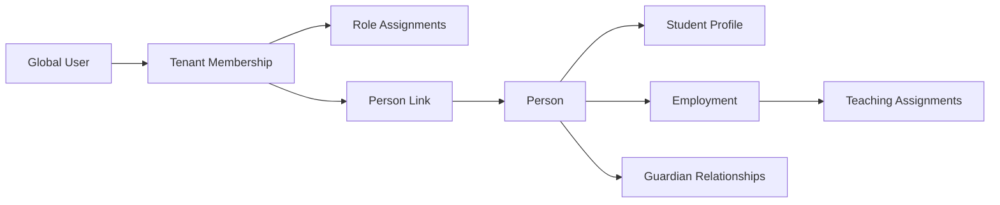
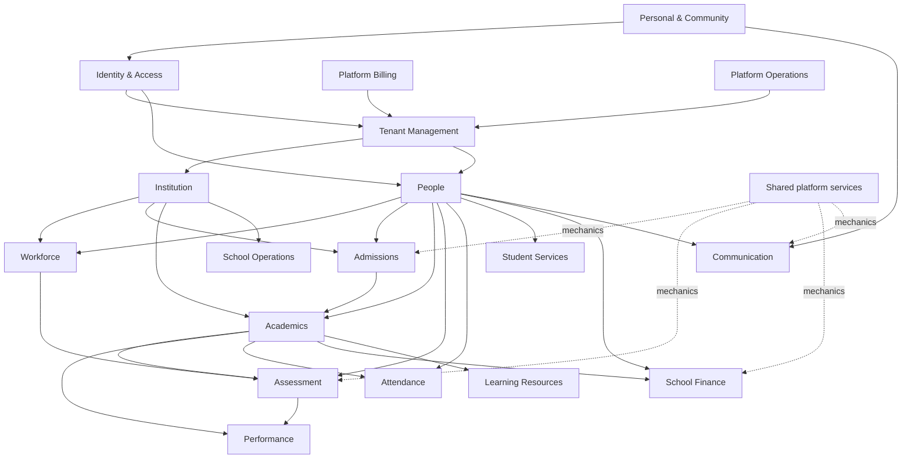
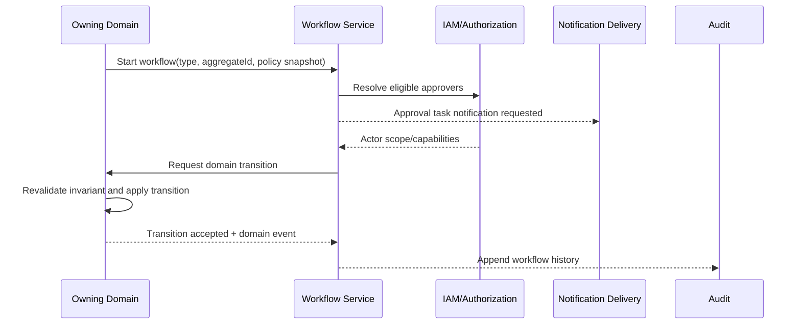

# SKUGGLE DOMAIN & CAPABILITY ARCHITECTURE

**Status:** Target domain decision document; no implementation is authorized by this document.  
**Authoritative evidence baseline:** `docs/SKUGGLE_ENTERPRISE_ARCHITECTURE_AUDIT.md` (working-tree baseline at commit `b30f3e1`, 2026-09-02).  
**Purpose:** Define canonical bounded contexts, capability ownership, domain language, dependencies, and the decomposition of current and planned Skuggle features.

## 1. Decision summary

Skuggle will evolve as a workspace-aware modular monolith with explicit bounded contexts. Each business fact has one canonical owner. Other contexts consume immutable identifiers, published events, or purpose-built query projections; they do not update another context's tables.

The domain architecture contains:

- 18 business bounded contexts: Identity & Access, Tenant Management, Institution, People, Workforce, Admissions, Academics, Assessment, Performance, Attendance, Student Services, School Operations, School Finance, Learning Resources, Communication, Platform Billing, Platform Operations, Personal & Community.
- 10 shared platform services: Tenant Context, Authorization, Forms & Custom Fields, Workflow, Notification Delivery, Documents & Media, Audit, Search, Reporting & Export, AI & Integrations.
- Five workspace compositions: Platform Console, School Workspace, Personal Space, Skuggle Relate, and Public Tenant Portal.

Current implementation status is never inferred. In this document:

- **CURRENT** means confirmed in the audit as working or materially implemented.
- **CURRENT-PARTIAL** means confirmed but incomplete, generic, hybrid, or thin.
- **PLANNED** means target architecture with no claim of current implementation.
- **TRANSITIONAL** means a current bridge to be replaced incrementally.

## 2. Strategic domain classification

| Type | Bounded contexts | Investment rule |
|---|---|---|
| Core differentiating | Academics, Assessment, Performance, Learning Resources, Admissions | Rich domain models and explicit workflows; protect semantics. |
| Core platform | Identity & Access, Tenant Management, People, Institution | Stable upstream contracts; changes require compatibility discipline. |
| Operational | Workforce, Attendance, Student Services, School Operations, School Finance, Communication | Typed aggregates; integrate through identifiers/events. |
| Platform business | Platform Billing, Platform Operations | Strictly separated from tenant operational domains. |
| Experience | Personal & Community, Public Tenant Portal composition | Compose upstream capabilities; own only experience-specific state. |
| Supporting services | Forms, Workflow, Notifications, Media, Audit, Search, Reporting, AI, Integrations | Reusable mechanics; never own core business decisions. |

## 3. Ubiquitous language and identity rules

| Term | Canonical meaning | Must not mean |
|---|---|---|
| User | Global authentication identity. | A school employee, student, guardian, or tenant membership. |
| Person | A real human known to Skuggle; target canonical demographic identity. | Login credentials or employment. |
| Tenant | An isolated customer/workspace data boundary. | Campus or subscription. |
| Membership | A user's authorized participation in a tenant/workspace. | Employment or academic enrolment. |
| Role assignment | Capabilities granted to a membership. | A person's profession or job title. |
| Student profile | A person's school-specific learner record. | A login account. |
| Employment | A person's contractual/organizational relationship with a tenant. | A role/permission assignment. |
| Teacher | An employment function/qualification, optionally backed by teaching assignments. | A special type of global user. |
| Guardian relationship | A relationship between a guardian person and a student profile. | A generic parent login. |
| Applicant | A person/candidate in an admissions process. | An enrolled student. |
| Admission | A decision granting eligibility to join. | Placement in a class/session. |
| Enrolment | Placement of a student in an academic session/program/class. | Admission application. |
| Assessment | A designed instrument and its collected evidence/scores. | A published report card. |
| Result | A finalized interpretation of assessment evidence for a period. | Raw mark entry. |
| Performance | Trends, analytics and published outcomes derived from results/attendance. | Ownership of assessment scores. |
| Payment | Receipt or attempted transfer of money to school Finance. | Skuggle subscription billing. |
| Subscription | Tenant entitlement to the Skuggle platform. | Student fee plan. |
| Message | Domain communication content/conversation. | Delivery attempt or notification. |
| Notification | Delivery of a domain fact to a recipient/channel. | The domain fact itself. |
| Report | A projection of domain-owned facts. | A second writable copy of those facts. |

### Identity composition

One person can therefore be a teacher and guardian, work in multiple schools, and use Personal Space without duplicate credentials. Authentication, membership, profession and school role remain separate concerns.

## 4. Canonical ownership rules

1. Only the owning context creates or changes an aggregate.
2. Cross-context references use public IDs and locally cached labels only where a projection needs them.
3. Consumers never enforce another context's invariant by direct table mutation.
4. Synchronous calls are allowed for commands that require immediate confirmation; events are preferred for reactions and projections.
5. Reporting, Search, Notifications, AI and Workflow do not become owners of business state.
6. Tenant, campus, session and term scope are explicit parts of command/query context, not arbitrary payload fields.
7. Generic `school_module_records` and `tenant_module_data` are transitional persistence, never target aggregate owners.
8. “Administration” is a workspace/navigation composition, not a business bounded context.
9. “Reports” is a read capability and shared service, not a source-of-truth domain.
10. Personal Space and Relate may reference school facts only through consented projections, never direct tenant-table access.

## 5. Context map and dependency direction

### Integration relationship matrix

| Upstream owner | Downstream consumer | Contract | Relationship |
|---|---|---|---|
| Identity & Access | all authenticated contexts | `UserId`, `MembershipId`, capabilities, identity events | Open host service; conformist consumers |
| Tenant Management | all tenant contexts | `TenantId`, workspace/entitlement/status context | Shared kernel limited to IDs/context |
| Institution | Academics, Workforce, Operations, Finance | campus/organizational reference catalog | Published language |
| People | Admissions, Workforce, Academics, Services, Finance, Communication | `PersonId`, `StudentId`, relationship projections | Published language |
| Admissions | Academics, People | `AdmissionAccepted`/`StudentCandidateReady` | Customer-supplier |
| Academics | Assessment, Attendance, Finance, Learning, Performance | session/term/class/subject/enrolment reference API/events | Published language |
| Assessment | Performance | finalized score/evidence projection | Anti-corruption layer in Performance |
| Finance | Reporting, Communication | invoice/payment/balance events | Published language |
| Communication | Notification Delivery | message/campaign delivery intent | Customer-supplier |
| Platform Billing | Tenant Management | entitlement/subscription status | Anti-corruption boundary |
| Every domain | Reporting/Search/Audit | events/read projections | Event consumers; no write-back |

## 6. Capability taxonomy

### 6.1 Identity & Access

**Mission:** authenticate global users and authorize their participation in workspaces. It owns credentials, sessions, MFA, memberships, role assignments, permissions and invitations—not people or employees.

**Current evidence:** global `User`, `TenantMembership`, `Role`, `Permission`, invitations; Sanctum/Fortify; email verification; Google OAuth; workspace switching; one role per membership; 42 seeded permissions. **Status: CURRENT with target evolution.**

| Element | Definition |
|---|---|
| Capabilities | Register/sign in/out; reset/verify email; social login; manage MFA; discover/switch workspaces; invite/accept/revoke; manage memberships; assign roles; evaluate capabilities; manage sessions/security events. |
| Aggregates | **UserAccount** (credentials, verification, MFA, sessions); **Membership** (tenant/workspace participation and status); **TenantRole** (permission set); **Invitation** (invite lifecycle). |
| Entities/value objects | User, Membership, RoleAssignment **PLANNED**, Role, Permission, InvitationToken, EmailAddress, Authenticator, WorkspaceContext. |
| Commands | RegisterUser, AuthenticateUser, LogoutSession, RequestPasswordReset, VerifyEmail, LinkGoogleIdentity, Enable/DisableMfa, SwitchWorkspace, InviteUser, AcceptInvitation, SuspendMembership, Assign/RevokeRole. |
| Queries | GetCurrentIdentity, ListAvailableWorkspaces, ListMemberships, ListTenantRoles, GetEffectivePermissions, ListInvitations, ListSecurityEvents. |
| Workflows | Registration->verification->workspace provision; invitation->acceptance->membership; privileged MFA challenge; workspace switch and context reset. |
| Settings | password policy, MFA policy, session lifetime, invitation expiry, permitted identity providers, privileged-role rules. |
| Reports | membership roster, role/permission matrix, dormant accounts, MFA adoption, invitation conversion, security events. |
| Events | UserRegistered, EmailVerified, MembershipCreated/Suspended, RoleAssigned, InvitationAccepted, WorkspaceSwitched, MfaEnabled. |

**Invariants:** a membership belongs to one user and one workspace; only active membership enters a tenant; platform and tenant roles are distinct; target membership may have multiple role assignments; role labels never drive authorization.

### 6.2 Tenant Management

**Mission:** own tenant identity, lifecycle, isolation boundary, workspace type, tenancy status and tenant-wide entitlements.

| Element | Definition |
|---|---|
| Status | Tenant registration/public resolution/context are CURRENT; tenant-aware jobs/storage/cache governance is PLANNED hardening. |
| Capabilities | register/provision tenant; resolve slug/code; activate/suspend/archive; manage workspace type; tenant branding reference; enforce quota/entitlement; provision personal tenant; tenant data lifecycle/export. |
| Aggregates | **Tenant**; **TenantEntitlement**; **TenantProvisioningRequest**. |
| Entities/value objects | TenantId, TenantSlug, TenantStatus, WorkspaceType, Quota, FeatureEntitlement. |
| Commands | RegisterTenant, ProvisionTenant, Activate/SuspendTenant, RenameTenant, ChangeSlug, Grant/RevokeEntitlement, ProvisionPersonalWorkspace, RequestTenantExport/Closure. |
| Queries | ResolveTenant, GetTenantProfile, GetTenantStatus, GetEntitlements, GetQuotaUsage, ListUserTenants. |
| Workflows | registration->verification->provisioning->activation; suspension/restore; closure/export/retention. |
| Settings | locale/timezone/currency defaults, retention policy, quota limits, workspace features. |
| Reports | tenant usage, quota consumption, provisioning failures, tenant lifecycle, isolation-control exceptions. |
| Events | TenantRegistered/Provisioned/Activated/Suspended, EntitlementChanged, QuotaThresholdReached. |

### 6.3 Institution Management

**Mission:** describe the school as an organization and own campuses, departments and institution profile. It does not own academic sessions, classes, people or subscriptions.

| Element | Definition |
|---|---|
| Status | campus/department/profile endpoints are CURRENT/PARTIAL; duplicate direct and SchoolStructure APIs are TRANSITIONAL. |
| Capabilities | school profile; campus hierarchy; departments/organizational units; regional configuration; branding reference; facilities/locations **PLANNED**. |
| Aggregates | **InstitutionProfile**; **Campus**; **OrganizationalUnit**. |
| Entities/value objects | Campus, Department, Location, Address, ContactPoint, RegulatoryIdentifier, BrandProfile reference. |
| Commands | UpdateInstitutionProfile, Create/Update/CloseCampus, Create/UpdateDepartment, AssignDepartmentHead, ConfigureRegionalDefaults. |
| Queries | GetInstitutionProfile, ListCampuses, GetCampus, ListDepartments, GetOrganizationTree. |
| Workflows | campus opening/closure; organizational restructure; profile approval **PLANNED**. |
| Settings | region/jurisdiction, timezone, language, contact details, branding, campus defaults. |
| Reports | campus directory, department roster, organizational structure, configuration completeness. |
| Events | InstitutionProfileChanged, CampusCreated/Closed, DepartmentChanged. |

### 6.4 People

**Mission:** own canonical human identity and school-specific student/guardian profiles. It does not own authentication, employment, admission decisions or academic placement.

| Element | Definition |
|---|---|
| Status | student/guardian models, registry, profiles, links and duplicate detection are CURRENT; canonical Person supertype is PLANNED. |
| Capabilities | create/update person; student registry/profile; guardian profile; guardian-student relationships; contact/address; identifiers; photo; duplicate matching/merge; consent/privacy; student lifecycle status. |
| Aggregates | **Person** **PLANNED**; **StudentProfile**; **GuardianProfile**; **GuardianRelationship**. |
| Entities/value objects | PersonName, DateOfBirth, Gender, Address, ContactPoint, NationalIdentifier, StudentNumber, RelationshipType, Consent, ProfilePhoto. |
| Commands | CreatePerson, RegisterStudentProfile, UpdateStudentProfile, ChangeStudentStatus, Add/LinkGuardian, UpdateGuardian, MergeDuplicatePerson, LinkUserIdentity, RecordConsent. |
| Queries | SearchPeople, ListStudents, GetStudentProfile, FindPossibleDuplicates, ListStudentGuardians, ListGuardianChildren, GetProfileCompleteness. |
| Workflows | profile registration/deduplication; guardian linking; status change; identity claim/link; privacy/consent request. |
| Settings | identifier formats, required profile fields, duplicate thresholds, permitted relationship types, consent policy. |
| Reports | student registry, demographics, profile completeness, guardian coverage, duplicate candidates, status history. |
| Events | PersonCreated/Merged, StudentProfileCreated/Updated/StatusChanged, GuardianLinked, UserIdentityLinked, ConsentChanged. |

**Ownership resolution — People/Staff/Teachers:** People owns human identity and student/guardian profiles. Workforce owns employment and teacher qualification/function. IAM owns login and permissions. Academics owns teacher-to-class/subject allocations. “Staff” is a Workforce collection; “Teacher” is an employment function plus academic assignment, never a separate user type.

### 6.5 Workforce

**Mission:** own employment, staff records, job positions, contracts, leave and workforce administration.

| Element | Definition |
|---|---|
| Status | employees/departments and staff UI are CURRENT-PARTIAL; leave/payroll/performance are PLANNED. |
| Capabilities | employee onboarding/offboarding; staff directory; job/position; department placement; contract; teacher credentials; staff attendance; leave; workload; payroll handoff; workforce performance **PLANNED**. |
| Aggregates | **Employment**; **PositionAssignment**; **LeaveRequest** **PLANNED**; **StaffAttendancePeriod** **PLANNED**. |
| Entities/value objects | EmployeeNumber, Position, Contract, Qualification, DepartmentAssignment, EmploymentStatus, LeaveBalance, WorkSchedule. |
| Commands | HireEmployee, UpdateEmployment, AssignPosition/Department, RecordQualification, TerminateEmployment, Request/ApproveLeave, RecordStaffAttendance. |
| Queries | ListEmployees, GetEmploymentProfile, ListTeachers, GetDepartmentRoster, GetTeacherEligibility, ListLeaveRequests, GetWorkload. |
| Workflows | hiring->identity invitation->onboarding; role/position changes; leave approval; termination->access review. |
| Settings | employee numbering, employment types, positions, leave types/policies, qualification rules, work schedules. |
| Reports | staff directory, headcount, turnover, leave, attendance, qualifications, teacher workload. |
| Events | EmployeeHired/Updated/Terminated, TeacherQualified, PositionAssigned, LeaveApproved. |

### 6.6 Admissions

**Mission:** own candidates, applications, screening, offers and admission decisions up to a handoff for student/enrolment creation.

| Element | Definition |
|---|---|
| Status | AdmissionsView and generic admission records are CURRENT-PARTIAL/TRANSITIONAL; typed workflow is PLANNED. |
| Capabilities | enquiry; application; document collection; duplicate-person match; screening/test/interview; review; offer; accept/decline; waitlist; admission; conversion; intake/capacity. |
| Aggregates | **AdmissionApplication**; **AdmissionOffer**; **Intake**. |
| Entities/value objects | Applicant, ApplicationFormSnapshot, ApplicationDocumentRef, ScreeningResult, ReviewDecision, Offer, IntakeCapacity, ApplicationStatus. |
| Commands | Start/Submit/WithdrawApplication, AttachDocument, RequestMissingInformation, RecordScreening, ScheduleInterview, ReviewApplication, Approve/Reject/Waitlist, Issue/Accept/DeclineOffer, ConvertAdmit. |
| Queries | ListApplications, GetApplication, SearchApplicant, GetAdmissionsPipeline, GetIntakeCapacity, ListPendingReviews, GetConversionStatus. |
| Workflow | draft->submitted->screening->review->decision->offer->accepted->conversion; rejection/appeal and request-info/resubmission branches. |
| Settings | admission cycles/intakes, application forms, eligibility rules, scoring rubrics, required documents, reviewer stages, offer expiry, numbering. |
| Reports | funnel, source, conversion, decision turnaround, intake capacity, demographics, missing documents. |
| Events | ApplicationSubmitted, ScreeningCompleted, AdmissionApproved/Rejected, OfferIssued/Accepted, ApplicantReadyForConversion. |

**Ownership resolution — Admissions/Enrolment:** Admissions ends at accepted admission and emits a conversion command/event. People creates/links the student profile. Academics owns enrolment into session/program/class. Admissions retains its historical application snapshot and references resulting `StudentId`/`EnrollmentId`.

### 6.7 Academics

**Mission:** own the academic structure, calendar and a student's academic placement.

| Element | Definition |
|---|---|
| Status | sessions, terms, classes, subjects, enrolments, assignments and lesson plans exist with mixed typed/generic/blob storage: CURRENT-PARTIAL. |
| Capabilities | academic sessions/terms; programs/levels **PLANNED**; classes/arms/sections; subjects; curriculum; class-subject offerings; enrolment/transfer/promotion; teacher allocation; timetable; schemes/lesson plans; calendar. |
| Aggregates | **AcademicCalendar** (session/terms); **ClassOffering**; **SubjectOffering**; **AcademicEnrollment**; **TeachingAssignment**; **CurriculumPlan**; **Timetable**. |
| Entities/value objects | AcademicSession, Term, Program, GradeLevel, Class, Arm/Section, Subject, Curriculum, LessonPlan, Period, Room, EnrollmentStatus. |
| Commands | Create/Activate/CloseSession, CreateTerm, CreateClass/Subject, PublishCurriculum, Enroll/Transfer/Promote/WithdrawStudent, AssignTeacher, Build/PublishTimetable, Create/ApproveLessonPlan. |
| Queries | GetCurrentAcademicContext, ListSessions/Terms/Classes/Subjects, GetClassRoster, GetStudentEnrollment, ListTeacherAssignments, GetTimetable, GetCurriculumCoverage. |
| Workflows | session setup/activation/closure; enrolment/transfer/promotion; teacher allocation; timetable draft/conflict-check/publish; lesson plan review. |
| Settings | calendar pattern, class naming, levels, promotion rules, subject catalog, timetable periods, curriculum jurisdiction, academic defaults. |
| Reports | enrolment by class/session, class capacity, promotion/retention, teacher allocation, timetable conflicts, curriculum/lesson coverage. |
| Events | AcademicSessionActivated/Closed, StudentEnrolled/Transferred/Promoted/Withdrawn, TeacherAssigned, TimetablePublished, CurriculumPublished. |

### 6.8 Assessment

**Mission:** own assessment design, questions, scheduling, candidate eligibility, evidence capture, marking, moderation and finalized scores.

| Element | Definition |
|---|---|
| Status | assessment/score core is CURRENT; question bank, CBT, Smartmark and workflows are CURRENT-PARTIAL. |
| Capabilities | assessment types/configuration; continuous assessment/tests/exams; question bank; blueprint; schedule; candidate roster; manual marks; CBT; scan/auto-mark; moderation; grading scheme reference; score finalization; AI question generation. |
| Aggregates | **Assessment**; **QuestionBank**; **ExamSchedule**; **AssessmentAttempt**; **MarkingBatch**; **ScoreSheet**. |
| Entities/value objects | Question, Option, Rubric, Weight, MaxScore, Candidate, Attempt, Response, RawScore, ModerationAdjustment, GradeBoundary, AssessmentStatus. |
| Commands | Create/Update/Publish/CancelAssessment, Add/ImportQuestion, ScheduleAssessment, RegisterCandidates, Start/SubmitAttempt, Enter/Import/ScanMarks, ReviewScan, Moderate/Approve/LockScores, ReopenScores. |
| Queries | List/GetAssessments, GetQuestionBank, GetSchedule, GetCandidateRoster, GetScoreSheet, GetMarkingProgress, GetModerationQueue, GetAssessmentStatistics. |
| Workflow | draft->review->scheduled/published->in progress->marking->moderation->approved->locked; explicit controlled reopen. |
| Settings | assessment types, weights, grade schemes, moderation thresholds, attempt/security rules, scan confidence, late/missing policies. |
| Reports | marksheet, completion, item analysis, score distribution, moderation changes, examiner progress, missing marks. |
| Events | AssessmentCreated/Published/Started/Completed, AttemptSubmitted, MarksEntered, ScoresModerated/Approved/Locked. |

### 6.9 Performance & Results

**Mission:** transform locked academic evidence into period results, report cards, approvals, publications and longitudinal insights. It consumes scores; it never edits them.

| Element | Definition |
|---|---|
| Status | generation, workflow, publication, PIN checker and performance read service are CURRENT/PARTIAL. |
| Capabilities | result calculation; grade/rank/remark; result review/approval; report-card generation; publication/revocation; PIN access; parent/student result view; trend/cohort/teacher analytics; interventions **PLANNED**. |
| Aggregates | **ResultSet**; **StudentResult**; **ResultPublication**; **PerformanceIntervention** **PLANNED**. |
| Entities/value objects | SubjectResult, Grade, Rank, Remark, AttendanceSummary projection, PublicationChannel, ResultPIN, ApprovalDecision. |
| Commands | GenerateResults, RecalculateDraft, SubmitForApproval, Approve/RejectResultSet, Publish/BulkPublish/RevokeResults, Issue/RevokePin, RecordIntervention. |
| Queries | GetStudentResult, ListResultSets, GetApprovalQueue, VerifyPublicResult, GetReportCard, GetStudent/Cohort/Subject/TeacherTrends, GetAtRiskStudents. |
| Workflow | scores locked->generate draft->review->approve->publish; correction creates new version rather than mutating published evidence. |
| Settings | calculation formula, grade display, ranking/privacy, approval stages, report-card template, publication channels, PIN expiry. |
| Reports | report cards, broadsheet, cohort/subject/class trends, grade distribution, progression, teacher analytics, intervention outcomes. |
| Events | ResultsGenerated/Approved/Rejected/Published/Revoked, PerformanceRiskDetected, InterventionOpened/Closed. |

**Ownership resolution — Academics/Assessment/Performance:** Academics supplies academic context and rosters. Assessment owns instruments and locked scores. Performance owns calculated result versions, publication and analytics. Grade-scheme configuration should be authored by Academics or Assessment policy (choose Assessment for operational ownership), versioned, and referenced immutably by Result calculations.

### 6.10 Attendance

**Mission:** own learner attendance sessions, observations, corrections and approvals.

| Element | Definition |
|---|---|
| Status | class attendance and records are CURRENT; sessions/devices tables show partial infrastructure. |
| Capabilities | open attendance session; class/subject attendance; present/absent/late/excused; bulk/offline capture; device sync; correction/approval; absence alerts; attendance policy. |
| Aggregates | **AttendanceSession**; **StudentAttendanceRecord**; **AttendanceDevice**. |
| Entities/value objects | AttendanceDate, Status, Reason, CaptureSource, SyncToken, Correction, Approval. |
| Commands | Open/CloseSession, Record/BulkRecordAttendance, SyncOfflineAttendance, Correct/ApproveAttendance, RegisterDevice, ExcuseAbsence. |
| Queries | GetClassRegister, GetAttendanceSession, GetStudentAttendance, GetDailySummary, ListExceptions, GetSyncStatus. |
| Workflows | open->capture->submit->approve/lock; correction request; repeated absence alert. |
| Settings | attendance statuses, cut-off, approval requirement, late thresholds, notification thresholds, device/offline rules. |
| Reports | daily register, student history, class/campus rates, chronic absence, lateness, capture compliance. |
| Events | AttendanceRecorded/Corrected/Approved, StudentAbsent, ChronicAbsenceDetected. |

### 6.11 Student Services

**Mission:** own student welfare and service cases, including health, counselling, discipline, safeguarding and accommodations.

| Element | Definition |
|---|---|
| Status | medical information/documents are CURRENT; broader services are generic/transitional or PLANNED. |
| Capabilities | medical profile; allergies/medications; clinic visits; counselling; discipline/behaviour; safeguarding; special needs/accommodations; service requests; case management. |
| Aggregates | **StudentHealthRecord**; **ServiceCase**; **BehaviourCase**; **AccommodationPlan**. |
| Entities/value objects | Condition, Allergy, Medication, Visit, CaseNote, Incident, Action, Referral, RiskLevel, ConfidentialityLevel. |
| Commands | UpdateMedicalProfile, RecordClinicVisit, Open/Assign/Update/CloseCase, RecordIncident, CreateAccommodationPlan, ReferStudent, EscalateSafeguardingConcern. |
| Queries | GetAuthorizedMedicalSummary, ListOpenCases, GetCaseTimeline, ListIncidents, GetAccommodationPlan, GetServiceDemand. |
| Workflows | case intake->triage->assignment->actions->review->closure; safeguarding escalation; discipline review/appeal. |
| Settings | case types, confidentiality, escalation SLA, incident categories, medical access roles, accommodation catalog. |
| Reports | case load, service outcomes, incident trends, health alerts, accommodations, SLA breaches—privacy constrained. |
| Events | MedicalProfileChanged, ServiceCaseOpened/Escalated/Closed, IncidentRecorded, AccommodationGranted. |

### 6.12 School Operations

**Mission:** own non-academic operational resources and processes. Student welfare cases remain in Student Services.

| Element | Definition |
|---|---|
| Status | generic operations modules are CURRENT-PARTIAL/TRANSITIONAL; typed domains are mostly PLANNED. |
| Capabilities | facilities/rooms/assets; inventory/procurement; transport/routes; hostel/boarding; meals; visitors; maintenance; operational requests; safety incidents; calendar/events/tasks. |
| Aggregates | **Asset**; **InventoryItem/StockLedger**; **ProcurementRequest**; **TransportRoute**; **BoardingAllocation**; **MaintenanceWorkOrder**; **VisitorVisit**; **OperationalTask**. |
| Commands | Register/Assign/RetireAsset, Receive/IssueStock, Request/ApprovePurchase, DefineRoute/AssignRider, AllocateBed, Open/CompleteWorkOrder, CheckIn/OutVisitor, Create/CompleteTask. |
| Queries | AssetRegister, StockPosition, ProcurementQueue, RouteManifest, BoardingRoster, MaintenanceBacklog, VisitorLog, OperationsCalendar. |
| Workflows | procurement; maintenance; asset assignment; transport/boarding allocation; visitor approval; task escalation. |
| Settings | asset classes, stock thresholds, approval limits, routes/stops, facilities/rooms, maintenance priorities, visitor policy. |
| Reports | asset/stock, procurement spend request projection, transport utilization, boarding occupancy, maintenance SLA, visitor/safety log. |
| Events | AssetAssigned, StockLow, PurchaseApproved, RouteChanged, WorkOrderCompleted, SafetyIncidentRaised. |

**Ownership resolution — Operations/Student Services:** Operations owns resources, logistics and facilities. Student Services owns a student's welfare/health/discipline/safeguarding case. A bus incident is Operations; resulting student care case is Student Services, linked by event/reference.

### 6.13 School Finance

**Mission:** own money owed to and received by a school. It is completely separate from Skuggle SaaS subscription billing.

| Element | Definition |
|---|---|
| Status | fee UI and payment transactions are CURRENT-PARTIAL/HYBRID; enterprise ledger is PLANNED rebuild. |
| Capabilities | fee catalog/structure; billing rules; student/customer account; invoice/charge; discounts/scholarships; payment; allocation; receipt; refund/reversal; arrears; reconciliation; payment gateway; finance approvals. |
| Aggregates | **FeeSchedule**; **StudentAccount**; **Invoice**; **Payment**; **Refund**; **ReconciliationBatch**. |
| Entities/value objects | Charge, InvoiceLine, Discount, Scholarship, Allocation, Money/Currency, ReceiptNumber, PaymentMethod, GatewayReference, Balance. |
| Commands | Define/PublishFeeSchedule, Generate/AdjustInvoice, ApplyDiscount, Record/Confirm/AllocatePayment, IssueReceipt, ReversePayment, Request/ApproveRefund, ReconcileSettlement, WriteOffBalance. |
| Queries | GetStudentAccount, ListInvoices/Payments, GetOutstandingBalances, GetReceipt, GetCollectionSummary, GetReconciliationExceptions, GetAgedDebt. |
| Workflows | fee publication->invoice generation; payment->verification->allocation->receipt; refund/reversal approval; reconciliation; arrears reminder. |
| Settings | currency, numbering, payment methods/gateways, approval limits, discount rules, due dates, late fees, accounting period/export mapping. |
| Reports | fee collection, outstanding/aged debt, receipts, discounts/scholarships, cashbook, settlement/reconciliation, revenue by class/campus/period. |
| Events | InvoiceIssued/Adjusted, PaymentReceived/Allocated/Reversed, ReceiptIssued, RefundApproved/Paid, AccountOverdue. |

### 6.14 Learning Resources & Online Learning

**Mission:** own educational resources, versions, annotations, assignments, progress and practice experiences. Formal assessment remains in Assessment.

| Element | Definition |
|---|---|
| Status | resource library, versioning, annotation, bookmark, progress, assignment, practice, exports and AI aids are CURRENT and comparatively mature. |
| Capabilities | resource authoring/upload; metadata/curriculum classification; review/publish/archive/version; public/private access; bookmark/annotation; assign to class/student; progress; practice; parent help; learning pathway; usage insights; content export. |
| Aggregates | **LearningResource**; **ResourceAssignment**; **LearnerProgress**; **PracticeActivity**; **LearningPathway** **PLANNED**. |
| Entities/value objects | ResourceVersion, Section, Annotation, Bookmark, AssignmentTarget, Progress, PracticeAttempt, CurriculumTag, AccessPolicy. |
| Commands | Create/Update/Submit/Publish/Archive/RestoreResource, Annotate, Bookmark, AssignResource, UpdateProgress, SubmitPractice, GenerateSummary/Practice/Pathway. |
| Queries | Search/List/GetResources, GetCurriculumCollection, GetLibraryHome, GetAnnotations/Versions, GetAssignments, GetProgress/Pathway, GetUsageInsights. |
| Workflows | draft->review->publish->archive/version restore; assign->consume->progress/complete; practice generation->attempt->feedback. |
| Settings | resource types, approval policy, metadata taxonomy, public sharing, storage limits, AI availability, retention/version policy. |
| Reports | usage, downloads, completion, assignment progress, popular resources, practice performance, content coverage. |
| Events | ResourcePublished/Archived/Assigned, ResourceAccessed, LearningProgressUpdated, PracticeSubmitted. |

### 6.15 Communication

**Mission:** own message intent, conversations, announcements, audiences and campaigns. Shared Notification Delivery owns channel execution.

| Element | Definition |
|---|---|
| Status | messages, announcements, broadcast UI and outbound delivery are CURRENT-PARTIAL. |
| Capabilities | direct/group messaging; conversations; school announcements; audience segmentation; broadcast campaigns; templates; consent/preferences reference; scheduling; replies; moderation; delivery status projection. |
| Aggregates | **Conversation**; **Announcement**; **Campaign**; **MessageTemplate**. |
| Entities/value objects | Message, Participant, AudienceDefinition, CampaignContent, Schedule, SenderIdentity, CommunicationPurpose. |
| Commands | StartConversation, Send/Edit/DeleteMessage, Create/Publish/WithdrawAnnouncement, Create/Schedule/CancelCampaign, ManageTemplate, ModerateContent. |
| Queries | ListConversations/Messages, ListAnnouncements, GetCampaign, PreviewAudience, GetCommunicationHistory, GetDeliverySummary. |
| Workflows | compose->audience review->approve->schedule->dispatch->delivery summary; conversation moderation/escalation. |
| Settings | allowed channels, quiet hours, sender identities, templates, consent rules, moderation, retention, audience limits. |
| Reports | campaign reach/delivery, response rate, channel effectiveness, announcement engagement, communication audit. |
| Events | MessageSent, AnnouncementPublished, CampaignApproved/Scheduled, DeliveryRequested, ConversationFlagged. |

**Ownership resolution — Communication/Notifications:** Communication owns what is said, by whom, to which business audience and why. Notification Delivery resolves channel endpoints, renders channel templates, sends/retries, and records delivery receipts. A domain can request a notification without creating a Communication conversation.

### 6.16 Platform Billing

**Mission:** own commercial plans, tenant subscriptions, Skuggle invoices and platform payment status. It never owns school fees.

| Element | Definition |
|---|---|
| Status | plans, subscriptions and platform invoices are CURRENT-PARTIAL. |
| Capabilities | plan catalog; pricing; trial; subscription lifecycle; entitlement mapping; metered usage; SaaS invoice; platform payment; dunning; upgrade/downgrade; cancellation. |
| Aggregates | **Plan**; **Subscription**; **PlatformInvoice**; **BillingAccount**. |
| Commands | Create/UpdatePlan, StartTrial, Subscribe, ChangePlan, Renew/Cancel/SuspendSubscription, GenerateInvoice, RecordInvoicePayment, SendReminder. |
| Queries | ListPlans, GetSubscription, ListPlatformInvoices, GetMRR/ARR, GetChurn/TrialConversion, GetUsageForBilling. |
| Workflows | trial->subscription; renewal; failed payment/dunning/suspension; plan change proration **PLANNED**. |
| Settings | currencies/taxes, billing cycles, grace period, dunning schedule, entitlement map, invoice numbering. |
| Reports | subscriptions, MRR/ARR, churn, receivables, plan mix, trial conversion, entitlement usage. |
| Events | SubscriptionStarted/Changed/Renewed/Suspended/Cancelled, PlatformInvoiceIssued/Paid/Overdue, EntitlementsChanged. |

**Ownership resolution — Finance/Subscription:** School Finance owns school charges and family payments. Platform Billing owns what tenants owe Skuggle. They may share a Payment Gateway adapter but never tables, invoices, permissions or reports.

### 6.17 Platform Operations

**Mission:** operate the Skuggle platform across tenants under explicitly privileged global access.

| Element | Definition |
|---|---|
| Status | platform dashboard, tenant status, support tickets, broadcasts, backups, API credentials and health are CURRENT-PARTIAL. |
| Capabilities | tenant registry/oversight; platform support; system health; usage; global audit; operational broadcasts; backup/restore registry; API credentials; release/go-live; abuse/security response. |
| Aggregates | **PlatformSupportTicket**; **PlatformBroadcast**; **BackupSnapshot**; **PlatformApiCredential**; **OperationalIncident** **PLANNED**. |
| Commands | Suspend/ReactivateTenant, Open/Reply/ResolveTicket, PublishPlatformBroadcast, Trigger/VerifyBackup, RotateCredential, Declare/ResolveIncident. |
| Queries | PlatformOverview, ListSchools, GetSystemHealth, GetUsage, ListTickets/Backups/Credentials, GetGlobalAudit, GetGoLiveStatus. |
| Workflows | support escalation; incident response; backup->verification->restore drill; credential rotation; tenant suspension review. |
| Settings | support SLA, backup/retention schedule, health thresholds, incident severity, credential rotation, maintenance windows. |
| Reports | availability/SLO, tenant usage, support SLA, incidents, backup compliance, security operations, release readiness. |
| Events | SupportTicketOpened/Resolved, TenantSuspensionRequested, BackupCompleted/Failed, CredentialRotated, IncidentDeclared/Resolved. |

### 6.18 Personal Space, Skuggle Relate and Public Portal

This is one experience domain split into three subcontexts when implementation depth warrants it.

| Subcontext | Ownership and decomposition |
|---|---|
| Personal Space | **CURRENT basic:** personal workspace and plans. Owns PersonalPlan/Task, personal preferences, independent resources/portfolio **PLANNED**. Commands: Create/Complete/DeletePlanItem, ManagePersonalProfile/Preferences, CuratePortfolio. Queries/reports: agenda, goals, activity, portfolio. It references school memberships but cannot mutate school facts. |
| Skuggle Relate | **NOT FOUND/PLANNED:** community profile, connection/follow, group/community, post/comment/reaction, moderation/report, discovery and consent. Aggregates: CommunityProfile, Relationship, Community, Post, ModerationCase. It depends on IAM, Communication, Media, Search, Notifications and privacy policy. It must not expose tenant student data by default. |
| Public Tenant Portal | **CURRENT-PARTIAL composition:** tenant welcome, login, result checker and public library. Owns public-page configuration, public content and enquiry/application entry only. Queries published projections from Institution, Admissions, Performance and Learning. Commands are limited to public enquiry/application/auth initiation. |

## 7. Shared platform services

Shared services supply reusable mechanics. Domain contexts still define when and why a process occurs.

| Service | Owns | Does not own | Current/planned capability |
|---|---|---|---|
| Tenant Context | resolved tenant/membership context, tenant-aware job/cache/storage keys | tenant lifecycle | CURRENT request scope; PLANNED common job envelope and policy |
| Authorization | capability evaluation, resource policy contract, scoped grants | role UX labels or domain decisions | CURRENT fragmented; PLANNED consolidation |
| Forms & Custom Fields | form schemas, versions, sections, fields, conditional/visibility/sensitivity metadata, answer-schema compatibility | admissions/student business lifecycle | CURRENT emerging engine; legacy custom API TRANSITIONAL |
| Workflow | definitions, instances, steps, assignments, transitions, deadlines, history | the semantic meaning of “approve result” | CURRENT result-specific only; PLANNED reusable kernel |
| Notification Delivery | recipient endpoints, templates, channel send/retry, receipts, preferences/quiet hours | message/announcement or triggering domain fact | CURRENT Laravel/outbound partial; PLANNED consolidation |
| Documents & Media | upload, scan, store, version, sign URL, retention, access labels | student/application/resource semantics | CURRENT fragmented; PLANNED consolidation |
| Audit | immutable actor/action/resource/change/context record and privileged read | operational business state | CURRENT AuditLogger/security logs; PLANNED enforced coverage |
| Search | permission-aware index/projection and query federation | canonical records | CURRENT module-local; PLANNED on demonstrated need |
| Reporting & Export | report definitions, read projections, job lifecycle, render/download, scheduling | writable source facts | CURRENT repeated report/export paths; PLANNED consolidation |
| AI & Integrations | model/provider gateway, quotas, prompt/version/safety telemetry, external credentials/adapters/webhooks | educational/business approval decisions | CURRENT AI/Google/storage/mail pieces; PLANNED gateway/registry |

### Shared workflow contract

The owning domain always revalidates and commits the business transition. Workflow cannot approve an invalid admission, score set, refund or leave request merely because a workflow step was completed.

## 8. Overlap resolution matrix

| Current overlap | Canonical split | Source-of-truth owner | Integration rule |
|---|---|---|---|
| People / Staff / Teachers | Person/student/guardian vs employment vs teaching allocation vs login role | People / Workforce / Academics / IAM respectively | Join through PersonId, MembershipId and EmploymentId; never duplicate users. |
| Admissions / Enrolment | applicant decision vs academic placement | Admissions / Academics | Accepted offer triggers conversion; People resolves student; Academics creates enrolment. |
| Academics / Assessment / Performance | context/roster vs evidence/score vs result/publication/analytics | Academics / Assessment / Performance | Versioned reference IDs and events; downstream cannot edit upstream facts. |
| Finance / Subscription | school receivables vs tenant SaaS billing | School Finance / Platform Billing | Separate ledgers, invoices, permissions, reports and terminology. |
| Operations / Student Services | resources/logistics vs student welfare cases | School Operations / Student Services | Operational incidents can emit welfare referrals; case confidentiality stays local. |
| Communication / Notifications | business content/audience vs channel delivery | Communication / Notification Delivery | DeliveryRequested contract; receipts project back into Communication. |
| Reports / module reports | report execution/read model vs domain metric definition | Domain owns metric semantics; Reporting owns execution/rendering | Report definitions reference versioned domain projections; no direct domain writes. |
| Administration / School / Settings | navigation composition vs institution/IAM/domain configuration | Each bounded context | Administration only groups links; settings remain with the context whose rules they alter. |
| Online Learning / Assessment | practice/resource engagement vs formal graded evidence | Learning Resources / Assessment | Practice stays ungraded unless explicitly promoted into an Assessment through a command. |
| Results / Performance | finalized result publication vs analytics/intervention | Performance owns both sub-capabilities | Keep one context initially; split analytics later only if scale/team autonomy demands it. |

## 9. Settings ownership catalog

Settings are not a generic dumping ground.

| Setting family | Owner |
|---|---|
| passwords, MFA, sessions, role definitions | Identity & Access |
| tenant locale/timezone/currency default, quotas, entitlements | Tenant Management |
| school profile, campus, department, regional identity | Institution |
| person/student/guardian required fields and identifiers | People + Forms schema service |
| positions, contracts, leave | Workforce |
| application forms, eligibility, intake, admission stages | Admissions + Forms/Workflow mechanics |
| session/term, class, subject, timetable, promotion | Academics |
| assessment types, weights, grades, moderation, exam security | Assessment |
| result approval/publication/report-card template | Performance |
| attendance statuses/cutoffs/approval | Attendance |
| case types/confidentiality/escalation | Student Services |
| facilities/assets/procurement/transport/boarding | School Operations |
| fees, due dates, gateways, receipt numbering | School Finance |
| resource taxonomy/approval/public sharing | Learning Resources |
| channels/templates/audiences/retention | Communication and Notification Delivery by concern |
| plans/pricing/dunning | Platform Billing |
| backup/support/incident/SLO | Platform Operations |
| form mechanics, workflow mechanics, media retention, AI provider policy | Corresponding shared service |

## 10. Report ownership catalog

| Report family | Metric owner | Projection/render owner |
|---|---|---|
| identity, access, MFA, invitations | IAM | Reporting |
| tenant usage/quota/lifecycle | Tenant Management | Reporting/Platform Ops |
| student demographics/profile completeness | People | Reporting |
| staff/headcount/leave/workload | Workforce | Reporting |
| admissions funnel/capacity/conversion | Admissions | Reporting |
| enrolment/class capacity/curriculum/timetable | Academics | Reporting |
| marks/item analysis/moderation | Assessment | Reporting |
| report cards/broadsheets/trends/interventions | Performance | Reporting |
| absence/lateness/compliance | Attendance | Reporting |
| welfare/health/discipline | Student Services with privacy policy | Reporting |
| assets/stock/transport/maintenance | School Operations | Reporting |
| collections/balances/reconciliation | School Finance | Reporting |
| library usage/progress/practice | Learning Resources | Reporting |
| campaign/delivery/engagement | Communication + Notification Delivery | Reporting |
| subscription/MRR/churn/receivables | Platform Billing | Reporting |
| health/SLO/support/backup/security | Platform Operations | Reporting |

## 11. Command and query boundary rules

- Commands are imperative, target one owning context and carry actor, tenant/workspace, idempotency key and expected version when concurrency matters.
- Queries return purpose-built read models; they do not expose writable ORM graphs.
- A cross-domain page may compose queries in a backend-for-frontend/read-model layer, not through a global mutable frontend context.
- IDs crossing boundaries are stable public IDs. Internal database IDs do not become contracts.
- Every command rechecks tenant scope and resource permission. UI visibility is never authorization.
- Reports and dashboards query projections or replicas/snapshots; they do not bypass isolation casually.
- Public queries use explicit published projections and privacy policies; “without global scope” is not a public API design.

## 12. Domain event catalog

| Lifecycle | Events |
|---|---|
| Identity/tenant | UserRegistered, EmailVerified, MembershipCreated/Suspended, RoleAssigned, TenantProvisioned/Activated/Suspended, EntitlementsChanged |
| People/workforce | PersonMerged, StudentProfileCreated/StatusChanged, GuardianLinked, EmployeeHired/Terminated, TeacherQualified |
| Admissions/academics | ApplicationSubmitted, AdmissionApproved, OfferAccepted, StudentEnrolled/Transferred/Promoted, SessionActivated/Closed, TeacherAssigned, TimetablePublished |
| Assessment/performance | AssessmentPublished, AttemptSubmitted, MarksEntered, ScoresApproved/Locked, ResultsGenerated/Approved/Published/Revoked |
| Operations | AttendanceRecorded, ChronicAbsenceDetected, ServiceCaseOpened/Escalated, AssetAssigned, StockLow, WorkOrderCompleted |
| Finance/billing | InvoiceIssued, PaymentReceived/Allocated/Reversed, AccountOverdue, SubscriptionChanged, PlatformInvoicePaid/Overdue |
| Learning/communication | ResourcePublished/Assigned, LearningProgressUpdated, MessageSent, CampaignScheduled, DeliveryRequested/Completed/Failed |
| Platform | SupportTicketOpened/Resolved, BackupCompleted/Failed, CredentialRotated, IncidentDeclared/Resolved |

Every event carries event ID, occurred-at time, owner context, aggregate type/ID/version, tenant/workspace ID where applicable, actor/correlation/causation IDs, schema version, and a privacy classification. Consumers must be idempotent.

## 13. Workspace composition

| Workspace | Included contexts/capabilities | Explicit exclusions |
|---|---|---|
| Platform Console | Platform Operations, Platform Billing, tenant registry, global IAM operations, global reports | School Finance/student records except audited support workflows |
| School Workspace | Institution, People, Workforce, Admissions, Academics, Assessment, Performance, Attendance, Services, Operations, Finance, Learning, Communication, tenant administration | Platform-wide billing/operations |
| Personal Space | personal plans/preferences/portfolio, consented membership summaries, individual learning tools | direct tenant administration or cross-school data merge without consent |
| Skuggle Relate | community profiles, relationships, communities/content/moderation | private school/student data by default |
| Public Tenant Portal | published institution profile/content, admissions entry, public result verification, public learning resources | authenticated internal records and unrestricted search |

## 14. Aggregate boundary and consistency policy

| Consistency requirement | Pattern |
|---|---|
| Within one aggregate | ACID transaction and optimistic version where concurrent edits matter. |
| Across aggregates in one context | Application service transaction only where invariant truly requires it; otherwise event/process manager. |
| Across bounded contexts | No distributed transaction. Use outbox events, idempotent consumers and compensating commands. |
| Admission conversion | Process manager: accepted offer -> resolve/create student -> create academic enrolment -> record conversion references. |
| Result publication | Saga-like orchestration: verify locked scores -> generate version -> approval -> publish -> notify; failure never mutates scores. |
| Payment allocation | Finance-local transaction for payment/allocation/receipt; communication reacts after commit. |
| Tenant suspension | Tenant event consumed by IAM/session revocation and service access gates; data remains retained per policy. |

## 15. Transitional mapping from current implementation

| Current implementation | Temporary owner | Target destination | Rule |
|---|---|---|---|
| `school_module_records` admissions modules | Admissions | typed Admission aggregates | Migrate module by module; retain immutable legacy reference. |
| `school_module_records` help tickets | Platform/School Support | typed support/service aggregate | Decide platform vs tenant support explicitly. |
| `school_module_records` services/operations | Student Services or School Operations | typed owner selected by semantics | No shared generic owner. |
| `tenant_module_data` timetable/config payloads | Academics | Timetable/Curriculum aggregates | Version and convert behind current contract. |
| direct resource APIs plus SchoolStructure facade | Institution/Academics | one application service per use case | Deprecate facade/direct duplicate only after consumers migrate. |
| legacy custom-fields API | Forms service | server-driven Form definitions | Preserve compatibility until all submissions use versioned schemas. |
| UI `AppContext` cross-domain collections | none (presentation coordinator) | domain query caches/BFF projections | Extract slice by slice; never make UI state authoritative. |
| “Platform Owner” UI alias | IAM | Platform Super Admin presentation | Align label without changing capability semantics. |
| admission/exam officer mapped to School Admin | IAM/presentation | retain specialist role identity + permission-derived shell | Dashboard/navigation derives from capabilities and job persona separately. |

## 16. Architectural fitness rules

The future implementation should make these enforceable in tests/static checks:

1. No domain writes another domain's persistence model.
2. Every tenant command/query has resolved tenant context; global bypasses are allow-listed and audited.
3. Tenant-aware jobs restore and clear context through common middleware.
4. Every object-by-ID endpoint has same-tenant and unauthorized-role tests.
5. A role label comparison cannot authorize a command.
6. Domain permission names follow `{context}.{resource}.{action}` and remain backward mapped during migration.
7. Generic JSON stores accept no new canonical capabilities after domain migration begins.
8. Public projections have explicit publish/revoke and privacy tests.
9. Domain events are emitted transactionally through an outbox and carry schema versions.
10. Reports/search/notifications cannot update source aggregates.
11. Settings are registered to an owning context.
12. Cross-workspace access requires an explicit membership/entitlement, never only a route prefix.

## 17. Delivery sequence implied by dependencies

This is architecture sequencing, not implementation authorization.

1. Harden Tenant Context and IAM/Authorization; resolve cross-tenant teacher assignment.
2. Introduce Person/Profile linking and Workforce employment boundaries.
3. Consolidate Institution/Academics application contracts.
4. Build typed Admissions conversion into People and Academics.
5. Stabilize Assessment->Performance contracts and result versioning.
6. Separate School Finance from Platform Billing and build the school ledger.
7. Split Student Services from School Operations and migrate generic records by semantic owner.
8. Consolidate Communication->Notification Delivery and Reporting projections.
9. Expand shared Workflow/Forms/Media only from proven domain needs.
10. Compose Personal Space, Platform Console and later Skuggle Relate from stable contracts.

## 18. Final ownership matrix

| Business object | Canonical owner | Referenced by |
|---|---|---|
| User, credential, session, MFA | Identity & Access | all workspaces |
| Membership, role assignment, permission | Identity & Access | all tenant contexts |
| Tenant, entitlement, quota | Tenant Management | all tenant domains, Platform Billing/Ops |
| Institution profile, campus, department | Institution | Academics, Workforce, Operations, reports |
| Person, student profile, guardian profile/relationship | People | Admissions, Academics, Services, Finance, Communication |
| Employment, position, qualification, leave | Workforce | Academics, IAM provisioning, Finance payroll export |
| Application, screening, offer, admission decision | Admissions | People, Academics, Communication |
| Session, term, class, subject, curriculum, enrolment, teacher allocation, timetable | Academics | Assessment, Attendance, Finance, Learning, Performance |
| Assessment, question, attempt, marking batch, score | Assessment | Performance, Reporting |
| Result version, publication, PIN, intervention | Performance | Public Portal, Personal views, Communication |
| Attendance session/record/device | Attendance | Performance, Services, Communication |
| Medical record, welfare/discipline/safeguarding case, accommodation | Student Services | authorized reports/alerts only |
| Asset, stock, procurement, transport, boarding, maintenance, visitor | School Operations | Finance/reporting and Services by event |
| Fee schedule, student account, school invoice/payment/allocation/refund | School Finance | Communication, Reporting |
| Learning resource/version/assignment/progress/practice | Learning Resources | Academics, Personal, Public Portal |
| Conversation, message, announcement, campaign | Communication | Notification Delivery, Reporting |
| Plan, subscription, platform invoice | Platform Billing | Tenant Management, Platform Console |
| Support ticket, backup, platform credential, incident | Platform Operations | Platform Console, Audit |
| Personal plan/portfolio, community profile/post/group | Personal & Community | Personal/Relate experiences |
| Form schema, workflow instance, delivery receipt, media object, audit entry, search/report projection | Corresponding shared service | all authorized contexts |

## 19. Architecture decision record

**Decision:** use bounded contexts inside the existing modular monolith, with explicit application contracts and events, rather than creating microservices now.

**Why:** the audit shows one deployable Laravel/React system, shared transactions, uneven module maturity and strong need for ownership clarity. Service extraction would add distributed failure modes before boundaries are proven. Domain modules, policies, tenant-aware application services, outbox events and read projections deliver the required isolation while keeping migration incremental.

**Consequences:**

- Existing mature capabilities remain usable during migration.
- Generic stores and duplicate endpoints can be strangled gradually.
- Teams can later extract a context only when scale, security isolation or deployment autonomy justifies it.
- Cross-context shortcuts must be actively prevented; a modular monolith succeeds only if its boundaries are enforced.

**Not decided here:** physical folder names, database migration details, API URL redesign, UI redesign, service extraction, package selection, or implementation estimates.

