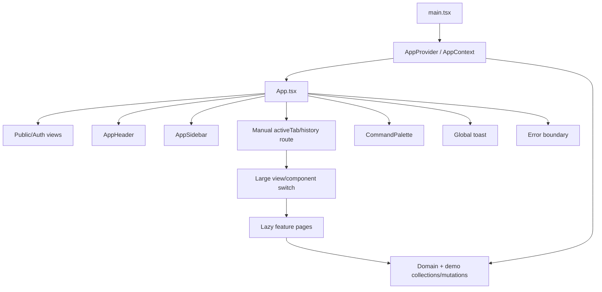
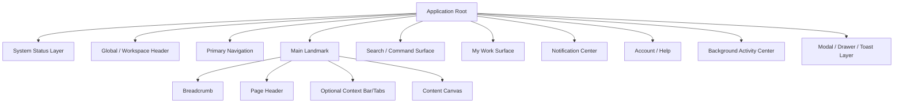
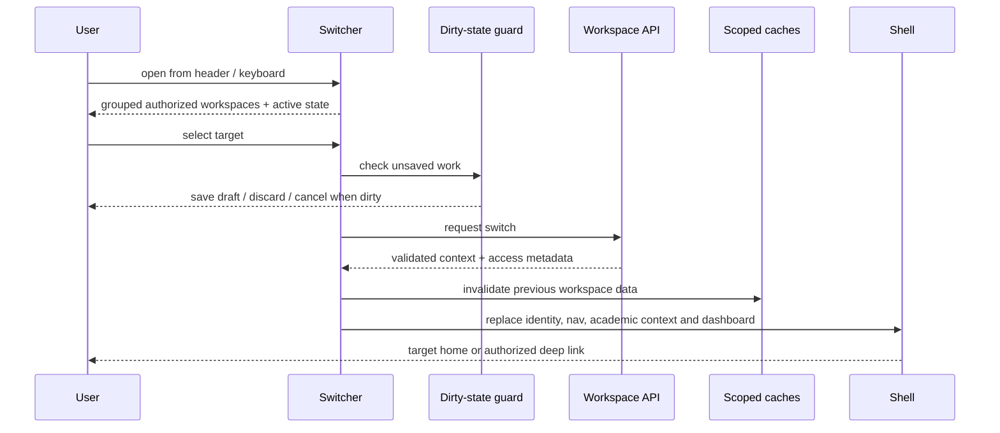
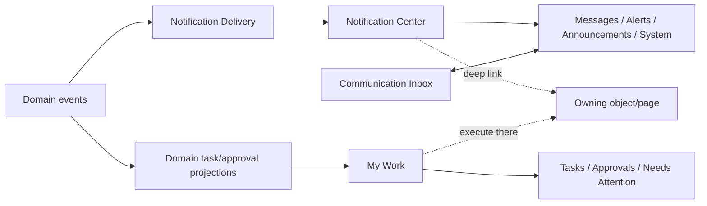
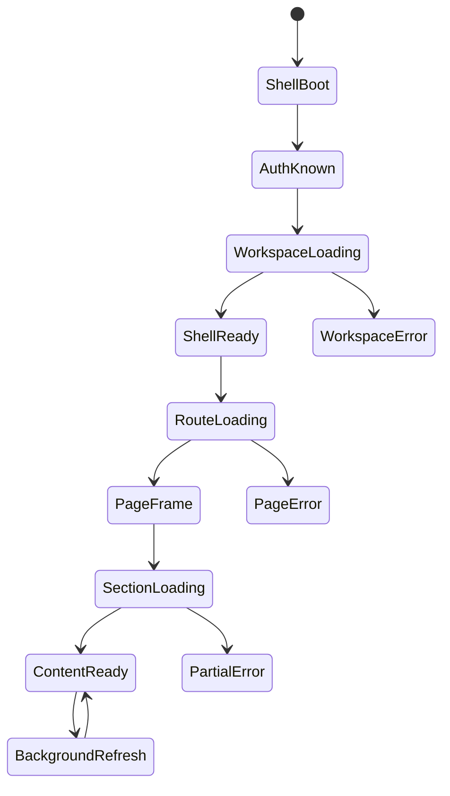
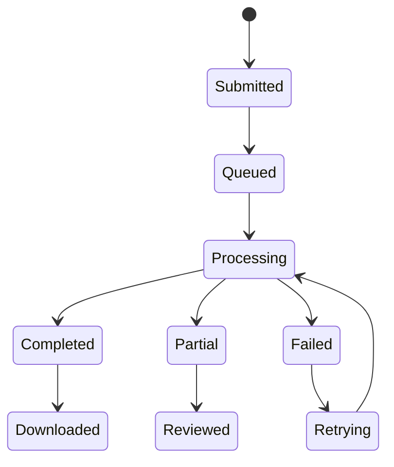
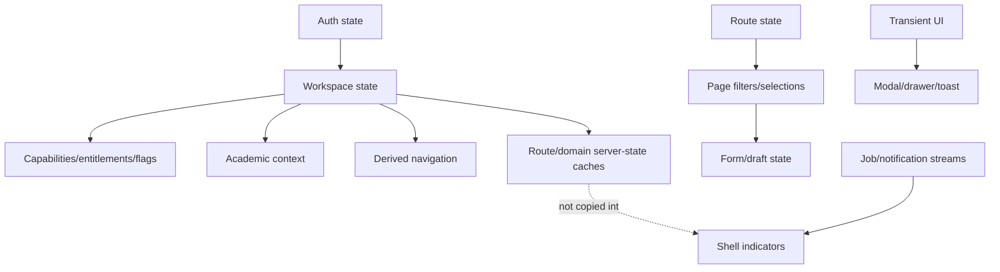
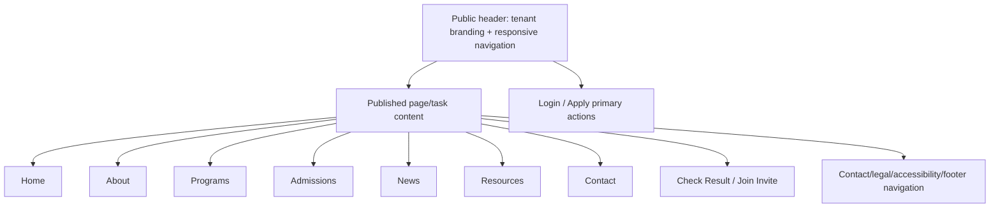

# SKUGGLE ENTERPRISE APPLICATION SHELL ARCHITECTURE

**Document type:** Architecture Phase 5 decision document. No implementation or final visual design is authorized.  
**Frozen inputs:** Enterprise Architecture Audit; Domain & Capability Architecture; Identity/Tenancy/IAM/RBAC Architecture; Workspace & Information Architecture.  
**Boundary:** This document defines where shell regions exist and how they behave. The Design System will later define their visual tokens and component specifications.

## 1. Executive Decision Summary

Skuggle will use a family of related workspace shells built from shared structural primitives, not one universal shell with links hidden by role. Authenticated pages fit this contract:

> Workspace Header + Primary Navigation + Page Context + Content Canvas + Transient/Status Surfaces

The staff School Workspace uses a collapsible labeled sidebar with a compact rail option on sufficiently wide screens. Icons-only rail is a user-controlled space-saving state, never the default or sole semantic representation. Tablet uses an overlay/adaptive drawer. Mobile uses task-first bottom navigation plus a complete authorized “More” sheet.

Workspace Switcher lives at the leading edge of the global header. Academic campus/session/term context is a school-workspace control in the header/context strip, visible only when relevant. Search is persistent as a compact header entry on desktop and a dedicated trigger on smaller screens. My Work and Notifications remain separate: work items demand action; notifications communicate events.

Parent and Student use simpler school shell variants, not the staff shell with hidden links. Personal Space uses a lighter productivity shell. Relate uses a top bar plus slim desktop rail and mobile bottom navigation. Platform Console shares primitives but has unmistakable privilege identity; tenant support sessions display a persistent banner. Public Portal has separate public chrome.

There is no giant global quick-create. Contextual primary actions and a capability-filtered command palette handle creation. Durable work uses deep-linkable pages. Modals are for confirmation and short atomic tasks; drawers are for preview, filters and transient utilities. Background jobs persist in a shell-level activity center. The shell loads before route data, never stores authoritative domain collections, and remains interactive through partial failures.

## 2. Current Shell Audit

The audit confirms a React 19/Vite SPA in which `App.tsx` coordinates public/authenticated view state, session restoration, manual route/tab state, role dashboard selection, shell rendering and a large component switch. `AppContext.tsx` (1,918 lines at audit) combines auth/workspace state, demo/server collections, mutations and cross-domain orchestration. `AppHeader`, `AppSidebar`, `WorkspaceSwitcherModal`, `CommandPalette`, toast UI, error boundary and feature components provide partial shell primitives. Major pages are lazy-loaded; PWA manifest/service worker/offline page exist.



| Current component/mechanism | Responsibility | Problem | Target responsibility |
|---|---|---|---|
| `App.tsx` | view/session/route/shell/page dispatch | orchestration and routing coupled; unknown route falls Home | thin root composition and nested layout outlet |
| `AppContext.tsx` | auth, workspace, server/domain/demo/page actions | global mutable coordinator; broad boot/re-render | small scoped providers/stores; domain server state outside shell |
| `AppHeader` | workspace/account/global utilities | competing concerns and role presentation | shared GlobalHeader contract with workspace variant slots |
| `AppSidebar` | groups/items/collapse/mobile | tied to current registry/IA; staff assumptions | metadata-driven PrimaryNavigation variant |
| `WorkspaceSwitcherModal` | choose role/workspace | modal semantics and identity can blur | header popover desktop/full-height sheet mobile; server switch lifecycle |
| `CommandPalette` | navigate/commands | current navigation registry bound | canonical permission-filtered search/command surface |
| role dashboards | entry summaries/quick links | separate products and broad data load | dashboard composition from authorized widgets/tasks |
| page internal tabs | local navigation | repeated/deep/nondurable state | one standard deep-linkable context tab row |
| UI modals/drawers | forms/details/actions | complex durable work can be trapped | governed surface policy |
| global toast | feedback | easy to overuse; transient for durable work | feedback hierarchy + job/activity persistence |
| error boundary | crash containment | root recovery can be too broad | root + route/section boundaries |
| service worker/offline | PWA shell/static cache | offline capability can be ambiguous | explicit availability/staleness/sync contract |

## 3. Shell Principles

1. Shell contains context and orchestration, never domain business rules.
2. Workspace identity is always visible and distinct from account identity.
3. Canonical capability metadata drives navigation; role names do not.
4. Sidebar has group -> item only; contextual navigation has one tab row only.
5. Page/object identity and meaningful state are deep-linkable.
6. Shell renders independently from route data and survives partial query failure.
7. Mobile prioritizes tasks, not desktop taxonomy.
8. Persistent surfaces are reserved for persistent user needs; actions are contextual.
9. Every transient surface has focus, escape, dismissal and restoration rules.
10. Accessibility, offline clarity, tenant isolation and performance are structural requirements.

## 4. Shared Shell Model



### Shell region matrix

| Region | Purpose/content | Desktop | Tablet | Mobile | Accessibility | Variation |
|---|---|---|---|---|---|---|
| Global header | workspace identity, search trigger, work, notifications, account | persistent single row | compact row | compact top bar | banner landmark, logical tab order | public/Relate variants differ |
| Workspace switcher | choose authorized context | anchored popover | sheet/popover | full-height sheet | combobox/listbox semantics, focus return | absent/public; privileged markers |
| Primary nav | canonical groups/items | expanded sidebar or rail | overlay drawer/rail | bottom priorities + More sheet | nav landmark, labels/tooltips | staff/parent/student/personal/Relate |
| Academic context | campus/session/term | header/context strip | compact trigger | context sheet | named controls/status announcement | school only, relevance filtered |
| Page header | identity/status/actions | inline responsive | wrapped compact | stacked concise | heading hierarchy | public has hero/page title variant |
| Breadcrumb | hierarchy/backtracking | visible on deep pages | shortened | back label/overflow | nav/ordered list | omitted at shallow roots |
| Context bar/tabs | coherent sibling views | one row | scroll/overflow menu | segmented/scroll/select | tablist/roving focus | permission filtered |
| Content canvas | page-owned layout | adaptive width | fluid | full width | main landmark/skip target | density by page type |
| Search/commands | find/navigate/act | header entry + dialog | trigger + dialog | full-screen search | combobox/listbox/live results | scoped per workspace |
| My Work | task/approval aggregation | header shortcut/page | drawer/page | page/sheet | count label, keyboard list | absent/public; role relevance |
| Notifications | event awareness | header bell/drawer | drawer | full-screen page/sheet | status/count/filter semantics | category differences |
| Account/help | identity/security/preferences/support | avatar menu | menu | account sheet/page | menu semantics | public sign-in actions |
| System status | offline/degraded/update/support banner | subtle banner/indicator | same | concise persistent bar | live region, noncolor cue | support-session banner mandatory |

### Interaction surface matrix

| Surface | Opens from / mode | Primary responsibility | Must not become |
|---|---|---|---|
| Sidebar/rail | persistent desktop; drawer tablet | group/item navigation and active context | third-level tree or action catalog |
| Workspace Switcher | header popover/sheet | select authorized workspace | account-role editor |
| Global Search | header/full-screen mobile | privacy-filtered find | cross-tenant data leak |
| Command Palette | search field/shortcut | navigate or invoke safe contextual command | unscoped destructive launcher |
| Notification Center | bell drawer/page | event awareness/read state | Communication inbox or work tracker |
| My Work | header/dashboard/page | tasks, approvals, attention | workflow source of truth |
| Page Header | page frame | identity, status, primary/secondary actions | oversized dashboard |
| Breadcrumb | deep page header | hierarchical backtracking | duplicate Home labels |
| Tabs | below page header | one level of sibling object views | nested domain navigation |
| Filter Bar | collection/analytics | refine current dataset/view | route taxonomy |
| Modal | contextual action | confirm/short atomic task | durable workspace |
| Drawer/sheet | preview/filter/transient utility | preserve current-page context | permanent sub-navigation |
| Wizard | full page | resumable multi-step creation | squeezed dialog |
| Account Menu | header avatar | personal/security/session actions | tenant administration |
| Help | header/account/context | docs/support/problem report | core domain navigation |
| Status/Activity | shell banner/center | system state and durable job progress | technical telemetry dump |

## 5. Global Header

Header responsibility is context and globally available utilities, not domain navigation. Leading: mobile navigation trigger when needed and Workspace Identity/Switcher. Center: compact search/command entry on desktop when space allows. Trailing: My Work, Notifications, Help (desktop optional), Account. Academic context may occupy a dedicated adjacent context region rather than overfill the primary header.

Workspace identity shows logo/mark, canonical name, workspace type and optional campus/current-period summary. It never displays as the user's avatar. Header remains stable during route loading and may compress—not disappear—on scroll where accessibility and task continuity permit.

## 6. Workspace Switcher



Desktop uses an anchored searchable popover; mobile/tablet-small uses a full-height sheet. Groups and ordering are frozen by IA. Keyboard: trigger announces active workspace, arrows navigate, typeahead/search filters, Enter selects, Escape closes, focus returns. Deactivated workspaces are excluded unless a useful disabled state explains recovery; inaccessible deep links show safe Unavailable. Switching shows progress in the trigger while the old shell remains inert/readable, then atomically replaces context. Unsaved work must never be silently discarded.

## 7. Primary Navigation

Desktop school staff navigation is an adaptive collapsible sidebar:

- expanded labeled mode is default at large/desktop widths;
- user-controlled compact rail is available when content needs width;
- at small-laptop width, compact mode may be suggested/persisted per user, not forced without escape;
- tablets use an overlay drawer or temporary rail depending orientation;
- mobile uses task-first bottom navigation and More.

Rail mode displays meaningful icons plus accessible labels/tooltips on hover/focus, clear active item and active-group indication. The workspace switcher remains in header, not compressed into ambiguous logo-only navigation. Navigation scrolls independently below fixed workspace/header context. Administration is collapsed initially unless active. Badges are privacy-safe actionable counts, capped/formatted, and never decorative. Pinning is allowed for authorized capability items only, with a small limit; it cannot bypass IA depth or entitlements.

## 8. Academic Context

One school-workspace Academic Context control represents optional Campus, Session and Term. Pages declare which dimensions they inherit. Current operational pages inherit active period; institution/profile pages ignore it; historical/report pages may override with an explicit local historical context displayed in the page header. Deep links encode required context and validate it against tenant.

Changing context warns about dirty work, updates URL/context state, invalidates affected query keys, refreshes page/work counts and announces the change. It never silently changes a record already opened with immutable period identity. Campus selection appears only for multi-campus users/pages and is constrained by role assignment.

## 9. Page Header

Canonical anatomy: breadcrumb (above), title, concise description, contextual metadata/status, one primary action, limited secondary actions, overflow menu. On mobile: title/status first, primary action visible or sticky when essential, secondary actions in overflow. Descriptions disappear when redundant. Headers should not become hero sections inside enterprise pages.

Primary action is the most likely authorized mutation for the page. Workflow actions may replace it by object state. Destructive actions live in overflow/danger section with confirmation. Actions expose pending/disabled reason and never disappear mid-operation without state feedback.

## 10. Breadcrumbs

Show on object/detail, settings depth, cross-domain and deep-linked pages; omit on workspace home and shallow primary capability pages where title/sidebar provide orientation. Maximum desktop visible path: workspace implied, then up to three meaningful segments; middle segments collapse into accessible overflow. Mobile shows Back to parent plus current title, with full hierarchy available to assistive technology/overflow.

Never render `Dashboard > Home > Dashboard`. Breadcrumb labels come from canonical route metadata and resolved object display identity; each ancestor link preserves workspace and valid context.

## 11. Contextual Navigation

One standard deep-linkable tab row for coherent sibling views only. Tabs are permission/privacy filtered before render; a directly requested unavailable tab returns/redirects to an explicit safe state, not another silent tab. Counts are used only when actionable. Desktop tabs may scroll or overflow into “More”; mobile uses horizontally scrollable tabs for small sets or an accessible select/menu for larger sets.

Changing tabs with dirty state triggers the same navigation guard. No nested tab row; deeper dimensions use filters, sections, anchors or object links. Examples remain Student and Assessment tab sets frozen in IA.

## 12. Content Layout

The shell supplies a fluid content canvas, safe responsive gutters, main landmark, optional full-bleed region and density context. Pages choose:

- full-width for operational tables/boards/analytics;
- medium for settings and structured forms;
- narrow for reading and focused review;
- dashboard grid for modular summaries;
- split pane for collection+preview where both remain deep-linkable;
- detail+activity rail on wide displays, stacked on small screens.

Cards are semantic grouping tools, not the mandatory page substrate.

### Page shell matrix

| Page type | Required composition | Optional regions | Excluded by default |
|---|---|---|---|
| Dashboard | workspace header, nav, concise page identity, task/outcome grid | calendar/status | domain tab maze |
| Collection | page header, filter bar, collection, pagination | summary, bulk bar, preview drawer | object editing modal |
| Object detail | breadcrumb, identity/status/actions, content | one tabs row, activity/related rail | nested tabs |
| Work queue | page header, queue filters, actionable list | preview drawer, batch action | copied workflow state |
| Analytics | page header, context/filters, visualization canvas | drill-down, saved view | writable facts |
| Report | breadcrumb/header, parameters or rendered result | history, export/job state | domain editing |
| Settings | breadcrumb/header, owner-labelled sections, save state | tabs for coherent setting families | unrelated domain settings |
| Wizard | identity/progress, current step, navigation/footer | draft status/review | sidebar-like step tree |
| Profile | identity header, authorized profile sections | contextual domain projections | implicit cross-workspace merge |
| Public page | public header, tenant brand, content/CTA, footer | focused task flow | authenticated app chrome |

## 13. Collection/Table Shell

Structure: Page Header -> optional small summary -> search/filter/saved-view bar -> selection/bulk action bar -> collection -> pagination/load boundary. The collection owns columns/rows; shell primitives standardize chrome, sticky behavior, responsive alternatives and state handling.

Filters include search, quick filters, Advanced Filters, sort, saved views and column visibility. Export is a secondary action with permission and background-job handling. Filter state is URL-addressable when shareable, otherwise page session state. Mobile uses a filter/sort sheet and card/priority-column presentation; it never forces horizontal desktop tables as the only usable view. Selection survives safe pagination only when the data contract guarantees stable IDs.

## 14. Object Detail Shell

Durable objects (Student, Application, Assessment, Invoice, Employee, Resource) use full-page deep links. Header contains identity, status and key metadata; contextual tabs provide sibling views; primary/overflow actions reflect state; related objects link to owning domains; activity appears as a tab or wide-screen rail. A drawer can preview an object from a collection, with “Open full page” for substantial work. Object URLs never depend on modal state alone.

## 15. Forms & Wizards

Form layouts: focused single-column; two-column desktop only for genuinely paired short fields; sectioned long form; repeatable group; wizard; sticky action footer when long. Mobile returns to single column. Validation uses field messages plus focusable summary; sensitive fields show classification/help without exposing values. Upload/camera affordances state format, progress, scan and retry. Dynamic/custom fields appear under labeled owner sections.

Wizard pattern supports resumable draft, meaningful steps, current/progress state, Back/Next, per-step validation, save/exit, review, submit and completion next action. On smaller screens show current step and progress count rather than ten squeezed labels. Autosave must disclose status and conflicts. Student enrolment, teacher onboarding and school setup use pages; not giant modals.

## 16. Modals & Drawers

Modal is appropriate for confirmation, short atomic form, quick assignment, small lookup and compact configuration. Modal becomes a page when work is durable/deep-linkable, requires multiple sections/tabs, meaningful history, complex validation, collaboration, more than one main task, or cannot fit comfortably at 200% zoom/mobile. Size categories are semantic (confirmation/small/standard) rather than arbitrary per domain.

Drawers are for filters, preview/quick detail, activity, notifications, mobile navigation, comparison and non-destructive context. They do not create permanent nested navigation. Both use semantic dialog where modal, labelled title/description, focus trap only when modal, Escape/close, outside-click policy that cannot lose work, scroll containment and focus restoration.

## 17. Search & Commands

Desktop exposes a persistent compact search entry; Ctrl/Cmd+K opens a unified surface. Results group People, Academics, Work, Resources, Pages, Reports and Commands, scoped to current workspace by default. Cross-workspace search is an explicit mode showing workspace labels and is disabled for sensitive categories unless authorized. Results are filtered server-side for permission, relationship and privacy before display.

Keyboard supports typing, arrows, grouped navigation, Enter, Escape and announced result counts. Recent/frequent items store safe IDs/labels only. Commands expose context, capability, entitlement and confirmation; privileged/destructive actions require full object context/step-up and are not one-keystroke executions. Mobile search is a full-screen surface.

## 18. My Work & Approvals

My Work is accessible from header, dashboard card and dedicated page. It aggregates references to domain-owned Tasks, Approvals, Needs Attention and History; it does not own workflow state. Header badge counts actionable current items. Drawer/preview can triage; substantive decisions deep-link to owner object. Filters include due date/domain/type/priority. Completing an item invokes the owning domain action and updates the projection.

## 19. Notifications



Notification Center uses a header bell opening a drawer on desktop/tablet and full page/sheet on mobile. It supports category filters, read/unread, mark selected/all read and deep links. Summary text is privacy-safe on shared/locked screens. Messages category links to Communication Inbox; the bell is not the inbox. Approval notification and approval work item may refer to the same object but have distinct read versus completion semantics.

## 20. Account & Help

Account menu owns My Profile, Personal Space shortcut, Preferences, Security/MFA, Sessions, Keyboard Shortcuts, Install App, Help & Support and Sign Out. School Setup never appears there. Desktop Help may also have a header icon; mobile uses account/More and contextual help. Support Center contains searchable documentation, contextual topic links, contact/report problem and ticket history. Platform support tickets remain clearly distinguished from school service cases.

## 21. Loading & Progressive Rendering



Root shell boot shows branded structural loading, never a white screen. Workspace identity/navigation load once and atomically. Route frame/title renders before domain data where metadata permits. Sections use skeletons only when shape is predictable; otherwise concise progress. One widget/query failure becomes partial error with retry and does not blank shell/page. Actions show local pending state; background refresh keeps stale content visibly stable.

## 22. Error & Empty States

| State | Meaning | Presentation/recovery |
|---|---|---|
| 404 | route/object absent or safely concealed | Not Found; parent/search/home link; never silent Home |
| 403 | known capability forbidden | Access Restricted; request/admin/help path where appropriate |
| Feature unavailable | technical/flag/state unavailable | explanation, status/retry or alternative |
| Not entitled | plan lacks feature | hide ordinary nav; authorized upgrade/catalog path |
| Not configured | entitled but setup missing | admin setup action; ordinary user explanation |
| Network/server error | request failed | retain shell/stale data; retry/status/support |
| Validation | submitted data invalid | summary + inline fields; preserve entries |
| Conflict/stale version | concurrent update | compare/reload/reapply; never overwrite silently |
| Offline unavailable | operation needs network | clear restriction and safe return/offline options |
| Partial failure | one section unavailable | local error/retry; rest usable |
| True empty | no records yet | purpose, authorized create/import action |
| Filtered empty | records exist but filter matches none | clear/adjust filters |
| Permission empty | nothing in actor scope | explain scope without revealing hidden data |

## 23. Long-Running Jobs



Imports, SmartMark, result/report generation, exports and bulk communication create durable job records. A shell Activity Center shows active/recent jobs across authorized current workspace, survives navigation/reload and provides progress where truthful, submitted time, owner/domain, completion artifact, error summary and retry/review link. Toast confirms submission only; persistent status carries the lifecycle. Cross-workspace jobs never leak titles/counts and are grouped by workspace when the switcher displays a safe indicator.

## 24. Responsive Architecture

| Feature | Large desktop (>=1440 conceptual) | Desktop (1200–1439) | Small laptop/tablet (768–1199) | Mobile (<768 conceptual) |
|---|---|---|---|---|
| Navigation | expanded sidebar; optional rail | expanded/collapsible | rail or overlay drawer | task bottom nav + More sheet |
| Header | full workspace/search/work/notify/account | compact full set | triggers/icons with labels accessible | workspace/context + essential indicators |
| Page header | single/wrapped row | wrapped | stacked actions | concise stack/sticky primary if needed |
| Tabs | full row/overflow | scroll/overflow | scroll/menu | scroll/select, one row |
| Tables | full density options | adaptive columns | priority columns/card option | cards/list, detail drill-in |
| Filters | inline + advanced popover | compact inline | wrap/drawer | full filter sheet |
| Actions | primary+secondary+overflow | same compact | primary+overflow | primary/sticky+overflow |
| Drawers | fixed max contextual width | contextual | broader overlay | full/near-full height/width |
| Switcher | anchored searchable popover | popover | sheet/popover | full-height sheet |
| Search | persistent field | compact field | trigger/dialog | full-screen |

Behavior bands are testable layout modes, not commitments to final CSS breakpoints.

### Tablet School Workspace

```mermaid
flowchart TB
  Top[Compact school header: menu | workspace | context | alerts/account] --> Frame
  Frame --> Drawer[On-demand two-level navigation drawer]
  Frame --> Main[Fluid main canvas]
  Main --> Page[Compact page header]
  Page --> Tabs[One scrollable context row]
  Tabs --> Content[Priority content / adaptive collection]
  Main --> Sheet[Filters, workspace switcher and utilities as sheets]
```

### Mobile Teacher Shell

```mermaid
flowchart TB
  Top[School + academic context | alerts/account] --> Today[Task-focused content]
  Today --> Bottom[Bottom navigation]
  Bottom --> T[Today]
  Bottom --> C[My Classes]
  Bottom --> A[Attendance]
  Bottom --> M[Marks]
  Bottom --> Msg[Messages]
  Top --> More[More/Search sheet for full authorized navigation]
```

### Mobile Principal Shell

```mermaid
flowchart TB
  Top[School context | alerts/account] --> Leadership[Leadership summary / queue]
  Leadership --> Bottom[Bottom navigation]
  Bottom --> H[Home]
  Bottom --> Ap[Approvals]
  Bottom --> P[Performance]
  Bottom --> At[Attendance]
  Bottom --> Com[Communication]
  Top --> More[More/Search sheet for People, Academics and Insights]
```

## 25. Accessibility

Required: skip-to-main; semantic header/nav/main/aside/footer landmarks; one H1 per page; logical focus order; visible focus; keyboard-operable switcher/nav/tabs/menus/search; accessible names beyond icons; menus versus listboxes versus dialogs used correctly; focus trap/restoration; Escape without data loss; minimum target size; 200% zoom/reflow; responsive text; noncolor status; live-region announcements for errors, route/workspace changes and meaningful async completion; reduced-motion preference; high-contrast/forced-colors compatibility; table headers/captions and card alternatives; current-page/tab semantics.

Shell testing includes keyboard-only task completion, screen-reader landmarks/labels, focus after route/modal/drawer close, zoom/reflow, reduced motion and automated checks. Accessibility cannot wait for Design System polish.

## 26. PWA & Offline

Global status distinguishes Online, Offline, Syncing, Degraded, Read-only, Update Available and Server Unavailable without technical jargon. Every route declares **Available Offline**, **View-only Offline**, or **Requires Connection**. Current implementation evidence proves PWA shell/static offline assets, not universal offline writes; therefore no queued mutation is promised until a domain explicitly implements conflict-safe sync.

Offline/stale data displays last-updated time and limitation. Unsupported actions are disabled with reason, not allowed to fail mysteriously. Install affordance lives in Account and optionally contextual onboarding. Updates prompt at a safe moment, never reload through unsaved work. Sync status is visible only for capabilities that support it.

## 27. Motion & Feedback

Motion may clarify sidebar/rail change, workspace transition, route continuity, drawer/modal entry, tab indicator, loading and success. It remains short, restrained and interruptible; no ornamental page choreography in dense operations. Reduced motion removes translation/parallax and uses opacity/instant state where needed.

Feedback hierarchy: inline state for field/action result; status banner for page/system condition; progress for ongoing work; toast for brief noncritical confirmation; notification for later/relevant event; Activity Center for durable jobs. Never toast every autosave/keystroke. Error feedback remains until resolved/dismissed; success requiring later action links to its object.

## 28. Frontend State Boundaries



| State | Owner | Lifetime | Persistence | Invalidation |
|---|---|---|---|---|
| Auth/session | auth boundary | session | secure server/browser session | logout/revoke/risk |
| Workspace/tenant | workspace provider | selected session | server + safe local hint | switch/membership/tenant change |
| Academic context | school context provider | workspace/session | URL/server/user preference | workspace/period/campus change |
| Capabilities | access provider/resolver | workspace access version | memory/cache | role/membership/policy version |
| Entitlements/flags | workspace access | workspace/version | cache | billing/flag/config change |
| Navigation | pure derived registry | render/workspace | not authoritative | access/context/metadata change |
| Server data | domain query owner | route/query | scoped cache | mutation/event/workspace switch |
| Page filters | route/page | route visit | URL/saved view/session | route/workspace change |
| Form/draft | form/wizard | editing session | memory/draft store | submit/discard/version conflict |
| Modal/drawer | local transient UI | open surface | none | close/route/workspace switch |
| Notifications/work/jobs | dedicated stream/query | session + durable server records | scoped server/cache | event/read/completion/switch |

## 29. Routing/Layout Contract

```mermaid
flowchart TD
  Root[/] --> PublicLayout[Public layout]
  Root --> W[workspace identity]
  W --> Guard[workspace/principal guard]
  Guard --> Layout[workspace shell variant]
  Layout --> Domain[domain segment]
  Domain --> Capability[capability segment]
  Capability --> Collection[collection/page]
  Capability --> Resource[resource public ID]
  Resource --> Subview[optional one-level context view]
  Guard --> Forbidden[403/404/unavailable]
  Legacy[historical alias] --> Canonical[validated canonical redirect]
```

Conceptual routes follow `/{workspace}/{domain}/{capability}/{resource?}/{view?}`; actual syntax is deferred. Layout nesting resolves workspace before loading domain bundle/data. Guards distinguish auth, membership/principal, entitlement/flag and resource policy. Historical aliases use an allow-listed mapping, preserve safe parameters and redirect to canonical identity after authorization. Unknown routes use scoped 404. Deep links select/confirm workspace without revealing unauthorized tenant/resource existence.

## 30. Performance Architecture

Shell JS/CSS and identity metadata load independently; no business module is required to render the frame. Workspace context is fetched once per access version. Route bundles/data load on demand. Likely next-route metadata/bundles may prefetch on idle/intent, never private data without context. Shell components subscribe to narrow state slices so domain mutations do not rerender header/sidebar. Query keys include workspace/tenant/academic/scope identity. Notifications/work/job counters refresh separately with backoff/push where available. Route boundaries isolate errors and Suspense/loading. Performance telemetry measures transition phases without PII.

## 31. School Workspace Shell

```mermaid
flowchart TB
  Header[Header: school identity/switcher | search | work | notifications | account]
  Header --> Context[Optional campus / session / term context]
  Context --> Body
  Body --> Sidebar[Two-level domain sidebar]
  Body --> Main[Main]
  Main --> Crumb[Breadcrumb]
  Main --> PH[Page header + actions]
  Main --> Tabs[Optional one tab row]
  Main --> Content[Adaptive content canvas]
  Main --> Activity[Transient drawer/modal + durable job center]
```

Staff desktop/tablet/mobile follows §§7 and 24. School identity remains visible. Parent/Student variants below share security/context primitives but use simpler navigation. Academic context is shown only to capabilities that use it. Sidebar renders the frozen eight IA groups and filtered canonical items.

## 32. Parent Shell

```mermaid
flowchart TD
  H[Header: school/workspace | notifications | account] --> N[Simple navigation]
  N --> Home[Overview]
  N --> Children[My Children]
  N --> Results
  N --> Attendance
  N --> Finance
  N --> Learning
  N --> Messages
  N --> Info[School Information]
  Children --> ChildContext[Selected-child context bar]
  ChildContext --> Content[Relationship-authorized projections]
```

No staff sidebar or administration vocabulary. Child selection is explicit and privacy-safe; it filters linked projections without becoming tenant switching. Mobile priorities: Home, Children, Results, Finance/Messages according to relevance, More. Personal Space remains a separate workspace.

## 33. Student Shell

```mermaid
flowchart TD
  H[Header: school | current academic context | notifications/account] --> N[Learning navigation]
  N --> Home
  N --> Learning[My Learning]
  N --> Timetable
  N --> Assessments
  N --> Results
  N --> Attendance
  N --> Resources
  N --> Messages
  N --> Content[Self-scoped content]
```

Student routes derive self scope and emphasize today/next work. Mobile priorities: Home, Learning, Assessments, Results, Messages; timetable/attendance/resources in More or contextual cards. It is not staff navigation with hidden items.

## 34. Personal Space Shell

```mermaid
flowchart TD
  H[Light header: Personal Space switcher | search | notifications | account] --> Nav[Minimal sidebar/rail or mobile bottom nav]
  Nav --> Home
  Nav --> Plan[My Plan]
  Nav --> Calendar
  Nav --> Resources
  Nav --> Development[Learning & Development]
  Nav --> Portfolio
  Nav --> Messages
  Nav --> Schools[School Memberships]
  Nav --> Relate[Open Relate]
```

Use more focused/comfortable density and fewer enterprise controls. School summaries are projections/links and never make school domain data part of Personal state. Persona-relevant recommendations alter content, not authorization.

## 35. Skuggle Relate Shell

```mermaid
flowchart TD
  Top[Community top bar: Relate identity | search | notifications | profile] --> Desktop[Desktop slim rail/top hybrid]
  Top --> Mobile[Mobile bottom navigation]
  Desktop --> Feed
  Desktop --> Discover
  Desktop --> Communities
  Desktop --> Connections
  Desktop --> Tutoring
  Desktop --> Messages
  Mobile --> FeedM[Feed]
  Mobile --> DiscoverM[Discover]
  Mobile --> CreateM[Create/Opportunity when eligible]
  Mobile --> MessagesM[Messages]
  Mobile --> ProfileM[Profile]
  Top --> Safety[Persistent privacy/safety access]
```

Relate does not use the School sidebar. Affiliation/privacy state is understandable near profile/content creation. Report/block/moderation are always reachable. Minor accounts receive age-appropriate reduced affordances.

## 36. Platform Console Shell

```mermaid
flowchart TB
  H[Platform header: PLATFORM CONSOLE | tenant lookup | search | work | alerts | operator]
  H --> Status[Operational status strip]
  Status --> Nav[Platform navigation]
  Nav --> Main[Platform content]
  Main --> Support{Support session active?}
  Support -->|Yes| Banner[Persistent tenant + actor + purpose + expiry + End Session banner]
  Banner --> TenantView[Scoped tenant support view]
  Support -->|No| PlatformView[Platform operations]
```

It shares structural/accessibility primitives, not exact school styling. Privilege boundary is conveyed by persistent workspace name and semantic treatment to be specified by Design System. Tenant lookup returns platform-safe summaries. Support session banner cannot be dismissed while active and remains through all tenant support routes.

## 37. Public Portal Shell



No authenticated app sidebar, Work, internal notifications or academic-context controls. Auth/apply/result tasks use focused public flows with tenant branding and safe return. Mobile uses public menu and prominent configured CTA.

## 38. IA -> Shell Traceability

| Frozen IA decision | Shell consequence |
|---|---|
| Five workspaces | shared primitives plus seven explicit shell variants (staff/parent/student included) |
| Eight School groups | staff sidebar renders those groups only from metadata |
| Maximum group->item | navigation component rejects third-level children |
| One context tab row | page layout exposes one tab slot and prohibits nested tab shell |
| CA/Test/Exam are filters | Assessment collection filter, never nav children |
| Results inside Performance | Performance shell routes/result tabs; Assessment links after score lock |
| Subscription under Administration | Finance shell has no subscription surface |
| Reports under Insights/context links | one report route identity from multiple links |
| Workforce under People | sidebar People item/landing; Workforce ownership retained |
| Admissions primary | direct capability item and work queues, stages remain filters |
| My Classes for Teacher | priority nav to scoped Academics projection |
| Help utility | header/account/context help, not core sidebar |
| Blueprint action | School Setup/onboarding action, not nav item |
| Parent/Student simplified | distinct shell navigation models, not hidden staff menu |
| Disabled policy | nav metadata evaluates entitlement/config/flag consistently |
| Unknown route not Home | route boundary renders secure 404/unavailable |

## 39. Shell Fitness Rules

1. Shell contains no domain business logic or authoritative collections.
2. Workspace switch invalidates all workspace-scoped state and queries.
3. Navigation derives from canonical capability metadata.
4. Third-level sidebar and nested tab rows are prohibited.
5. Unknown routes never silently fall Home.
6. Meaningful page/object identity is deep-linkable.
7. Complex durable work is not modal-only.
8. Mobile does not reproduce desktop taxonomy.
9. Parent/Student do not receive staff shell with only hidden links.
10. Platform support banner is persistent and unmistakable.
11. Search is server permission/privacy filtered before render.
12. Shell stays interactive when a page/section query fails.
13. Page loading never blanks the whole authenticated app.
14. Notifications and My Work remain semantically distinct.
15. Domain server data loads by route and is not copied into shell state.
16. Cache keys include workspace/tenant and cannot cross tenants.
17. Offline/stale/read-only status is visible and truthful.
18. All interaction surfaces meet keyboard/focus/semantic requirements.
19. Reduced motion is supported.
20. Shell renders without loading every business module.
21. Background jobs survive route navigation/reload.
22. Transient surfaces restore focus correctly.
23. Shell consumes future Design System tokens; architecture hardcodes no visual brand values.
24. Context changes guard unsaved work.
25. Page metadata and navigation have one canonical route identity.

## 40. Architecture Decision Records

| ADR | Decision | Rationale |
|---|---|---|
| SHELL-01 | Collapsible desktop School sidebar | enterprise breadth needs labels and reclaimable width. |
| SHELL-02 | Optional icon rail, never semantic-only/default | useful on smaller laptops; labels/tooltips/accessibility required. |
| SHELL-03 | Workspace Switcher in leading header | workspace context precedes domain navigation and remains visible in rail/mobile. |
| SHELL-04 | Academic context in school header/context strip | avoid repeated page selectors while allowing declared overrides. |
| SHELL-05 | Persistent compact desktop search | high-frequency global find/navigation; becomes trigger/full screen responsively. |
| SHELL-06 | Separate My Work and Notifications | action obligation differs from event awareness/read state. |
| SHELL-07 | Help in header/account/context | accessible utility without occupying core domain sidebar. |
| SHELL-08 | Parent/Student distinct shell variants | job language and responsive priorities differ fundamentally from staff. |
| SHELL-09 | Personal reuses primitives, not School shell | productivity context needs lighter navigation/density. |
| SHELL-10 | Relate top+slim rail desktop, bottom nav mobile | community behavior differs from enterprise hierarchy. |
| SHELL-11 | Platform shares primitives, not exact identity styling | privilege boundary must remain unmistakable. |
| SHELL-12 | Mobile bottom nav is workspace/persona priority set + More | task-first access without duplicating taxonomy. |
| SHELL-13 | No universal global create menu | prevents fifty-action clutter; contextual actions/commands suffice. |
| SHELL-14 | Modal-to-page threshold is durability/complexity/deep-link need | preserves addressability, accessibility and recoverability. |
| SHELL-15 | Drawers for preview/filter/transient utilities | context without becoming permanent navigation. |
| SHELL-16 | Object details use full-page deep links | durable work and collaboration/history require stable identity. |
| SHELL-17 | Dirty-state guard blocks workspace/route/context loss | offer save draft, discard or cancel. |
| SHELL-18 | Activity Center owns persistent background-job visibility | jobs outlive pages and toasts. |
| SHELL-19 | Explicit offline capability labels/status | current PWA does not prove offline mutation support. |
| SHELL-20 | Independent shell boot + route bundles/narrow subscriptions | minimizes boot cost and global rerenders. |

## 41. Design System Handoff

Application Shell Architecture freezes region presence, hierarchy, behavior, state semantics, responsive transformations, accessibility contracts, density contexts and workspace variants.

Step 6 must define: color roles and workspace/privilege semantics; typography scale; spacing/layout grid and region dimensions; breakpoints implementing behavior bands; icon system; focus/contrast; buttons/action hierarchy; inputs/forms/validation; navigation items/rail/tooltips; breadcrumbs/tabs/filters; tables/cards/lists; dialogs/drawers/sheets; banners/toasts/status/badges/skeletons; empty/error illustrations; elevation/radius/borders; motion durations/easing/reduced motion; density tokens; component anatomy/variants/states; responsive specs and accessibility acceptance criteria.

The Design System must not change domain ownership, IA placement or the shell decisions recorded here merely to simplify a component.

## 42. Final Decision Matrix

| Area | Current | Target/decision | Priority | Implementation dependency |
|---|---|---|---|---|
| App Shell | App.tsx coordination/switch | nested workspace shells and route outlet | P1 | routing/access contracts |
| Header | mixed global controls | stable workspace header with slots | P2 | Design System |
| Sidebar | current registry/collapse | labeled collapsible + optional rail; 2 levels | P1/P2 | canonical metadata |
| Workspace Switcher | modal/role context | header popover/full mobile sheet + atomic switch | P1 | IAM response/cache invalidation |
| Academic Context | page-scattered risk | single declared school context control | P2 | academic context contract |
| Search/Palette | current registry | unified scoped search/navigation/commands | P3 | search service/route metadata |
| Notifications | bell/toasts | categorized center | P3 | notification projections |
| My Work | dashboard/domain fragments | separate actionable center/page | P3 | workflow task projections |
| Breadcrumb | inconsistent | canonical route/object metadata | P2 | router/metadata |
| Page Header | page-specific | one anatomy/action hierarchy | P2 | Design System |
| Tabs | multiple internal patterns | one deep-linkable row | P2 | route contract |
| Filters | page-specific | standard URL-aware filter bar/sheet | P2 | collection contracts |
| Tables | local/client variants | standard collection shell + mobile alternatives | P2 | Design System/server pagination |
| Detail Pages | modal/component-dependent | durable full-page deep links + preview drawer | P2 | routing |
| Modals/Drawers | broad use | governed atomic/transient surfaces | P2 | Design System/accessibility |
| Wizards/Forms | multiple patterns | resumable accessible structural patterns | P2/P3 | form engine/Design System |
| Mobile Navigation | sidebar adaptation risk | persona/task bottom priorities + More | P2 | workspace metadata |
| Parent/Student | role dashboard + hidden nav | distinct simple school variants | P2 | IAM scope + IA routes |
| Personal Space | shared app shell | light productivity shell | P3 | workspace abstraction |
| Relate | not implemented | community hybrid shell | P4 | Relate/privacy architecture |
| Platform Console | aliases/shared dashboard | visibly privileged operations shell | P1/P2 | PlatformPrincipal/support sessions |
| Public Portal | separate public views | configurable public shell | P2/P3 | published projections |
| Loading | root/page ad hoc | progressive shell->workspace->page->section | P2 | route boundaries |
| Errors/Empty | mixed | semantic state catalog/recovery | P2 | Design System/error contract |
| Offline | PWA assets | explicit online/offline/stale capability states | P2/P3 | per-domain offline declarations |
| Jobs | domain-specific | durable Activity Center | P3 | job API/events |
| State Management | global AppContext | scoped auth/workspace/access/domain/page/form/UI | P1 | migration design |
| Routing | manual tab/history | guarded nested route/layout contract | P1 | later implementation selection |
| Accessibility | partial | structural WCAG-oriented shell contract | P1 | Design System/test strategy |
| Performance | lazy pages but broad boot/context | independent shell, on-demand data/bundles | P1 | state/routing architecture |

### Decisions that must be frozen before Step 6

The following are now proposed as frozen inputs to the Design System: shell region model; header responsibility/order; Workspace Switcher placement and responsive surfaces; labeled collapsible sidebar plus optional rail; two-level navigation limit; academic-context placement; page-header anatomy; breadcrumb rules; one-tab-row rule; content/density modes; collection/detail/form/wizard/modal/drawer policies; separate My Work/Notifications/Jobs; search/command behavior; account/help placement; state/error/loading/offline semantics; behavior bands; accessibility and keyboard contract; seven workspace/user shell variants; persistent platform support banner; route/layout/deep-link contract; frontend state ownership; and independent shell performance boundary.

No colors, typography, icons, dimensions, component styling, framework/library choices or code changes are decided here.
