# SKUGGLE ENTERPRISE ARCHITECTURE AUDIT

**Audit baseline:** working tree at commit `b30f3e1`, including all modified and untracked files present on 2026-09-02.  
**Method:** static code trace, Laravel executable route inventory, migration/model inspection, frontend call-site inspection, and non-destructive validation.  
**Validation:** `npm run typecheck` passed; `php artisan test` passed **241 tests / 670 assertions** in 57.93 seconds.  
**Change policy:** no application, schema, route, permission, or UI code was changed. This document is the only audit artifact added.

## 1. Executive summary

Skuggle is **CONFIRMED** as a modular monolith: a React 19/Vite 6 TypeScript SPA backed by a Laravel 13/PHP 8.3 JSON API and a shared relational database. It already contains a serious SaaS foundation: global users, tenant memberships, database-backed roles and permissions, request tenant resolution, fail-closed Eloquent tenant scopes, Sanctum/Fortify authentication, optional privileged MFA, idempotency, quotas, queues, audit records, public tenant pages, personal workspaces, platform operations, and production health controls.

It is not yet a coherent enterprise school operating platform. Product breadth exceeds domain depth. Mature verticals (identity/tenancy, student enrolment, assessment basics, library, result publication) coexist with generic JSON-backed `school_module_records`, single-blob `tenant_module_data`, thin read models, demo-backed UI state, and large frontend coordinator components. The central `AppContext` (1,918 lines) simultaneously owns remote loading, normalized UI state, demo data, mutations, authentication/workspace state, and cross-domain orchestration. The SPA has no router library; a navigation registry and `history.pushState` emulate routing.

The most serious immediate issue is not evidence of a confirmed tenant breach. Tenant-scoped Eloquent models fail closed, middleware verifies membership, public cross-scope paths are explicit, and tenant tests pass. The largest **P0/P1 risks** are incomplete endpoint-by-endpoint authorization assurance, global `User` lookup in teacher assignment, tenant context propagation inconsistencies in jobs, generic JSON domain storage, role-to-UI collapsing, and untested IDOR surfaces outside students. Two hard-coded localhost diagnostic POSTs are a production hygiene defect.

The recommended path is an incremental strangler migration. Keep the deploy/observability baseline, global identity, tenant membership, tenant scope mechanism, student enrolment core, library, result workflow, and form engine. Establish domain boundaries around them; replace generic record/blob storage incrementally; formalize policies and tenant-aware job envelopes; split the SPA by workspace/domain; then migrate thin modules in dependency order. A big-bang rewrite is neither justified nor recommended.

## 2. Architecture health score

| Area | Score | Evidence-based explanation |
|---|---:|---|
| Domain architecture | 48 | Domain folders exist only for Tenancy, Identity, Forms, and School; most logic remains in controllers/services/models and generic records. |
| Multitenancy | 78 | Membership-based resolver plus fail-closed global scope and isolation tests are strong; raw queries, jobs, global models, and public bypasses require systematic assurance. |
| Identity | 72 | One global `users` record can have multiple `tenant_memberships`; student/user link and personal tenant exist. Domain-profile consistency is incomplete. |
| Authorization | 65 | Database permissions, middleware and policies exist. Some routes use controller-local checks, broad permissions, or no named permission; UI collapses officer roles. |
| Database architecture | 62 | Broad FK/index use and ULID public IDs; several JSON/blob tables and mixed lifecycle/scoping conventions weaken integrity. |
| API architecture | 64 | Versioned JSON API, validation, throttles, idempotency and consistent response helper; 264 routes and several large/controllers with mixed business logic. |
| Frontend architecture | 51 | TypeScript, lazy loading, shared primitives, PWA and centralized API wrapper; monolithic context, manual router and widespread client-side aggregate state. |
| Information architecture | 54 | Registry-driven navigation is centralized, but module/capability/page concepts overlap and many views add another internal tab layer. |
| Security | 70 | Strong headers, CSRF/Sanctum, verified email, MFA option, upload scanner and isolation controls; endpoint coverage and debug telemetry need closure. |
| Performance | 59 | Pagination, indexes, queues, cache and chunking exist; bootstrap fan-out, client aggregation, broad platform counts, large components and generic JSON constrain scale. |
| Maintainability | 52 | Tests and conventions help; god context/components, duplicate APIs, controller delegation, magic status strings, and generic persistence increase change risk. |
| Testing | 67 | 241 passing backend tests include tenancy/security and key workflows; almost no frontend component tests and only one Playwright file. |
| Observability | 76 | Request IDs, metrics, logs, Sentry config, Pulse/Horizon, health/readiness/version and scheduled backup controls are present. |

## 3. Repository and technology audit

### Frontend — CONFIRMED

| Concern | Actual implementation | Evidence |
|---|---|---|
| Runtime/build | React 19.0.1, React DOM 19.0.1, TypeScript 5.8, Vite 6.2, ES2022 | `package.json`, `vite.config.ts`, `tsconfig.json` |
| Styling/UI | Tailwind 4 Vite plugin, local UI primitives, Lucide icons, Motion, Recharts | `package.json`, `src/components/ui`, `src/index.css` |
| Routing | Manual pathname parser + navigation registry + History API; no React Router | `src/App.tsx:121-130,217-237`, `src/lib/workspaceRoute.ts` |
| State | React Context/local state; no Redux/Zustand | `src/context/AppContext.tsx` |
| Server state | Custom fetch wrapper and context bootstrap; no TanStack Query/SWR | `src/lib/apiClient.ts`, `AppContext.tsx:1120-1170` |
| Forms | Native controlled forms, shared `FormField`, dynamic renderer, server-driven form API | `src/components/forms/DynamicFormRenderer.tsx`, `src/lib/forms/api.ts` |
| Validation | HTML/client checks plus Laravel validation; no frontend schema library | feature forms; backend Form Requests/controllers |
| Auth | Sanctum cookie/CSRF, `/auth/me`, localStorage presence hint, verification gate | `src/lib/apiClient.ts`, `src/App.tsx:36-58,138-215` |
| Permissions | Server-issued permission array controls nav/actions; backend remains authoritative | `src/lib/navigation.ts`, `src/components/ModuleWorkspace.tsx` |
| Caching/offline | Browser/service-worker cache; lookup/server caching; no normalized client cache | `public/sw.js`, `public/offline.html`, `src/lib/apiClient.ts` |
| PWA | Manifest, service worker, offline page | `public/manifest.webmanifest`, `public/sw.js`, `docs/FRONTEND_PWA.md` |
| Splitting | All major pages lazy-loaded plus Rollup manual vendor/feature chunks | `src/App.tsx:60-102`, `vite.config.ts` |
| Errors | Root error boundary and global API error event | `src/components/AppErrorBoundary.tsx`, `src/App.tsx:138-160` |
| Flags/config | Account-module policy and server feature flags; Vite env | `src/lib/moduleAccess.ts`, `backend/.../feature_flags` migration |

Frontend folders are `components` (shell/shared UI/forms), `context` (global application state), `features` (domain/page components), `lib` (API/auth/navigation/utilities), and `assets`. This is feature-oriented at the leaf level but centralized at runtime through `App.tsx` and `AppContext.tsx`.

### Backend — CONFIRMED

Laravel 13 on PHP 8.3 exposes a versioned `/api/v1` JSON API using Sanctum/Fortify. `bootstrap/app.php` registers tenant, permission, module, quota, idempotency, MFA, verification, security-header and request-metric middleware. There are 59 Eloquent models, 51 API controllers, 22 services, 5 policies, 4 jobs, 5 notifications, scheduled backup/prune/snapshot commands, Horizon/Redis support, Sentry/Pulse configuration, and S3-compatible storage support. There is no repository layer. Application services exist for complex flows, but many controllers query models directly.

The executable inventory contains **264 routes**: **232 `/api/v1`**, 21 legacy `/api/*`, and health/web/framework routes. API versioning is therefore partial: compatibility aliases remain in `backend/routes/api.php`.

### Database — CONFIRMED

Migrations create **83 distinct application/framework tables** (the static create-call count is 84 because one table is driver-conditional). MySQL is the production expectation; tests use SQLite. Conventions include integer internal keys, ULID `public_id` on exposed entities, timestamps, extensive foreign keys/indexes, JSON payloads, and selective soft deletes. The hierarchy `tenant -> campus -> academic_session -> term` exists, although many transactional records are tenant/term scoped without mandatory campus scope.

High-level ownership is shown in §9. Important generic stores are `tenant_module_data` (versioned per-module JSON) and `school_module_records` (module/status/reference/payload JSON). These are operationally useful bridges but are not canonical enterprise domain models.

## 4. Current architecture diagrams

### 4.1 Current system

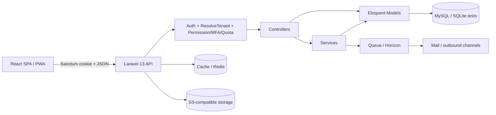

### 4.2 Current frontend

```mermaid
flowchart TD
  main[main.tsx] --> Provider[AppProvider / 1,918-line AppContext]
  Provider --> App[App.tsx manual view + tab router]
  App --> Shell[Header + Sidebar + Command Palette]
  App --> Nav[navigation.ts registry]
  App --> Lazy[Lazy feature pages]
  Lazy --> Ctx[Context collections/mutations]
  Lazy --> Client[apiClient fetch wrapper]
  Client --> API[/api/v1]
  SW[Service worker] --> BrowserCache[Offline/static cache]
```

### 4.3 Current backend

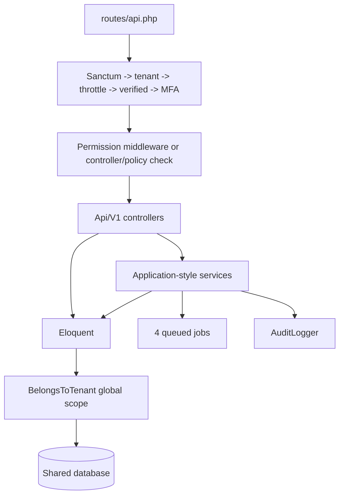

### 4.4 Current tenant architecture

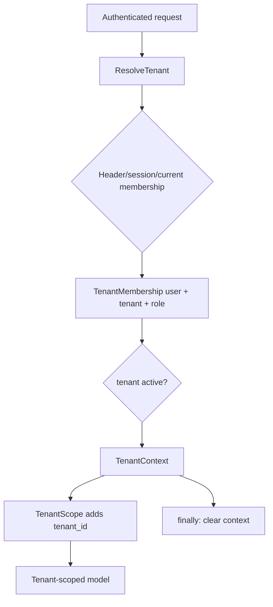

### 4.5 Current identity and RBAC

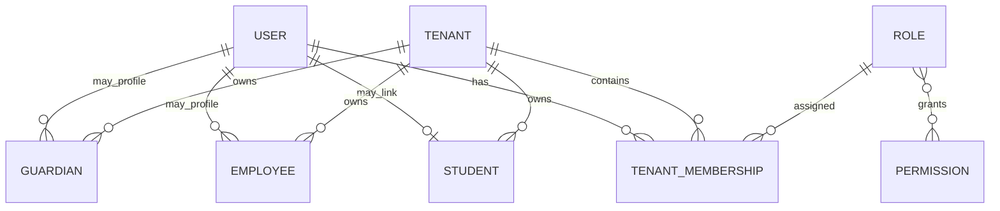

`users` is global; membership supplies tenant/workspace/role. A user can have multiple memberships. Personal workspaces are represented through provisioned individual tenancy/membership rather than a separate identity system. Students have an optional `user_id`; employees and guardians are tenant profiles with user associations where populated. This is close to the target concept but not consistently enforced for every person subtype.

### 4.6 Current module dependency map

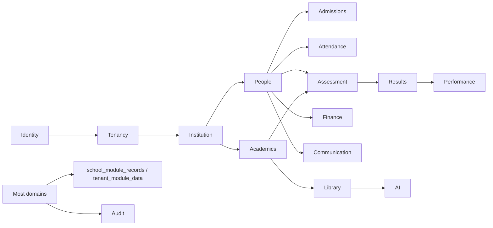

### 4.7 Current role/permission model

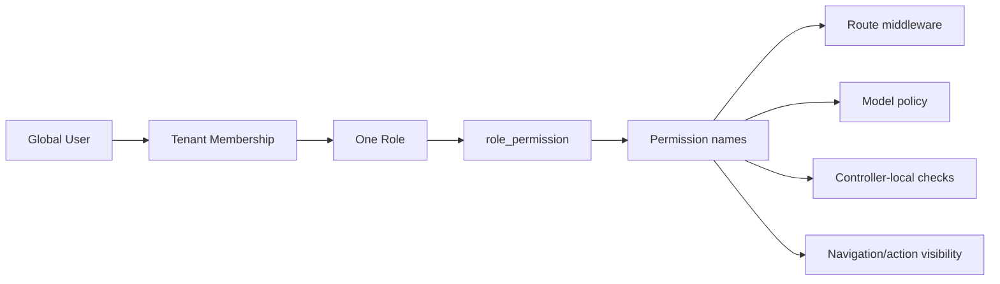

## 5. Capability inventory and traceability matrix

Status vocabulary: **WORKING** means an executable UI/API/data chain plus tests or direct implementation evidence; **PARTIAL** means meaningful implementation with missing depth; **MOCK/HYBRID** means UI can operate from demo/context arrays; **BACKEND ONLY** and **UI ONLY** are literal.

| Capability | Current UI/route | API/service/model/table | Permission / scope | Status | Target owner / future state |
|---|---|---|---|---|---|
| Authentication, reset, email verify, Google OAuth | Public auth views; `/`, `/reset-password`, `/verify-email` | `/auth/*`; Auth/Google controllers; `User`; `users`, tokens | Public/self; global identity | WORKING | Identity; KEEP+CLEAN |
| Workspace discovery/switch | Workspace modal; app shell | `/auth/contexts`, `/memberships`, `/switch-workspace`; PersonalWorkspaceProvisioner | Membership-bound; tenant context | WORKING | Identity/Tenancy; KEEP |
| Tenant registration/public welcome/login | school/public views; `/s|school|t/{slug}` | registration/public/auth endpoints; `Tenant`, membership | Public then membership | WORKING | Tenant/Portal; KEEP+CLEAN |
| Platform console | PlatformOwnerDashboard; `home` and platform nav IDs | `/platform/*`; PlatformController/PlatformOpsController | `platform.view`; global bypasses | PARTIAL | Platform Operations; REFACTOR large controllers |
| Tenant/campus/session/term/class/subject setup | SchoolStructure/Academics views; registry IDs | `/school-structure/*`, direct resources; models/tables | broad settings/users/students checks; tenant scope | WORKING/PARTIAL | Institution + Academics; CONSOLIDATE duplicate endpoints |
| Membership/invitations/administrators | Administrators/Invitations views | `/school/memberships`, `/invites`; membership/invitation | users/roles manage; tenant scope | WORKING | IAM; KEEP+CLEAN |
| Roles and permissions | navigation/actions and admin views | seeded roles/permissions; middleware/policies | 14 roles, 42 permissions | WORKING/PARTIAL | IAM; stop role collapsing |
| Student registry/profile/enrolment | registry/profile/wizard; `students`, admissions entry | `/students*`; StudentEnrolmentService etc.; student/guardian/enrollment tables | student permissions; tenant policies | WORKING | People/Admissions; KEEP+CLEAN |
| Student medical/documents | profile modal/pages | `/students/{id}/medical|documents`; dedicated controllers/models | medical permissions/policy; tenant scope | WORKING | Student Services; KEEP |
| Guardians/parents | ParentsView and parent dashboard | `/guardians`, `/parent/children`; Guardian/Parent controllers | students/results permissions; tenant + relationship auth | PARTIAL | People; canonical person linkage needed |
| Employees/staff/teachers | StaffManagement; `people`, `teachers`, `staff` | `/employees`, departments, teacher assignments | `users.manage`; tenant profiles | PARTIAL | Workforce; separate employment from IAM |
| Admissions workflow | AdmissionsView tabs | generic `/school-modules/admissions-*`; SchoolModuleRecord | `admissions.manage`; tenant scope | PARTIAL/GENERIC | Admissions; MIGRATE to typed aggregate/workflow |
| Timetable/curriculum/lesson notes/schemes | Academics views | `tenant_module_data`, school-module records, lesson plans | settings/learning permissions; tenant scope | PARTIAL/HYBRID | Academics; CONSOLIDATE and type |
| Assessments/question bank/marks | AssessmentWorkspace; assessment tabs | `/assessments`, scores, AI assessment; Assessment services/models/tables | assessment/scores permissions; policies + tenant | WORKING core, PARTIAL breadth | Assessment; KEEP+CLEAN |
| CBT quizzes/attempts | CBTQuizModuleView | `/cbt/quizzes*`; CbtController/models | create middleware; attempt is tenant-auth only | PARTIAL | Assessment; add candidate eligibility policy |
| Smartmark scanning | SmartMarkScanner | `/smartmark/*`; SmartmarkOcrService/job/models | scores/edit/view; tenant | PARTIAL | Assessment; KEEP+CLEAN |
| Result generation/approval/publish/PIN checker | Results views/public checker | `/results*`, public result endpoints; ResultWorkflow/Pin/Report services | result permissions; tenant/public PIN | WORKING | Performance/Results; KEEP+CLEAN |
| Performance views | PerformanceView | `/performance/{view}`; PerformanceService | any of 3 broad permissions; tenant | PARTIAL read model | Performance; define view-specific policy |
| Attendance | AttendanceView | `/attendance/classes*`; policy, records | attendance view/create; tenant | WORKING core | Attendance; KEEP+CLEAN |
| Finance/payments/fee UI | FeeStructureBillingView | `/payments`; PaymentController/model plus context data | finance permissions; tenant | PARTIAL/HYBRID | Finance; REBUILD typed ledger incrementally |
| Communication/messages/announcements | Messages/Broadcast views | `/messages`, `/announcements`, deliveries/job | broad students/settings permissions on legacy routes | PARTIAL | Communication; normalize permission use |
| Library/resources/annotations/assignments/progress | LearningResourcesView | extensive `/library/*`; services/models | granular library permissions; tenant/public paths | WORKING | Learning Resources; KEEP+CLEAN |
| AI lesson/quiz/assistant | lesson planner, buddy, library tools | `/ai/*`, library tools; AI quota/idempotency | ai/assessment permissions; quotas | PARTIAL | AI shared service; central policy/telemetry |
| Reports/exports | ReportsCentre/result cards | `/reports*`, library exports; queued jobs | reports/library export; tenant | WORKING/PARTIAL | Reporting; shared job/export service |
| Forms/custom fields | FormsSettings + dynamic renderer | `/forms*`, `/custom-fields*`; FormEngineService; form tables | settings configure; tenant data in global definitions | WORKING emerging | Form service; KEEP+CLEAN, retire legacy API |
| Help/support | HelpSupportView | `/help/tickets`; SchoolModuleRecord | authenticated owner; tenant | WORKING basic | Support; migrate from generic records |
| Audit logs | AuditLogsView | `/audit-logs`; AuditLogger/AuditLog | audit.view; explicit tenant filter | WORKING | Audit shared service; KEEP |
| Subscription/plans | SubscriptionView | `/plans`, `/subscription`, platform plans/invoices | account-module + platform permission | PARTIAL | Billing; distinguish platform billing from school finance |
| Operations/student services/workforce | SchoolModuleView | generic school-module endpoints | catalog-defined permissions; tenant | PARTIAL/GENERIC | Corresponding domains; MIGRATE one-by-one |
| Personal plan | dashboard/workspace state | `/personal/plans`; PersonalPlanItem | personal membership | WORKING basic | Personal Space; KEEP+CLEAN |
| Skuggle Relate | navigation/product references only | no bounded backend/API/data model found | none | NOT FOUND | Community; defer until IAM/event foundations |
| Public tenant portal | welcome/login/results and public library paths | public tenant/config/result/library endpoints | public constraints | PARTIAL | Public Portal; KEEP+CLEAN |

This table is the required major-capability traceability matrix. The authoritative endpoint-level inventory is the executable declaration in `backend/routes/api.php`; `php artisan route:list --json` resolved 264 routes with middleware/action chains. No route was inferred from controller filenames.

## 6. Route and API map

### Frontend routes

The actual route grammar is:

| Route | Resolver/layout | Status |
|---|---|---|
| `/` | PublicLanding or restored authenticated app | WORKING, state-dependent |
| `/reset-password` | ResetPasswordPage | WORKING |
| `/verify-email?status=...` | VerificationStatusPage | WORKING |
| `/s/{slug}`, `/school/{slug}`, `/t/{slug}` | TenantWelcome/Auth public context | WORKING aliases |
| `[tenant-prefix]/app` | role-specific dashboard in app shell | WORKING |
| `[tenant-prefix]/app/{navigation-id}` | `navigation.ts` -> `App.tsx` switch -> lazy page | WORKING when registered |
| unknown `/app/{id}` | silently resolves to `home` | BROKEN observability/404 semantics |

There is no route-object list with explicit layouts, loaders or guards. Required role/workspace/permission is data in `navigation.ts`/`sidebarNav.ts`, then rechecked by APIs. `App.tsx:314-382` maps view identifiers; aliases can intentionally reach the same component (people/staff/teachers, platform/health/schools/governance). Navigation IDs should be considered application routes even though they are not React Router routes.

### API groups

| Group | Representative endpoints | Controller(s) | Frontend consumers/status |
|---|---|---|---|
| Auth/public | `/auth/*`, `/public/*`, `/contact` | Auth, Registration, GoogleAuth, PublicResult | Public pages/App bootstrap; ACTIVE |
| Institution | campuses/sessions/classes/subjects and `/school-structure/{resource}` | direct resource controllers + SchoolStructure | School/Academics; DUPLICATED API surface |
| People | `/students*`, guardians, employees, departments, memberships/invites | Student family controllers | People/Admin views; ACTIVE |
| Learning | assessments, CBT, Smartmark, results, performance | corresponding controllers | feature views; ACTIVE |
| Library/AI | `/library/*`, `/ai/*` | Library/Ai controllers | library/teacher features; ACTIVE |
| Operations | attendance, payments, reports, messages, announcements | corresponding controllers | feature/context; ACTIVE/PARTIAL |
| Generic modules | `/school-modules/{module}`, `/module-data/{module}` | SchoolModuleRecord, ModuleData | many thin modules; TRANSITIONAL |
| Platform | `/platform/*` | Platform, PlatformOps | PlatformOwnerDashboard; ACTIVE/PARTIAL |

Confirmed inconsistencies:

- `POST /api/ai/lesson-plan` is a legacy alias of `/api/v1/ai/lesson-plan` (`backend/routes/api.php`).
- Direct campuses/classes/subjects/sessions endpoints overlap `/school-structure/{resource}`.
- `/custom-fields/{entity}` overlaps the newer `/forms/{formKey}` engine; tests explicitly preserve the legacy API.
- Route-level absence of `permission:*` does not always mean unprotected: generic school modules and structure perform controller-local permission checks. This fragmentation is itself a maintainability risk.
- `SchoolStructureController` delegates writes to other controllers and extracts JSON response payloads, coupling HTTP controllers (`store` match branches).
- OpenAPI exists (`docs/openapi.v1.yaml`) but executable route count and recent untracked endpoints require a drift check before treating it as authoritative.

## 7. Multitenancy assessment

### Confirmed request lifecycle

`ResolveTenant` obtains the authenticated user, resolves the requested/current membership, verifies that membership belongs to the user and that the tenant is active, places tenant and membership on request attributes, sets `TenantContext`, and clears it in `finally`. `BelongsToTenant` installs `TenantScope`, auto-fills `tenant_id` on create, rejects creation without context, and prevents tenant ID mass override. Tests prove fail-closed no-context behavior, scoped count/delete/find/public-ID access, inactive/no-membership rejection, cleanup after exceptions, and cross-tenant student isolation.

### Tenancy concepts

The canonical boundary is `tenant_id`. `campus_id`, `academic_session_id`, and `term_id` are subordinate operational scopes, not competing tenancy keys. Searches found no parallel `school_id`, `organisation_id`, `organization_id`, `institution_id`, or `branch_id` tenancy architecture. Personal workspaces use tenant/membership infrastructure. A user can belong to multiple tenants.

### Tenant leakage/risk register

| Severity | Evidence | Finding / potential exposure | Future remediation |
|---|---|---|---|
| P0 | `SchoolStructureController.php:354-360` | `User::query()->where(public_id...)` is global during teacher assignment. Class/session/subject are scoped, but the selected user is not proven to be a member of the active tenant; cross-tenant identity association is possible if a public ID is known. | Require active tenant membership and eligible workforce profile; add adversarial test. |
| P1 | `PlatformController.php:526-527` and registered global-scope bypasses | Platform counts intentionally use global raw queries. Correct authorization depends entirely on outer `platform.view`. | Keep explicit platform boundary; policy-test every method and log global reads. |
| P1 | `AuditLogger.php:24`, `PaymentController.php:81`, public library controllers | Intentional `withoutGlobalScopes()` calls expand blast radius if surrounding predicates regress. | Centralize audited bypass API; require tenant/public predicate and static rule. |
| P1 | queued jobs in `backend/app/Jobs` | Smartmark carries tenant ID; other report/export jobs are primarily record-ID driven. Tenant context restoration is not represented by a common job envelope. | Introduce tenant-aware job middleware; assert tenant ID and restore/clear context for every tenant job. |
| P1 | raw `DB::table` calls in Dashboard/Library/Auth | Raw builder bypasses Eloquent global scope. Some calls explicitly constrain tenant, but assurance is manual. | TenantQuery helper/static lint; test each raw report/search/export path. |
| P2 | cache/lookups and service-worker | Backend lookup tests prove tenant-aware keys for covered catalogs; browser PWA caching must never cache authenticated API responses. | Keep API network-only; add cache-policy test. |
| P2 | storage/download controllers | Signed/private storage support exists; authorization is controller/policy specific. | Standard tenant media service and download policy suite. |

**Conclusion:** multitenancy is **implemented and materially tested**, not merely suggested by columns. It is still shared-schema defense-in-depth, so all raw queries, global models, jobs, storage and public access paths must be governed as exceptions.

## 8. Identity, roles and permissions

### Actual roles

Seeder-defined roles are: `platform_super_admin`, `proprietor`, `director`, `principal`, `head_teacher`, `school_super_admin`, `school_admin`, `admission_officer`, `examination_officer`, `bursar`, `teacher`, `parent`, and `student`. A legacy `admin` alias remains in `SchoolRoles`. The UI exposes Super Admin, School Admin, Principal, Teacher, Parent, Student, Platform Owner and Bursar; examination/admission officers are mapped to School Admin (`src/lib/roles.ts:15-16`). This loses role identity in dashboards/navigation even though backend permissions differ.

There are 42 seeded permissions covering platform/tenant/users/settings/students/medical/attendance/assessment/scores/results/reports/finance/library/AI/roles/security/audit/admissions/communication/operations/services/learning (`ReferenceAccessSeeder.php:14-26`).

### RBAC matrix (actual seeded grants, compact)

Legend: V=view, C=create/write, A=approve/publish, M=manage, E=export/insights.

| Role | Platform | IAM/settings | Students | Attendance | Assessment/results | Finance | Library/AI | Other domain grants | Scope |
|---|---|---|---|---|---|---|---|---|---|
| platform_super_admin | V+tenant M | all | all | all | all | all | all | all | Platform/global + memberships |
| school_super_admin | — | users/settings/roles/security/audit | all | V/C/A | all | V/M | all | admissions/communication/ops/services/learning | Tenant |
| proprietor | — | all tenant | all | all | all | all | all | all tenant | Tenant |
| director | — | — | V | V | V/results A/reports E | V | library V/E | — | Tenant |
| principal | — | — | V | V/A | V/scores A/results A/publish/reports E | V | library V/E | services/communication | Tenant |
| head_teacher | — | — | V | V/A | V/scores A/results approve/reports V | — | library V/E | — | Tenant |
| school_admin | — | users M | V/C/edit/import/medical | V/C | V/C/scores edit/results V/reports V | V | V/C/annotate/assign | admissions/communication/ops/services/learning | Tenant |
| admission_officer | — | — | V/C/edit/import/medical | — | reports V | — | — | admissions M | Tenant |
| examination_officer | — | — | V | — | V/C/scores edit+approve/results approve+publish/reports E | — | — | — | Tenant |
| bursar | — | — | V | — | reports E | V/M | — | — | Tenant |
| teacher | — | — | V | V/C | V/C/scores edit/results V | — | library all + AI | learning/communication | Tenant |
| parent | — | — | — | — | results V | — | library V | relationship-limited in controller | Tenant |
| student | — | — | — | — | assessments/results V | — | library V | — | Tenant |

Gaps: roles are global reference records rather than tenant-custom roles; membership supports one `role_id`, so multiple simultaneous roles in one tenant are not modeled; permission names are inconsistent (`assessments.view` plural vs `assessment.create` singular); several generic routes enforce permissions inside controllers; and broad grants such as `students.view` gate announcements/messages/classes. Frontend hiding is correctly secondary but role collapsing causes wrong UX. Unused permission determination remains **PARTIAL EVIDENCE** because dynamic catalog references prevent reliable grep-only classification.

## 9. Data and domain ownership

| Entity/table(s) | Primary owner | Tenant | Campus | Session/term | Global/personal | PII | Audited |
|---|---|---|---|---|---|---|---|
| User / `users` | Identity | No | No | No | Global | Yes | security events/partial |
| Membership / `tenant_memberships` | IAM/Tenancy | Yes by FK | No | No | both | Yes | partial |
| Tenant / `tenants` | Tenant Management | root | No | No | Global registry | Yes | Yes/partial |
| Campus / `campuses` | Institution | Yes | self | No | No | Low | partial |
| Academic session/term | Academics | Yes | not consistently | Yes | No | No | partial |
| Student / `students` | People | Yes | optional/indirect | via enrollment | optional user | High | Yes/partial |
| Guardian / `guardians` | People | Yes | No | No | optional user | High | partial |
| Employee/department/assignment | Workforce | Yes | optional/indirect | assignment session | user link | High | partial |
| Enrollment / `enrollments` | Admissions/Academics | Yes | class indirect | session | No | Yes | status history/partial |
| Class/subject/curriculum | Academics | Yes | mixed | mixed | No | No | partial |
| Assessment/question/score | Assessment | Yes | class indirect | term | No | score PII | workflow audit partial |
| Result/publication/PIN | Performance | Yes | indirect | term | public token | High | workflow service |
| Attendance record/session/device | Attendance | Yes | mixed | term/date | No | High | partial |
| Payment transaction | Finance | Yes | No | No | No | High | partial |
| Library resource family | Learning Resources | Yes, some public | mixed | mixed | public/personal use | annotations PII | events/versions |
| Message/announcement/delivery | Communication | Yes | No | No | No | High | delivery trail |
| Form definitions/fields | Forms platform service | tenant-associated definitions | No | No | templates global | can define PII | version/audit |
| School module record/module data | Temporary migration boundary | Yes | payload-only | payload-only | No | potentially | generic audit/version |
| Platform invoice/support/broadcast/backup/API credential | Platform Operations | global, tenant FK where relevant | No | No | Global | mixed/high | partial |
| Personal plan | Personal Space | personal tenant | No | No | Personal | Yes | no explicit audit |

High-level ERD:

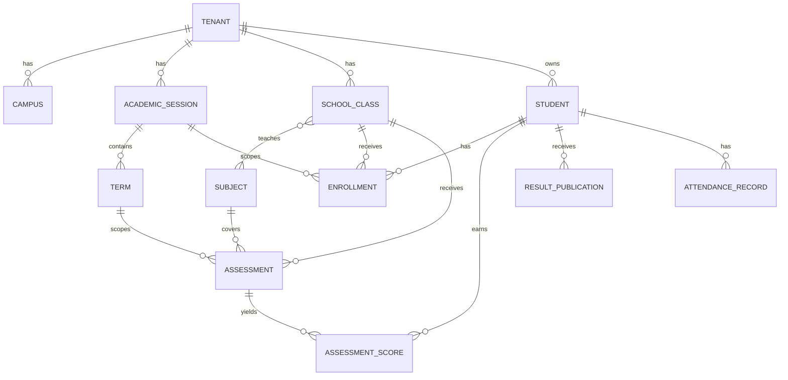

Database forensic priorities are generic JSON weakening constraints, mixed direct-vs-generic representations, optional campus scope, status strings rather than centralized enums, and tables without corresponding models (`assessment_submissions`, curricula/content, grading/marking, attendance sessions/devices, feature flags, notification deliveries, etc.). Those tables are **DATABASE ONLY or raw-query-backed until traced otherwise**, not evidence of working capabilities.

## 10. Duplicate and overlap analysis

| Capability | Implementation A | Implementation B | Classification/conflict | Recommended owner |
|---|---|---|---|---|
| Institution setup | direct campus/session/class/subject controllers | SchoolStructureController generic resource facade | DUPLICATE API SURFACE; controller-to-controller calls | Institution/Academics |
| Custom forms | legacy `/custom-fields/{entity}` | `/forms/{formKey}` + form tables | PARTIAL OVERLAP; tests preserve both | Forms service |
| School feature persistence | typed domain tables | `school_module_records` | DOMAIN BOUNDARY PROBLEM | Each bounded context |
| Timetable/config data | typed classes/subjects | `tenant_module_data` JSON blobs | PARTIAL OVERLAP | Academics |
| People/staff/teachers | same StaffManagement component modes | Employee + User + teacher assignment concepts | NAMING/IDENTITY CONFUSION | Workforce + IAM references |
| Admissions/enrolment | generic admission application records | typed student/enrollment service | PARTIAL OVERLAP | Admissions |
| Assessment/results/performance | assessment scores and workflows | result publications + performance read service | VALID SEPARATION with blurred navigation | Assessment then Performance |
| Finance/subscription | tenant payments/fee UI | SaaS plans/subscriptions/platform invoices | VALID SEPARATION, confusing label | School Finance vs Platform Billing |
| Communication/notifications | domain messages/announcements | Laravel notifications/outbound deliveries | VALID SEPARATION needing shared delivery | Communication + Notification service |
| Reports | central ReportController/jobs | module-specific library/result reports | PARTIAL OVERLAP | Reporting platform service |
| Platform roles | backend platform_super_admin | UI “Platform Owner” alias | NAMING CONFUSION | Platform IAM |

## 11. Forms, workflows, events and shared services

The new form engine is **CONFIRMED and tested**: definitions, sections, placements, field library, conditional rules, sensitivity, permissions, report/download flags, tenant bootstrap, versioning/reset, and dynamic frontend rendering exist. It should remain the shared Form Service. Missing depth includes repeatable groups, jurisdiction packs as versioned products, encryption policy tied to sensitivity, stable schema migration for submitted answers, and broader reuse outside student enrolment.

Workflows are fragmented. Result lifecycle has `ResultWorkflowService`; admissions and many operations use status strings in generic records; assessment state is split across controllers/UI; finance has transaction states. There is no common workflow engine with transition definitions, approver resolution, escalation, rejection/resubmission and immutable history. Build one only after documenting two or three real workflows; do not generalize solely from status columns.

There are four queued jobs (report export, library export, Smartmark processing, outbound delivery), no application Event/Listener directory, Laravel notification classes, and an `outbox_events` table/model. Most domain coordination is direct service/controller invocation. The outbox is infrastructure without a demonstrated end-to-end event dispatcher. Target a tenant-aware domain event/outbox service, beginning with result publication, student admission and payment receipt.

Shared-service disposition:

| Service | Current state | Direction |
|---|---|---|
| Authentication/IAM/Tenant context | substantive | KEEP+CLEAN; formal public contracts |
| Authorization | middleware + policies + local checks | CONSOLIDATE behind capability policies |
| Forms/custom fields | substantive emerging engine + legacy API | KEEP+CLEAN; migrate legacy |
| Workflow | result-specific + status strings | BUILD incrementally from proven workflows |
| Notifications/delivery | Laravel notifications + outbound job/models | CONSOLIDATE channel policy/templates/preferences |
| Documents/media | signed storage + several upload flows | CONSOLIDATE tenant media service |
| Search | module-local query/search | BUILD shared contract only when cross-domain search is required |
| Audit | AuditLogger + security/domain records | KEEP+CLEAN; enforce coverage/schema |
| Reporting/export | domain reports + repeated jobs/PDF/XLS helpers | CONSOLIDATE job lifecycle and authorization |
| AI | several controller/service entry points | CONSOLIDATE quotas, safety, prompt/version telemetry |
| Payments | basic transaction model | Finance-owned adapter boundary |
| Feature flags | table/config exists, limited consumption evidence | PARTIAL; define evaluation service |

## 12. Security findings

1. **P0 — HIGH CONFIDENCE: cross-tenant user association risk.** `SchoolStructureController.php:354` queries global users by public ID when creating teacher assignments without verifying active-tenant membership. This is an IDOR-style integrity issue even though dependent academic objects are scoped.
2. **P1 — CONFIRMED: authorization is structurally fragmented.** Route middleware, policies, controller-local permission arrays and relationship checks all coexist. Correctness cannot be audited from routes alone.
3. **P1 — HIGH CONFIDENCE: IDOR coverage is narrow.** Student cross-tenant access is well tested; equivalent adversarial tests are not present for every assessment, result, payment, report download, library assignment, employee, invitation, module record and platform object.
4. **P1 — CONFIRMED: broad capability reuse.** Messages/announcements/classes sometimes use `students.view` or settings permissions rather than domain permissions, creating unintended coupling.
5. **P1 — CONFIRMED: global-scope bypass and raw SQL are privileged escape hatches.** A checked audit register/test exists, but query correctness remains predicate-dependent.
6. **P2 — CONFIRMED: hard-coded diagnostic telemetry.** `AppErrorBoundary.tsx:30` and `SchoolStructureView.tsx:56,82` POST runtime details to `http://127.0.0.1:7364/ingest/...`. Remove before production release; browser localhost is not a supported telemetry boundary and may disclose local runtime metadata to a process on the user's machine.
7. **P2 — CONFIRMED: privileged MFA is optional unless tenant policy enables it.** Tests prove the default. Platform and school super-admin production policy should be mandatory or risk-accepted.
8. **Positive controls:** password hashing/config, CSRF/Sanctum, CORS config, email verification, throttling, security headers, request IDs, idempotency, upload MIME/magic-byte and optional ClamAV scanning, private storage enforcement, secret/env tests, and production demo-seed guard are implemented.

No SQL injection was confirmed; query builder/raw statements observed use bindings or static SQL. No claim of complete XSS safety is made. React escaping helps, but stored rich content and document rendering need dedicated testing.

## 13. Performance and scalability findings

- `AppContext.tsx:1120-1170` performs a broad parallel bootstrap. Parallelism avoids a waterfall, but every user pays for many domain collections and context rerenders; move to route/domain query caches.
- Client tables often paginate already-loaded arrays (`DataTable.tsx`); large domains need server pagination consistently.
- Platform controller performs global aggregate counts and is 627 lines; dashboard snapshots exist and should own heavy aggregates.
- SchoolStructure uses eager loading for terms/enrollments/assignments, reducing obvious N+1s; controllers should be profiled rather than presumed safe.
- Database performance migrations add composite indexes for students, library, attendance, assessments, AI, results, audit, outbox and tokens. This is a strong baseline, not proof for all query plans.
- Four long-running categories are queued, but AI endpoints and some report/document work remain synchronous.
- Frontend code splitting is explicit, but `AcademicAndTeacherAnalytics.tsx` (2,066 lines), `PublicLanding.tsx` (1,335), `AssessmentsView.tsx` (1,149) and the global context remain parse/render/maintenance hotspots.
- No load-test evidence supports a concurrency or user-count claim.

## 14. UX and information architecture

The experience feels fragmented because URL route, module, view, section, tab and component state are separate concepts. A sidebar item resolves through `navigation.ts`, is remapped in `App.tsx`, and many destination components maintain internal tabs. Aliases lead to the same component under different labels. People/staff/teachers, assessment/results/performance, school/academics, and finance/subscription present boundary ambiguity. Unknown routes silently show Home. Role mappings also collapse specialist officers into School Admin, producing navigation that may not reflect their actual job.

Keep the global header for workspace/search/notifications/profile; sidebar for domains and primary capabilities; breadcrumb for hierarchy; page header for title/primary actions; context tabs only for sibling views of the same aggregate. Remove module-level navigation duplicated inside a page as each domain migrates.

## 15. Testing, mocks and code quality forensics

### Coverage map

Backend coverage is strongest for tenancy, authentication, production config, deployment, student enrolment, form settings, personal workspace, result PIN publication and infrastructure. It is weak or absent for frontend components/hooks, complete RBAC permutations, every IDOR surface, finance accounting rules, communication delivery failure/retry, assessment moderation, platform support/invoices/backups, accessibility and browser workspace navigation. The frontend has one Playwright public-flow file and no substantive Vitest suite found.

### Demo/mock classification

| Evidence | Classification |
|---|---|
| `DemoUsersSeeder`, `DemoTenantDataSeeder` guarded by `SEED_DEMO_TENANT` in production | SAFE DEMO SEED with explicit production opt-in |
| large initial arrays and `demoMode` branches in `AppContext.tsx` | DEVELOPMENT MOCK / PRODUCTION RISK if demo mode is reachable unintentionally |
| dashboards combining API snapshots and context fallbacks | HYBRID; label fallback/demo data clearly |
| hard-coded localhost ingest calls | PRODUCTION RISK |
| tables/models with no route/service consumer | DATABASE ONLY, not capability proof |

### Code-quality findings

- God coordinator: `AppContext.tsx` 1,918 lines.
- God UI: `AcademicAndTeacherAnalytics.tsx` 2,066; `PublicLanding.tsx` 1,335; legacy `AssessmentsView.tsx` 1,149.
- Oversized backend: `FormEngineService.php` 779; `PlatformController.php` 627; `PlatformOpsController.php` 502; `SchoolStructureController.php` 432.
- Controller-to-controller invocation in SchoolStructure is an application-boundary violation.
- Magic string statuses and role names occur across frontend/backend; permission naming is inconsistent.
- Frontend/backend contract mapping is hand-written in the global context rather than generated/typed from OpenAPI.
- `tenant_module_data` and `school_module_records` concentrate unrelated domain payloads.

## 16. Gap and priority matrix

| ID | Severity | Domain | Current -> enterprise expectation | Impact / direction | Dependencies |
|---|---|---|---|---|---|
| TEN-01 | P0 | Workforce/Tenancy | global user lookup -> tenant membership eligibility | cross-tenant association; enforce membership + test | IAM |
| SEC-01 | P0 | Release | localhost diagnostic POSTs -> approved telemetry only | local data disclosure/noise; remove via controlled change | release gate |
| IAM-01 | P1 | Authorization | mixed enforcement -> policy/capability boundary | audit gaps; consolidate and adversarial-test | tenant context |
| JOB-01 | P1 | Infrastructure | ad hoc job context -> tenant-aware job envelope | wrong-tenant background work | tenancy |
| DOM-01 | P1 | Core domains | generic JSON records -> typed aggregates | integrity/reporting constraints | ownership map |
| IAM-02 | P1 | Identity | one role + UI collapsing -> membership role assignments/capabilities | inaccurate UX/custom roles | IAM migration |
| API-01 | P1 | API | duplicate/facade endpoints -> one application use case | drift and inconsistent validation | domain services |
| DB-01 | P1 | Data | inconsistent campus/period constraints -> explicit scope rules | ambiguous reporting/data quality | domain model |
| UI-01 | P2 | Frontend | god context/manual router -> workspace/domain routes and query cache | coupling, overfetching | API contracts |
| IA-01 | P2 | Product | overlapping modules/tabs -> domain/capability hierarchy | fragmented experience | domain map |
| FIN-01 | P2 | Finance | fee UI/basic payments -> ledger/invoice/allocation domain | unreliable enterprise finance | people/session refs |
| WF-01 | P3 | Shared | status strings -> reusable proven workflow primitives | duplicated approvals | domain workflows |
| EVT-01 | P3 | Shared | direct calls/outbox shell -> domain events/outbox processor | tight coupling | job tenancy |
| TEST-01 | P3 | QA | backend-heavy tests -> contract/frontend/E2E/RBAC matrix | regression exposure | stable boundaries |
| PERF-01 | P4 | Performance | bootstrap/all-state -> route-local cached queries | payload/render cost | frontend split |

## 17. Target architecture

### 17.1 Platform and workspaces

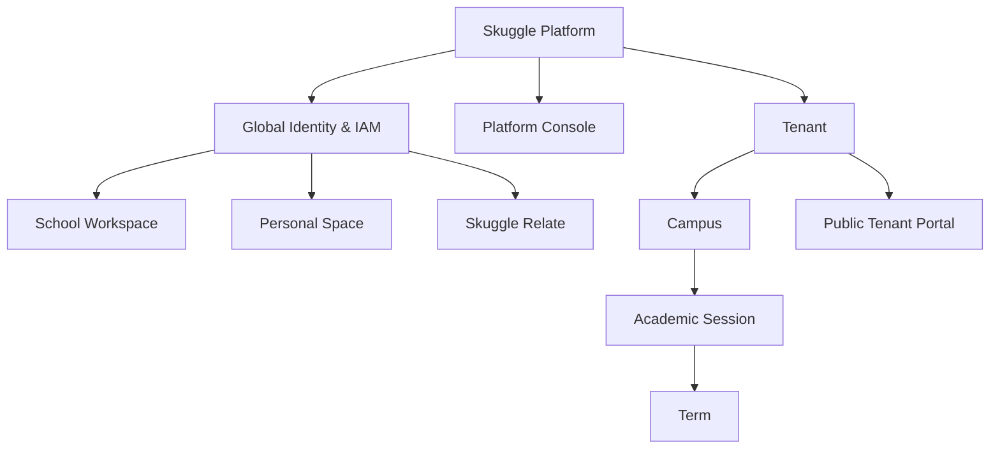

### 17.2 Target tenant and identity

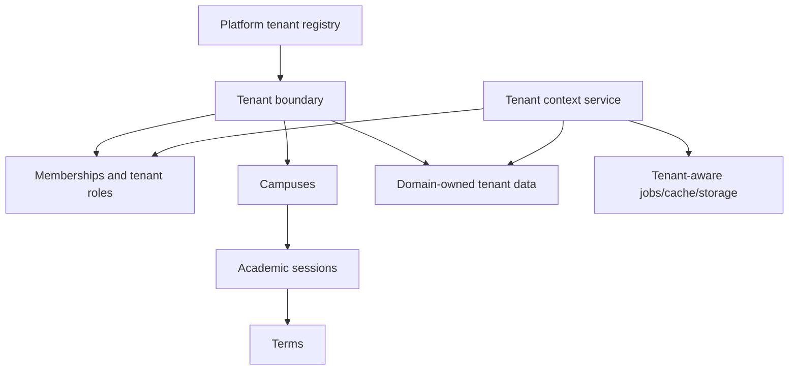

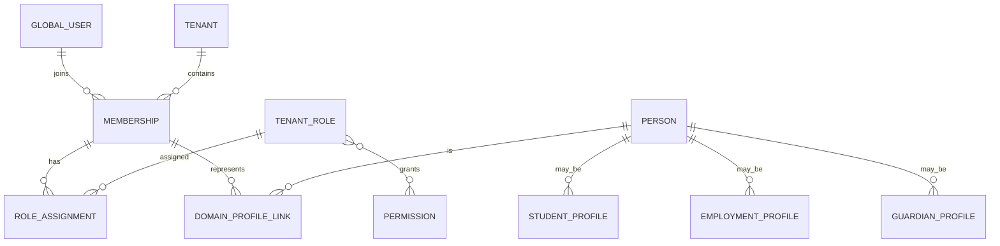

Global identity authenticates; a tenant membership authorizes presence; multiple role assignments grant capabilities; domain profiles carry school-specific facts. A teacher in two schools has one user/person and two memberships/employment profiles. Parent/teacher overlap is additive. Personal Space is a workspace entitlement, not a duplicated user.

### 17.3 Target bounded contexts

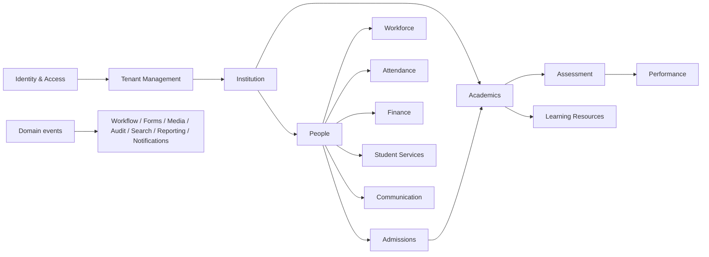

Primary owners: Identity owns User; People owns Person/Student/Guardian identity profile; Workforce owns Employment; Admissions owns Application/Admission decision; Academics owns Class/Subject/Curriculum/Enrollment-in-period; Assessment owns Assessment/Question/Score; Performance owns Result publication/analytics; Attendance owns attendance records; Finance owns Invoice/Charge/Payment/Allocation; Learning owns resources; Communication owns messages/campaigns.

### 17.4 Target shared services

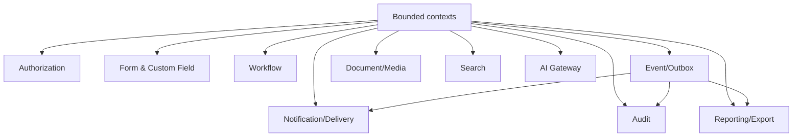

### 17.5 Target navigation

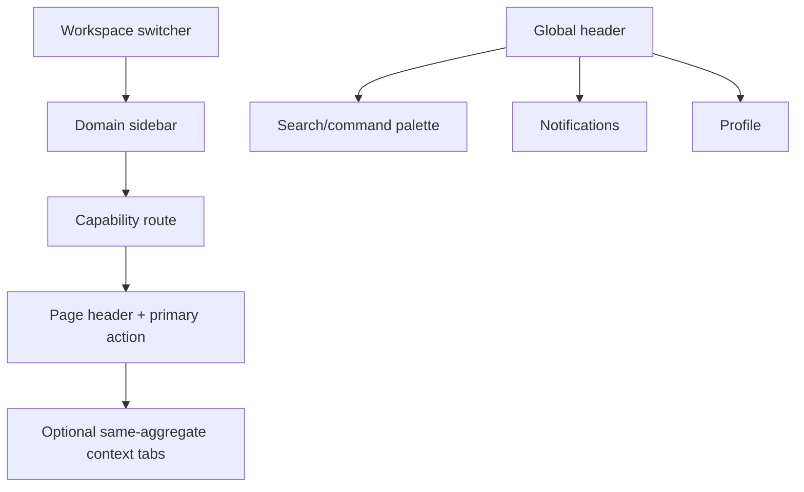

Recommended school IA: Home; People (Students, Guardians); Admissions; Teaching & Learning (Academics, Assessment, Performance, Learning Resources); School Operations (Attendance, Finance, Student Services, Workforce, Operations); Engagement (Communication, Calendar); Insights (Analytics, Reports); Administration (School Setup, Users & Access, Roles, Forms, Workflows, Integrations, Settings, Subscription). Platform billing stays out of school Finance.

### 17.6 Target request lifecycle

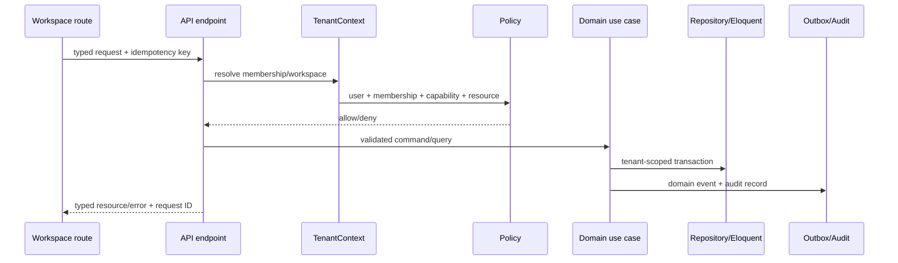

### Backend structure

Adopt domain boundaries incrementally, not a ceremonial rewrite:

```text
app/
  Domain/{Identity,Tenancy,People,Admissions,Academics,Assessment,...}
  Application/{Commands,Queries,DTOs}
  Infrastructure/{Persistence,Queue,Storage,Integrations}
  Shared/{Authorization,Forms,Workflow,Audit,Reporting}
  Http/Api/V1
```

Move code only when a use case changes. Existing Eloquent models can remain while ownership and service boundaries are introduced.

### Frontend structure

```text
src/
  app/{router,providers,shell}
  workspaces/{platform,school,personal,relate,public}
  domains/{people,admissions,academics,assessment,...}
  shared/{ui,forms,api,auth,permissions,errors}
```

Use a real declarative router, route-level guards, a server-state query library, generated API types, and domain-local state. Keep the current design primitives and lazy chunks while extracting slices from `AppContext`.

## 18. Migration strategy

| Wave | Outcome | Domains/actions |
|---:|---|---|
| 0 | Close release/security risks | TEN-01, diagnostic calls, IDOR matrix, mandatory privileged MFA decision, backup/restore evidence |
| 1 | Harden foundations | tenant-aware jobs/raw-query policy; capability policy service; membership multi-role design; contract inventory |
| 2 | Establish shell without redesign | declarative routes, workspace guards, 404s, query cache; preserve visual system |
| 3 | Canonical People/Workforce | Person/profile links, employee/teacher membership integrity, guardian linkage |
| 4 | Admissions | replace generic admission records with application/decision/workflow; handoff to enrollment |
| 5 | Institution/Academics | consolidate duplicate APIs; canonical campus/session/term/class/subject/enrollment ownership |
| 6 | Assessment/Performance | keep working core; unify question/CBT/Smartmark/moderation/publication contracts |
| 7 | Attendance/Student Services/Operations | migrate generic records into typed domains based on usage |
| 8 | Finance | introduce ledger, invoice/charge/allocation/payment; migrate fee UI |
| 9 | Communication/Learning | shared delivery preferences and tenant-aware jobs; preserve mature library |
| 10 | Reporting/intelligence | shared read models/exports, snapshots, row-level authorization |
| 11 | Shared workflow/forms/media/search/audit | consolidate only after domain use cases prove extension points |
| 12 | Personal Space | expand entitlements/profile-aware experiences |
| 13 | Platform Console | split Platform controllers and formal global-query boundary |
| 14 | Skuggle Relate | build community only on stable identity/privacy/event foundations |

Domain disposition: **KEEP** deployment/health, global user + membership basis, tenant scope, audit/request IDs; **KEEP+CLEAN** auth, enrolment, assessment core, results, library, attendance, form engine; **REFACTOR** platform controllers, global context, navigation/router, permission enforcement; **CONSOLIDATE** institution APIs, custom-fields/forms, notifications, reports/exports, AI; **MIGRATE** generic school modules and module data; **REBUILD incrementally** Finance and typed Admissions workflow; **DEPRECATE** legacy `/api` aliases, legacy admin alias, old custom-fields API after consumers migrate; **DELETE only after telemetry proves unused** orphan tables/routes/components. No deletion is authorized by this audit.

## 19. Final decision matrix

| Area | Current state | Problem | Target state | Migration action | Priority |
|---|---|---|---|---|---|
| Tenancy | tested global scope/middleware | raw/jobs/global exceptions | governed tenant context everywhere | harden | P0/P1 |
| Identity | global user + memberships | inconsistent profiles | user/person/membership/profile links | evolve | P1 |
| RBAC | seeded role->permissions | one role, UI collapsing, mixed checks | tenant roles + assignments + policies | refactor | P1 |
| Navigation | registry/manual history | overlapping layers, silent fallback | declarative workspace/domain routes | refactor | P2 |
| People | students/guardians/employees | split person concepts | canonical Person profiles | migrate | P1/P2 |
| Admissions | generic records + enrolment | no typed workflow | Application->Decision->Enrollment | rebuild incrementally | P2 |
| Academics | typed core + blobs/facade | duplicate sources | canonical academic aggregates | consolidate | P1/P2 |
| Assessment | substantive core/CBT/scan | fragmented permissions/states | one Assessment context | keep+clean | P1/P2 |
| Performance | results + thin read service | boundary/navigation blur | publication and analytics context | refactor | P2 |
| Attendance | working core | depth/device assurance | owned attendance context | keep+clean | P2 |
| Finance | UI/basic transactions | no enterprise ledger | invoice/charge/payment allocation | rebuild | P2 |
| Student Services | generic records | weak schema/workflow | typed service cases | migrate | P2/P3 |
| Operations | generic records | weak integrity | typed operational contexts | migrate by demand | P2/P3 |
| Communication | messages/announcements/delivery | broad permissions/fragmented channels | comms + notification service | consolidate | P2/P3 |
| Online Learning | library + lesson/AI/CBT | features span contexts | Learning Resources integrations | keep+clean | P2 |
| Reports | several report/export paths | duplication/access risk | shared reporting service/read models | consolidate | P3 |
| Administration | setup/IAM/forms/audit | mixed domain ownership | admin capability hub | reorganize | P2 |
| Subscription | tenant + platform views | confused with Finance | Platform Billing | separate | P2 |
| Personal Space | workspace + personal plans | narrow capability | entitlement-based personal workspace | expand later | P3 |
| Skuggle Relate | not found | no domain/privacy model | Community context | defer/build | P4 |
| Platform Administration | implemented large controllers | global-query blast radius | isolated Platform Ops context | refactor | P1/P3 |
| Forms | new tested engine + legacy | dual APIs | shared schema/version service | keep+consolidate | P3 |
| Workflow | result-specific/generic statuses | duplicated lifecycle logic | proven workflow primitives | build incrementally | P3 |
| Notifications | framework + outbound tables/job | fragmented policy/preferences | shared notification service | consolidate | P3 |
| Search | module-local | no cross-domain contract | permission-aware search | build when needed | P3 |
| Audit | logger/log/security events | incomplete consistency | immutable tenant-aware audit | keep+clean | P1/P3 |
| AI | multiple endpoints/quota | governance fragmented | AI gateway | consolidate | P3 |
| Integrations | Google/storage/mail/outbound | no uniform registry | integration service + credentials | evolve | P3 |

## 20. Final decisions

1. **What Skuggle is:** a shared-schema, multi-workspace modular monolith with a capable SaaS/security foundation and uneven domain implementation.
2. **Most serious problems:** cross-tenant teacher-assignment integrity risk; fragmented authorization; generic JSON domain persistence; incomplete job/raw-query governance; identity-role UI collapse; god frontend context/manual routing.
3. **Remain unchanged for now:** production/deploy controls, tenant fail-closed scope, global user/membership basis, working student/result/library/form capabilities, public-ID convention, audit/request IDs.
4. **Refactor:** authorization enforcement, platform controllers, application shell/router, AppContext, profile linking, performance/read APIs.
5. **Consolidate:** duplicate school-structure endpoints, forms/custom fields, notifications/delivery, reports/exports, AI policy, module navigation.
6. **Rebuild:** Finance ledger and typed Admissions workflow, incrementally behind current UI/API contracts.
7. **Deprecate:** unversioned API aliases, legacy role aliases, generic stores after each owning domain migrates, and unused schema only after measured proof.
8. **Target:** workspace-aware modular monolith with explicit bounded contexts, global identity/membership/multi-role RBAC, tenant-safe application services, events/outbox and shared platform services.
9. **Safest sequence:** security/tenancy/IAM first; shell and contracts second; People/Admissions/Academics; Assessment/Performance; operations/Finance; shared services; Personal/Platform/Relate.
10. **Before visual redesign:** close TEN-01 and debug telemetry; inventory/test every IDOR path; standardize tenant-aware jobs/raw queries; freeze domain ownership and permission vocabulary; establish declarative workspace routes. Visual redesign before those P0/P1 foundations would encode current boundary errors into a new shell.

## Audit limitations and confidence

Major stack, route, model, tenancy, identity, seed-RBAC and test conclusions are **CONFIRMED**. Endpoint safety assessments are **HIGH CONFIDENCE** where source and tests agree, and **PARTIAL EVIDENCE** where only static traces exist. Runtime production configuration, real MySQL query plans, queue worker topology, object-store ACLs, mail/SMS provider behavior, traffic/load characteristics, and deployed OpenAPI drift are **UNVERIFIED** because this audit intentionally made no external or destructive production checks.
