# SKUGGLE IDENTITY, TENANCY, IAM & RBAC ARCHITECTURE

**Document type:** Target architecture decision document — no implementation authorized.  
**Evidence baseline:** `SKUGGLE_ENTERPRISE_ARCHITECTURE_AUDIT.md` and `SKUGGLE_DOMAIN_AND_CAPABILITY_ARCHITECTURE.md`, audit state 2026-09-02 at commit `b30f3e1` including then-present working-tree changes.  
**Repository state:** No application changes were made during this architecture phase. Therefore the audit baseline remains authoritative; target concepts below are explicitly marked logical and do not claim physical tables or implemented behavior.

## 1. Executive Decision Summary

Skuggle's existing global user, tenant membership, database role/permission, tenant resolution, fail-closed model scope, Sanctum/Fortify and workspace switching foundations should be retained. The target evolves them into a zero-trust access model:

> Identity + workspace + active membership + role assignments + capability + resource relationship/scope + data classification/purpose + entitlement + feature flag + business invariant.

It must never reduce to role name plus menu visibility.

The binding decisions are:

1. **User and Person are separate logical concepts.** User authenticates; Person represents a human. They may initially share or reuse existing physical records during migration.
2. **One membership supports multiple RoleAssignments.** Current `role_id` remains a compatibility source until safe cutover.
3. **Permission definitions are platform-global and versioned; tenant role definitions and role assignments are tenant-specific.** Reserved system roles/permissions cannot be manufactured by tenants.
4. **Roles grant candidate capabilities, not resource access.** Domain policies derive teacher, guardian, student and ownership scopes.
5. **Platform Super Admin uses a platform principal/context, not an ordinary school membership.** School access requires a visible, justified, time-limited support session.
6. **Personal Space remains on the current personal-tenancy mechanism initially.** Hide that implementation behind `Workspace` contracts, then reevaluate after school IAM migration.
7. **Custom tenant roles are supported.** Schools clone templates or create roles from delegable permissions; they cannot assign platform or reserved governance capabilities.
8. **MFA is mandatory for platform-critical identities and School Super Admin; step-up applies to sensitive/privileged actions.**
9. **Entitlement, feature flag, configuration and authorization remain distinct gates.**
10. **Migration is incremental and observable:** shadow new decisions beside legacy checks, establish parity, enforce new policies, then retire aliases/checks.

## 2. Current Architecture

### Confirmed current model

- `users` is a global authentication identity table.
- `tenant_memberships` joins user, tenant and one `role_id`.
- roles, permissions and `role_permission` are database-backed.
- `ResolveTenant` resolves membership/tenant, rejects inactive/no-membership access, sets request attributes and `TenantContext`, and clears it in `finally`.
- `BelongsToTenant` and `TenantScope` fail closed, auto-fill tenant ID and prohibit tenant override for covered models.
- authorization is fragmented across permission middleware, policies, controllers and relationship checks.
- Sanctum/Fortify, CSRF, sessions, email verification, OAuth, optional privileged MFA, invitations, Personal Space provisioning and workspace switching exist.
- specialist backend roles are sometimes collapsed to School Admin in frontend mapping; platform roles map to “Platform Owner.”
- the current role vocabulary includes platform super admin, proprietor, director, principal, head teacher, school super admin, school admin, admission officer, examination officer, bursar, teacher, parent and student.
- current seeded permissions are inconsistent (`assessments.view` versus `assessment.create`) and sometimes borrowed across domains.

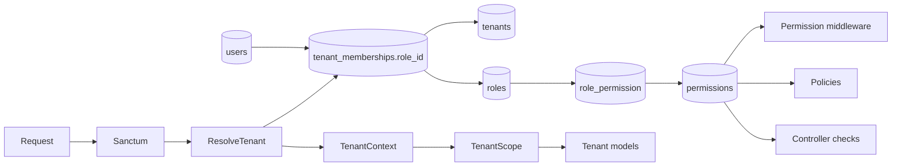

### Current defects carried into migration

- one role per membership cannot express Teacher + Parent + HOD cleanly;
- role aliases distort persona/navigation;
- the teacher-assignment path can select a global user without proving active-tenant membership;
- parent safety depends on relationship checks in addition to broad `results.view`;
- tenant context in raw queries, global-scope bypasses, jobs, cache and storage is not governed by one contract;
- IDOR/BOLA tests are strong for students but incomplete across all resource types.

## 3. Identity Principles

1. One human should normally have one Person and at most one active User login identity.
2. A User may participate in many workspaces without account duplication.
3. A Person may exist without a User; a User can be linked to a Person after verification/review.
4. School-specific attributes never belong on global User unless authentication technically requires them.
5. Membership proves participation, not employment, guardianship, studentship or job title.
6. Role labels are administrative groupings and personas; permission/capability keys drive authorization.
7. Permission is necessary but insufficient: resource scope, privacy, entitlement and domain state also apply.
8. Deny by default; absent context, assignment, relationship or proof produces no access.
9. Cross-tenant/global access is exceptional, purpose-bound and auditable.
10. Identity lifecycle events do not cascade blindly across tenants or Personal Space.

## 4. Global User Architecture

**User owns:** immutable public `UserId`; normalized login identifiers; verified email/phone states; password credential hash; OAuth identity links; MFA authenticators/recovery material; sessions; trusted-device assertions if introduced; account state; recovery controls; security events; global preferences that are truly cross-workspace.

**User does not own:** legal/demographic name beyond minimal display/recovery data, DOB, gender/sex, address, school ID, employee number, student number, campus, class, school role, guardian relationship or employment.

| Concern | Decision |
|---|---|
| Identifier | Opaque, stable public ID; internal database ID is not an external contract. |
| Email/phone | Normalized unique login identifiers where verified; change requires re-verification and security event. Shared family contact data belongs to Person/contact records. |
| OAuth | Separate provider identity linked to User; provider email alone must not silently link accounts without verification policy. |
| MFA | Multiple authenticators logically supported; secrets encrypted, never returned after enrollment; recovery events audited. |
| Sessions | User-scoped session inventory with workspace context; revoke one/all; high-risk changes revoke or revalidate sessions. |
| Account states | PENDING_VERIFICATION, ACTIVE, SUSPENDED, RECOVERY_LOCKED, DELETION_PENDING, DELETED/ANONYMIZED as policy permits. |
| Recovery | Verified channels channel plus risk controls; privileged recovery requires stronger proof/support workflow. |
| Deletion | Orchestrated privacy lifecycle; cannot cascade-delete memberships/data in unrelated tenants without retention decisions. |

### Authentication/login lifecycle

```mermaid
sequenceDiagram
  participant C as Client
  participant A as Authentication Service
  participant U as User Account
  participant M as MFA/Risk Policy
  participant W as Workspace Resolver
  participant L as Audit
  C->>A: credentials/OAuth assertion + CSRF context
  A->>U: validate active account and verified login identity
  U-->>A: identity and security state
  A->>M: evaluate MFA, device and recent-auth requirements
  M-->>C: challenge when required
  C-->>M: verified factor
  A->>W: discover accessible platform/school/personal/community workspaces
  W-->>A: memberships, entitlements and safe summaries
  A-->>L: login result, session and correlation event
  A-->>C: secure session + workspace choices; no tenant access implied until selection
```

## 5. Person Architecture

Person is the canonical human identity independent of authentication and tenancy. Logical Person can support global deduplication only where privacy/legal basis permits; tenant-visible demographic/profile facts may remain tenant-bound projections.

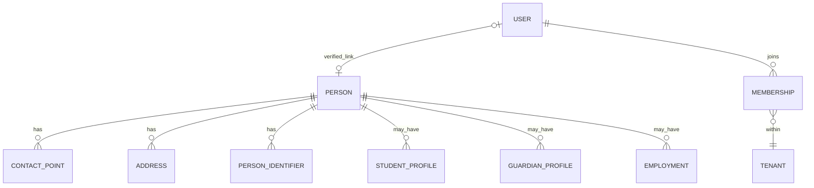

**Person data:** names and history, DOB, jurisdiction-configured gender/sex attributes, contacts, addresses, media/photo references, identifiers, verification assertions, consent/privacy state. Highly sensitive identifiers are encrypted/tokenized and purpose-restricted.

Supported states: Person+User; Person without User; User linked later; student without login; guardian without login; applicant before account; employee profile created before invitation.

### Deduplication

Deterministic candidates: same verified national identifier within permitted scope; same verified email/phone; exact school identifier within tenant. Probabilistic candidates: name+DOB, phonetic/fuzzy name, address/contact/guardian overlap. A score creates **POSSIBLE_MATCH**, never an automatic uncertain merge.

Workflow: candidate detected -> privacy-authorized reviewer compares masked evidence -> CONFIRM_SAME_PERSON or KEEP_SEPARATE -> privileged merge plan -> re-point eligible profile links -> preserve aliases/source provenance -> tombstone duplicate -> append immutable before/after audit -> notify affected domain owners. Merges are reversible through controlled restoration where feasible. Cross-tenant comparison requires explicit lawful purpose and must not reveal the other tenant.

## 6. Tenant Architecture

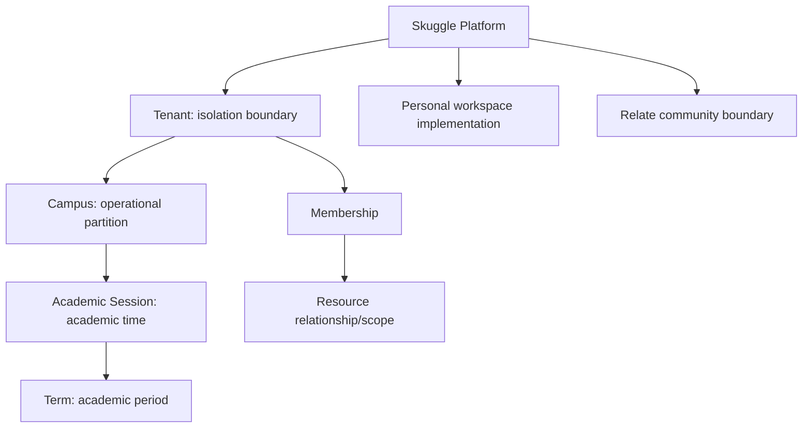

| Scope | Meaning |
|---|---|
| Platform global | Platform operations only; explicit platform principal. |
| Tenant | Customer/workspace isolation and ownership boundary; mandatory for school business data. |
| Campus | Subdivision inside tenant; never substitutes for tenant isolation. |
| Academic session/term | Temporal business context inside tenant; required only for period-specific use cases. |
| Resource | Relationship/assignment/ownership filter inside broader scopes. |
| Personal workspace | User-controlled experience scope, currently provisioned with personal tenancy. |
| Community | Relate privacy/community scope; not a school tenant and cannot imply school-data access. |

MVP tenant types are SCHOOL and PERSONAL_IMPLEMENTATION. `WorkspaceType` is the stable public abstraction. Relate is a distinct community context, not modeled as a school tenant. Future organizations may introduce additional types only through explicit policies.

### Canonical TenantContext

Required for a school tenant request: `UserId`, `MembershipId`, `TenantId`, `WorkspaceType=SCHOOL`, active RoleAssignments/effective capability snapshot or resolver, `CorrelationId`. Optional: `PersonId`, selected persona, `CampusId`, `AcademicSessionId`, `TermId`; each optional context must be validated as belonging to the tenant. Platform requests require PlatformPrincipal and no implied TenantId. Public requests use PublicTenantProjectionContext, never membership impersonation.

Resolution order: authenticate -> resolve workspace from trusted route/session/signed selector -> resolve membership -> verify membership active -> verify tenant active -> validate optional sub-context -> load entitlements/flags -> establish TenantContext -> capability check -> resource/privacy policy -> domain invariant -> execute -> clear context.

Header selection is accepted only as a requested ID and matched to the authenticated user's memberships. Workspace switching issues/updates server-side context, clears academic/subscope selections, and returns a fresh frontend access contract.

## 7. Workspace Architecture

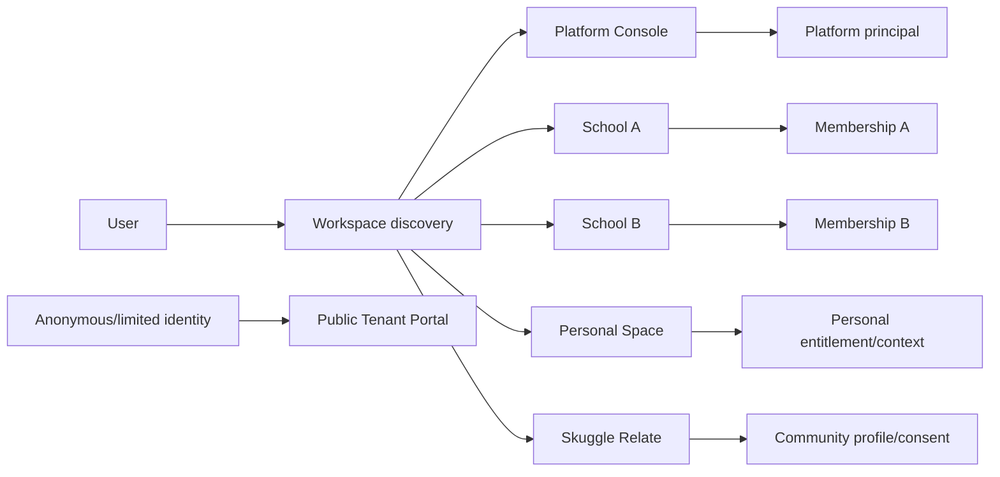

Workspace is presentation and access composition, not an authorization shortcut. Platform, School, Personal, Relate and Public each establish a different principal/context contract. Selected persona influences dashboard focus only.

## 8. Membership Architecture

Membership logically contains `MembershipId`, `UserId`, `TenantId`, status, invitation provenance, joined/suspended/revoked/expired timestamps, workspace entitlement, default persona/role-assignment reference, and narrowly justified metadata. It excludes job title, employment facts, learner records and family relationships.

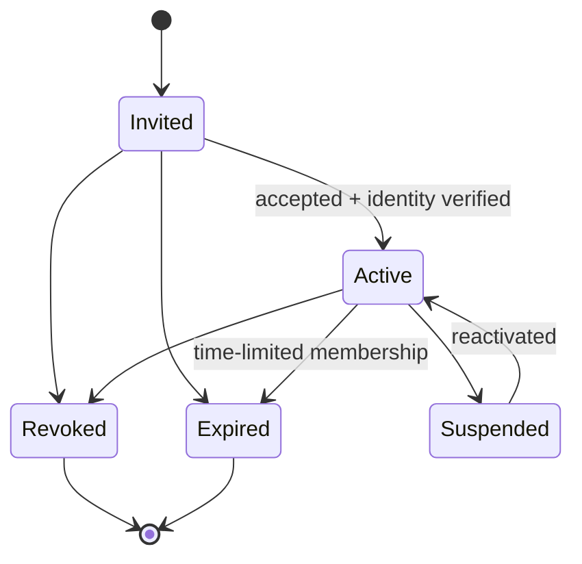

Employment termination may trigger an access-review workflow but does not delete User or automatically revoke parent access. Graduation ends/changes StudentProfile/Enrollment state but may preserve membership for alumni/personal use. Guardian relationship revocation removes linked-child scope, not unrelated membership capabilities. Tenant suspension gates all tenant memberships without mutating each membership.

## 9. Multi-Role Architecture

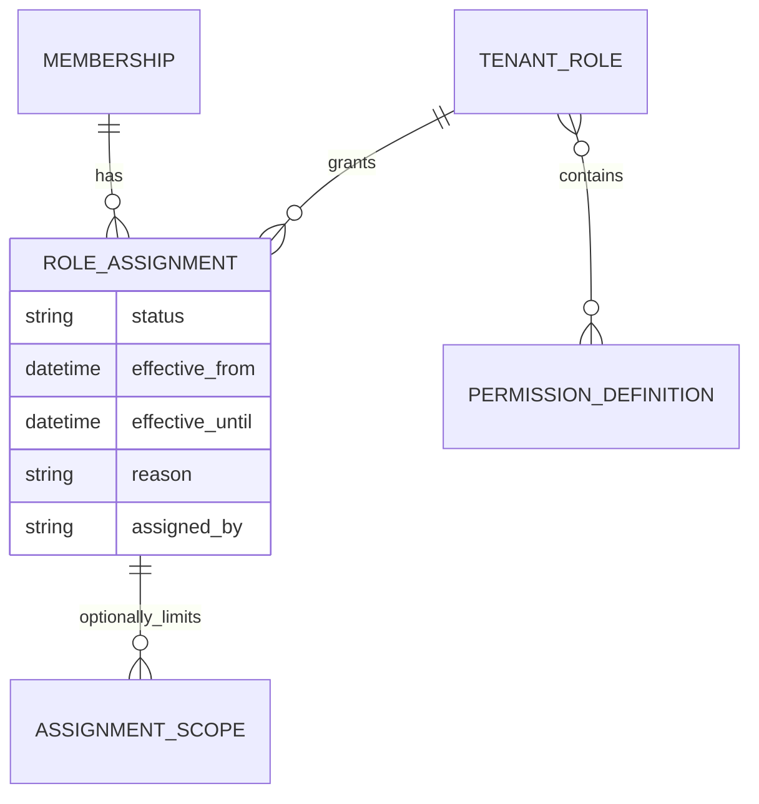

Effective permissions are the union of active, in-period role assignments, reduced by assignment scope, tenant policy, explicit deny where supported, entitlement, privacy and resource policy. MVP assignment scopes: TENANT and CAMPUS plus domain-derived relationships (assigned classes, linked children, self). Department/class/resource generic assignment scopes are added only when a real role needs them; avoid a universal policy DSL.

Role assignment states: SCHEDULED, ACTIVE, SUSPENDED, EXPIRED, REVOKED. Self-assignment is prohibited. Expiration is automatic and effective immediately in authorization/cache invalidation.

## 10. Role Architecture

**System roles/templates:** immutable platform-defined identities necessary for bootstrap and boundary protection: Platform Super Admin and School Super Admin bootstrap template. They have reserved semantics and cannot be deleted, renamed into another boundary, or cloned with platform permissions.

**Tenant roles:** tenant-owned permission bundles such as School Admin Officer or Academic Secretary. They may be custom or cloned from safe platform templates.

**Personas/job titles:** UX and workforce language such as Principal, Teacher, HOD or Bursar. A persona may suggest a role template but does not authorize anything.

Privilege rules: a grantor may assign only delegable capabilities within their own administration authority; cannot grant self; cannot create platform permissions; cannot elevate a role by cloning; School Admin Officer cannot grant School Super Admin; governance role changes may require step-up and dual control.

## 11. Permission/Capability Architecture

Canonical key: `{domain}.{resource}.{action}`, lowercase stable tokens. Standard actions: `view`, `list`, `create`, `update`, `archive`, `restore`, `submit`, `approve`, `reject`, `publish`, `revoke`, `export`, `import`, `assign`, `manage`, `configure`; domain verbs remain when materially clearer (`enter`, `moderate`, `allocate`, `reconcile`).

Each registry entry contains key, domain, resource, action, description, risk, assignability (platform-only/reserved/delegable), supported scopes, prerequisites/entitlement, default templates, deprecation aliases and version metadata. Application code consumes registry constants/generated definitions, not invented strings.

### Legacy mapping

| Legacy permission | Canonical target |
|---|---|
| `platform.view` | `platform.console.access` |
| `tenants.manage` | `platform.tenants.manage` |
| `users.manage` | split into `iam.memberships.manage`, `iam.invitations.manage`, `workforce.employees.manage` by endpoint |
| `settings.configure` | split to owning contexts, e.g. `institution.profile.configure`, `academics.calendar.configure` |
| `students.view/create/edit/import` | `people.students.list/create/update/import` |
| `students.medical.view/edit` | `student_services.health.view/update` |
| `attendance.view/create/approve` | `attendance.records.view/create/approve` |
| `assessments.view`, `assessment.create` | `assessment.assessments.view/create` |
| `scores.edit/approve` | `assessment.scores.enter/approve` |
| `results.view/approve/publish` | `performance.results.view/approve/publish` |
| `reports.view/export` | domain report permissions plus `reporting.exports.create` |
| `finance.view/manage` | split across `finance.accounts.view`, invoices/payments/refunds actions |
| `library.*` | `learning.resources.*`, `learning.assignments.*`, `learning.insights.view` |
| `ai.generate` | `ai.generations.create` plus domain capability prerequisite |
| `roles.manage` | `iam.roles.manage` |
| `security.manage` | `iam.security.configure` |
| `audit.view` | `audit.entries.view` |
| `admissions.manage` | split `admissions.applications.*`, `admissions.decisions.approve` |
| `communication.send` | `communication.messages.send` / `communication.campaigns.publish` |
| `operations.manage`, `services.manage`, `learning.manage` | decomposed resource/action capabilities in owning contexts |

Compatibility keeps legacy aliases pointing to canonical decisions until endpoint migration and parity telemetry complete. Never reinterpret a broad legacy key silently.

## 12. Resource Scope Architecture

| Scope | Meaning | Derivation | Domains |
|---|---|---|---|
| SELF | actor's linked Person/domain profile | User->Person/profile | People, Personal, Student views |
| OWN_RECORDS | actor-created/owned resources | aggregate owner/creator | Communication, Learning, drafts |
| LINKED_CHILDREN | active authorized guardian relationship | GuardianRelationship | Performance, Attendance, Finance, People |
| ASSIGNED_CLASSES | active teaching/class assignment in current period | Academics TeachingAssignment | Students, Attendance, Assessment |
| ASSIGNED_SUBJECTS | active subject teaching assignment | Academics TeachingAssignment | Assessment, Learning |
| DEPARTMENT | employment/leadership assignment | Workforce/Institution | Workforce, Academics, reports |
| CAMPUS | validated campus assignment/role scope | RoleAssignment + Institution | most school domains |
| TENANT | all permitted tenant resources | tenant-scoped role assignment | governance/leadership/admin |
| SPECIFIC_RESOURCE | explicit delegation | resource grant/assignment | documents, support, assessment marking |
| PUBLIC_PUBLISHED | explicitly published projection | owner publish state | Public Portal, Learning, Results |

Domain relationships are preferred to stored generic filters. A small scope descriptor may say `ASSIGNED_CLASSES`, but the Academics policy resolves the actual class IDs at decision time or through a versioned projection.

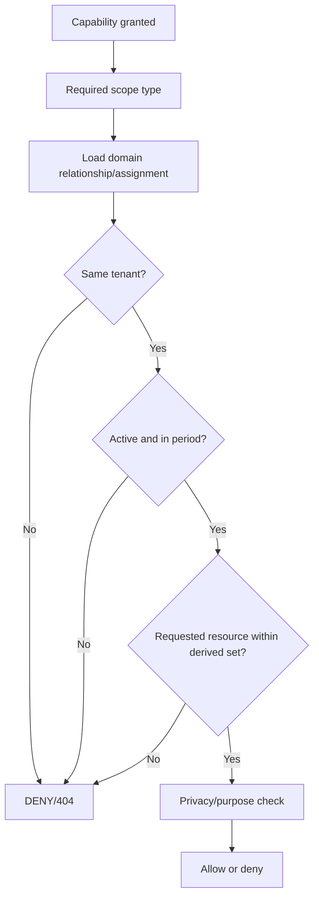

## 13. Authorization Decision Model

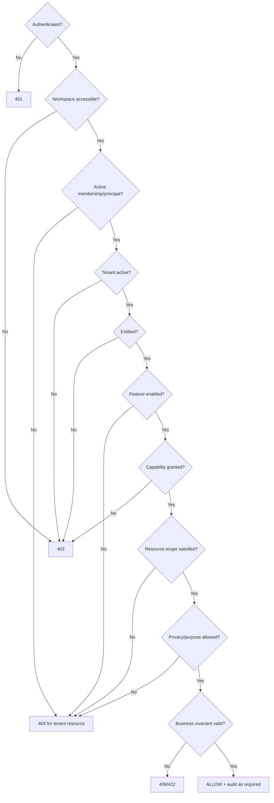

Middleware authenticates, resolves workspace/tenant/membership, checks tenant status, coarse entitlement/flag and optionally capability. Authorization service resolves effective assignments/capabilities. Resource policy enforces tenant, relationship, scope, purpose and object state. Domain use case enforces business invariants and segregation of duties. Controllers only translate transport.

## 14. School Role Templates

Templates provide defaults, not behavior. `S`=system protected, `P`=platform-provided clonable, `O`=optional template, `C`=tenant custom role.

| Template | Type | Default purpose | Default scope |
|---|---|---|---|
| Proprietor/Tenant Owner | P, privileged | ownership oversight and selected governance | tenant |
| School Super Admin | S, privileged | tenant IAM/security/configuration bootstrap | tenant |
| School Admin Officer | P | delegated daily administration | tenant/campus |
| Principal | P | academic/operational leadership and approvals | tenant/campus |
| Head Teacher / Vice Principal | O | delegated academic leadership | campus/department |
| HOD | O | subject/department leadership and moderation | department |
| Admission Officer | P | application processing | tenant/campus/intake |
| Examination Officer | P | exam operations/results workflow | tenant/campus |
| Bursar | P, sensitive | school finance operations | tenant/campus |
| Teacher | P | teaching/marking/attendance | assigned classes/subjects |
| Class Teacher | O | pastoral/class responsibility | assigned class |
| Librarian | O | resource curation | tenant/campus |
| School Nurse/Student Services Officer | O, sensitive | health/welfare case work | assigned/tenant by policy |
| Operations Officer | O | logistics/facilities | tenant/campus |
| Parent/Guardian | P | linked-child access | linked children |
| Student | P | own learner access | self |
| Academic Secretary | C example | students/classes/assessments/results/report export | configured scope |

Templates are immutable versions. Tenant roles may clone a safe template and then diverge. Updating a platform template never silently adds privileges to a clone; administrators receive a reviewed diff.

## 15. Platform Role Architecture

Platform Super Admin is a platform principal activated only in Platform Console, backed by platform-specific assignments and mandatory MFA. It is not inferred from `school_super_admin`, proprietor, tenant owner, email domain or a school membership. Platform permissions cannot be placed in tenant roles.

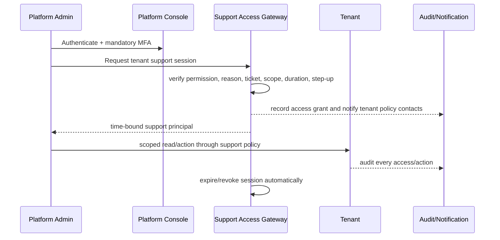

No invisible omnipotent impersonation. Prefer “act with support access” displaying platform actor and purpose. True user impersonation, if legally necessary, must be separately permitted, read-only by default, prominently bannered, time-limited, tenant-visible, session-recorded and prohibited for credentials/MFA/highly restricted records without explicit escalation.

## 16. Parent/Guardian Authorization

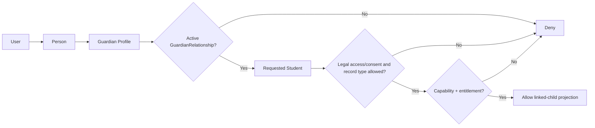

GuardianRelationship records relationship type, legal/authorized access status, effective dates, restrictions, consent/custody flags and tenant. A generic result permission only enables the feature; the relationship selects accessible children. Health, safeguarding, counselling, contact address and finance payer data require separate purpose/capability rules. A payer relationship may differ from guardianship.

## 17. Student Authorization

Student access defaults to SELF through User->Person->StudentProfile in current tenant. Allowed projections may include own profile, timetable, eligible assessments/attempts, results, attendance, permitted account balance, assigned learning resources, communications, Personal Space and consented Relate content. Student cannot select another `StudentId`; APIs derive it from the principal or verify exact equality. Public/shared learning objects remain separately authorized.

## 18. Teacher/Workforce Authorization

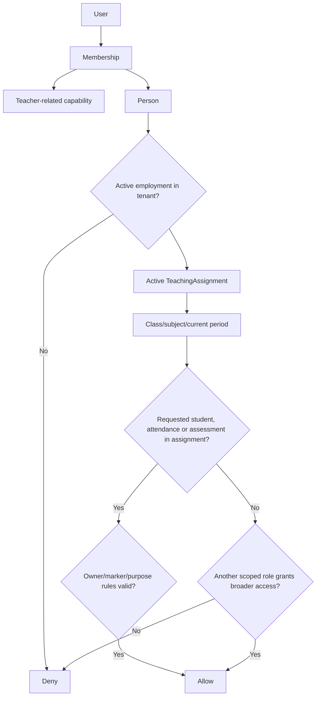

Teacher access requires both capability and domain relationship. Employment establishes eligibility; TeachingAssignment defines classes/subjects/periods; AcademicEnrollment defines students in those classes; Assessment ownership/marker assignment governs mark entry. A Teacher label alone grants nothing. The current global-user teacher-assignment gap is closed conceptually by requiring active membership + Person + eligible Employment before assignment.

## 19. Leadership Authorization

Principal, Head Teacher, Vice Principal and HOD are personas with default role templates. Typical capabilities cover academic oversight, attendance review, staff visibility, result/assessment approval, communication and reports. They receive campus/department/tenant scopes deliberately. Technical IAM security, subscription/billing configuration, medical/safeguarding detail and platform access are excluded unless explicitly assigned and policy-approved.

Segregation rules can prohibit approving one's own marks, preparing and publishing the same result set, reviewing and finally approving one application, recording and approving one refund, or creating a user and granting School Super Admin. Small schools may select WARN, REQUIRE_JUSTIFICATION or REQUIRE_SECOND_ACTOR per risk; platform-critical conflicts remain mandatory.

## 20. Privileged Access & MFA

| Risk | Examples | Control |
|---|---|---|
| STANDARD | list authorized students, view assigned timetable | active session; normal audit |
| SENSITIVE | medical records, finance account, safeguarding summaries | scoped permission, purpose, audit, optional/recent auth by tenant policy |
| PRIVILEGED | manage tenant roles/security, publish results, approve refund | mandatory MFA enrollment; step-up/recent auth; reason; enhanced audit; SoD where configured |
| PLATFORM-CRITICAL | tenant suspension, support access, credential rotation, restore backup | mandatory phishing-resistant MFA target, step-up every session/action, approval where feasible, time limit and alerting |

School Super Admin and Platform Super Admin MFA is mandatory. Bursar/refund approver, result publisher and highly restricted Student Services roles require MFA; sensitive actions use step-up if the session is older than policy, device/risk changed, or operation is high-impact. Recovery codes and factor reset are highly restricted events.

Temporary delegation is a time-bound RoleAssignment with effective dates, reason, grantor and optional scope. “Acting Principal,” substitute Teacher, temporary Bursar and exam-period officer expire automatically and invalidate cached effective access.

## 21. Custom Tenant Roles

School Super Admin can create named roles from delegable registry permissions, scopes supported by those permissions, and optional description/status. A custom role cannot include platform-only or non-delegable protected permissions. The creator cannot grant beyond delegated authority, grant themselves, bypass SoD or clone hidden reserved capabilities. Changes are versioned/audited; high-risk expansions require step-up and optional approval. Assignment and definition management are separate capabilities.

## 22. Invitation & Onboarding

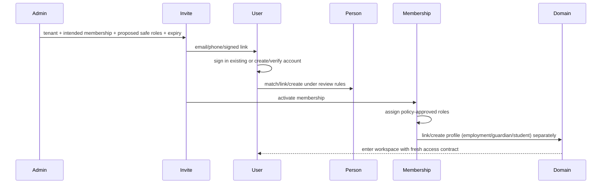

Invitation supports existing/new users, email/phone/link and bulk issuance. It stores tenant, intended membership, proposed role template IDs, inviter, expiry, status and domain-profile intent. Acceptance revalidates every proposed role against current grantor/policy; invitation never freezes an escalation loophole.

Onboarding variants:

| Actor | Identity/person | Membership/role | Domain profile |
|---|---|---|---|
| School Super Admin | register+verify User; link/create Person | bootstrap school membership + protected assignment | optional proprietor/employment profile |
| Admin/Principal/Teacher/Staff | match/create Person before or during invite | accept membership; safe role assignment | create/link Employment; teacher assignment remains Academics action |
| Parent | match/create Person or invite existing User | parent capability template | create/verify GuardianRelationship |
| Student | StudentProfile may pre-exist without User | invite/claim optional student membership | verified link to exact StudentProfile |
| Applicant | Person/application can exist anonymously | no school membership by default | Admissions owns applicant/application; membership only after policy point |
| Existing user joining another school | reuse User; privacy-safe Person match | new tenant Membership/assignments | distinct school profiles/employment/relationships |

Registration creates minimum identity, not a completed domain profile.

## 23. Offboarding

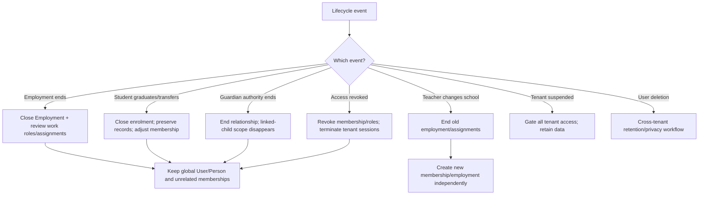

Tenant lifecycle: ACTIVE -> SUSPENDED -> ACTIVE or CLOSED/ARCHIVED -> DELETION_PENDING -> DELETED/ANONYMIZED. Suspension blocks normal login/use but permits controlled export/support. Closure preserves legal records for configured retention and provides restoration window. Deletion processes tenant-owned data without deleting a global User who belongs elsewhere or Personal/Relate state. Platform Billing can request suspension through Tenant Management; it does not perform data deletion.

## 24. Personal Space Identity

**Decision:** keep the current personal-tenant implementation during migration, but expose only `WorkspaceId`, `WorkspaceType=PERSONAL` and personal entitlements to consumers. Benefits: reuses tested membership/context/isolation and avoids concurrent migration. Costs: artificial tenant semantics, possible billing/report confusion, and risk that school-only assumptions leak into personal data.

Long-term decision gate: after IAM-3/4, evaluate volume, privacy and domain needs. If personal tenancy continues to create exceptional logic, migrate behind the Workspace contract to a separate PersonalWorkspace aggregate. No feature may depend directly on “personal tenant” identity today. School membership revocation must not remove Personal Space.

## 25. Skuggle Relate Identity & Privacy

Relate uses the same User/Person linkage but a distinct CommunityProfile and community consent. It is not a school tenant and does not inherit school memberships, role assignments, student profile, teacher status or linked children. Claims such as “teacher at School A” require user-controlled, tenant-approved verification projection and revocation. Minors default to private/limited discovery; guardian/school permissions do not silently authorize public sharing. Community blocks, reports, moderation, audience and content privacy are Relate-owned. School records enter Relate only through explicit, revocable, minimum-data publication/consent contracts.

## 26. Public Identity & Access

Anonymous access uses explicit PUBLIC_PUBLISHED projections: tenant welcome/profile, public learning resources and result verification by scoped PIN. Public admissions may create a candidate/application without tenant membership. Rate limiting, enumeration resistance, anti-automation, consent and data minimization apply. Authenticated public users do not gain tenant access until active membership is established. Public result/PIN responses reveal only the approved report projection.

## 27. Machine/Integration Identity

Machine principals are not Users. Each service account/API credential owns opaque ID, tenant or platform boundary, allowed integration type, capability set, resource scope, status, secret/public-key metadata, issuer, expiry/rotation and last-used risk data. Credentials are hashed/encrypted, short-lived tokens preferred, tenant administrators cannot create platform credentials, and webhook identities use signature/replay verification. All actions carry machine principal, tenant, correlation and audit context. No interactive role templates are assigned to machines.

## 28. Tenant-Aware Queue Architecture

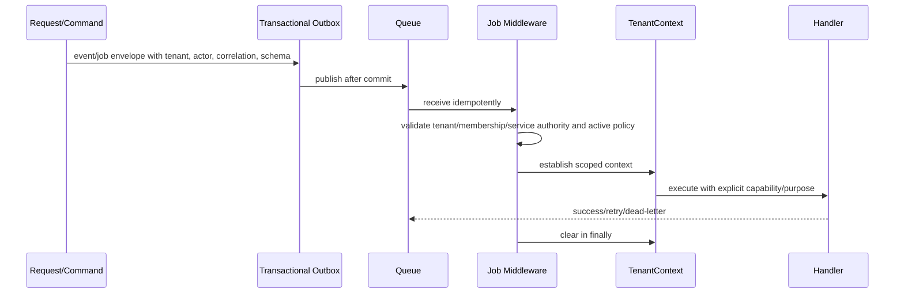

Scheduled/CLI jobs declare PLATFORM_GLOBAL or enumerate TenantIds explicitly; absence of context is not “all tenants.” User-initiated jobs capture immutable actor/purpose plus reauthorization policy: sensitive delayed actions recheck current authorization. Idempotency, retry safety, tenant-partitioned concurrency and dead-letter audit are mandatory.

## 29. Cache & Storage Tenancy

Tenant cache keys include environment, schema/version, workspace type, TenantId and resource/query identity; user-sensitive entries additionally include User/Membership or scope fingerprint. Effective access cache includes assignment versions and expires/invalidate on role, membership, relationship, entitlement, tenant state or delegation changes. No shared cache value contains tenant-private payload without tenant keying.

Private storage paths/metadata include TenantId and owner context; access occurs through policy-authorized short-lived signed delivery, never guessable public paths. Media records carry classification, purpose, owner aggregate, retention, malware status and audit. Public copies are explicit derivatives with publish/revoke lifecycle. Personal and Relate objects use their own workspace/privacy scopes.

## 30. Audit Architecture

Audit records include event ID/time, actor type/ID (User, support or machine), effective Membership/RoleAssignments, tenant/workspace/subscope, capability, resource type/public ID, purpose/reason, decision/result, before/after or field-change summary with sensitive redaction, IP/device/session, correlation/causation/request IDs, support ticket/elevation and retention class. Required events include login/recovery/MFA, membership/role/permission changes, Person merge, sensitive reads, exports/downloads, result publication, finance approvals, support sessions, scope bypass, tenant lifecycle and credential rotation. Audit is append-only, tenant-visible where appropriate and platform-separated.

## 31. Privacy & Data Classification

| Class | Examples | Required controls |
|---|---|---|
| PUBLIC | published school name, public resource | explicit publication, integrity, revoke lifecycle |
| INTERNAL | general tenant configuration, non-sensitive staff directory | active membership + capability |
| CONFIDENTIAL | student academic profile/results, employment, finance summaries | capability + tenant/resource scope + audit |
| SENSITIVE PERSONAL | contacts, identifiers, detailed finance, disability/accommodation | purpose, least privilege, masking/export controls, enhanced audit |
| HIGHLY RESTRICTED | health/safeguarding/counselling, MFA secrets, recovery material | narrow named capability, relationship/purpose, MFA/step-up, field-level response policy, alert/audit |

Access decision combines classification with purpose. Platform support does not automatically override classification. Reports/search indexes inherit the highest included field classification. Relate/Public never consume school confidential data without explicit privacy-reviewed projection.

## 32. Security/IDOR Architecture

Security failure semantics: 401 for absent/invalid authentication where authentication is expected; 403 for an authenticated actor lacking workspace/coarse capability when revealing the feature is safe; 404 for unknown, different-tenant, out-of-scope or privacy-sensitive resource IDs to prevent existence disclosure; 409 for state/version conflict; 422 for validly disclosed business validation errors. Responses carry request ID and no sensitive predicates.

Every resource-by-ID test template covers: same tenant authorized; same tenant wrong capability; same tenant capability but wrong resource relationship; different tenant; inactive/revoked membership; missing context; wrong campus/period; expired delegation; entitlement/flag off; privileged action without step-up; platform principal using normal tenant API; and safe 404 semantics.

Required suites: Student, GuardianRelationship, Employee, TeachingAssignment, Assessment, ScoreSheet, Result/Publication, Payment, Invoice, Report/Export, Document/Media, Invitation, FormDefinition/submission, Attendance, Message/Campaign, LibraryResource, SupportTicket. Mutations additionally test mass assignment/tenant override, stale version, idempotency and audit emission.

## 33. Current -> Target Mapping

| Current structure | Target logical concept | Migration strategy |
|---|---|---|
| `users` | UserAccount; later optional verified Person link | keep; remove school profile concerns incrementally |
| `tenant_memberships` | Membership | keep IDs/lifecycle; add target behavior compatibly |
| `tenant_memberships.role_id` | legacy primary RoleAssignment | dual-read; materialize assignment; preserve primary persona; deprecate after parity |
| `roles` | platform templates/system roles plus tenant role definitions | classify/reserve existing roles; clone tenant roles without breaking IDs |
| `permissions` | global Permission Registry entries/legacy aliases | map aliases; shadow canonical decisions; retire only after consumers migrate |
| `role_permission` | role capability grants | retain during compatibility; target grants remain versioned/validated |
| Employee | Employment linked to Person/Membership | establish verified link; never equate Employee with User |
| Student | StudentProfile linked to Person; optional User claim | preserve student IDs; staged match/link with audit |
| Guardian | GuardianProfile/relationship linked to Person | separate profile from relationship/access status |
| TeacherAssignment | Academics TeachingAssignment referencing eligible Employment | validate membership/person/employment; preserve assignment IDs |
| personal tenant/membership | Personal Workspace implementation behind abstraction | keep initially; remove tenant leakage from public contract |
| `platform_super_admin` | PlatformPrincipal/assignment | isolate from school roles/memberships; mandatory MFA |
| frontend role aliases | persona labels + effective access contract | stop collapsing specialists; capability-based navigation |
| invitations | Invitation + proposed role/profile intent | keep flow; revalidate assignments at acceptance |
| stored tenant/current context | server-validated Workspace/TenantContext | invalidate/refresh on switch and IAM version change |

Conceptual multi-role transition: retain `role_id` -> introduce logical RoleAssignments -> dual-read with legacy as implicit assignment -> write new assignments while maintaining primary compatibility role -> backfill -> compare effective-access parity -> switch authorization reads -> retain frontend/API adapters -> deprecate `role_id` only after usage telemetry and rollback window. No physical migration is prescribed here.

## 34. Migration Strategy

| Wave | Outcome | Compatibility/control |
|---|---|---|
| IAM-0 | close immediate association/telemetry risks; comprehensive IDOR baseline | no vocabulary/schema change |
| IAM-1 | canonical Permission Registry and policy decision contract | legacy->canonical aliases; shadow decisions beside existing checks |
| IAM-2 | multi-role-capable Membership | legacy `role_id` implicit assignment; dual-read/write and parity telemetry |
| IAM-3 | Person identity/profile links and merge governance | preserve User/Student/Guardian/Employee IDs; no automatic uncertain merge |
| IAM-4 | domain-derived SELF, LINKED_CHILDREN, ASSIGNED_CLASSES/SUBJECTS, campus scopes | migrate one endpoint family at a time |
| IAM-5 | privileged role governance, mandatory/step-up MFA, SoD, support sessions | staged enrollment/grace/recovery plan |
| IAM-6 | tenant-aware jobs, cache, storage, reports/search | common envelopes/keys/policies; fail closed |
| IAM-7 | frontend access contract/persona presentation; remove role collapsing | adapters preserve current UI names until each route migrates |
| IAM-8 | retire fragmented legacy checks/aliases after coverage and observability | rollback window and explicit deprecation evidence |

Authorization rollout per endpoint: legacy enforcement + new-policy shadow evaluation/logging -> investigate mismatches -> new policy enforce with legacy parity assertion -> remove legacy check -> later remove alias. Do not flip every endpoint simultaneously.

Existing sessions remain valid until ordinary refresh unless a security/assignment change requires revocation. Workspace-switch/auth responses support versioned old and new shapes. Seeded roles remain and become protected templates or compatibility roles. Personal Space and invitations remain operational throughout.

## 35. Architecture Fitness Rules

1. Backend role-name comparison cannot authorize an action.
2. Every tenant API resolves active membership before business execution.
3. Every object-by-ID endpoint has cross-tenant and relationship-denial tests.
4. A grantor cannot delegate capability beyond their authority or to themselves.
5. Tenant administrators cannot assign platform permissions.
6. Parent access requires active authorized GuardianRelationship.
7. Teacher classroom access requires active academic assignment or explicitly broader scope.
8. Tenant jobs restore and clear TenantContext through common middleware.
9. Tenant cache keys contain tenant/workspace identity and access-version where needed.
10. Private files require tenant, capability, resource and classification authorization.
11. Entitlement never replaces user authorization.
12. Frontend visibility is never security enforcement.
13. User deletion cannot cascade into unrelated tenants without explicit lifecycle decisions.
14. Employment termination does not delete global User.
15. Person merge is privileged, reviewed and fully audited.
16. RoleAssignments support effective periods and automatic expiry.
17. Privileged permissions require MFA/step-up according to registry policy.
18. Global-scope bypasses are allow-listed, purpose-bound and audited.
19. Platform support access is visible, scoped, time-bound and audited.
20. Personal/Relate principals cannot bypass school privacy.
21. Platform principal cannot use a normal tenant controller without support grant.
22. Permission keys come from the registry; unknown keys fail CI/startup validation.
23. Tenant role changes invalidate effective-access caches.
24. Public access reads only explicit published projections.
25. Machine credentials cannot authenticate interactive sessions.

## 36. Architecture Decision Records

| ADR | Decision | Rationale / consequence |
|---|---|---|
| IAM-ADR-01 | Separate User and Person logically | Supports people without accounts, one person/many school roles, privacy and later linking without credential duplication. |
| IAM-ADR-02 | Multiple RoleAssignments per Membership | Required for Teacher+Parent+HOD and temporary delegation; effective permissions additive but constrained by policy/scope. |
| IAM-ADR-03 | Custom tenant roles | Required for real school structures; only delegable registry permissions, no platform/reserved escalation. |
| IAM-ADR-04 | Global permission definitions; tenant roles/assignments | Stable application vocabulary with local administration; tenant cannot invent executable capabilities. |
| IAM-ADR-05 | Keep personal tenancy behind Workspace abstraction initially | Safest compatibility path; permits later replacement without consumer coupling. |
| IAM-ADR-06 | Platform Super Admin not a normal school membership | Prevents accidental global-to-tenant access; support requires explicit support principal/session. |
| IAM-ADR-07 | Teacher access = role capability + domain assignment | Role enables task; Employment/TeachingAssignment selects authorized classes/subjects/students. |
| IAM-ADR-08 | Parent access = capability + active relationship | Prevents generic result permission from exposing all students. |
| IAM-ADR-09 | Derive resource scopes from domains | Keeps rules understandable and current; generic scope descriptors only select a domain resolver. |
| IAM-ADR-10 | Role templates are immutable and clonable | Safe updates and tenant control; clones do not silently inherit future privilege. |
| IAM-ADR-11 | Persona is presentation only | Selected work mode changes focus, never server capability. Task-oriented dashboard with optional persona filter is preferred over security-significant switching. |
| IAM-ADR-12 | Audited support sessions, not invisible impersonation | Enforces purpose, duration, tenant visibility and least privilege. |

## 37. Final Matrices

### Capability registry matrix

This is the minimum target catalog, not every future UI action.

| Domain | Resource | Actions | Scope support | Risk |
|---|---|---|---|---|
| IAM | memberships | list, create, suspend, revoke | tenant | privileged |
| IAM | roles/assignments | view, create, update, assign, revoke | tenant | privileged |
| Institution | profile/campuses | view, configure/manage | tenant/campus | standard/privileged |
| People | students/guardians | list, view, create, update, archive, import | self/linked/assigned/campus/tenant | standard/confidential |
| Workforce | employees/employment | list, view, create, update, terminate | self/department/campus/tenant | confidential/privileged |
| Admissions | applications/decisions | view, create, update, review, approve, reject, export | own/intake/campus/tenant | confidential/privileged |
| Academics | calendar/classes/subjects/enrolments/assignments | view, configure, create, update, assign, publish | assigned/department/campus/tenant | standard/privileged |
| Assessment | assessments/questions/scores | view, create, update, publish, enter, moderate, approve, lock | assigned class/subject/department/campus/tenant | confidential/privileged |
| Performance | results/publications | view, generate, approve, publish, revoke, export | self/linked/assigned/campus/tenant | confidential/privileged |
| Attendance | records/sessions | view, create, correct, approve | self/linked/assigned class/campus/tenant | confidential |
| Student Services | health/cases | view, update, assign, escalate, close | self/linked-limited/specific/campus/tenant | highly restricted |
| Operations | assets/procurement/transport/etc. | view, create, update, assign, approve, manage | specific/campus/tenant | standard/privileged |
| Finance | accounts/invoices/payments/refunds | view, create, record, allocate, approve, reverse, export | self/linked/campus/tenant | sensitive/privileged |
| Learning | resources/assignments/progress | view, create, publish, assign, annotate, export | public/self/assigned/campus/tenant | standard/confidential |
| Communication | messages/campaigns | view, send, moderate, approve, publish | own/linked/assigned/campus/tenant | confidential/privileged |
| Platform Billing | plans/subscriptions/invoices | view, manage, issue, mark-paid | platform/tenant-account | platform-critical |
| Platform Ops | tenants/support/backups/credentials | view, support, suspend, restore, rotate | platform/time-bound tenant support | platform-critical |
| Shared | audit/reports/media/AI | view/export/download/manage/generate | inherits owner context | risk inherited |

### Default role-capability summary

Legend: A=administrative, O=oversight/approval, W=operational write, V=scoped view, S=self/relationship, —=none by default.

| Template | IAM | People/Workforce | Admissions | Academics | Assessment/Performance | Attendance/Services | Finance | Learning/Comms | Platform |
|---|---|---|---|---|---|---|---|---|---|
| School Super Admin | A | A | A | A | A | A | A | A | — |
| School Admin Officer | delegated W | W | W | W | V/W limited | W | V | W | — |
| Principal | — | O/V | O | O | O/publish if assigned | O | V | O | — |
| Head/Vice Principal | — | scoped O | O | O | O | O | V optional | O | — |
| HOD | — | department V | — | department O | moderate/approve dept | V | — | W/O | — |
| Admission Officer | — | applicant/student V | W/O split | conversion V | — | — | — | send scoped | — |
| Examination Officer | — | student V | — | V | W/O/publish per SoD | — | — | send scoped | — |
| Bursar | — | payer/student V | — | period V | — | — | W/O split | reminders | — |
| Teacher | — | assigned student V | — | assignment V | create/enter assigned | create assigned | — | W assigned | — |
| Class Teacher | — | assigned class V | — | class V | V/limited W | class W | class V optional | W | — |
| Librarian | — | V minimal | — | curriculum V | — | — | — | library W/O | — |
| Nurse/Services | — | scoped student V | — | roster V | — | health/case W | — | notify scoped | — |
| Operations Officer | — | minimal V | — | calendar V | — | operations W | request V | send scoped | — |
| Parent | — | linked child S | — | linked timetable S | linked results S | linked attendance/limited health | payer/linked S | S | — |
| Student | — | self S | — | self S | self S | self S | self optional | self/assigned | — |
| Platform Super Admin | platform IAM | — normally | — | — | — | — | platform billing | platform broadcast | A |

Detailed grants are generated from the Permission Registry and template versions; this summary is not executable policy.

### Persona matrix

| Persona | Job purpose | Relevant domains | Default dashboard focus |
|---|---|---|---|
| Super Admin | tenant governance | IAM, Institution, all oversight | security, setup, exceptions, subscription |
| Admin Officer | daily administration | People, Admissions, Academics, Operations | tasks, enrolment, records, operations |
| Principal/Leadership | school outcomes | Academics, Performance, Attendance, Workforce | approvals, risks, trends |
| Teacher | teaching | Academics, Assessment, Attendance, Learning | classes, timetable, marking, plans |
| Bursar | school finance | Finance, People references | collections, balances, reconciliation |
| Specialist officer | focused workflow | Admissions/Exams/Services/Ops | assigned queue and SLA |
| Parent/Guardian | child support | Performance, Attendance, Finance, Learning | linked children, notices, balances |
| Student | learning | Academics, Assessment, Performance, Learning | timetable, tasks, results, resources |
| Platform operator | operate Skuggle | Platform Ops/Billing | health, tenants, incidents, support |

Persona selection changes layout/focus only. Effective backend access remains the union of active assignments and policies.

### Identity relationship matrix

| Entity | Owns | References | Tenant? | Global? | Authenticates? | Classification |
|---|---|---|---|---|---|---|
| User | credentials, verification, MFA, sessions | optional Person | no | yes | yes | highly restricted |
| Person | human identity/contact/consent | optional User | logically global/privacy controlled | yes logical | no | sensitive personal |
| Membership | workspace participation/status | User, Tenant | yes | no | no | confidential |
| Role | permission bundle/template | permissions, tenant if custom | custom yes/system no | definitions may be global | no | internal |
| RoleAssignment | granted role, dates, scope | Membership, Role, grantor | yes/platform context | no | no | confidential |
| StudentProfile | school learner identity | Person, Tenant | yes | no | no | confidential |
| GuardianProfile/Relationship | guardian and child authorization | Person, StudentProfile | yes | no | no | sensitive |
| Employment | job relationship | Person, Tenant, department | yes | no | no | sensitive |
| TeachingAssignment | class/subject/period responsibility | Employment, Academics refs | yes | no | no | confidential |
| AcademicEnrollment | learner placement | StudentProfile, class/session | yes | no | no | confidential |

### Workspace access matrix

Access also requires user entitlement/membership; a role/persona alone never opens a workspace.

| Role/persona | Platform | School | Personal | Relate | Public |
|---|---|---|---|---|---|
| Platform Super Admin | assigned | only support session or separate membership | entitled | entitled/consented | yes |
| School roles | no | active membership | entitled independently | entitled/consented | yes |
| Parent/Student | no | active membership + relationship/self | entitled independently | policy/age/consent | yes |
| Personal-only user | no | no until invited | yes | entitled/consented | yes |
| Anonymous | no | no | no | public-only if offered | explicit public projections |
| Machine principal | API scope only | credential tenant scope | no interactive | integration-specific | signed public integration only |

### Security control matrix

| Control | Current | Target | Enforcement | Required test |
|---|---|---|---|---|
| Authentication | Sanctum/Fortify, verification/OAuth | global account + stronger recovery/session policy | auth middleware/service | invalid/revoked/session fixation/recovery |
| Membership | single-role tenant membership | lifecycle + multi-role assignments | workspace resolver | wrong/inactive/expired membership |
| Tenant isolation | fail-closed model scope | universal query/job/cache/storage context | middleware/persistence/infrastructure | every ID type cross-tenant |
| RBAC | DB permissions, fragmented checks | registry + effective capability service | authorization service | template/grant/escalation matrix |
| Resource scope | some policies/relationships | domain-derived resolvers | policy/domain | teacher/parent/self negatives |
| MFA | optional privileged tenant policy | mandatory/step-up by risk | auth/authorization | missing/stale factor, recovery |
| IDOR | strong student coverage | mandatory endpoint template | policy + API tests | tenant/relationship/existence hiding |
| Support access | broad platform permission | time-bound visible support principal | platform gateway | expiry/scope/audit/no normal tenant access |
| Jobs | inconsistent context propagation | common signed/versioned envelope | queue middleware | restore/clear/wrong tenant/retry |
| Cache | covered lookup keys tenant-aware | standard key/access version | cache service | cross-tenant collision/invalidation |
| Storage | private/signed controls | classified tenant media policy | media service | guessed ID/expired URL/wrong tenant |
| Audit | logger/security records | mandatory structured immutable events | audit service | sensitive actions and redaction |
| Privacy | endpoint-specific | classification+purpose+scope | policy/serializer | field/relationship/support restrictions |

### Final decision matrix

| Area | Current | Target | Action | Priority | Dependency |
|---|---|---|---|---|---|
| User | global auth record | focused UserAccount | Keep+clean | P1 | — |
| Person | split across profiles | canonical logical Person | Evolve | P1 | privacy/dedupe |
| Tenant | tested shared-schema boundary | canonical workspace tenant context | Keep+harden | P0/P1 | — |
| Membership | one `role_id` | lifecycle + multiple assignments | Evolve | P1 | registry |
| Role/multi-role | global seeded/single | system templates + tenant roles + assignments | Refactor | P1 | membership |
| Permissions | inconsistent global strings | versioned canonical registry | Evolve/alias | P1 | domain ownership |
| Custom roles | absent/limited | delegable tenant roles | Add | P1/P2 | registry/governance |
| Teacher | role/employee/assignment blurred | Person+Employment+Membership+Role+Assignment | Refactor | P0/P1 | Person/Academics |
| Parent | role + controller relationship | role capability + active guardian relationship | Harden | P1 | Person |
| Student | optional User link | self-scoped StudentProfile link | Evolve | P1 | Person |
| School Super Admin | distinct seeded role | protected tenant governance template | Keep+harden | P1 | MFA |
| School Admin | delegated seeded role | tenant-configurable operational role | Evolve | P1 | custom roles |
| Principal/specialists | backend roles, UI collapsing | personas + distinct templates/capabilities | Refactor | P2 | frontend contract |
| Platform Super Admin | platform role/alias | isolated PlatformPrincipal | Refactor | P1 | support gateway/MFA |
| Personal Space | personal tenant | Workspace abstraction; keep implementation initially | Keep+encapsulate | P2 | IAM contract |
| Relate | not found | separate consented community identity | Plan | P4 | IAM/privacy |
| MFA | optional privileged policy | mandatory/step-up by risk | Evolve | P0/P1 | recovery UX |
| Invitations | working tenant invites | proposed roles/profile intent with revalidation | Keep+clean | P1 | assignments |
| Resource scope | fragmented | domain-derived scope resolvers | Add/refactor | P1 | Person/Academics |
| Queues/cache/storage | uneven tenant governance | common tenant-aware contracts | Harden | P1 | TenantContext |
| Audit | implemented partial | structured mandatory audit | Evolve | P1/P3 | event contract |
| Support access | implicit broad platform power | visible time-bound purpose-bound session | Add | P1 | PlatformPrincipal |
| Entitlements | account/plan module checks | Billing->Tenant entitlements, separate from permission | Evolve | P1/P2 | Billing contracts |
| Feature flags | table/limited use | release gate separate from entitlement/config | Evolve | P2 | registry |

## Closing directives

Keep the existing authentication, global User, membership IDs, tenant resolver/context, fail-closed scopes, database permissions, session/workspace flows, invitations and Personal Space foundation. Evolve Person/profile links, Membership into multi-role assignments, the permission registry, resource policies, MFA, audit and tenant-aware infrastructure. Deprecate role-name authorization, specialist-role collapsing, broad unrelated permissions, ungoverned global bypasses and eventually the single `role_id` after measured compatibility.

Freeze these decisions before new interface design: User versus Person; Workspace/TenantContext contract; multi-role Membership; canonical permission grammar/registry; protected versus custom roles; persona is non-authoritative; teacher/parent/student scope derivation; School Super Admin versus School Admin; PlatformPrincipal/support session boundary; entitlement/flag/configuration evaluation order; privacy classes; and frontend access-contract fields. Otherwise a redesigned shell will encode unstable identity assumptions.
