# SKUGGLE WORKSPACE & INFORMATION ARCHITECTURE

**Document type:** Enterprise information-architecture decision document. No implementation or visual design is authorized.  
**Authoritative baseline:** `SKUGGLE_ENTERPRISE_ARCHITECTURE_AUDIT.md`, `SKUGGLE_DOMAIN_AND_CAPABILITY_ARCHITECTURE.md`, and `SKUGGLE_IDENTITY_TENANCY_IAM_RBAC_ARCHITECTURE.md`.  
**Sequence:** This is architecture document 4. Application Shell Architecture follows only after the decisions identified here are frozen.

## 1. Executive Decision Summary

Skuggle navigation will express:

> Product -> Workspace -> Domain -> Capability -> Page/Object -> Context -> Action

It will not mirror controllers, tables, React components, historical modules or role names. The five workspace compositions are Platform Console, School Workspace, Personal Space, Skuggle Relate and Public Tenant Portal. They share global identity but have distinct purposes, navigation languages and data boundaries.

The canonical staff School Workspace uses eight persistent groups: **Home, People, Admissions, Teaching & Learning, School Operations, Engagement, Insights, Administration**. It has at most two sidebar levels: group -> item. Items open a capability landing or collection; one optional contextual tab level may organize closely related views inside that capability.

Binding decisions:

1. Workforce appears under **People** in user-facing navigation, while remaining a separate bounded context.
2. Admissions remains a **primary domain item**, not buried under People.
3. Online Learning disappears as a parallel module; its capabilities live under Learning Resources and Assessment.
4. Continuous Assessment, Tests and Examinations are assessment-type filters/templates, not separate applications.
5. Results and publication live in **Performance**; Assessment ends with approved/locked scores.
6. Performance means interpreted outcomes, trends, risks and interventions; Results are its operational publication capability.
7. Subscription lives under **Administration -> Subscription & Plan**, never School Finance.
8. Reports live under **Insights**, with contextual links from owning domains to the same report definition.
9. Settings remain with their owning domain; Administration aggregates governance entry points but owns no business settings.
10. Forms & Custom Fields are visible to authorized administrators. Workflow configuration is administrative; ordinary users see only work queues and actions.
11. Help & Support remains a low-frequency utility/account destination, not a core operating domain.
12. Launch Blueprint is removed from persistent navigation and becomes a contextual setup/onboarding action; retire it if it is only demo/legacy.
13. Teachers receive **My Classes** as a primary task-oriented page: a scoped Academics projection, not a new domain.
14. Parent and Student school experiences use simplified job-oriented navigation, not the enterprise staff sidebar.
15. Personal Space uses a lighter productivity navigation; Relate uses community-oriented top/bottom navigation, not the school sidebar.
16. Unknown routes show a secure Not Found/Unavailable state and never silently route Home.

## 2. Current Information Architecture

The current SPA has no declarative router. `workspaceRoute.ts` parses `[tenant-prefix]/app/{navigation-id}`, `navigation.ts` resolves IDs/aliases, and `App.tsx` remaps a `view` identifier to a lazy component. Unknown IDs fall back to Home. Destination components often add tabs, nested state, modals and drawers. The global header, sidebar, workspace switcher, command palette and dashboard quick actions coexist with page-local navigation.

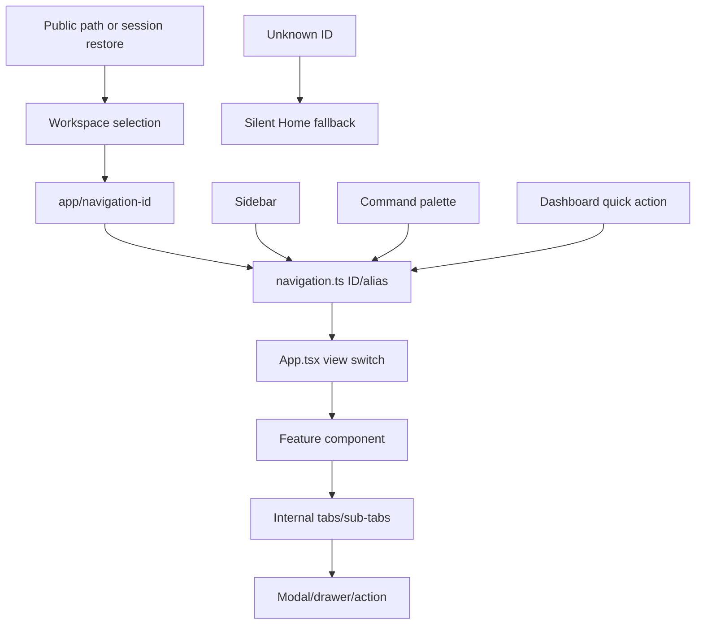

### Current navigation inventory

| Current label | Workspace/group | Route/view/component | Internal structure/capabilities | Permission signal | Alias/problem | Target |
|---|---|---|---|---|---|---|
| Dashboard | all authenticated/Home | `home`; role dashboard components | widgets, quick actions, analytics | role + permissions | many role-specific screens; widgets resemble modules | Home |
| School | School/Institution | structure IDs -> `SchoolStructureView` | profile, campuses, sessions, terms, classes, arms, departments, subjects, enrolments, allocations | broad settings/users/students | overlaps Academics/Admin; generic facade | Administration: School Setup + Academics |
| People | School/People & Enrolment | people/staff -> `StaffManagementView` | staff/teacher modes | users.manage | same component under People/Staff/Teachers | People: Workforce |
| Students | School/People | students -> `StudentRegistryView` | registry, profile, enrolment/import actions | students.* | enrolment overlaps Admissions/Academics | People: Students |
| Parents | School/People | parents -> `ParentsView` | guardian collection | students/results | terminology and relationship ambiguity | People: Guardians |
| Admissions | School/People & Enrolment | admissions -> `AdmissionsView` | workflow-stage sections | admissions.manage | generic records; stages risk becoming nav | Admissions |
| Academics | School/Teaching | academics -> `AcademicsConfigView` | configuration sections, planning | settings/learning | setup and operations mixed | Teaching & Learning: Academics |
| Assessment | School/Teaching | assessments -> `AssessmentWorkspace` | overview, assessment types, questions, marking, results, settings | assessment/scores/results | overloaded; contains Performance | Teaching & Learning: Assessment |
| Performance | School/Teaching | performance -> `PerformanceView` | students/classes/subjects/teachers | broad reports/assessment/student | thin read view; overlaps Results | Teaching & Learning: Performance |
| Results | School/Teaching | results -> `ResultsManagementView` | generation, approval, publishing | results.* | separate from Performance | Performance > Results |
| Online Learning/Library | School/Teaching | library -> `LearningResourcesView`; CBT/lesson tools | resources, practice, progress, AI, CBT | library/AI/assessment | backend distinctions exposed | Learning Resources; CBT remains Assessment |
| Attendance | School/Operations | attendance -> `AttendanceView` | capture/status tabs | attendance.* | student/staff attendance ambiguity | School Operations: Attendance |
| Finance | School/Operations | finance -> `FeeStructureBillingView` | fees/billing/payments/outstanding | finance.* | partial/hybrid; “billing” confused with subscription | School Operations: Finance |
| Student Services | School/Operations | generic module view | cases/services | services.manage | generic/empty risk; sensitive capabilities | School Operations: Student Services |
| Operations | School/Operations | generic module view | logistical records | operations.manage | generic umbrella | School Operations: Operations |
| Communication | School/Engagement | messages/broadcasts components | messages, announcements, broadcasts | students/settings/communication | confused with notification infrastructure | Engagement: Communication |
| Administration | School/Governance | administrators, audit, forms, settings destinations | users, roles, forms, security | governance permissions | navigation composition treated as module | Administration composition |
| Subscription | School/Governance | subscription -> `SubscriptionView` | plan/usage | account module | competes with school Finance | Administration: Subscription & Plan |
| Reports | School/Governance | reports -> `ReportsCentreView`; report cards elsewhere | report families/export | reports.* | duplicate domain-report paths | Insights: Reports |
| Help & Support | all/Support | help -> `HelpSupportView` | personal tickets/help | membership | persistent item consumes core space | Utility/account menu |
| Launch Blueprint | School/utility | setup/launch action | onboarding/setup | configuration | task presented as module | contextual setup action |
| Platform | Platform | platform/health/schools/governance aliases -> one dashboard | tenants, billing, health, support, audit | platform.view | multiple labels same component | Platform Console domains |

### Navigation-layer classification

| Mechanism | Correct class | Current misuse |
|---|---|---|
| Workspace switcher | Global workspace navigation | current role hints can be confused with authorization |
| Sidebar | Primary domain/capability navigation | tasks, settings and aliases compete as modules |
| Breadcrumb | Contextual navigation | inconsistent because route identity is tab state |
| Page tabs/sub-tabs | Contextual navigation/filter | often used for workflow stages, types and unrelated capabilities |
| Modal/drawer | Task action/context | complex journeys can become trapped and non-linkable |
| Dashboard quick actions | Task action | sometimes another route taxonomy |
| Command palette | Utility/search/command | bound to current registry rather than canonical capability IDs |
| Reports entries | Capability/contextual link | repeated as central and module implementations |
| Settings entries | Setting | mixed into operational module pages or generic Settings |

## 3. IA Principles

1. Every item has one canonical workspace, domain, capability owner and route identity.
2. Navigation is filtered by effective capability, entitlement, feature flag and relevance; backend authorization remains authoritative.
3. Role/persona affects ordering and dashboard focus, not product structure or access.
4. A workflow stage is a status/filter unless users manage a durable work queue around it.
5. An action is a button/command, not a sidebar item.
6. A setting stays near the domain behavior it changes; Administration offers governance shortcuts.
7. Reports are immutable projections; contextual and central links resolve to one definition.
8. Sensitive navigation is itself filtered: seeing Student Services does not reveal Health/Safeguarding.
9. No empty module is exposed because a route/table exists.
10. Each major page has one purpose, one primary action and a stable deep link.
11. Cross-domain journeys use explicit next-step links/commands, not copied data/screens.
12. Labels use school language while preserving architectural ownership behind the interface.

## 4. Workspace Model

| Workspace | Primary users | Purpose/domains | Navigation style | Data boundary | Entry |
|---|---|---|---|---|---|
| Platform Console | authorized platform operators | Platform Ops, Platform Billing, tenant registry, platform IAM | dense domain sidebar + global work queues | platform principal; support session for tenant access | explicit authorized workspace |
| School Workspace | staff, leaders, parents, students | school operating/learning domains | staff domain sidebar; simplified parent/student jobs | active school membership + tenant/resource scope | school selection/deep link |
| Personal Space | any individual | personal plans, learning/development, resources, portfolio | light productivity navigation | personal workspace; school data only via consented projections | personal entitlement/default |
| Skuggle Relate | consented community users | feed, discovery, communities, tutoring, safety | community top/bottom navigation | CommunityProfile and privacy scope | explicit Relate entry |
| Public Portal | anonymous/applicant/auth users | published school presence/tasks | public website/task navigation | explicit published projection | tenant URL/search/invitation |

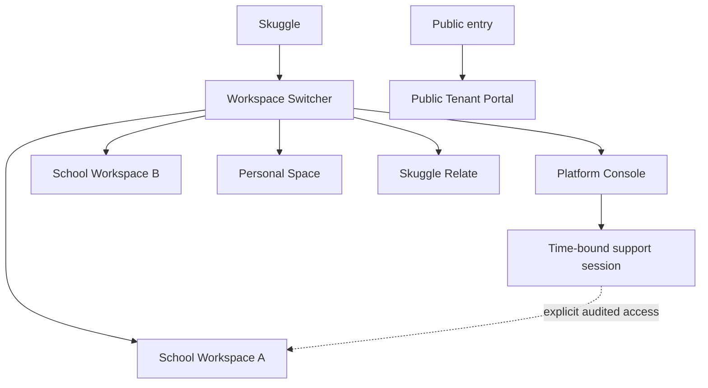

Switcher order: **My Spaces** (Personal Space), **Schools** (recent/active first, then alphabetical), **Community** (Relate), **Platform** (authorized only). Each school shows canonical name, logo, location/campus hint if necessary and presentation persona—not permissions. Show active state unmistakably. Search appears above a membership-count threshold. “Join school” and “Create school” are contextual actions gated by policy. Unread badges show only aggregated safe counts.

Switching refreshes server workspace/tenant context, effective capabilities, entitlements/flags, academic context, navigation, dashboard and query caches. Pending unsaved work requires confirmation. Deep links request the target workspace and undergo full authorization.

## 5. Navigation Hierarchy

| Level | Meaning | Example |
|---|---|---|
| 0 Product | Skuggle ecosystem | Skuggle |
| 1 Workspace | security/experience composition | School: Royal Gateway Academy |
| 2 Domain/group | coherent business area or sidebar grouping | Teaching & Learning |
| 3 Capability | persistent job area | Assessment |
| 4 Page/collection | canonical collection/workspace view | Assessments |
| 5 Object/context | selected aggregate or coherent sibling view | Mathematics Mid-Term |
| 6 Action | mutation/workflow task | Enter Marks |

Sidebar depth is maximum two: group -> item. Ordinary in-page depth is page -> one contextual tab set. Object subviews may use tabs, but cannot nest another tab row. Filters never change route identity unless they represent a shareable saved view. Exceptions such as deep analytics use local drill-down/breadcrumb, not deeper persistent menus.

Conceptual `NavigationItem`: stable ID, label, workspace, owner domain, capability, route identity, required any/all capabilities, entitlements, feature flag, persona relevance score, icon semantic category, badge source, order and visibility policy. No schema or component is prescribed.

## 6. School Workspace

```mermaid
flowchart TD
  School[School Workspace] --> Home[Home]
  School --> People[People]
  School --> Admissions[Admissions]
  School --> TL[Teaching & Learning]
  School --> Ops[School Operations]
  School --> Engage[Engagement]
  School --> Insights[Insights]
  School --> Admin[Administration]
  People --> Students
  People --> Guardians
  People --> Workforce
  TL --> Academics
  TL --> Assessment
  TL --> Performance
  TL --> Learning[Learning Resources]
  Ops --> Attendance
  Ops --> Finance
  Ops --> Services[Student Services]
  Ops --> Operations
  Engage --> Communication
  Engage --> Calendar
  Insights --> Analytics
  Insights --> Reports
  Admin --> Setup[School Setup]
  Admin --> Access[Users & Access]
  Admin --> Roles[Roles & Permissions]
  Admin --> Forms[Forms & Custom Fields]
  Admin --> Workflows
  Admin --> Integrations
  Admin --> Subscription[Subscription & Plan]
  Admin --> Security
  Admin --> Audit
```

Admissions remains its own sidebar item because it is a high-volume journey crossing applicant, review, offer and conversion—not simply a People collection. Workforce is under People because users seek staff/teachers as people; its domain ownership remains independent. Administration items are capability-filtered and collapsed by default.

## 7. People & Workforce IA

Recommended visible structure: People landing (optional summary), **Students**, **Guardians**, **Workforce**. Workforce opens a capability landing containing Employees and Teachers as saved views/context tabs; Departments and Leave are workforce pages/settings where authorized. “Staff” becomes an allowed alias/search term for Workforce/Employees. “Parents” is displayed as Guardians when legal/access meaning matters; conversational copy may say parents and guardians.

Student profile contextual tabs: Overview, Contacts & Guardians, Enrolment (Academics projection), Attendance, Performance, Finance, Services/Documents—each shown only with capability/privacy rights. Cross-domain tabs are read projections/deep links, not People-owned data.

Teacher profile is an Employee context with employment/qualifications and links to Teaching Assignments. IAM roles/access are a separate authorized link.

## 8. Admissions IA

Sidebar: one **Admissions** item. Landing shows pipeline metrics, My Work/Needs Attention and recent applications. Primary pages: Applications and Intakes. Screening, interviews, decisions and offers are contextual queues/saved views within the application workspace, not sidebar items. Conversion is a workflow action after accepted offer. Admission Settings is owned here but discovered through page settings and Administration shortcut.

Application tabs: Overview, Applicant, Requirements/Documents, Screening, Reviews, Decision/Offer, Activity. Status stages are filters/pipeline columns. Primary action depends on state (Submit, Start Review, Record Decision, Issue Offer, Complete Enrolment Handoff).

## 9. Academics IA

Academics landing organizes:

- Academic Calendar: Sessions & Terms; calendar configuration.
- Structure: Classes/Arms/Sections, Subjects, Curriculum.
- Placement: Enrolment, Transfers, Promotion.
- Teaching: Teacher Assignments, Timetable, Lesson Plans.

Classes and Subjects are primary collection pages. Arms/sections are class context, not sidebar items. Session/term setup is Academics-owned settings/context, accessible from the current academic-context control. Enrolment is Academics even when reached as the next step from Admissions. Teacher Assignments remain Academics; Workforce shows a contextual projection.

## 10. Assessment IA

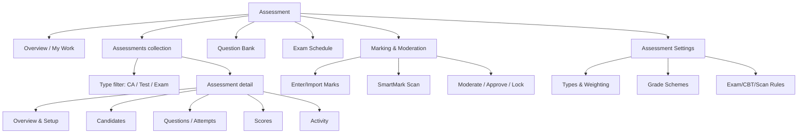

Classification:

| Capability | IA type |
|---|---|
| Assessment Overview | capability landing |
| Assessments | primary collection |
| CA, Tests, Examinations | type filters/templates; saved filter can deep-link |
| Question Bank | primary capability page |
| Blueprint | assessment object tab/action/template, not global module |
| Exam Scheduling | primary page when enabled; schedule views filtered by type |
| Candidate Management | assessment contextual tab |
| Marks Entry | workflow action/work queue; deep-linkable task |
| CBT | delivery mode/context within Assessment; attempts contextual |
| SmartMark | marking method/action and processing queue; entitlement-gated |
| Moderation/Approval/Locking | workflow stages in Marking queue |
| Grade Configuration | setting |
| Assessment Analytics | report/context insight; raw evidence analytics here |

Assessment ends at approved/locked scores. “Generate Results” is the no-dead-end transition into Performance.

## 11. Performance IA

Performance landing separates **Results** (operational result sets and publication), **Report Cards**, **Broadsheet**, **Analytics** (student/class/subject/teacher trends), **At-Risk Students**, and **Interventions**. Results contextual states—draft, awaiting approval, approved, published—are filters/work queues, not top navigation.

User language: Results answers “what finalized outcome will be viewed/published?” Performance answers “what does the evidence mean over time and what should we do?” Report approval/publication belongs to Results within Performance; score moderation remains Assessment.

## 12. Learning Resources IA

One **Learning Resources** capability replaces Library/Online Learning fragmentation. Primary views: Discover/Library, My Resources, Assignments, Progress, Curriculum Collections. Resource detail contains content, sections, annotation, versions (authorized), assignment and practice. Practice and AI learning tools are contextual actions. Formal CBT remains Assessment; ungraded practice stays Learning. “Online Learning” may be a marketing label, not persistent IA.

## 13. Attendance IA

Attendance primary pages: Overview/Today, Student Attendance, Exceptions and Reports. Capture is an action from class/today context. Device/Offline Capture is configuration/operations for authorized users. Student record tabs show attendance projections.

Staff Attendance belongs to Workforce and appears there. A cross-domain “Attendance” search may return both categories with clear labels, but they are not one source of truth.

## 14. Student Services IA

Student Services landing shows only authorized capabilities: Cases/Requests, Health & Clinic, Welfare/Counselling, Behaviour & Discipline, Safeguarding, Accommodations. Sensitive names/items are hidden unless the actor has the specific capability; a generic Student Services permission cannot reveal case presence. Case stages are work-queue filters. Domain settings cover case types, confidentiality and escalation and are linked from Administration only for authorized governors.

## 15. School Operations IA

Operations is an entitlement/configuration-driven capability catalog: Assets, Inventory, Procurement, Transport, Boarding, Meals, Facilities & Maintenance, Visitors, Safety, Tasks. Only enabled/configured capabilities become sidebar/page entries. Low-frequency capabilities live on an Operations landing rather than each consuming global sidebar space. High-frequency enabled capability may be pinned by tenant/user preference within approved limits.

## 16. School Finance IA

Primary pages: Overview, Student Accounts, Invoices, Payments & Receipts, Arrears, Reconciliation. Fee Structures, discounts/scholarships and finance rules are contextual settings/configuration pages. Refund/reversal is a workflow action/queue, not primary navigation. Finance Reports link to the same definitions indexed in Insights.

Use “Billing” only for issuing school invoices within context; top-level label remains Finance. “Subscription & Plan” is never shown inside Finance.

## 17. Engagement IA

Engagement contains **Communication** and **Calendar**. Communication pages: Inbox/Conversations, Announcements, Campaigns/Broadcasts, Templates (authorized) and Delivery summaries. Notification delivery is infrastructure and does not appear as a module. Calendar composes published academic, operational and personal-relevant events; event creation is owned by the relevant domain or a calendar/event capability if later established.

## 18. Insights & Reporting IA

**Analytics** offers interactive dashboards, trends, comparisons and drill-down. **Reports** offers structured definitions, parameters, scheduled exports, printable statements and history. Both query domain-owned projections.

| Report family | Metric owner | Primary discovery | Contextual entry | Export right |
|---|---|---|---|---|
| Students/demographics | People | Insights > Reports > People | People/Students | people report + export capability |
| Admissions funnel | Admissions | Insights > Analytics/Reports | Admissions landing | admissions report/export |
| Enrolment/timetable/curriculum | Academics | Insights > Reports > Academics | Academics pages | academics export |
| Marks/item analysis | Assessment | Assessment analytics + Insights index | Assessment detail | assessment report/export |
| Results/broadsheets/trends | Performance | Performance + Insights | result set/cohort | performance export |
| Attendance | Attendance | Insights > Reports | Attendance | attendance export |
| Welfare/health | Student Services | restricted domain reports | services capability only | highly restricted export |
| Collections/balances | School Finance | Finance + Insights | finance page | finance export |
| Operations | School Operations | Insights > Reports | operation page | operations export |
| Learning usage/progress | Learning Resources | Learning insights + Insights | resource/assignment | learning export |
| Communication delivery | Communication | Communication analytics + Insights | campaign | communication export |

Contextual and central discovery resolve to one report identity and execution history. Reports never become editable business records.

## 19. Administration IA

Administration is a governance directory, not a bounded context. Authorized items:

- School Setup -> Institution profile, campuses, regional defaults; Academics setup remains linked/owned by Academics.
- Users & Access -> memberships, invitations, access reviews.
- Roles & Permissions -> tenant roles/assignments.
- Security -> MFA policy, sessions/security settings.
- Forms & Custom Fields -> shared form schemas organized by owning domain.
- Workflows -> workflow definitions/assignment rules for authorized administrators.
- Integrations -> tenant integrations/credentials.
- Subscription & Plan -> plan, usage, billing history, entitlements, upgrade.
- Audit -> tenant audit search.

Domain settings stay within Academics, Assessment, Performance, Attendance, Services, Finance, Communication, etc. Administration may link to them through a Settings Directory showing owner, not duplicate them.

| Setting | Owner | Primary location | Access | Admin shortcut? |
|---|---|---|---|---|
| Password/MFA/session | IAM | Account/Security or Admin Security | self/governance | yes for policy |
| School identity/campus | Institution | School Setup | institution configure | yes |
| Session/term/class rules | Academics | Academics Settings | academics configure | directory link |
| Assessment types/weights/grades | Assessment | Assessment Settings | assessment configure | directory link |
| Result calculation/publication | Performance | Performance Settings | result configure | directory link |
| Attendance policy | Attendance | Attendance Settings | attendance configure | directory link |
| Case/privacy rules | Student Services | restricted Services Settings | services governance | restricted link |
| Fee/payment rules | Finance | Finance Settings | finance configure | directory link |
| Communication policy/templates | Communication | Communication Settings | communication configure | directory link |
| Forms/custom fields | Forms + domain | Administration > Forms | settings capability | yes |
| Workflow mechanics | Workflow + domain | Administration > Workflows | governance capability | yes |
| Subscription | Platform Billing/Tenant entitlement | Administration > Subscription & Plan | billing admin | yes |
| Personal preferences | User/Personal | Profile/Preferences | self | no |

## 20. Platform Console IA

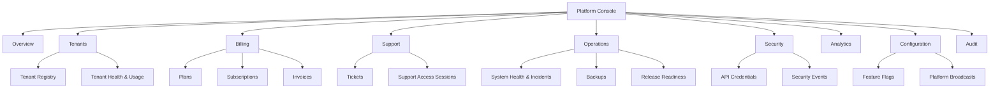

School operational domains never appear here. “Open support session” is a contextual action from tenant/ticket, with reason/scope/duration, not ordinary navigation into a school.

## 21. Personal Space IA

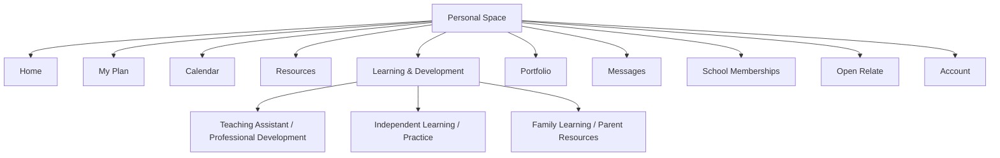

Universal: Home, My Plan, Calendar, Resources, Portfolio/Profile, Messages, School Memberships, Account. Persona-relevant cards/shortcuts surface teacher lesson planning/professional development, student goals/practice, or parent family-learning/tutor discovery. School-owned records appear only as explicit read projections/deep links back into that school workspace. Personal Space remains valuable without a school.

## 22. Skuggle Relate IA

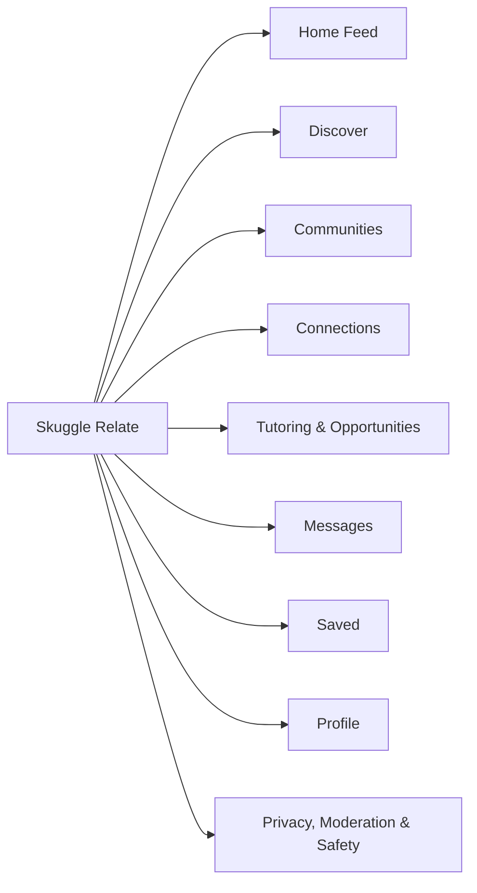

Desktop may use a slim community navigation rail/top bar; mobile uses bottom navigation for Feed, Discover, Create/Opportunities as eligible, Messages, Profile. Minors receive restricted discovery, connection and messaging affordances. Affiliation visibility and CommunityProfile privacy are explicit. Relate notifications are categorized within Relate and may summarize in the global center without exposing private content.

## 23. Public Tenant Portal IA

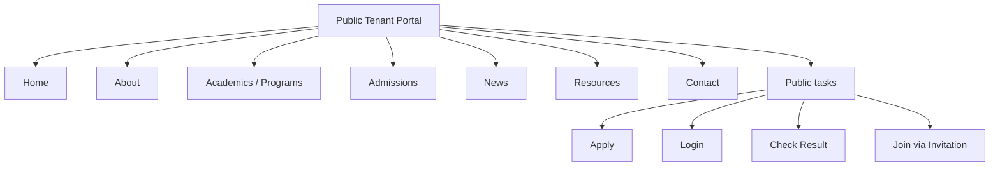

Tenants enable only desired portal capabilities. It may be a lightweight presence, not a mandatory website replacement. Portal chrome and public routes remain separate from authenticated school shell. Only published projections are visible.

## 24. Persona-Aware Navigation

One capability graph is filtered and ranked; there are not separate products per role.

| Persona | High-priority navigation | Secondary | Hidden by default | Quick actions |
|---|---|---|---|---|
| School Super Admin | Home, People, Admissions, T&L, Operations, Engagement, Insights, Administration | all entitled capability landings | individual sub-capabilities collapsed | invite user, open setup, review security/approvals |
| School Admin Officer | Home/My Work, Students, Admissions, Attendance, Finance, Operations, Communication, Reports | Academics/Workforce as delegated | governance/security/role controls | enrol student, invite staff, record payment, announce |
| Principal | Home, My Work/Approvals, Academics, Assessment oversight, Performance, Attendance, People, Communication, Insights | Operations/Finance summaries | technical settings | approve results, review absence/risk, message staff |
| Teacher | Home, My Classes, Attendance, Assessment, Learning Resources, Students, Communication | Performance for assigned classes | institution/admin/finance | take attendance, enter marks, create assessment, prepare lesson, message class |
| Admission Officer | Home, Admissions, Students, Communication, Reports | People lookup | unrelated teaching/admin | new application, request info, review, issue offer |
| Examination Officer | Home, Assessment, Performance, Academics references, Reports | Students, Communication | unrelated operations | schedule exam, review marks, approve/publish as assigned |
| Bursar | Home, Finance, Students/payers, Communication, Reports | Academics period reference | assessment/services/admin | invoice, record payment, reconcile, remind |
| Parent | Overview, My Children, Results, Attendance, Finance, Learning, Messages, School Information | calendar | enterprise/admin domains | view result, pay/view balance, message school |
| Student | Home, My Learning, Timetable, Assessments, Results, Attendance, Resources, Messages | calendar/profile | all administration/enterprise collections | continue learning, start assessment, view result |

### Representative navigation diagrams

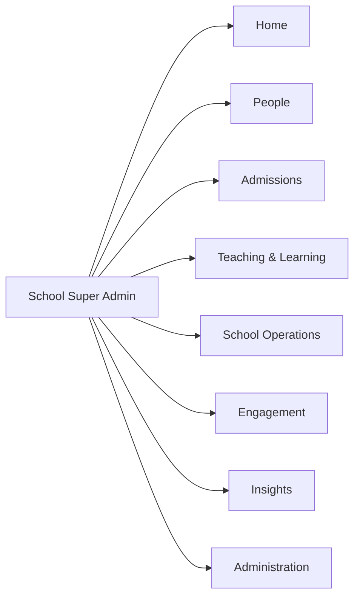

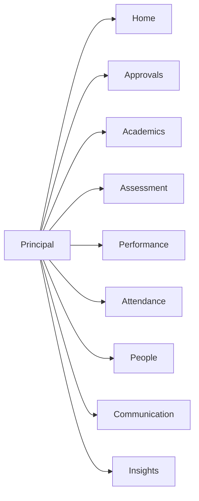

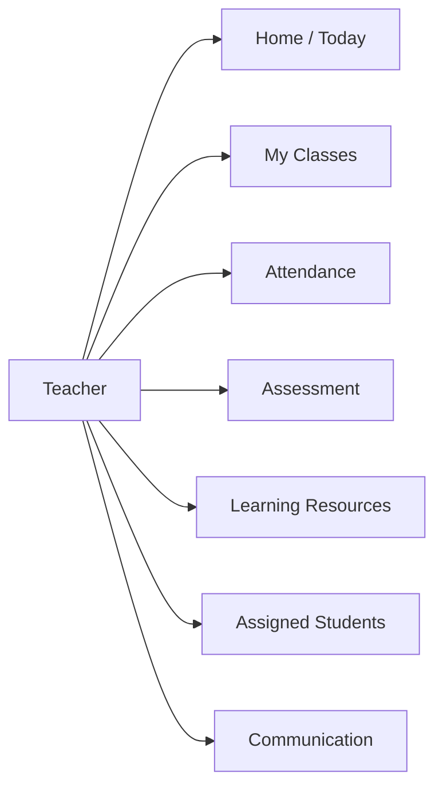

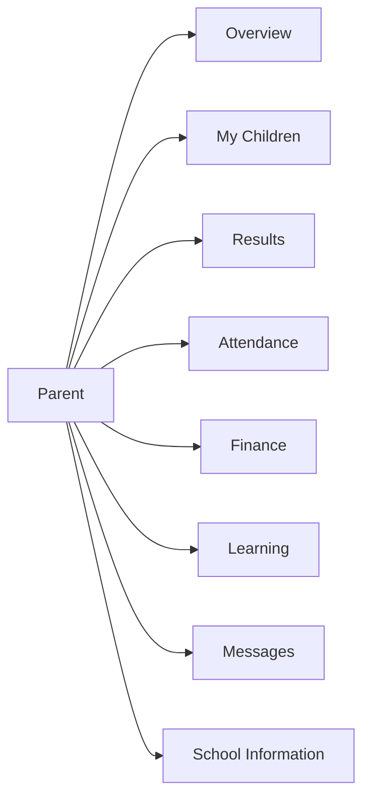

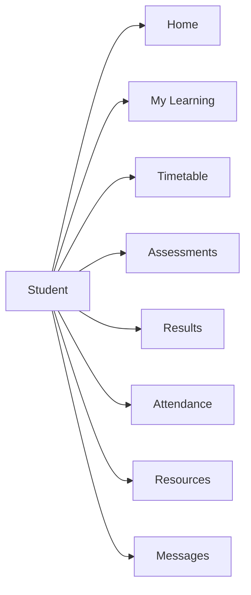

## 25. Dashboard Information Architecture

Dashboard is a role/persona-relevant summary and launch surface, not a domain or a grid of every metric. Stable regions: Today/Current Context, My Work, Needs Attention, key outcomes, upcoming calendar and recent activity. Cards link to canonical pages with filters. Approvals are aggregated tasks and may have a dedicated My Work view for approvers; Notifications are not dashboard-owned.

No widget becomes permanent navigation without a durable, repeatable user job. Dashboard data honors current workspace, tenant, academic context and resource scopes.

## 26. Search / Command Architecture

Search categories: People (students/guardians/employees), Academics (classes/subjects), Work (applications/assessments/invoices/cases), Learning resources, Pages, Reports and Commands. Results are permission-, relationship-, tenant- and privacy-filtered before display. Show category and workspace; never reveal unauthorized existence.

Commands are context-aware: Create Student, Enter Marks, Take Attendance, Generate Report, Open My Classes. Destructive/privileged actions require object context and cannot execute blindly from search. Recent/frequent commands are personalized within current capability set. Workspace-wide search never silently crosses schools.

## 27. Notification & Work Queue IA

Notification Center categories:

- Messages: conversations requiring reading/reply.
- Tasks: assigned work.
- Approvals: explicit decisions with due dates.
- Alerts: risks/exceptions requiring attention.
- Announcements: broadcast information.
- System: security, subscription, integration and operational notices.

The bell shows categorized summaries, not an undifferentiated feed. Domain owns task meaning; a reusable My Work projection aggregates task references. Views: My Work, Approvals, Needs Attention, Completed/History. Each item shows domain, object, due/state and canonical deep link. Completing it executes the owning domain command.

## 28. Page / Tab / Action Taxonomy

| Page type | Purpose | Navigation entry | Tabs | Primary action | Example |
|---|---|---|---|---|---|
| Dashboard | summary/launch | yes, Home | no domain tabs | contextual | School Home |
| Capability landing | orient within broad capability | sidebar item | limited | most common task | Admissions |
| Collection | find/manage objects | direct/deep link | saved views optional | create/import | Students |
| Object detail | understand one aggregate | deep link/context | coherent subviews | state-dependent | Assessment detail |
| Work queue | process assigned items | capability/My Work | status filters | next workflow action | Result approvals |
| Analytics | explore trends | Insights/domain link | dimensions as filters | save/export | Attendance analytics |
| Report catalog/run | select parameters/output | Insights/context | categories | run report | Finance reports |
| Settings | configure owner domain | domain/Admin link | coherent categories | save/publish | Assessment Settings |
| Wizard | multi-step creation | action, not nav | steps not tabs | continue/complete | Enrol student |

Action taxonomy: one PRIMARY action per page; SECONDARY noncritical actions; BULK actions after selection; ROW actions for one collection item; CONTEXT actions on an object; DESTRUCTIVE actions separated/confirmed; WORKFLOW actions named by transition. Filters refine a page and never masquerade as navigation.

## 29. Responsive / Mobile IA

Desktop: workspace switcher + searchable/collapsible two-level sidebar; page header/context tabs; command palette. Tablet: navigation drawer/rail, persistent current workspace, horizontally scrollable single tab row where necessary. Mobile: task-first bottom/compact navigation with Home, My Work/contextual priorities, Search and More; workspace switcher in header/account sheet.

Do not reproduce the desktop taxonomy on mobile. Teacher priority: Today, My Classes, Attendance, Marks, Messages. Principal: Home, Approvals, Alerts, Performance, Attendance, Communication. Parent/Student use their simplified navigation. Large tables transform into cards/priority fields with filter/sort sheet; critical row actions remain reachable. Complex creation may use full-screen step flows rather than nested modals. Drawers replace noncritical modals; destructive confirmation remains explicit.

## 30. Cross-Domain User Journeys

### New student

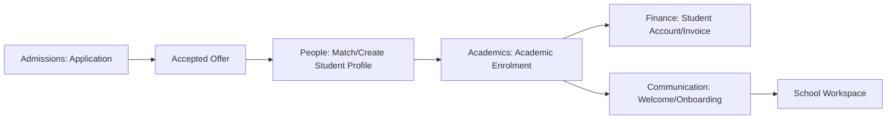

### Result lifecycle

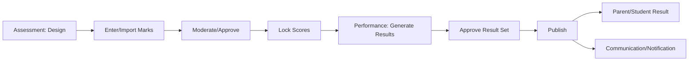

### New teacher

Person match/create -> Workforce Employment -> IAM Membership/RoleAssignment -> Academics TeachingAssignment -> Teacher Home/My Classes. Each completion page offers the next authorized action. No domain duplicates the previous domain's record.

No-dead-end examples: admitted -> Complete enrolment; enrolment -> Set up finance/welcome; marks locked -> Generate results; invoice issued -> Record payment/Send notice; incomplete application -> Request information; employee hired -> Invite/Assign access; teacher assigned -> Open My Classes.

## 31. Current -> Target Navigation Mapping

| Current navigation | Problem | Target domain/location | Treatment |
|---|---|---|---|
| Dashboard | role-specific sprawl | Home | KEEP; task/outcome focus |
| School | profile and academics mixed | Admin > School Setup; Academics | SPLIT/MOVE |
| People | staff component alias | People landing | REDEFINE |
| Students | sound capability | People > Students | KEEP |
| Parents | incomplete legal term | People > Guardians | RENAME with alias |
| Staff | overlaps Employees/Teachers | People > Workforce > Employees | MERGE/RENAME |
| Teachers | role/profile/assignment blur | Workforce teacher view + My Classes | CONTEXTUALIZE |
| Admissions | stages risk nav explosion | primary Admissions capability | KEEP/SIMPLIFY |
| Academics | setup/operations mixed | T&L > Academics | KEEP/REORGANIZE |
| Assessment | overloaded tabs/results | T&L > Assessment | KEEP/SPLIT Performance content |
| CA/Tests/Examinations | parallel app concepts | Assessments type filter | MAKE FILTER |
| Question Bank | durable work area | Assessment > Question Bank | KEEP as page |
| Blueprint | task/object configuration | Assessment detail | MAKE ACTION/CONTEXT |
| Marks Entry | workflow task | Marking queue/assessment detail | MAKE ACTION |
| SmartMark | method/entitlement | Marking > Scan | CONTEXTUALIZE |
| Results | separated from Performance | Performance > Results | MOVE/MERGE |
| Performance | thin/overlapping | T&L > Performance | KEEP/CLARIFY |
| Online Learning | overlaps library/CBT/AI | Learning Resources + Assessment | DEPRECATE label/module |
| Attendance | sound but ambiguous staff attendance | Operations > Attendance | KEEP; staff attendance moves Workforce |
| Finance | school/payment/subscription ambiguity | Operations > Finance | KEEP/CLARIFY |
| Student Services | generic, sensitive | Operations > Student Services | KEEP only enabled/authorized |
| Operations | generic capability dump | Operations landing/catalog | KEEP/DECOMPOSE |
| Communication | messages/broadcast/notifications blur | Engagement > Communication | KEEP/CLARIFY |
| Administration | treated as owner/module | governance composition | REDEFINE |
| Subscription | alongside operations/Finance | Admin > Subscription & Plan | MOVE |
| Reports | source-of-truth confusion | Insights > Reports + contextual links | MOVE/CONSOLIDATE |
| Help & Support | low-frequency core nav | Utility/account | MOVE |
| Launch Blueprint | task as module | School Setup/onboarding action | REMOVE FROM NAV/MAKE ACTION |

## 32. Terminology Standard

| Current/ambiguous | Canonical term | Definition | Alias/migration |
|---|---|---|---|
| People | People | human/student/guardian discovery grouping | retain |
| Staff | Workforce / Employees | employment domain / employed people | “Staff” search alias |
| Teachers | Teachers / My Classes | employee function / assigned teaching work | retain label only in context |
| Parents | Guardians | authorized relationship, not only biological parent | copy may say Parents & Guardians |
| Admissions/Enrolment | Admissions / Enrolment | decision journey / academic placement | never interchangeable |
| School | School Setup | institution profile/campus governance | route alias during migration |
| Academics | Academics | calendar, structure, enrolment, teaching allocation | retain |
| Assessment/Exam | Assessment / Exam type | evidence lifecycle / one assessment type | Exam aliases filter |
| Results | Results | finalized/published outcomes | nested under Performance |
| Performance | Performance | interpretation, trend, risk, intervention | retain |
| Library/Online Learning | Learning Resources | resources, assignments, progress, practice | aliases in search/redirects |
| Finance/Payments/Billing | Finance / Payments / Invoicing | school money domain / transaction / charge creation | avoid standalone “Billing” |
| Subscription | Subscription & Plan | school's commercial Skuggle relationship | never Finance |
| Student Services | Student Services | health/welfare/cases | retain; capability-filtered |
| Operations | School Operations | facilities/logistics/processes | retain grouping/context |
| Notifications | Notifications | delivery/user alerts | not Communication domain label |
| Communication | Communication | messages/announcements/campaigns | retain |
| Reports/Analytics | Reports / Analytics | structured outputs / interactive insight | separate IA behaviors |
| Administration/Settings | Administration / Domain Settings | governance directory / owner configuration | no generic dumping ground |

### Architectural context to navigation

| Context | User-facing navigation | Why |
|---|---|---|
| IAM/Tenant | Administration, workspace switcher, account | cross-cutting governance, not daily domain |
| Institution | School Setup | recognizable school configuration |
| People/Workforce | People > Students, Guardians, Workforce | user discovery language |
| Admissions | Admissions | durable high-volume journey |
| Academics/Assessment/Performance/Learning | Teaching & Learning items | distinct jobs with clear handoffs |
| Attendance/Finance/Services/Operations | School Operations items | operational family; owners remain separate |
| Communication | Engagement | user-facing communication intent |
| Reporting | Insights and contextual domain links | shared projection service, no business ownership |
| Forms/Workflow/Audit/AI/Notifications | Administration or contextual actions | supporting mechanics, not universal modules |
| Platform Billing/Ops | Platform Console; tenant Subscription link only | boundary protection |

## 33. Navigation Fitness Rules

1. Sidebar nesting is at most group -> item.
2. At most one coherent contextual tab row is visible.
3. Role names never authorize; hidden navigation never replaces backend checks.
4. Every item has canonical workspace/domain/capability identity.
5. Reports remain read projections; Administration owns no domain facts.
6. Settings declare an owner and primary location.
7. Platform Billing never appears as School Finance.
8. Personal Space displays school data only through explicit projections/deep links.
9. Relate hides school affiliation by default; Public Portal reads published projections only.
10. Unknown routes render secure Not Found/Unavailable, never Home.
11. Tabs cannot cross unrelated aggregate/domain purposes.
12. Actions/filters are not sidebar items without recorded IA justification.
13. Specialist personas are not collapsed into School Admin presentation.
14. Mobile ordering is task-based, not a duplicate desktop taxonomy.
15. Workspace switch refreshes access, academic, navigation and cache context.
16. Disabled/unentitled capabilities follow the policy below.
17. Cross-domain transitions use canonical links/commands and no copied data.
18. Each page has one primary purpose/action.
19. Backend artifacts do not create empty navigation.
20. Labels follow the terminology registry.
21. Parent/Student navigation uses their jobs, not staff group taxonomy.
22. Badge sources are meaningful/actionable and privacy-safe; no decorative counts.
23. Every meaningful collection/object/work queue/report is deep-linkable.
24. Deep-link resolution establishes workspace and authorizes before revealing identity.
25. Automated IA tests validate duplicate route identity, owner, depth and unavailable-route behavior.

Feature visibility policy:

- Not entitled: hide by default; show in an authorized Capability Catalog/Subscription page as upgrade information, never as a dead sidebar item.
- Entitled but not enabled/configured: administrators see setup prompt in catalog/Admin; ordinary users do not see it.
- Enabled but unauthorized: hide navigation; direct link returns safe access response.
- Feature flag off/unreleased: hide entirely except authorized platform/preview cohorts.
- Temporarily unavailable: retain item only when users have work there and show honest service status.

## 34. Architecture Decision Records

| ADR | Decision | Reason |
|---|---|---|
| IA-01 | Workforce under People | staff/teacher discovery is person-oriented; domain boundary remains intact. |
| IA-02 | Admissions primary | independent journey/work queues and cross-domain handoff justify prominence. |
| IA-03 | Retire Online Learning module | capabilities already split coherently between Learning and Assessment. |
| IA-04 | CA/Test/Exam are types | one assessment lifecycle; filters prevent parallel navigation systems. |
| IA-05 | Results inside Performance | Assessment owns scores; Performance owns interpretation/publication. |
| IA-06 | Subscription under Administration | tenant commercial governance, not school finance. |
| IA-07 | Reports under Insights + contextual links | one definition, multiple discovery paths, no duplicate implementations. |
| IA-08 | Owner-local settings + Administration directory | prevents generic Settings dumping ground. |
| IA-09 | Forms visible; workflow config administrative | administrators configure mechanics; ordinary users process domain tasks. |
| IA-10 | Help as utility/account destination | accessible but not core operating taxonomy. |
| IA-11 | Blueprint becomes setup action | temporary/setup task is not a persistent domain. |
| IA-12 | My Classes is teacher primary page | high-frequency mobile/desktop job; implemented as Academics projection. |
| IA-13 | Parent/Student simplified composition | different jobs and scopes; same school workspace security context. |
| IA-14 | Personal/Relate use distinct patterns | productivity and community are not school administration. |
| IA-15 | Maximum two sidebar levels | prevents accordion labyrinth; context belongs inside pages. |
| IA-16 | Tabs only for coherent sibling views | stages/types usually filters; actions remain actions. |
| IA-17 | Consistent unavailable-feature policy | avoids Coming Soon clutter and clarifies entitlement/configuration. |

## 35. Final Workspace Navigation Matrices

### Canonical School sidebar

| Group | Item | Owner/capability | Default visibility | Persona priority |
|---|---|---|---|---|
| Home | Dashboard | workspace summary | all members | all |
| Home | My Work | cross-domain task projection | actors with tasks | staff/leaders |
| People | Students | People/student registry | capability | admin/teacher scoped |
| People | Guardians | People/guardian relationships | capability | admin |
| People | Workforce | Workforce/employment | capability | admin/leadership |
| Admissions | Admissions | application lifecycle | capability+enabled | admission/admin |
| Teaching & Learning | Academics | academic structure/placement | capability | leaders/admin |
| Teaching & Learning | My Classes | scoped Academics projection | teaching assignment | teacher |
| Teaching & Learning | Assessment | evidence/marks | capability | teacher/exam/leader |
| Teaching & Learning | Performance | results/insights | capability | leader/teacher/parent/student simplified |
| Teaching & Learning | Learning Resources | resources/progress | capability+entitlement | teacher/student |
| School Operations | Attendance | student attendance | capability | teacher/admin/leader |
| School Operations | Finance | school financial operations | capability | bursar/admin |
| School Operations | Student Services | welfare/cases | specific capability | services roles |
| School Operations | Operations | logistics/facility catalog | capability+enabled | operations/admin |
| Engagement | Communication | messages/announcements/campaigns | capability | all relevant |
| Engagement | Calendar | composed calendar | capability | all |
| Insights | Analytics | interactive projections | capability | leaders |
| Insights | Reports | report catalog/history | capability | admin/specialists |
| Administration | School Setup | Institution config | configure | super admin |
| Administration | Users & Access | IAM memberships/invites | manage | super admin/admin delegated |
| Administration | Roles & Permissions | IAM roles | privileged | super admin |
| Administration | Forms & Custom Fields | Forms schemas | configure | super admin/admin delegated |
| Administration | Workflows | workflow config | privileged | super admin |
| Administration | Integrations | tenant integrations | privileged | super admin/ICT role |
| Administration | Subscription & Plan | Platform Billing projection | billing entitlement | tenant billing admin |
| Administration | Security | IAM security policy | privileged | super admin |
| Administration | Audit | Audit query | privileged | super admin/auditor |

### Workspace switching model

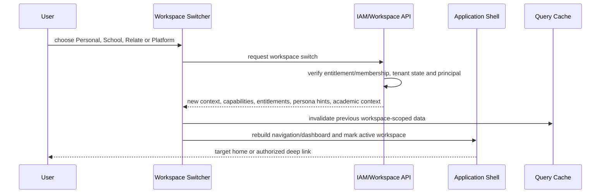

### Final decision matrix

| Area | Current | Target | Decision | Priority | Implementation dependency |
|---|---|---|---|---|---|
| Workspace Switcher | exists, role hints | grouped, searchable, unmistakable context | EVOLVE | P1 | IAM access contract |
| Dashboard | role-specific broad widgets | task/outcome workspace summary | REFACTOR | P2 | query projections |
| School | mixed module | School Setup + Academics | SPLIT | P2 | domain routes |
| People/Students/Guardians | overlapping labels | People grouping with canonical pages | KEEP/CLARIFY | P2 | Person architecture |
| Staff/Teachers | same component/role blur | Workforce views + My Classes | MERGE/CONTEXTUALIZE | P1/P2 | Workforce/Academics |
| Admissions | generic sections | primary journey, stages as filters | KEEP/REBUILD IA | P2 | typed workflow |
| Academics | config/operations mixed | coherent academic capability landing | REORGANIZE | P2 | API consolidation |
| Assessment | overloaded | assessments/questions/schedule/marking/settings | SIMPLIFY | P1/P2 | score/result boundary |
| CA/Tests/Exams | parallel labels | type filters/templates | MAKE FILTER | P2 | assessment type model |
| Question Bank | assessment capability | primary Assessment page | KEEP | P2 | capability route |
| Marks Entry/SmartMark | tab/module-like | workflow action/method queue | CONTEXTUALIZE | P2 | assessment workflow/entitlement |
| Results/Performance | separate/overlap | Results inside Performance | MERGE IA | P2 | domain contracts |
| Online Learning | parallel module | Learning Resources/Assessment capabilities | DEPRECATE | P2 | redirects/aliases |
| Learning Resources | library-centric | unified resources/assignments/progress | KEEP+RENAME | P2 | stable library |
| Attendance | student/staff ambiguity | student Attendance; staff in Workforce | SPLIT SEMANTICS | P2 | ownership |
| Finance | hybrid; billing ambiguity | school accounts/invoices/payments | REBUILD IA | P2 | finance ledger |
| Student Services | generic/sensitive | filtered capability landing | EVOLVE | P2/P3 | typed cases/privacy |
| Operations | generic records | enabled capability catalog/landing | DECOMPOSE | P2/P3 | domain migration |
| Communication | mixed with notifications | messages/announcements/campaigns | CLARIFY | P2 | delivery service |
| Reports/Analytics | module and duplicates | Insights + contextual shared definitions | CONSOLIDATE | P2/P3 | reporting service |
| Administration/Settings | module/dumping risk | governance directory + owner-local settings | REDEFINE | P1/P2 | ownership registry |
| Subscription | beside operations | Administration > Subscription & Plan | MOVE | P2 | entitlement contract |
| Forms | emerging setting | Administration capability organized by owner | KEEP | P2/P3 | form engine |
| Workflow | hidden/module-specific | Admin config; user work queues | ADD CONCEPT | P3 | workflow service |
| Help & Support | sidebar | utility/account destination | MOVE | P3 | shell utility IA |
| Launch Blueprint | shortcut/module | contextual setup action or deprecate | REMOVE FROM NAV | P2 | onboarding decision |
| Platform Console | aliases to one dashboard | platform domain IA | REFACTOR | P1/P2 | PlatformPrincipal/contracts |
| Personal Space | basic/shared shell | distinct productivity IA | EVOLVE | P3 | workspace abstraction |
| Skuggle Relate | not found | distinct community IA | PLAN | P4 | identity/privacy/moderation |
| Public Portal | partial | configurable public projection/task IA | KEEP+EVOLVE | P2/P3 | publish contracts |
| Mobile navigation | desktop-like risk | persona/task-first compact navigation | DESIGN LATER TO IA | P2 | shell architecture |
| Search | command palette/registry | scoped categorized search/commands | EVOLVE | P3 | search service/canonical routes |
| Notifications | broad bell/feed | categorized messages/tasks/alerts/etc. | EVOLVE | P3 | notification/work projection |
| Quick Actions | dashboard/page-local | contextual, limited, capability-derived | STANDARDIZE | P2 | action registry |

### Decisions to freeze before Application Shell Architecture

Freeze the five workspace purposes and security contexts; the eight School groups; Workforce under People; Admissions primary; the Assessment/Performance and Finance/Subscription separations; Learning Resources replacing Online Learning; Reports under Insights; owner-local settings; two-level sidebar/one-tab-row maximum; canonical terminology; persona-derived ordering without role authorization; parent/student simplified compositions; unavailable-feature policy; route/deep-link identity; workspace-switch invalidation contract; Notification/My Work categories; and mobile task priorities.

The next phase may design shell regions and responsive interaction patterns against these rules. It must not reopen domain ownership through visual convenience.

